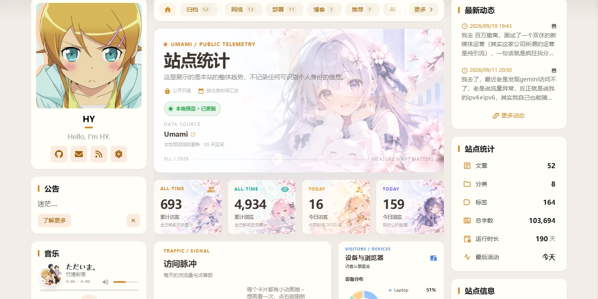

上一篇刚给[页脚加了两行数字](/posts/blog/footerstats/)，转头又看上了 [rainzt.cn](https://rainzt.cn) 的 `/analytics/`。

那和页脚那两行完全不是一个量级——整整一页数据看板：



四张彩色总览卡、能切 7 / 30 / 90 天的访问脉冲、按 GitHub 推送时间排的热力图、24 小时活跃分布、设备与浏览器的环形图，还有一张中国地图和最近评论。

## 第一版：照着自己设计

我当时的做法是——截图，看一眼，然后自己写。

结果做出来是这样：能跑，数据也全对，但一看就不是那个味道。它的卡片有自己的四色体系（蓝、薄荷、金、紫），总览卡上压着纹理，访问脉冲下面还挂了一组「本周数据 / 大家在听什么」的小卡，动效的节奏也不一样。我这份是「功能齐全的朴素版」，人家那份是设计过的。

被一句话点醒之后我才反应过来：**这东西的源头就在仓库里，我为什么要在那儿瞎设计。**

它的来源是 [Jarvis0227/Aemeath](https://github.com/Jarvis0227/Aemeath)，和我一样是 Firefly 的 fork——同一种子。

## 人家是四个部分，不是一个文件

去翻仓库，结构比我想的散：

| 文件 | 行数 | 干什么的 |
|---|---|---|
| `src/pages/analytics.astro` | 3959 | 页面本身，模板 / 脚本 / 样式三大段 |
| `src/components/widget/AnalyticsSnapshot.astro` | 665 | 侧栏那块分布图 |
| `src/components/analytics/UmamiMetrics.astro` | 582 | **渲染四个总览数字的** |
| `public/assets/images/analytics/*` 等 | 8 个文件 | 角色插画、hero 背景、中国地图 |

注意第三行。

## 最大的坑：四个数字永远「加载中」

我先把页面搬过来，构建，打开——访问脉冲有数据，环形图有数据，地图有数据，评论区也正常。

**唯独最上面那四张总览卡，一直停在「加载中」。**

查了半天才明白：页面模板里只输出了 `data-umami-stat` 占位符，**真正去请求数据、把数字写进去的逻辑，写在 `UmamiMetrics.astro` 里**。那个组件原本是在主题布局层全局引入的（页脚统计也用它），页面上根本不显眼。

漏了它，页面其余模块全部正常工作，因为那些数据是页面自己的脚本拉的；只有那四个数字永远填不上。

补上组件之后立刻出数：累计访客 670、累计浏览 4,716、今日访客 1、今日浏览 9。

## 适配只动了三处

搬过来之后要做点本地化，但尽量少改，方便以后跟着上游一起更新。

**一是署名。** hero 卡片右下角有一行 `RZ / 2026`，改成自己的。顺带把 localStorage 的 key 前缀和全局变量名里的 `rainzt` 也换掉了，一共 19 处——都是内部标识，看不见，改完不会互相干扰。

**二是两个缺的 CSS 变量。** 页面用了 `--text-color` 和 `--font-active-sans`，这两个我这份主题里没有——作者是直接改了 `src/styles/variables.styl` 加的。为了两个变量去动主题源文件不划算，我改成在页面自己的 `.analytics-page` 作用域里就地定义，暗色模式也单独给了一组值。

**三是配置字段。** 页面从 `analyticsConfig.umamiAnalytics` 里读 `shareId`、`shareApiBase` 和 `historicalStats`（迁移前历史累计，我没有迁移过就填 0）。

## 顺手把入口挪了

第一版我把导航入口挂在了「关于」的子菜单里，结果被吐槽「不然我怎么进去」。

有道理。藏在下拉里的入口等于没有，现在提到了顶级导航，和「我的」「关于」并列。

## 成品

搬到一半的样子，左边是主题自带的侧栏，中间是看板主体：


再往下是活跃时段热力图和评论：


数据全部来自 Umami 的公开分享接口，浏览器直连，**不需要任何后端**——和上一篇页脚统计是同一套路子，只是这次铺得更开。GitHub 提交记录在构建时拉取，Waline 评论走它的公开接口。

## 上线后又改了四轮

部署完之后先自己看了两眼，然后被连着挑了四次毛病。回头看，这四个问题都不是 bug，而是「整份搬过来之后没消化」——功能是别人的，细节也全是别人的。

### 一、整页蓝色，跟站点主题色打架

一开始没注意，直到被指出「UMAMI / PUBLIC TELEMETRY 这种标题适配我的主题色吧，不然有点割裂」。

参考实现把主色写死成 `#2d7cff`，而这个变量被页面里几乎所有彩色元素引用：hero 的 kicker、每个模块的小标题、折线图、7 / 30 / 90 天切换、进度条。所以整页是蓝调，而本站主题是橙黄（`hue: 65`）。

改起来只有一行——`--analytics-blue` 从 `#2d7cff` 换成 `var(--primary)`。`--primary` 本身就有明暗两套取值，暗色模式那边写的那行覆盖也跟着删掉了。

顺带把「访客活跃时间」热力图的 6 级色阶从写死的蓝色改成 `color-mix` 从主色派生，否则暗色模式还得另写一组。有个细节：GitHub 那块热力图的色阶**本来就是 `color-mix` 派生的**，只有这一块写死——参考实现自己就没统一，改之前得 grep 清楚。

### 二、推送数不对：fork 把上游历史也算进来了

这条是真错。热力图底部写着「最近 1690 次」，被一句反问戳穿：**「我的推送没有这么多吧？你这是记录 commit 的吗」**。

`git log HEAD` 和 GitHub 的 `/commits` 接口**默认统计仓库里所有作者的提交**。这个仓库 fork 自 `CuteLeaf/Firefly`，上游那一千多条历史全被算进来了：

| | 条数 |
|---|---|
| 仓库全部提交 | 1695 |
| 我自己的 | **252** |

差了七倍。加上 `--author` 过滤才对。

（顺带一提：GitHub 主页显示「过去一年 125 次贡献」，和这里的 252 又不一样——GitHub 只统计**默认分支**，而我的提交都在 `HY` 分支上。两个数字口径不同，别想着对齐。）

排查时我一度怀疑 API 限流、一度怀疑 `author` 参数不生效，都是白折腾。最后是在接口里加了两行日志，构建日志直接打出「git log 0 条 / API 也 0 条」，一次定位。**早该这么做。**

### 三、热力图要绿色，状态角标别压住插画

「推送热力图改成绿色，符合 GitHub 原版」——有道理，这个模块本来就是在模仿 GitHub 贡献图，用主题色反而不对。换成 GitHub 原版绿阶（`#9be9a8` → `#216e39`），暗色另配一组；「访客活跃时间」那块继续跟主题色，两者正好区分开。

同类的还有两个状态角标：「本地预览 · 已更新」和「已记录」。它们原本是 header 的 flex 子项，而 header 是 `space-between` 布局，右侧又恰好放着角色插画——角标被顶到最右，正好压在插画脸上。把它们挪进标题文案块就解决了。

两处角标、同一个原因，说明这不是偶然，是这套布局的固有倾向。

### 四、Umami 链接点进去是登录页

我把「Umami」做成了外链，但 href 用的是 `shareApiBase`——那是实例根目录，访客点进去只有登录框，等于死链。

改成公开分享页才对：地址由 `shareApiBase` 和 `shareId` 拼出，而不是写死。以后换实例或换 shareId 就自动跟着变。

### 小结

这四轮改下来最大的体会：**「能跑」和「是自己的」是两回事。** 整份搬代码解决的是前者，配色、口径、排版这些细节才是后者。搬完之后最好逐块过一遍，问自己一句「这地方的数据和颜色，真的是我的吗」——第二项那个七倍差距，就是没问这一句的代价。

## 顺带发现的一个老问题

看板页顶部 banner 上那四个巨大的「暂无封面」，我一度以为是自己搞出来的。

对比了一下 about 页面——**也有**。查代码才明白是主题音乐播放器的封面占位：

```js
ui.cover.src = '';
ui.cover.classList.add('opacity-0');
ui.cover.alt = cfg.i18n.noCover;   // 图片没 src 时 alt 就被浏览器画出来了
```

它给图片挂了 `opacity-0`，但 `alt` 文本照样渲染。这是主题自带的小瑕疵，要修得动 `src/components/features/`，本次没碰。

## 最后说个教训

这一轮最大的浪费不在技术，在流程：**看到别人有个好效果，第一反应应该是先翻他的仓库，而不是照着截图自己设计。**

功能能对，味道对不上。而且人家那份是反复调过的，我再自己摸一遍，只是在重复他的试错过程。

不过反过来说，这次翻车也不是全白费——至少搞清楚了 `x-umami-share-token` 和 `x-umami-share-context` 这两个头缺一不可，那是自研时试出来的。
