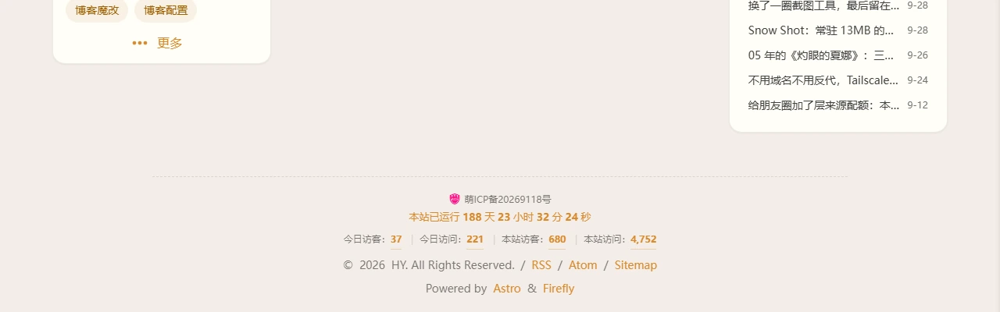

前两篇写的都是[首页贴纸卡片](/posts/blog/homestickercard/)和[更新日志页](/posts/blog/blogchangelog/)，来源都是刷 [rainzt.cn](https://rainzt.cn) 刷出来的羡慕。这次又轮到它了——刷到页脚，发现最底下挂着两行东西：


一行是「本站已运行 82 天 23 小时 18 分 53 秒」，秒数还在跳；再往下一行是四个数字：今日访客、今日访问、本站访客、本站访问。

运行时间那行好办，纯前端算就行。真正让我停住的是第二行。

## 第一反应：静态站读不到吧

我的博客是 Astro 构建出来的纯静态站，跑在 Vercel 上。Umami 统计是另外部署的一个实例，数据在它自己那边。

按常识，浏览器要从 `www.9ll.uk` 去读 `umami.9ll.uk` 的数据，跨域了，得对方点头才行。而我没法在 Vercel 上加任何服务端代码去代理这个请求——那就不叫静态站了。

所以本来是打算放弃的。后来想，反正 curl 一下也不费事，先看看接口长什么样：

```bash
curl -sS -i "https://umami.9ll.uk/api/share/你的分享ID"
```

响应头里明晃晃一行：

```
Access-Control-Allow-Origin: *
```

行吧，Umami 的分享接口本来就是设计给外部页面调用的，人家压根没打算拦。

顺带拿到了后面要用的两个东西：`websiteId`，还有一枚 JWT。

## 第二步卡住了：401

有分享 ID 和 token 了，接下来取数据：

```bash
curl -sS -H "x-umami-share-token: $TOKEN" \
  "https://umami.9ll.uk/api/websites/$WEBSITE_ID/stats?startAt=0&endAt=$NOW"
```

返回：

```json
{"error":{"message":"Unauthorized","code":"unauthorized","status":401}}
```

token 是从接口现取的，长度 619，没问题。那就只能是我传的方式不对。试了塞进 query 参数 `?token=`，401；试了 `Authorization: Bearer`，还是 401。

去翻参考实现才看到，真正要传的是**两个**头：

```
x-umami-share-token: <JWT>
x-umami-share-context: 1
```

少一个就是 401。补上第二个，数据立刻回来了：

```json
{"pageviews":4741,"visitors":680,"visits":1025,"bounces":532,"totaltime":265264}
```

`startAt=0` 表示全站，把它换成今天零点的时间戳，拿到的就是今日数据。四个指标正好对应页脚要的四项：

| 页脚显示 | 来源 |
|---|---|
| 今日访客 | 今日 `visitors` |
| 今日访问 | 今日 `pageviews` |
| 本站访客 | 全站 `visitors` |
| 本站访问 | 全站 `pageviews` |

## 代码放哪：还是原生注入点

落点不用纠结，前两篇已经踩过路了——`src/config/FooterConfig.html`。

这是 Firefly 自带的页脚 HTML 注入点，`Footer.astro` 在构建时用 `fs` 把这个文件读出来，再 `set:html` 塞进页脚。这个文件在 `src/config/` 目录下，本来就是留给用户填自定义内容的，改它不算动主题源码，以后合并上游更新也不会冲突。

> [!NOTE] 一个容易踩的细节
> `set:html` 注入的内容**不经过 Astro 的处理**，所以里面写 `<style>` 和 `<script>` 会原样输出、照常生效，不需要额外包装。反过来，`Footer.astro` 里有一句正则会把 HTML 注释 `<!-- -->` 整段删掉，所以别在这个文件里用 HTML 注释写正经内容。

另外一件事让我省了不少心：`<Footer />` 是挂在 `#swup-container` **外面**的。这意味着开着 Swup 的页面切换不会重新渲染页脚，注入的脚本只在整页加载时跑一次，不用像参考实现那样写一堆防重入判断。

## 实现里的几个决定

整段逻辑就是一个 IIFE，塞在注入的 `<script>` 里，没有新增任何文件。

**缓存分三层**。分享令牌 24 小时、今日数据 60 秒、全站数据 5 分钟，都落在 localStorage。令牌有效期本来就长，没必要每次刷新都去换；今日数据变得快，60 秒是个折中；全站那几个数字半天不一定动一下，5 分钟足够。

**请求挂在 `window.load` 之后的 `requestIdleCallback` 上**。页脚统计再怎么说也是装饰，没道理让它跟首屏抢带宽。

**页面停留时每 90 秒静默刷新一次**。本来第一版是拉一次就不管了，但想想访客在文章页读个十分钟，数字一直不动也挺奇怪的。加了轮询之后还有个副作用：`document.hidden` 为真时直接跳过，切到别的标签页一次请求都不发。

**拉取失败就整行藏起来**。不显示 0，也不显示「加载中」——页脚里留半截残骸比什么都没有更难看。控制台留一条 warn 方便排查就够了。

**数字是滚上去的**，从 0 滚到目标值，900ms 三次方缓动。系统开了「减少动态效果」的话直接落值，不折腾。

## 跳秒那行：时区写死是有意为之

运行时间比统计简单得多，但有个细节值得说。

建站日期我直接取了 `siteConfig.siteStartDate` 里的值（2026-03-24）。真正要注意的是**怎么解析它**：

```js
new Date("2026-03-24")                     // ❌ 按 UTC 午夜解析，东八区变成当天早上 8 点
new Date("2026-03-24T00:00:00+08:00")      // ✅ 明确东八区
```

第一种写法在我的机器上看不出问题，但访客要是在别的时区，算出来的天数就会差一天。把时区写死，不管谁访问都是同一个数字。

至于「切后台就停表」——`setInterval` 每秒跑一次本身不重，但没道理让它在看不见的地方一直空转。切回去的时候立刻重算一次，也不会出现停表期间时间对不上的情况。

## 成品

跑起来之后长这样：



红色那条是主题色，跟着站点配色走，暗色模式下会自己换。数字用了 `tabular-nums`，不然滚动的秒数会让整行宽度一直在抖。

顺手把这次改动也记进了[更新日志](/blog-changelog/)（V1.11）。

## 说点代价

这套东西确实不需要后端，但它换来的是**分享链接是公开的**。分享 ID 会明文出现在 HTML 里，任何人拿到都能读到你站点的访问量——这本来就是 Umami 分享功能的用途。介意的话去后台把分享删掉就行，页脚那行会自己隐藏。

另一个是它只读数据、不写数据，所以不必担心开发环境访问页面会污染统计。本地 `pnpm dev` 打开也能正常看到数字，调试反而更方便了。
