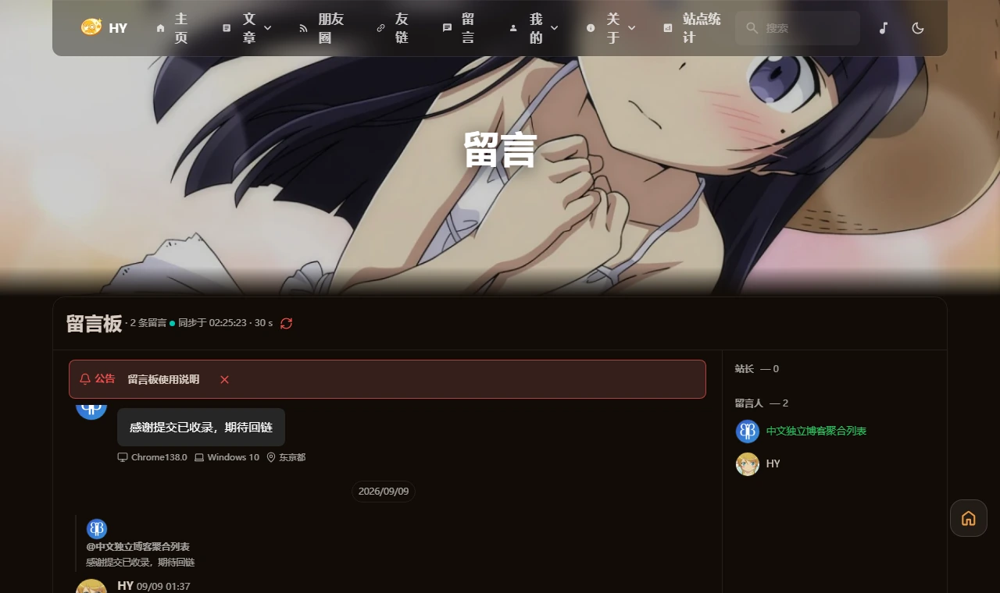
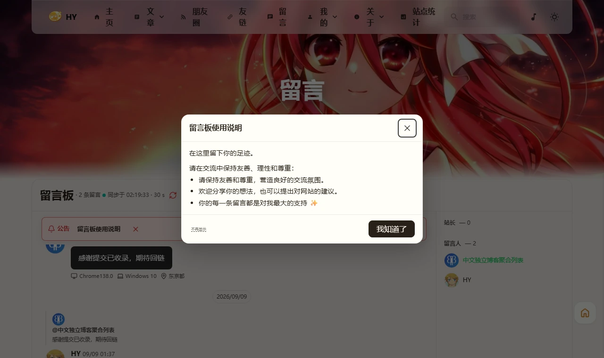

前两天写友链自动申请那篇的时候，在 [blog.amamo.top](https://blog.amamo.top) 上翻了半天。今天又回去把它留言板翻出来看——不是普通评论区，是一整个聊天窗口：气泡、成员列表、顶上一条公告栏，右下角输入框，像开在博客里的群。



扒了仓库，比想象的好复现。

::github{repo="qwc-ch/Firefly"}

## 后端是现成的，只是把 UI 换了

参考站自己写过一篇《留言页的群聊风格改造》，说组件直接与 Twikoo 的 API 通信。那篇文章应该是早期版本，仓库现状早就不是了——现在 import 的是 `@waline/api`，拿评论、发评论、改评论、删评论、登录，全走 Waline 的接口。

这对我是好消息：我的评论后端本来就是 Waline（`waline.9ll.uk`），留言板这个页面在 Waline 里就是 `path=/guestbook/` 的一组评论，跟文章评论同库不同 path。等于后端一个字节不用动，纯换前端。

组件本体是一个 Svelte 文件，43 KB 源码，用的是 Svelte 5 的 runes（`$state` / `$derived.by`）。主题的 `astro.config.mjs` 里 `svelte()` 集成上游本来就有，`@astrojs/svelte` 的版本我和参考站还完全一致，搬过来连 API 差异都没有。

## 搬过来 11 个文件，改上游的只有 1 个

| 文件 | 干什么 |
|---|---|
| `components/features/GuestbookChat.svelte` | 主组件，43 KB，聊天窗口本体 |
| `components/features/GuestbookChatComposer.svelte` | 输入框：表情、图片、资料卡 |
| `components/features/GuestbookChatMessage.svelte` | 单条气泡：头像、引用、工具按钮 |
| `components/features/GuestbookChatFallback.astro` | 水合前的骨架屏（SSR） |
| `utils/guestbook-chat.ts`、`guestbook-chat-markup.ts` | 评论树拍平、正文渲染 |
| `utils/guestbook-lang.ts` | 中文文案表（我自己加的，下面说） |
| `types/guestbook-chat.ts`、`types/guestbookConfig.ts`、`config/guestbookConfig.ts` | 类型与公告配置 |
| `styles/components/guestbook-chat.css` | 全部样式，50 KB |

参考站为了塞进主题，改了 6 类上游文件：页面骨架、`variables.styl`、`main.css`、`i18nKey.ts` 加 6 个语言文件、`package.json`、`types/config.ts`。照单全收的话，以后每次合并上游都要在 i18n 那 7 个文件里打一架。所以三处改道：

**一、137 个 i18n key 换成自建文案表。** 组件里的文案全是 `i18n(I18nKey.gbXxx)`，数下来 137 个新 key——意味着要改 `i18nKey.ts` 和 6 个语言文件，那正是上游高频改动区。我全部替换成自建文件里的 `GB_LANG.gbXxx`（186 处调用，脚本批量换的）。站点是中文单语，为多语言维护 7 个上游文件纯属自找麻烦；真要恢复多语言，把常量表换回 `i18n()` 调用就行。

**二、`--guestbook-*` 变量就近写进组件自己的 CSS。** 参考站把它们写在主题的 `variables.styl` 里，亮暗两套 45 行。这些变量只有这套组件用，写在组件自己的样式文件里效果一样，还不用碰上游。

**三、样式引入从 `main.css` 挪到页面里。** 参考站往 `main.css` 加了一行 `@import`，后果是这 50 KB 样式被打进全站公共 CSS——我抓了它的 Layout.css 数了数，`guestbook-chat` 类名出现 200 次，访客在每篇文章都要白下载一遍。改成在 `guestbook.astro` 里 `import "@/styles/components/guestbook-chat.css"`，Astro 按页分块，只有 `/guestbook/` 加载。

改完之后 `git status` 里被修改的上游文件只剩 `src/pages/guestbook.astro` 一个——88 行的页面骨架，上游几乎不动它，就算动了手工合一下也就一分钟的事。

## 30 秒更新是拉取，不是推送

组件里就一个定时器：

```ts
const POLL_INTERVAL = 30_000;

function startPolling() {
  if (pollTimer) window.clearInterval(pollTimer);
  pollTimer = window.setInterval(() => {
    if (document.visibilityState === "visible" && navigator.onLine) {
      void syncLatest();
    }
  }, POLL_INTERVAL);
}
```

没有 WebSocket、没有 SSE，Waline 也不提供这些。所谓"实时"就是浏览器每 30 秒发一个普通 GET，`pageSize=30` 拉最新一页，按 id 去重合并进列表。服务器全程无状态，甚至不知道有谁开着页面。

我拿无头浏览器实测过：页面可见时每 29.8 秒一次请求、每次响应 1.6 KB；切到后台标签 70 秒 0 次请求；切回来 2.5 秒内立刻补一次再恢复定时。访客停留 5 分钟也就 10 次请求、16 KB，后台标签页是零。发消息也不用等 30 秒——发送成功后组件会立刻补一次同步。

## 旧回复看不到引用，是两套体系打架

上线后立刻发现一个问题：用旧评论框发的回复，在聊天界面里看不到"回复了谁"的引用块。

原因是这套组件的回复关系是**自己编码**的——发送时往正文开头塞一个 HTML 注释，渲染时再解析出来：

```html
<!--guestbook-reply:305687:HY-->
@HY 测试回复
```

而旧评论框发的回复走的是 Waline 自己的 `pid` / `reply_user` 字段，正文里没有标记，组件自然解析不出来。我留言板上那条 9 月 9 日的回复就是这么发的，引用块直接消失。

修法是解析时加一层回退：标记优先，没有就查 `pid`。有个细节——Waline 对一级评论返回的是 `pid: null`（**键存在、值是 null**），判据必须写 `typeof pid === "number"`，用 `"pid" in comment` 会把所有一级评论误判成子评论：

```ts
const childFields = comment as Partial<WalineChildComment>;
const nativePid = typeof childFields.pid === "number" ? childFields.pid : null;
// replyToId: parsed.replyToId ?? (nativePid === null ? undefined : String(nativePid))
```

这样历史回复、以及以后从 Waline 后台发的回复，都能正常显示引用。

## 界面上又修了三处

**标题压在壁纸上。** 主题本来就会让主内容区上浮 3.5rem 叠在首屏壁纸底部——普通页面有白底卡片挡着，看不出来；留言板是透明背景，标题就直接印在图上了。给页面加 3.5rem 的 `margin-top` 让开，高度顺势放大到原来的 1.2 倍。

**公告栏和消息文字叠在一起。** 公告栏原本是绝对定位的浮层，底色写的是 `color-mix(in srgb, var(--guestbook-danger) 9%, var(--guestbook-surface))`，而 `--guestbook-surface` 是 `transparent`——整条栏实际只有 9% 不透明度，全靠 `backdrop-filter` 兜底，这个属性在父级带 overflow 的环境里说失效就失效。我索性把浮层改成占位式布局：公告栏独立占一行，消息在它下面滚动，底色换成主题的 `--card-bg`，谁也不挡谁。

**「不再显示」的字号死活不生效。** 给公告弹窗加了"不再显示"的小字（写入 localStorage，点过以后不再自动弹窗），调字号时发现 CSS 里的 `font-size` 完全不生效，而同一条规则里的 `color`、`margin` 都好好的。翻了所有样式表才找到元凶：同文件里有一条 `.guestbook-chat button { font-size: inherit }`，特异性比我的单类选择器高一级，把字号顶回去了。选择器加上父级前缀解决。



## 省了多少

| 项目 | 原版留言板 | 现在 |
|---|---|---|
| 评论前端 | `@waline/client` 完整客户端 | 自写组件 |
| 脚本来源 | unpkg 第三方 CDN | 同域自托管 |
| 脚本体积 | 100.9 KB（gzip） | 23.4 KB（brotli） |
| 样式 | — | 不再打进全站 CSS |

最大的收益其实不是这 80 KB，而是甩掉了 unpkg——原版从第三方 CDN 拉 `@waline/client`，国内能不能打开全看缘分；现在全部资源同域托管，和站点走同一条链路。

## 要抄的话

1. 装依赖：`pnpm add @waline/api lucide-svelte`
2. 把上面表格里的文件从 [qwc-ch/Firefly](https://github.com/qwc-ch/Firefly) 拿过来放进同样的路径，建议用 raw 地址加 commit SHA 逐个拉，锁住版本，避免他以后更新后行为对不上
3. 前提检查：`commentConfig` 里 Waline 的 `serverURL` 得是能用的后端，`astro.config.mjs` 里得有 `svelte()` 集成——Firefly 主题两者都自带
4. `guestbookConfig.ts` 里写你的公告，`announcements` 置空数组可以连公告栏一起关掉

写在最后。这套东西本质上是"把 Waline 的评论树拍平成聊天记录"，后端一个字节没动，随时可以退回原版评论框——把 `guestbook.astro` 还原就行。
