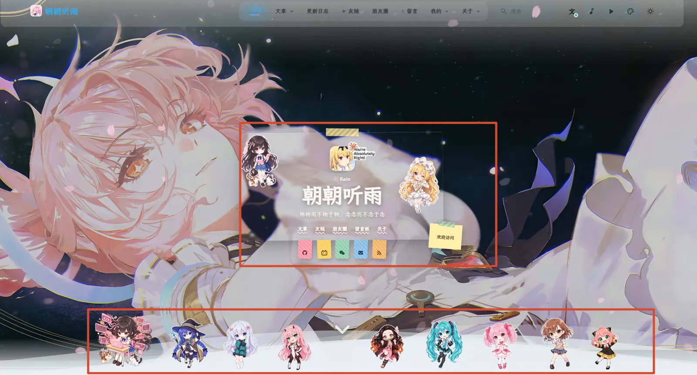
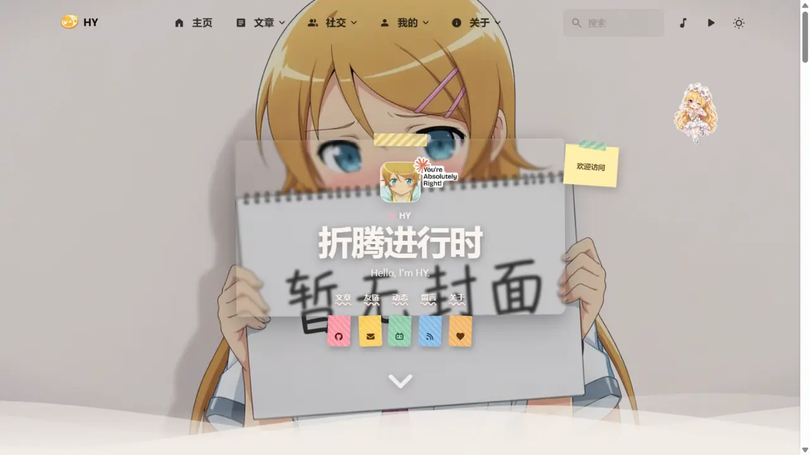
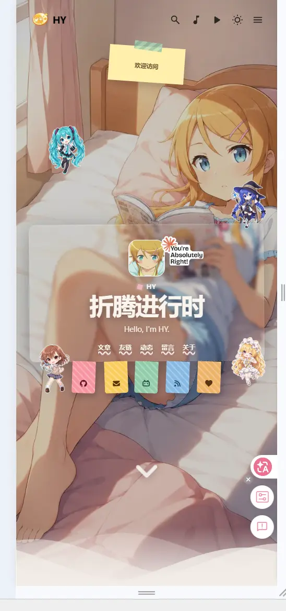
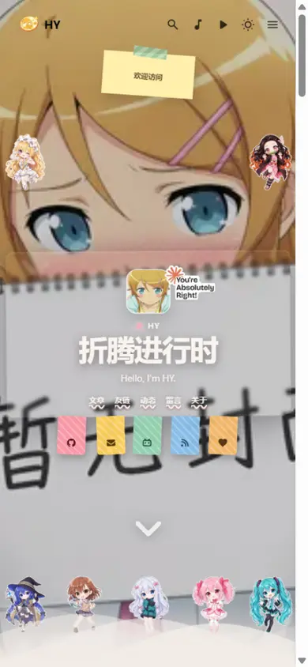
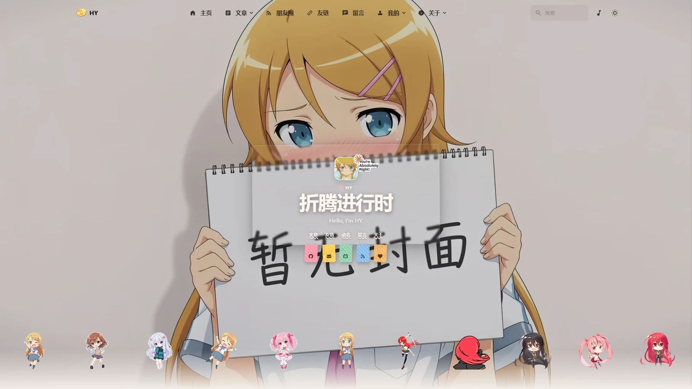
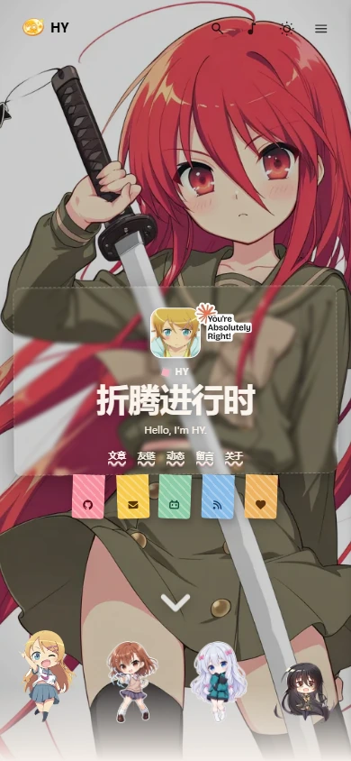
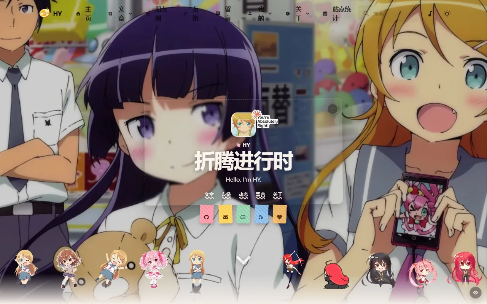

前几天刷到 [rainzt.cn](https://rainzt.cn)，首页是一张虚线框毛玻璃卡片，头顶贴着胶带、头像旁边挂了个 "You're Absolutely Right!" 的小贴纸，底下还有一排 Q 版小人，按住还能拖走。我一瞬间就觉得自己的首页太素了。



更舒服的是，我去翻了翻它的源码仓库 —— ::github{repo="Jarvis0227/Aemeath"}，发现它也是基于 Firefly 二改的。同一种子，那我抄作业的心就更安了。

## 先扒站：仓库里根本没有这套代码

第一反应是去仓库里找实现，结果 `sticker`、`drag` 全搜了一遍，啥都没有。它的 GitHub 仓库落后于线上站，这套装饰层根本没开源进去。

行吧，那就直接扒线上站。`curl` 把首页 HTML 拉下来，grep 一把 `home-wallpaper-sticker`，结构立刻清晰了：

```bash
curl -sL https://rainzt.cn/ -o rainzt.html
grep -o 'class="[^"]*sticker[^"]*"' rainzt.html | sort -u
```

从线上站一共拆出三块料：

1. **卡片 HTML**：一个 `article.home-wallpaper-card`，头像、身份行、标题、副标题、导航、彩色标签，全是语义化标签
2. **CSS**：`home-wallpaper-decor.css`，22KB，从卡片毛玻璃到贴纸投影全带
3. **JS**：一段拖拽脚本，Pointer Events 实现，附带移动端四角随机投放和点击复制 toast

贴纸图片就直接从它站点上下载到自己的 `public/images/home-stickers/`，一共十几张 webp。

## 集成方案：全放新文件，只留一个挂载点

这里我给自己加了个约束：**以后要合并 CuteLeaf/Firefly 上游的更新**。所以这套东西不能像传统魔改那样把主题文件改得到处都是，不然下次合并就是一场战争。

最终的结构是：

```
src/config/homeCardConfig.ts              # 新文件：全部配置
src/components/features/HomeWallpaperDecor.astro   # 新文件：HTML + CSS + JS 全自包含
public/images/home-stickers/              # 新目录：贴纸素材
```

主题文件只动了 `WallpaperSection.astro` 一个，改动是纯增量的一小段：

```diff
+ import HomeWallpaperDecor from "@/components/features/HomeWallpaperDecor.astro";
+ import { homeCardConfig } from "@/config/homeCardConfig";

  const { state, backgroundImages, title, bannerPostMeta } = Astro.props;
+ const homeCardEnabled = homeCardConfig.enable === true;

+ {homeCardEnabled && <HomeWallpaperDecor />}
```

卡片上显示什么也全部收进配置文件，换标题、换社交链接、挪贴纸都不用碰组件：

```ts
export const homeCardConfig = {
  enable: true,
  identity: "HY",
  title: "折腾进行时",
  subtitle: "Hello, I'm HY.",
  navLinks: [
    { name: "文章", url: "/archive/" },
    { name: "友链", url: "/friends/" },
    // ...
  ],
  socials: [
    { name: "GitHub", icon: "fa7-brands:github", url: "https://github.com/hy4962" },
    { name: "Email，点击复制", icon: "fa7-solid:envelope", copy: "admin@9ll.uk" },
    // ...
  ],
  stickers: [
    // 具体使用时，每一项只需要管这五个值
    { src: "/images/home-stickers/blonde-idol.webp", name: "金发偶像", top: 20, left: 1.2, width: 112, rotate: 4 },
    { src: "/images/home-stickers/blue-witch.webp", name: "蓝发魔女", bottom: 5, left: 1.2, width: 98, rotate: -5 },
    // ...
  ],
};
```

以后合并上游，就算 `WallpaperSection.astro` 被改了，冲突也就几行，手工处理一下就完事。

## 使用指南：怎么改成自己的

先说清楚数据流：**配置文件只描述内容，组件负责渲染，主题只提供一个挂载点**。日常改内容，你只需要动 `homeCardConfig.ts` 一个文件。

### 换文字和链接

- `identity` / `title` / `subtitle`：卡片上三行字，留空会自动回退到 `profileConfig` 和 `siteConfig` 里的名字、站点标题、签名
- `navLinks`：卡片标题下方的快捷导航，数组每一项 `{ name, url }`
- `socials`：彩色标签社交按钮，最多 5 个，颜色按顺序自动循环。`url` 是跳转，`copy` 是点击复制（邮箱、微信号这种就适合用 `copy`）

### 改贴纸

场景贴纸每一项的字段含义：

| 字段 | 含义 | 说明 |
|---|---|---|
| `src` | 图片路径 | public 目录的绝对路径，如 `/images/home-stickers/xxx.webp` |
| `name` | 备注名 | 不显示，只是给自己看的 |
| `top` / `bottom` | 纵向定位 | 距容器顶/底的百分比，二选一；一排贴纸用 `bottom` 才能对齐地面线 |
| `left` | 横向定位 | 距容器左侧的百分比 |
| `width` | 基准宽度 | px 为单位，实际渲染按视口自动缩放 |
| `rotate` | 旋转角度 | 度数，正数顺时针 |

纵向用 `top` 还是 `bottom` 取决于贴纸在哪一排：**底部那排全部用 `bottom`**，这样无论贴纸多高，脚都踩在同一条线上；左右两列的上半部分用 `top`。

还有一个 1.25 倍的全局缩放系数在组件里（`HomeWallpaperDecor.astro` 顶部的 `STICKER_SCALE`），想要所有贴纸一起变大变小改它就行，不用一个个调 `width`。

### 替换素材

新贴纸丢进 `public/images/home-stickers/`，然后改对应条目的 `src`。两个注意点：

1. 图片别太大——贴纸实际只显示 100~140px 宽（配置里的 `width` 再乘组件顶部的 1.25 倍缩放），源图 **192px 宽就够**，太大只会白烧流量
2. 底部一排的贴纸如果新素材身高差得特别大，地面线是靠 `bottom` 锚定保证的，不用管高度

### 关闭整套装饰

`enable: false`，组件整个不渲染，默认的横幅文字会自己回来，什么都不用动。

## 实现细节

### 显隐：不跟 Swup 纠缠，交给 CSS

Firefly 的壁纸区在 Swup 容器外面，切页不重渲染。这意味着装饰层不能依赖"重新渲染时判断是不是首页"，得自己处理显隐。

我最后用的方案是纯 CSS 门控，和主题里滚动指示器的思路一致：

```css
.home-wallpaper-decor {
  opacity: 0;
  visibility: hidden;
  /* ... */
}
html[data-wallpaper-mode="banner"] body.is-home .home-wallpaper-decor,
html[data-wallpaper-mode="fullscreen"] body.is-home .home-wallpaper-decor {
  opacity: 1;
  visibility: visible;
}
```

`body.is-home` 是服务端渲染 + Swup 切页时都会维护的类，`data-wallpaper-mode` 跟着壁纸模式走。这样切去文章页装饰层自动淡出，回到首页自动出现，一行 JS 都不用写。

入场动画最初是等卡片图片全部加载完再加 `is-ready` 触发，动画播完用 `animationend` 事件打上 `is-motion-settled` 标记固化终态。另外加了个 `MutationObserver` 盯着 `body` 的 class，每次从别的页面回首页时重播一遍入场动画。

> [!NOTE] 这段后来改过
> "等图片加载完才播动画"这个做法后来被推翻了——它把标题的入场一起拖到了图片下载之后。现在文字和图片走两条独立通道，细节见文末「后续更新」一节。

## 贴纸布局：从随手摆到强迫症对齐

贴纸位置全用百分比，但默认值不能随便摆——卡片居中占了大约 34%~66% 的横向空间，导航链接和社交标签都在卡片下半部，贴纸直接压上去会挡住点击。

最终的布局结构是：**左列（金发偶像上、蓝发魔女下）、右列（竹哒上、初音下）、底部中间一排三个**。宽度用 `min()` 做响应式收缩：

```css
width: min(105px, 5.4688vw, 11.5068vh);
```

中间排一开始我用 `top` 定位，结果贴纸身高不一，头顶齐了脚不齐，怎么看怎么别扭。后来把底部一排全改成 `bottom` 锚定——不管多高，脚都踩在同一条地面线上，瞬间工整了：

```ts
// bottom（距底）或 top（距顶）二选一
{ name: "蓝发魔女", bottom: 5, left: 1.2, width: 98, rotate: -5 },
```

### 拖拽的实现

拖拽用 Pointer Events，鼠标和触屏一套代码。指针按下时记录贴纸相对壁纸容器的坐标，移动时换算成 `left/top` 并夹在壁纸范围内（`Math.max(0, Math.min(容器宽 - 贴纸宽, ...))`），配合 `setPointerCapture` 保证拖出元素外也不丢事件。移动端额外禁掉长按弹菜单的 `contextmenu` 和 iOS 的 `touch-callout`。

头像小贴纸的位移写 CSS 变量而不是 `style.transform`，这是踩坑 4 的教训——fullscreen 模式下主题有 `transform: scale(1.05) !important`，内联 transform 打不过它。

刷新后贴纸回到初始位置是故意的：不做 localStorage 记忆，访客拖乱之后下次进来还是整齐的。

### 移动端的自适应

手机端和桌面端是同一套结构，靠脚本换算：解析每个贴纸初始配置里的 `top/bottom/left` 识别它属于左列、右列还是中间排，然后按卡片实际边界重排——顶部两张贴卡片上方两侧，底部五个 `bottom` 锚定在卡片下方，中间三个在左右两列之间等宽槽位居中。布局时机挂 `load` + `setTimeout` + 防抖 `resize` 兜底（后台标签页里 rAF 不触发，这个坑下面细说）。

## 踩坑记录

这次踩的坑比写代码的时间还长，值得单独一节。

### 坑 1：默认横幅文字阴魂不散

装饰卡片上线后，"World and Life" 那套默认横幅文字还叠在卡片上。我明明在服务端把 `showHomeText` 关了，HTML 里也确实带着 `hidden` 类——但页面跑起来之后它又出现了。

翻主题源码才发现有个 `syncBannerHomeTextVisibility()`，会在运行时按"是否首页 + 壁纸模式"重新计算并把 `hidden` 类摘掉。它不认识我的卡片，只知道"首页就该显示横幅文字"。


不想去改主题的工具函数，最后用同一条件的 CSS 规则直接压死：

```css
html[data-wallpaper-mode="banner"] body.is-home .banner-home-text-overlay {
  display: none !important;
}
```

这段 CSS 在我的组件里，组件不渲染时它也不存在，卡片关掉就一切恢复原状。

### 坑 2：看不见的卡片盒模型挡住了点击

调试时发现分类栏的"归档"按钮点不动，Playwright 报错说元素被 `article.home-wallpaper-card` 盖住了。卡片是透明的，但盒模型是实打实的，社交标签下方还伸出去一截。

解法是把整个卡片设成 `pointer-events: none`，再只给真正需要交互的子元素恢复：

```css
.home-wallpaper-card { pointer-events: none; }
.home-wallpaper-card__nav a,
.home-wallpaper-card__social-link,
.home-wallpaper-card__avatar-sticker {
  pointer-events: auto;
}
```

### 坑 3：切到 fullscreen 模式，贴纸三连崩

把壁纸模式切成 `fullscreen` 之后怪事来了：贴纸变大了一圈、下半截被裁掉、滚动一下还糊成一团。


查出来是主题在 fullscreen 模式下有针对壁纸容器内**所有** `img` 的规则，一共三条变体，其中最高的一条长这样：

```css
html[data-wallpaper-mode="fullscreen"][data-fullscreen-layout="classic"] #wallpaper-wrapper img {
  width: 100% !important;
  height: 100% !important;
  object-fit: cover !important;
  filter: blur(var(--fullscreen-blur)) !important;
  transform: scale(1.05) !important;
}
```

它的本意是让壁纸图铺满全屏、滚动时渐变模糊，但贴纸图也是 img，全被扫进去了：`cover` 负责裁切，`scale(1.05)` 负责放大，`blur` 负责糊脸，三个症状一次凑齐。

修法是在我自己的组件里加更高特异性的豁免规则。主题那条是 `(1,2,2)`，我借自己容器的类提到 `(1,3,2)`：

```css
html[data-wallpaper-mode="fullscreen"] #wallpaper-wrapper .home-wallpaper-decor .home-wallpaper-sticker img {
  width: 100% !important;
  height: auto !important;
  object-fit: contain !important;
  filter: none !important;
  transform: none !important;
}
```



### 坑 4：!important 大战之下，拖拽失效了

修上面这个的时候又埋了个雷：`transform: none !important` 把头像小贴纸的拖拽也废了——JS 拖拽写的是内联 `style.transform`，在内联样式里 `!important` 之外，任何样式表的 `!important` 都能把它按在地上摩擦。

解法是拖拽位移不走 `style.transform`，改写 CSS 变量：

```css
.home-wallpaper-card__avatar-sticker {
  transform: translate(var(--avatar-sticker-tx, 0px), var(--avatar-sticker-ty, 0px));
}
```

```js
// fullscreen 下也照样能拖
sticker.style.setProperty("--avatar-sticker-tx", `${translateX}px`);
sticker.style.setProperty("--avatar-sticker-ty", `${translateY}px`);
```

变量赋值是内联的，规则里带 `!important` 的 `transform` 引用的还是这份值，两边不打架。

### 坑 5：移动端随机投放，是我自己想当然

一开始照搬参考站的移动端方案：只显示 4 张 `mobile: true` 的贴纸，随机投放到四块写死的百分比区域。结果上线一看不对劲——区域是死的，卡片却是活的，窄屏下卡片占掉九成宽，两块"侧边区域"直接压在卡片上，一张贴纸骑在社交标签上，另外三张干脆没显示。



想明白了就把"随机投放"整个删掉：移动端显示全部贴纸，布局和桌面端同一套结构，坐标由脚本按卡片实际边界换算——顶部两张贴在卡片上方，底部五个 `bottom` 锚定在卡片下方，中间三个在左右两列之间等分槽位。这样不管屏幕多窄都自适应。

### 坑 6：布局代码写完了，后台标签页里根本不跑

自适应布局写完，我自己截图验证，发现贴纸时对时不对，纯属玄学。排查半天是两个坑叠一起：

1. 布局被包在 `requestAnimationFrame` 里——后台标签页的 rAF 是不触发的，页面在后台加载时布局永远不执行
2. 依赖 `matchMedia` 的 `change` 事件切换布局——部分环境（视口仿真等）这个事件压根不派发

解法：布局改同步执行（读 `getBoundingClientRect` 本身就会强制布局，不需要 rAF），再补 `load` 事件、`setTimeout` 校准和防抖 `resize` 监听兜底。顺手把贴纸坐标的解析从正则换成了临时元素 + `cssText`，让浏览器自己拆 `inset` 简写——之前那个正则压根没算上百分号，一直匹配失败，全靠默认值兜底。

### 坑 7：贴纸素材太大了

做完才反应过来，贴纸原图全是 1086×1448 的高清图，加起来 1.6MB，而它们实际只显示一百来像素宽——下载量是显示需求的十倍。用 ffmpeg 压到 192px 宽之后总共 **126.8 KB**，肉眼看不出差别：

```bash
cd public/images/home-stickers
for f in *.webp; do
  ffmpeg -y -loglevel error -i "$f" -vf "scale=192:-1" "tmp/$f"
done
```

八张图现在的实际尺寸和体积：

| 素材 | 尺寸 | 体积 |
|---|---|---|
| 金发偶像 | 192×256 | 16.2 KB |
| 洛琪希 | 192×256 | 20.1 KB |
| 和泉纱雾 | 192×256 | 14.2 KB |
| 祢豆子 | 192×256 | 17.7 KB |
| 初音未来 | 192×256 | 20.9 KB |
| 鹿目圆 | 192×256 | 16.2 KB |
| 御坂美琴 | 192×256 | 16.0 KB |
| Claude Code | 160×115 | 5.4 KB |

贴纸显示宽度是配置里的 `width` 乘上组件顶部的 `STICKER_SCALE = 1.25`，算下来在 98~140px 之间。192px 的源图对这个显示尺寸是 1.4~2 倍，正好覆盖高清屏，再大就是纯浪费。

## 效果

手机端不再是另一套布局：和桌面端同一套结构，脚本按卡片实际位置自适应换算，便签自动居中到顶部：



拖拽是按下即拖，Pointer Events 鼠标触屏通用，位置限制在壁纸范围内，点击邮箱标签会弹"已复制"的 toast：


刷新后贴纸会回到初始位置，这点是故意的——位置记忆听着美好，但访客拖乱之后就再也回不去了，参考站也是这么做的。

## 极简流程

1. `curl` 抓参考站 HTML，拿到卡片结构、CSS、拖拽 JS 三块料，贴纸图下载到 `public/images/home-stickers/`
2. 新建 `src/config/homeCardConfig.ts`，卡片内容和贴纸位置全配置化
3. 新建 `src/components/features/HomeWallpaperDecor.astro`，HTML/CSS/JS 自包含
4. `WallpaperSection.astro` 里加一个挂载点，同时把 `showHomeText` 短路掉
5. 显隐交给 `body.is-home` + `data-wallpaper-mode` 的 CSS 门控
6. 踩坑修复：压默认文字、放开卡片点击、fullscreen 豁免、CSS 变量拖拽、移动端自适应布局
7. 后续：换自己的贴纸素材、入场动画拆成文字/图片两段、关掉 Swup 视口预取、桌面贴纸并成一排、手机端收成一行、加一张动图、贴纸改成延迟加载

## 写在最后

这次最值得记的其实不是贴纸本身，而是"合并友好"这个约束：所有逻辑收进两个新文件，主题只留一个挂载点，连踩坑修复都尽量用自己组件里的高优先级规则去覆盖，而不是直接改主题源码。以后上游更新合并过来，该是啥样还是啥样。

贴纸素材当时用的还是 rainzt 的演示图，后来换成了自己的一套角色（下面说）。想换成自己的图直接丢进 `public/images/home-stickers/` 改下配置就行。

## 后续更新

上面那一版是 9 月初的形态。后面又折腾了几轮，这里按时间补上，免得文章停在一个过时的状态。

### 贴纸换成自己的了

原来那批是参考站的演示图，8 张都是常见动漫 Q 版角色。后来换成了自己挑的一套，还是 8 张，布局位置一个没动：

| 素材 | 位置 |
|---|---|
| 金发偶像 | 左列上（`top: 20`） |
| 洛琪希 | 左列下（`bottom: 5`） |
| 和泉纱雾 | 底部左（`bottom: 5, left: 48`） |
| 祢豆子 | 右列上（`top: 20`） |
| 初音未来 | 右列下（`bottom: 5, left: 94`） |
| 鹿目圆 | 底部中（`bottom: 5, left: 61.5`） |
| 御坂美琴 | 底部中左（`bottom: 5, left: 34.5`） |
| Claude Code | 底部右（`bottom: 5`） |

换素材只动了 `homeCardConfig.ts` 里的 `src` 和少量 `width`，组件一行没改——这算是当初把内容全配置化的回报。压缩尺寸也顺便从 360px 收到了 192px，8 张图合计 126.8 KB（原本 330KB，再早是 1.6MB）。

（这批角色和"左右两列 + 底排"的两排布局后来又整个推翻重做了一轮，见下面。）

### 入场动画拆成了两段

这是被一组性能数据逼出来的改动。我跑了几轮 Lighthouse 测移动端，一直有个数字看不懂：最大元素（LCP）要 4 秒多才被浏览器认定"画好了"，而且查不到是哪张图拖的。

后来把 Lighthouse 的底层 trace 导出来（145MB）流式解析，才发现 LCP 元素根本不是壁纸、也不是卡片，**是卡片里那行标题文字**：

```
@ 2614 ms  type=text  size=15194  nodeName=SPAN class='home-wallpaper-card__motion-text'
```

顺着查到两个叠加的原因，都在这套入场动画里：

1. **标题的入场关键帧起点是全透明**。它借用了通用的 `home-wallpaper-content-enter`，0% 是 `opacity: 0`；而动画用了 `animation-fill-mode: both`，意味着动画开始**前**就套用 0% 关键帧——于是它在 0.36 秒的延迟期间一直是全透明的，**Chrome 不把 `opacity: 0` 的元素算作内容绘制**，LCP 自然被推迟。
2. **`is-ready` 要等图片**。前面写的那句"等卡片图片加载完再加 `is-ready`"，把标题的入场也一起绑在了图片下载上。

改法是两刀：

- 给标题单独一版关键帧，起点直接 `opacity: 1`，只保留从下往上滑 12px 的位移；延迟从 `0.36s` 收到 `0.08s`。视觉上还是"滑上来"，但第一帧就算画好了。
- 入场逻辑拆两段：文字动画不再等图，两帧之后直接放行；图片单独走一条 `is-media-ready` 通道，只控制自己 0.24 秒的淡入。

```css
@keyframes home-wallpaper-title-enter {
  0% { opacity: 1; transform: translateY(12px); }
  to { opacity: 1; transform: translateY(0); }
}
.home-wallpaper-decor.is-ready .home-wallpaper-card h1 {
  animation-name: home-wallpaper-title-enter;
  animation-delay: 0.08s;
}
```

拆图片通道时留了个安全垫：图片的隐藏规则写成 `.is-ready:not(.is-media-ready)`，只有 JS 确实接管、入场已启动时才隐藏它。这样脚本失效、或者访客开了"减弱动态效果"，图片都是直接可见的，不会永久空白一块。

### 顺手关掉了 Swup 的视口预取

同一次体检里还挖出一笔大流量：Swup 的预取插件默认会**把导航里露出来的链接全部提前下载**。首页第一屏正好有 7 个链接满足条件（卡片导航 5 个 + RSS / 打赏），移动端一次抓回 483KB 页面 HTML，占总流量 34%。

改法是把它还原成上游那行 `preload: true`。这行配置的完整语义是"hover 预取开、视口预取关"，跟我想要的 `visible: false` 运行时完全等价，但**和上游字节一致**，以后合并上游连 diff 都不会产生——这是这次所有优化里唯一一条能减少合并负担的改动。

效果（部署后实测）：

| 指标 | 改前 | 改后 |
|---|---|---|
| 移动端 perf | 64 | 71 |
| FCP | 3968 ms | 3006 ms（−24%） |
| LCP | 5280 ms | 4506 ms（−15%） |
| 总传输 | 1405 KiB | 916 KiB（−35%） |
| 预取页面数 | 16 | 1 |

桌面端分数没变（都是 89），但传输量从 2177 KiB 掉到 1142 KiB。桌面模拟带宽高，那 1MB 预取本来就不在关键路径上——所以桌面的收获是**省流量，不是提分**，这点得说清楚。

所有这些改动依然遵守着"不碰主题源码"的规矩：新增的关键帧、通道类名、门控规则全在 `HomeWallpaperDecor.astro` 里，这个文件上游根本没有，改它零冲突。`astro.config.mjs` 那行还反倒更接近上游了。

### 贴纸并成一排，手机也收成一行

底排那六张错位贴纸看久了还是觉得不如一排整齐，索性全铺平：桌面端 11 张全部 `bottom: 5`，脚踩同一条地面线。顺手裁掉两张（夏娜蜜瓜包、露易丝女仆），又加进来一张动图，于是"左右两列 + 底排"这套布局算是彻底下架了。

摆到一条线上才发现"等距"没那么简单。先按 `left` 等距排，看着还是歪。原因是各张基准宽度不一样，而图片在盒子里是居中的（宽盒子遇到 `img { max-height: 104px }` 会上下裁、内容收窄），`left` 等距换来的是视觉中心不等距，1920 宽下最多能漂 ±11px。改成按视觉中心算就正了：

```
中心 C_i = 5 + i × 90 / (n - 1)              // 从 5% 铺到 95%
left_i   = C_i - width_i × 0.0651042 / 2     // 盒宽% = width × 1.25 / 1920 × 100
```

还有个教训：**张数一变必须重算所有 `left`**，不能只挪动周围两张。从 12 张加到 13 张那次，中心间距从 8.18% 掉到 7.5%，原本够宽的贴纸立刻擦边。换算下来有个闸门：相邻两张 `width` 之和 ≲ `2764.8 / (张数 − 1)`。11 张是 276、12 张 251、13 张只剩 230。

这是"盒子刚好相切"的值，实际要按八折用——`rotate` 的那 ±3~6° 会把图横向撑出来。

真正管住碰撞的其实是**可见宽度**，不是盒子宽度。`img { width: 100%; max-height: 104px; object-fit: contain }` 意味着 `可见宽 = min(盒宽, 104 / 宽高比)`。抱臂那张高宽比 2.16，盒子给多宽也只显示 48px，压根不参与碰撞。所以 13 张那次我是把几张扁图从 116/112/110 压到 100 才腾出的空间，而**在 1920 上观感完全没变**——它们的实际大小本来由 `max-height` 决定。后来裁回 11 张，又把这些 `width` 还了回去：1440 / 1024 上盒子才是限制因素，留着临时瘦身会肉眼可见地小一圈。



手机端也被我改了一轮。原本随机抽 8 张、每行放 5 张，于是分两行、平分 4+4。想改成一行，改完发现 `mobileStickerLimit` 不是一个随便填的数——**它直接决定排几行**：

```
每行张数 = floor(97.6 / (尺寸 / 屏宽 × 100 + 1.6))
```

尺寸从 68px 往下试，只要"行数 × 行高"塞得进卡片下方的安全区就定案，**它不会为了凑成一行主动去选更小的尺寸**。68px 时 390 宽能放 5 张，360 宽掉到 4 张。

所以填 5 是假的：在 390px 的机器上看着是一行，换台 360px 的立刻翻回两行。要"任意机型都一行"只能填 4，窄到 320px（iPhone SE）也还是完整一行。想让 8 张挤进一行得压到 41px 以下，而尺寸候选表最小就是 42px——物理上不可能。

代价是从 8 张变 4 张。我倒是觉得更好：4 张 68px 铺满一行，比 8 张 50px 挤两行干净。



同一天还把卡片上那张"欢迎访问"的便签去掉了——`note.enable` 设成 `false`，组件直接不渲染这个节点。这里有个小坑：不能靠清空文字来"隐藏"，便签的黄色方块是 CSS 给的固定尺寸（`width: 84px; min-height: 63px; background: #fff1a8`），文字空了方块还在；想用 `top` 挪到 999% 又会往页面外撑出滚动条。

### 第一张动图贴纸，以及一次翻车的压缩验证

11 张里有一张是动的。手上正好有个 6 帧的甩发 GIF（160×143、50ms 一帧、GIF89a 自带透明），就顺手做成了动画 webp——组件本来就是裸 ``，浏览器自己会播。

转换踩到两个坑：

1. **所有帧要按"并集 bbox"统一裁剪**，不能每帧各裁各的。各自裁会让头发甩出去时整只跟着位移，看起来像画面在抖。
2. **缩放必须走预乘 alpha**。直接对 RGBA 跑 LANCZOS，透明区的黑 (0,0,0) 会渗进边缘，红头发外圈会挂一圈黑边。PIL 不做预乘，这一步得自己实现。

做完一看体积 60.2 KB，是普通静态贴纸（8~16 KB）的四倍多，于是开始压。压的过程比转换本身有意思：

| 手段 | 结果 | 值不值 |
|---|---|---|
| `alpha_quality` 100 → 70 | q90 档 60.2 → 51.3 KB，q75 档 42.6 → 33.6 KB | 白捡的，见下 |
| `quality` 90 → 70 | 51.3 → 32.3 KB | 也白捡 |
| 高 192 → 176 | 再省 12%（33.6 → 29.7 KB） | 看不出来，但为 2.6 KB 不值 |
| 高 192 → 原尺寸 139 | 19.8 KB（−41%） | 翻车在这里，下面说 |
| 6 帧减到 4 帧 | −7 KB | 动感变段落化 |

`alpha_quality` 之所以基本免费，是因为这张图的 alpha 几乎只有 0 和 255 两个值，有损压缩根本碰不到它——实测 alpha 通道平均差 0.19、差超过 10 的像素只占 **0.036%**。

质量那条曲线在 q50~q70 这段几乎是平的（28.1 / 29.1 / 30.1 / 31.2 / 32.3 KB，从 q50 到 q70 一共只涨 4.2 KB）。也就是说**字节是帧数据本身，不是质量参数**，想再小只能动尺寸或帧数。

至于翻车的那条：我第一轮对比是用 LANCZOS 把各版本放大到显示尺寸看的，结论是"降到原尺寸也没差"。**这个结论是错的**。贴纸显示高 104 CSS px，2x 屏要 208 设备像素，139 的源图得靠浏览器放大 1.5 倍；而浏览器放大图像用的是双线性级别，**没有 LANCZOS 那么好**。改用 `BILINEAR` 模拟 2x 屏、再 nearest 放大 4 倍去看，原尺寸那版的描边明显发虚。

所以最终定在 202×192 / q70 / `alpha_quality` 70 / 6 帧 = **32.3 KB**，比一开始省 46%，和别的贴纸同分辨率、放大四倍看不出差别。这个"验压缩要先模拟浏览器的滤镜"的坑值得单独记一笔。

### 贴纸改成延迟加载：手机端从 149 KB 降到 47 KB

这个数字是查了才知道的：手机端随机显示 4 张，实际下载的却是全部 11 张加头像，一共 149 KB，然后扔掉三分之二。

因为服务端输出的是一整排 ``，随机抽签是页面加载完之后在 JS 里切 `display` 的——`display: none` 不阻止下载，抽签也救不了已经发出去的请求。更糟的是这 149 KB 全带着 `eager`，和壁纸（手机端 220 KB，就是 LCP 元素）抢带宽，等于在首屏最要命的时刻插队。

改法是服务端不输出 `src`，只留 `data-home-wallpaper-src`（这样首屏一个贴纸请求都不会发），赋值交给脚本：

| 场景 | 行为 |
|---|---|
| 手机端 | 布局跑完、`display` 定好之后，**只给抽中的那几张赋 `src`** |
| 桌面端 | 等 `window.load` 之后再统一赋值，避开壁纸的关键路径 |
| 手机 → 桌面 resize | 补齐没加载的 |
| 禁用 JS | `<noscript>` 里另有一份带真实 `src` 的贴纸兜底 |

实测：

| 视口 | 请求数 | 字节 |
|---|---|---|
| 390×844 | **5**（4 张抽中的 + 头像） | **≈47 KB** |
| 1920×1080 | 12（11 张 + 头像） | 149 KB，但都在 `window.load` 之后 |

手机端少下 68%，桌面端字节没变但让开了首屏。

几个连带处理：图片没 `src` 时高度是 0，所以给 `img` 加了 `opacity: 0` 和 `img[src] { opacity: 1 }` 的淡入，盖住盒子从 0 长到 104px 那一下；手机端解码完要重排一次，否则盒子高度只能拿估算值；从手机 resize 到桌面时得把没加载的补上。

验证方式也换了一个。`--log-net-log` 在本机打不开文件，改成临时插一个 `?sticker-debug=1` 门控的覆盖层，读 `performance.getEntriesByType("resource")` 里 `home-stickers` 的条数和 `encodedBodySize`，截图读数之后再把那段删掉。

### 卡片开场两秒，然后把位置让给壁纸

卡片太抢眼了，壁纸反而成了背景板。于是想要个"开场"：卡片完整亮两秒，然后整体向右滑出屏幕，只留壁纸和贴纸；右边缘挂一根竖排小签，点它还能把卡片叫回来；不想等就点右上角那颗半透明的 `−`（用减号不用叉，它不是"永久关掉"）。

听着简单，写起来卡在两个地方。

第一个是 **CSS animation 的终态压住了后面所有的 transition**。卡片入场用的是 `animation: ... both`，`fill: both` 会把动画最后一帧一直挂在元素上，而动画声明的优先级高于普通声明——不先把这段动画摘掉，`transition` 怎么写都推不动，表现就是"点了没反应，卡片直接瞬移"。所以收起前得先给容器加 `is-entrance-done` 摘掉卡片自身的动画，再强制一次样式计算（`getBoundingClientRect()` 之类），位移才真的走得动。

顺带一个 reduced-motion 的坑：开了"减少动态效果"时动画是 `none`，**永远不会有 `animationend`**，卡片也就拿不到 `is-motion-settled`；而收起态那条规则原本靠这层类去压 `opacity: 1 !important`，同特异性下被更靠后的规则反压——结果是"卡片移出屏幕了却还算亮着"。修法是收起态补一条 `is-entrance-done.is-collapsed` 的四类组合（0-4-0），不再依赖任何动画事件。

第二个是**只做水平位移、不做缩放**。手机端那套贴纸布局读的是卡片 rect 的上下边界来决定贴纸落点，只横着挪的话这两个值完全不变——实测收起前后 11 张（手机 4 张）坐标零漂移，不需要重排。要是加了缩放，这套就得整个推翻重算。

还有个配置上的洁癖：一开始配置里写的是 `delay: 3900`，意思是"从入场开始算 3.9 秒后收起"——这个数是 1.41s 入场动画加 2.5s 停留手算出来的。以后谁改一下入场节奏，它就悄悄错了，而且新会话里根本看不出 3900 是哪来的。改成了只填语义化的一个 `hold: 2000`（入场动画落定之后再停留多久），总时长交给脚本监听 `animationend` 现算。

"只播一次"的判定也有讲究：用脚本作用域里的**内存变量**，不用 `sessionStorage`。这个脚本带 `data-swup-ignore-script` 只在整页加载时跑一次，壁纸区又在 Swup 容器外不会重渲染——于是刷新会重播、从文章返回首页不会重播。用 `sessionStorage` 反而会把刷新也算进同一次会话，正好和想要的相反。

### 右下角加了颗「隐藏贴纸」开关

有时就想纯看壁纸。右下角加了一颗毛玻璃圆钮（`fa7-solid:eye` / `eye-slash`），点一下整排收走、再点放回，状态存 localStorage，刷新切页都记得住。图标表状态、`aria-label` 表动作、配 `aria-pressed`。

效果是逐张错开的：收起时从左往右一张张淡出，放回时从右往左接上（每张错开 40ms）。JS 只切一个 `is-stickers-hidden` 类，节奏全在 CSS，靠每张贴纸的 `--home-wallpaper-sticker-i` 算延迟。

这里有个很容易写错的点：**两个方向的 transition 要各写各的**。CSS 的 `transition` 读的是"变化之后"那条声明——收起方向的延迟得写在 `.is-stickers-hidden` 那条规则里，放回方向写在 `.home-wallpaper-sticker` 基础规则里。写在一处的话，总有一个方向没有级联。

然后踩到一个症状极具欺骗性的 bug。我第一版在隐藏规则里写了 `animation: none`，想着"都藏起来了还跑什么入场动画"。后果是：页面加载时如果 localStorage 记着"已隐藏"，贴纸的入场动画被掐掉 → 不触发 `animationend` → 拿不到 `is-motion-settled` → 等用户点"放回"时入场动画重新生效（0.52s 延迟 + 0.76s），把右先左后的级联整个盖掉。

**症状是「刷新过之后放回没有逐张效果，但当天首次加载时是好的」**——第一次跑全流程 7 项断言只挂这一项，差点当成探针误差放过去。修法是干脆不写 `animation: none`：`opacity: 0 !important` 本来就压得住动画（`!important` 声明的优先级高于动画），让它照常跑，状态就统一了。

另外选择器要多挂一层 `.home-wallpaper-decor__stickers` 凑到四个类，否则压不过入场动画那条同为 (0,4,0) 的规则——同特异性就得靠源码顺序，太脆。

### 贴纸给下滑箭头让路（顺带一个被否掉的方案）

全屏壁纸模式正中央有颗往下的小箭头，提示可以往下滚。它被贴纸盖住了——不是位置问题，是层级：贴纸层 `.home-wallpaper-decor` 是 `z-index: 25`，箭头只有 `10`，而居中那张小人正好压在它上面（实测重叠 76×64，几乎完全盖住）。

我第一反应是把箭头抬到 `30`，顺便给它一块毛玻璃圆底，这样压在贴纸上也像颗按钮。**做出来就被否了**：中央那张贴纸身上凭空多一颗圆钮，不好看。

于是改成**让贴纸让路**，箭头一行 CSS 都没动：桌面端底部这排从 11 张素材里**每次刷新随机抽 10 张**，左右各 5 张分列，正中央空出 20%（`homeCardConfig.desktopStickerRow` 的 `count` / `centerGap`）。抽中的仍按原本的相对顺序排，不重新洗牌——洗了会左右跨位，看着乱。



实测两侧净空：1280 宽下 46 / 50px，1024 宽下 29 / 31px，箭头完整露出来，贴纸一张没少看（只是每次少露一张）。

写这段时踩了四个坑，都挺隐蔽：

1. **抽签结果必须缓存。** 布局在 `load`、400ms 定时、`resize` 时会重算好几次，不缓存就每次重抽，贴纸在眼前来回跳。
2. **改完位置必须写回 `data-home-wallpaper-initial-style`。** 拖拽还原是整条 `style` 覆盖，手机端排布也读它来分带——只改 `style` 不改这个属性，拖一下或者转手机就打回原形。
3. **序号要按"看得见的张数"重编。** `--home-wallpaper-sticker-i` 和 `--home-wallpaper-sticker-count` 都得跟着改成 10，否则整排收起/放回的错开延迟按 11 张算，最后一张会平白多等一拍。
4. **`restoreDesktopStickerPositions` 会把 `display: none` 一起抹掉。** 它是拿 initial-style 整条覆盖 inline style 的，所以顺序必须是"还原 → 重新抽签并隐藏 → 矮窗口压缩"，而且矮窗口压缩那个分支也得读同一份抽签结果，否则它会把被抽掉的贴纸重新放出来。

顺带一个性能上的小便宜：被抽掉的那张不给 `src`，一整页少一个贴纸请求。

### 还没解决的

说个不太好看的：移动端那 2 秒的白屏直到现在也没完全解释清楚。trace 里能看到渲染阻塞的 CSS 在 612ms 就全部就绪了，但 FCP 还是拖到 2655ms——中间这段空窗目前只能怀疑是字体或主题运行时脚本，没定位到确切的元凶。

所以性能这块还没收工，下次再测。
