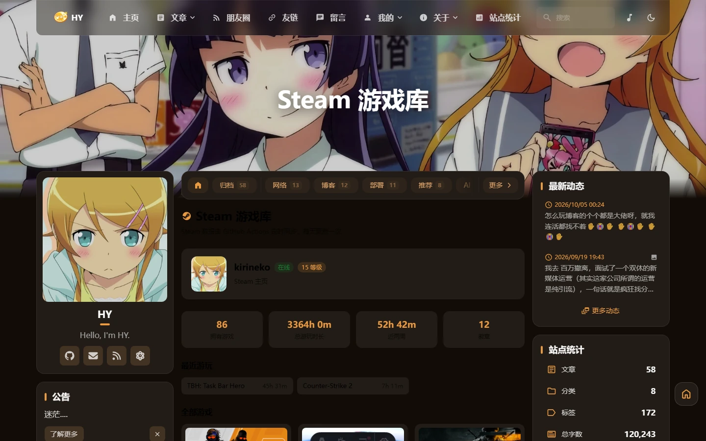

在 [nxxy335.top/steam](https://nxxy335.top/steam) 看到他做了个 Steam 游戏库页面：54 款游戏、637 小时总时长、最近在玩什么，全都列得清清楚楚。

我 Steam 上也攒了些游戏，这种"游戏履历"摆在博客上挺有意思的，就想着也搞一个。

不过第一眼看到的是他的页面，第二眼想的是另一个问题：**这数据是浏览器直接调的，还是他后端拉的？**

## 他的数据是怎么来的

扒了一下页面源码，答案很清楚。

站点是 **Halo 2.26.1**（`<meta name="generator">` 里写着），装了个第三方插件 `plugin-steam`。页面 HTML 里游戏名、时长、封面图 URL **全是烤好的静态内容**——也就是说数据是后端定时调 Steam 接口拿到、缓存下来、再服务端渲染出去的。前端那个 `steam-game-card.js` 只在点开某张卡片时补一次详情请求，走的是他自己的后端代理。

浏览器从头到尾没碰过 Steam。

这个区别很关键，因为它直接决定了我要怎么抄：**他有常驻后端，我是纯静态站。** 服务端定时同步这条路我走不了。

## 静态站没有后端，但这事有解

静态站拿外部数据，常规就三条路：

| 方案 | 数据新鲜度 | 代价 |
|---|---|---|
| 构建期 fetch | 停在部署那一刻 | 零配置，但 Steam 抽风会挂构建 |
| **定时任务写快照** | 每天一次 | 一条 CI 任务 |
| Serverless 函数实时拉 | 每次打开都最新 | 每访客一次请求，首屏空白，还得处理限流 |

我选了中间那条，原因特别简单：**我博客里已经有一条干这事的流水线了。**

朋友圈（友链 RSS 聚合）有个 `refresh-friends-feed.yml`，每周定时跑脚本抓所有友链的 RSS，写进 `src/data/friends-feed-snapshot.json`，有变化就 commit——提交一推，Vercel 和 Cloudflare 各自检测到就重新构建，内容自然保持新鲜。

Steam 游戏库是**完全同一类活**：定时抓外部数据、落本地文件、构建时读。所以我没有新建第二条流水线，直接往这条里加了一个步骤。跑一次、提交一次、构建一次，朋友圈和游戏库一起刷新。

## 数据本身：Steam Web API

接口不复杂，主要是三个：

- `ISteamUser/GetPlayerSummaries` —— 昵称、头像、在线状态
- `IPlayerService/GetBadges` —— 等级和徽章数
- `IPlayerService/GetOwnedGames` —— 拥有游戏、每款总时长、近两周时长、最后游玩时间

要申请一个 **Steam Web API Key**（[申请页](https://steamcommunity.com/dev/apikey)）。这里有个前提：账号必须**非受限**（消费满 5 美元），否则申请不了。所幸我这号没这个问题。

另外记得把 Steam 隐私设置里的**「游戏详情」设为公开**，不然 `GetOwnedGames` 返回空。

封面图不用额外调商店接口。直接拼就行：

```
https://cdn.cloudflare.steamstatic.com/steam/apps/<appid>/header.jpg
```

实测 200，约 34 KB，460×215。参考站用的是带 hash 的 `store_item_assets` 那种 URL，那是要先把商店详情拉下来才能拿到的——**别走这条弯路**。

## 没配置 Key 也不至于空着

Key 还没申请下来的那段时间，页面就一直是空的。

后来补了条降级路径：没有 Key 就退回去抓 `steamcommunity.com/profiles/<id>/?xml=1` 这个公开 XML。不用任何凭据，能拿到昵称、头像、在线状态和**常玩的几款游戏**（含时长）。

代价是数据不完整——我这号实测只有 **2 款**。真正的游戏库有 86 款。所以脚本里加了个 `partial` 标记，页面会显示一条提示说明现在是精简模式，统计卡也从「拥有游戏」改成「收录游戏」，不去误导读者。

有 Key 走完整模式，没 Key 走精简模式，代码自己判断，不用手动切换。

## 踩坑记录

### `steamids` 是复数

这个是代码里最坑的一处。我把三个接口共用一个参数拼装：

```ts
const keyParam = `key=${apiKey}&steamid=${steamId}`;
```

结果 `GetPlayerSummaries` 一直返回 **HTTP 400**，我第一反应是 Key 有问题——刚申请的新 Key 不该失效，又怀疑是不是还没生效，来回试了几轮。

后来把响应体打出来才看到：

```
<html><body><h1>Bad Request</h1>Required parameter 'steamids' is missing</body></html>
```

**这个接口的参数名是复数 `steamids`**，另外两个才是单数 `steamid`。修一下就好了。

> [!WARNING] 排查接口报错时一定要把响应体打出来
> 只看状态码的话，400 太容易被当成"凭据无效"了。

### 别拿 302 判断"游戏详情公开了吗"

想确认隐私设置对不对，我一开始拿 `steamcommunity.com/profiles/<id>/games?tab=all&xml=1` 试探——返回 302 跳登录，看起来像是游戏列表没公开。

其实那个端点**现在对所有人都跳登录**，不管你的游戏详情公开不公开。参考站的游戏数据明显是公开的，我去试了一下，同样 302。

所以这条路判断不了任何事，配好 Key 跑一次脚本，看输出里有没有收录数才靠谱。

### `game_count` 不含免费游戏

`GetOwnedGames` 返回的 `game_count` 只统计付费游戏。CS2、Apex 这类免费游戏会出现在 `games` 数组里，但不计入这个数。我这边 `game_count` 是 86，实际玩过的有 51 款（时长大于 0 的），两个数各有各的用处，别混着展示。

顺带一提，想让免费游戏也出现在列表里，接口要加 `include_played_free_games=1`。

## 密钥会不会泄露

这是我自己最担心的一点——**仓库是公开的**。

实际盘下来，风险比想象中小得多。核心原因是存档和取数是分开的：

| 环节 | 有没有 Key |
|---|---|
| GitHub Secrets | 加密存储，设置后连自己都看不到明文 |
| Actions 运行 | 环境变量注入，日志里自动显示为 `***` |
| 快照 JSON | 只有游戏数据，不含 Key |
| Vercel / Cloudflare 构建 | **根本不需要 Key** |
| 前端 JS 和 HTML | 没有 |

最后两行是这个方案最舒服的地方。构建时页面干的事只有一句 `import snapshot from "@/data/steam-snapshot.json"`——读一个已经提交的普通 JSON 文件。所以 Vercel 和 Cloudflare 后台都不用配任何环境变量，**只在 GitHub 加一个 Secret 就够了**。

顺手做的验证：`git log --all -S "<密钥片段>"` 搜全部分支和全部历史，零命中。（注意 GitHub 网页的代码搜索只索引默认分支，我的改动在 `HY` 分支上，用网页搜其实说明不了问题。）

> [!NOTE] Key 换掉之后记得手动跑一次
> 脚本的容错策略是"抓失败就保留旧快照、不让 CI 变红"。好处是流水线永远不炸，坏处是**Key 失效了也不会有人告诉你**，页面会一直显示旧数据。所以换 Key 之后建议手动 Run 一次 workflow，确认日志里打出「完整模式」和正确的收录数。

## 上手步骤

如果你想在自己博客上也搞一个，流程是这样：

1. 到 [steamcommunity.com/dev/apikey](https://steamcommunity.com/dev/apikey) 申请 Key，域名随便填，最后要在手机 Steam App 上确认一次
2. 把 Steam 隐私设置里的「游戏详情」设为**公开**
3. 仓库 Settings → Secrets and variables → Actions 添加 `STEAM_API_KEY`
4. 把 64 位 Steam ID 填进配置（可以在 Steam 客户端「账户明细」里找到，或者用 steamid.io 查）
5. 手动跑一次那条定时 workflow，确认日志输出正常

脚本零依赖，只用 Node 内置的 `fetch`，几秒就跑完。

## 最后看看效果



现在的数据是 **86 款游戏、总时长 3364 小时、15 级、12 个徽章**，按时长排前几名是 CS2（2265 小时）、Wallpaper Engine（295 小时）、Call of Duty（217 小时）。「最近游玩」那块会显示近两周有时长的游戏，比总时长榜更有"最近在干嘛"的感觉。

整件事改动是 6 个文件、+1343 行：一条 workflow 加了一个 step，新增一个抓取脚本、一个配置文件、一份快照数据和一个页面。除了导航菜单要加个入口，**组件、布局、样式、i18n 这些高频改动区一行都没碰**，上游合并的时候不会打架。
