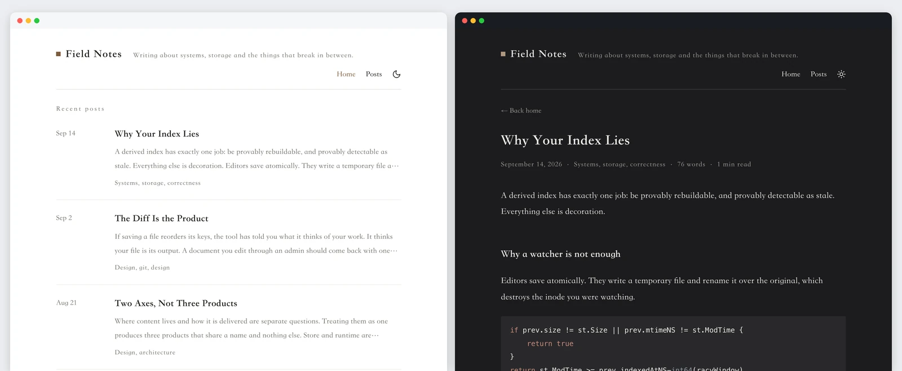
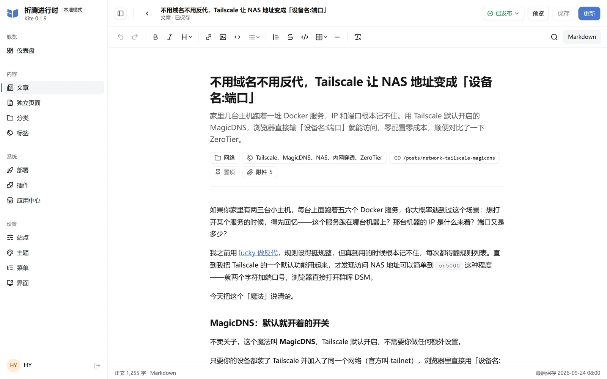
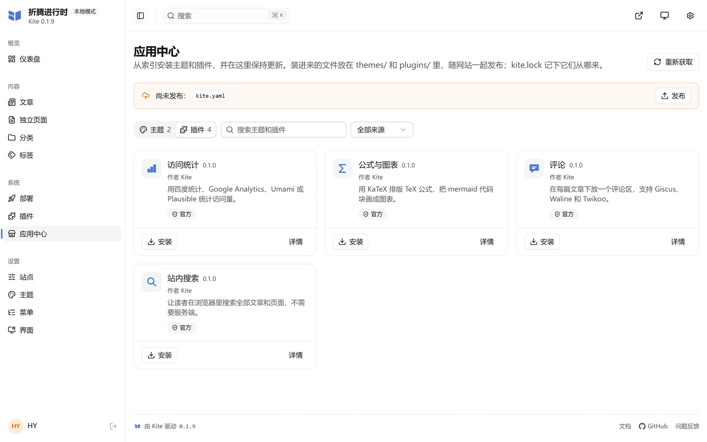
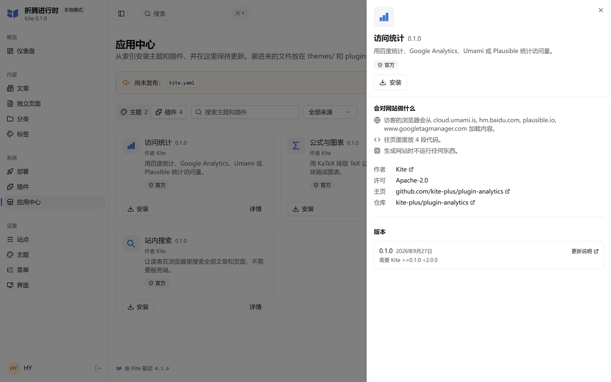
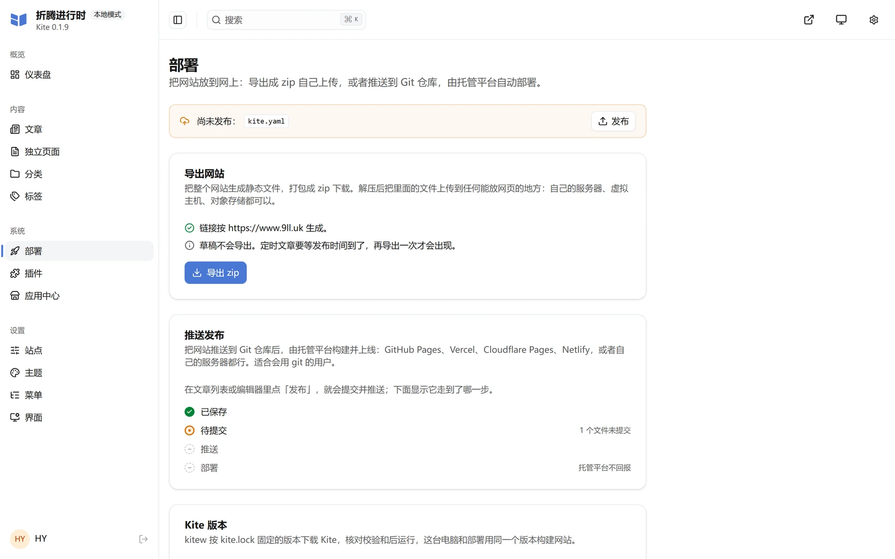

前两天刷 GitHub 的时候看到一个新项目，叫 Kite。star 才 12 个，创建也就半个多月，看着像是个玩具。

结果点进去一看，作者是把它当正经产品在做的 —— Go 写的 CMS，Apache-2.0，主题契约、插件 ABI、构建产物版本锁定，该有的都有。

我最近正好想给博客找个新后端，就顺手把这 52 篇文章全迁过去试了一圈。

## 为什么觉得它有意思

我做这个博客的时候有个一直很别扭的地方：写文章是纯 Markdown，但要改个标题、加张图、调整标签，得开编辑器改文件，存盘，切窗口看效果，来回折腾。

别的静态博客方案要么还是这套，要么就得自己配一个 CMS 前端 —— 通常是个单独的 Node 项目，跑起来还要连数据库。

Kite 的做法不一样：**整个 CMS 就是一个二进制文件**。

```
kite 0.1.9 (152206b, 2026-10-03T20:26:53Z) go1.26.8 windows/amd64
theme api kite/v1, plugin abi 1
```

就这一行输出。32.4 MB 的 exe（解压后 34013696 字节），后台、默认主题、SQLite 驱动全编译进去了。解压完丢进 PATH，在一个空目录里敲 `kite run`，浏览器直接弹出建站页面，填完站名和作者名就进后台了。

没有数据库要装，没有依赖要跑，没有 npm install 出一屏 WARN。我这已经不是第一次被"解压即用"糊弄了，但 Kite 这个是真的一个文件。

## 后台长什么样

后台在 `http://localhost:1717/admin/`，可视化编辑器直接读写磁盘上的 Markdown。




关键在"直接读写磁盘"这个说法：内容就是磁盘上的 `.md` 文件，保存时只改写真正变化的部分，key 顺序和注释都原样保留。



这意味着你在后台改个标题，`git diff` 只有一行。写错了还能直接在编辑器里切回源码模式手动救。写作这件事和 Git 仓库之间没有割裂感 —— 这一点比很多 CMS 强太多了。


我迁移文章的时候全程就是靠这个特性：写脚本批量改 front matter 的键名（`published` 改成 `date`、`category` 改成 `categories`），Kite 认这套规则，一遍过。

## 插件化做到了什么程度

插件分两种，一种往页面里注入代码，一种在构建时于沙箱里跑 WebAssembly。

构建时的钩子有这几个：

| 钩子 | 什么时候跑 | 能拿到什么 |
|---|---|---|
| `transform_markdown` | 页面 Markdown 渲染之前 | `markdown` |
| `transform_html` | 每个渲染好的页面 | `html` |
| `build_complete` | 整站构建完成后 | `pages`，每页带纯文本 `text` |

关键是 WASM 这个选择。插件跑在 Extism 沙箱里，不是拿 Go 插件往你进程里塞东西 —— 意味着任何有 Extism PDK 的语言都能写，官方插件用的是 Go。

目前官方的 4 个插件：

| 插件 | 作用 | 压缩包 |
|---|---|---|
| `comments` | 评论，支持 Giscus / Waline / Twikoo | 11.4 KB |
| `analytics` | 访问统计，百度 / Google Analytics / Umami / Plausible | 8.4 KB |
| `math` | KaTeX 公式 + mermaid 画图 | 927 KB |
| `search` | 站内搜索，纯浏览器端，不需要服务端 | 978 KB |

索引里每个版本都记着要加载哪些外部域名（`loads` 字段），装之前你就能看清它要连哪些 CDN。`search` 那个插件的 `loads` 是空的 —— 搜索索引直接打进包里，一个外部请求都不发。`comments` 则老老实实列了 giscus.app 和两个 CDN。这种把网络依赖摊开给你看、而不是装完再说的做法，我觉得比插件数量更重要。





## 主题市场

主题也是按名字装，官方市场目前两个：

- **Almanac**（年鉴）v0.1.2 —— 杂志风，首页有个刊头，下面是卡片流，还有 projects、books、moments、links、resume 各种版式
- **Vane**（风标）v1.0.2 —— 已经迭代到 1.0 了


我自己装的是 Almanac。它的 `theme.yaml` 里声明 `contentTypes: [post, page]`，只需要 Kite 原生的两种内容类型，正好能直接用上我迁过去的 `posts/` 和 `pages/`。

装主题在后台点一下就行，或者命令行 `kite theme add vane`。更新同理。

## 部署方式随便挑

这块我反而觉得不是重点，但确实自由：

**导出静态页** —— 后台「部署」导出 zip，或者 `kite build` 写到 `public/`，丢到任何静态托管都行。



**跑在自己服务器** —— Docker 一条命令：

```bash
docker run -d --name kite --restart unless-stopped -p 127.0.0.1:1717:1717 -v kite-data:/data ghcr.io/kite-plus/kite:latest
```

**走 Git 发布** —— `kite publish --all --push` 提交推送内容，托管平台的工作流负责上线。

有个细节我觉得挺实在：`kite.lock` 会把站点构建用的 Kite 版本固定下来，CI 里由 `kitew` 运行。也就是说**你部署时用的 Kite 和你本地预览时的是同一个版本**，不会因为上游发了新版导致线上突然挂掉。

## 它现在到哪一步了

作者在 README 里写得很清楚，一点不藏着。

**已完成**（0.1 系列）：静态构建、实时预览服务、浏览器后台、Git 发布（M0–M4），WebAssembly 插件第一版（M8）；主题契约 `kite/v1` 在 0.1.4 冻结（M5）；应用中心在 0.1.5 发布，0.1.6 起索引带签名；版本锁定在 0.1.7 发布（M6 的一部分）。

**接下来**：增量构建（M6 剩下部分），以及基于 SQLite 的动态模式（M7）。

翻译成人话：写文章、后台、插件、主题、部署全都能用了；还没做完的是构建速度优化，以及带数据库的动态功能（比如访客交互、动态流这类需要服务端存储的东西）。

项目自己也写着"仍在早期开发中，版本之间仍可能有变化"。0.1.9 的 API 契约主题是 `>=0.1.0 <2.0.0`，卡得很死，但毕竟 0.1 阶段，谁都说不准明天会不会改。

## 迁移过程中踩的坑

我这次迁移不算顺，Windows 上撞了三个。

**中文名图片存不进去。** 篇文章里有 41 张 `01-设置root密码.jpg` 这种文件，Kite 构建时直接 `Access is denied`。我一开始以为是缓存脏了，清了 `.kite/` 重建，照样报。定位到是 Windows 文件名编码的问题，只好写脚本把所有非 ASCII 文件名改成 `img-1.jpg` 这种，再同步改写正文引用。这不是 Kite 逻辑错，是它对非 ASCII 文件名没做处理。

**`doctor --fix-ids` 会制造 slug 冲突。** 这命令给每篇文章分配唯一 ID 挺好用的，但它会顺手写一句 `slug: index`。我三篇页面 slug 全变成 `index`，构建直接报 SQLite 唯一约束失败。更坑的是 Windows 大小写不敏感 —— 如果我把旧地址写进 `aliases` 保留外链，`/posts/Oreimo/` 和 `/posts/oreimo/` 会去写同一个文件，又是 `Access is denied`。得把跟自身 slug 相同的 alias 剔掉。

**`.kite/` 里有 SQLite，运行时删不掉。** 想清缓存重来的时候 `rm -rf` 直接被占用文件拦了，得先停服务。

前两个坑是 Kite 在 Windows 上的真实缺陷，第三个算不上。但对一个"解压即用"的项目来说，这些确实会影响第一次上手的心情。

## 跟现在的方案差在哪

我这个博客现在是 Firefly，Hugo 生态的静态站，主题功能多得多 —— 壁纸轮播、贴纸、追番、时间线、相册，都是折腾出来的。

对比一下：

| | Firefly | Kite |
|---|---|---|
| 技术栈 | Astro + Svelte | Go 单二进制 |
| 后台 | 无（纯改文件） | 自带可视化后台 |
| 装环境 | Node + pnpm，依赖一大片 | 一个 exe |
| 插件 | 自己改主题代码 | 官方市场装，有 ABI |
| 主题 | 主题自带全部功能 | 主题 + 插件组合 |
| 内容量 | 52 篇 + 动态 + 项目 + 相册 | 同上（这次全迁了） |
| 成熟度 | 稳定在 1.x | 0.1.9，早期 |

Kite 赢在"不用配环境 + 自带后台 + 装东西有统一入口"，Firefly 赢在"主题功能多到离谱"。

## 适合谁

我觉得挺适合这几类人：

- **想自己写博客但不想折腾环境的人**。有个 exe 就够了，不用管 Node 版本、pnpm、依赖冲突。
- **静态博客写累了的人**。后台直接改，不用来回切窗口。
- **想要插件化但不想自己写主题的人**。评论、统计、公式、搜索都是现成的，主题自己换。

不太适合的：

- **要功能完整的**。图库、追番这类 Firefly 里折腾出来的东西 Kite 没有，官方市场也没有现成插件。Almanac 主题倒是画了 moments 时间线的版式，但要在 `kite.yaml` 里自己声明 dynamic 内容类型才能用 —— 官方 4 个插件和 2 个主题里没有一个帮你做这事。
- **不接受早期项目的**。0.1.9，API 契约随时可能变，star 才 12 个，基本没社区。
- **在 Windows 上放大量中文文件名图片的**。这条是我自己撞出来的，你如果图片都是英文名就没事。

## 我的判断

方向是对的。

把 CMS 后台编译进单个二进制，这个取舍很克制 —— 代价是没有 Node 生态那套现成的东西，收益是零配置。主题契约和插件 ABI 冻结得早，说明作者想清楚了要往哪走，不是先跑起来再说。

我自己现在是两边留着：主站继续用 Firefly（那些折腾出来的功能我舍不得），Kite 拿来当试验田，写新东西或者想试试不同主题的时候在这边试。

最让我意外的是后台这个决定。之前觉得"静态博客配后台"是个伪需求 —— 我自己用 Astro 这么久也一直没配。但真的用下来，在后台改 front matter、拖图片上传、设标签这个过程，比开编辑器找文件改要舒服得多。

当然这也可能因为我刚从一个折腾了半年的 Astro 项目逃出来，单纯想换个不用折腾的环境。换句话说，如果我现在的主流博客工具已经自带好用的后台，我大概不会觉得这个东西有多新鲜。

---

如果你也在找静态博客的新方案，可以关注一下这个项目。不过还是那句话，早期项目，先看着别急着把主站搬过去。

项目地址在 [`kite-plus/kite`](https://github.com/kite-plus/kite)，文档在 [`docs/reference.zh-CN.md`](https://github.com/kite-plus/kite/blob/main/docs/reference.zh-CN.md)，写得比多数项目的文档细，踩坑之前值得先翻一遍。
