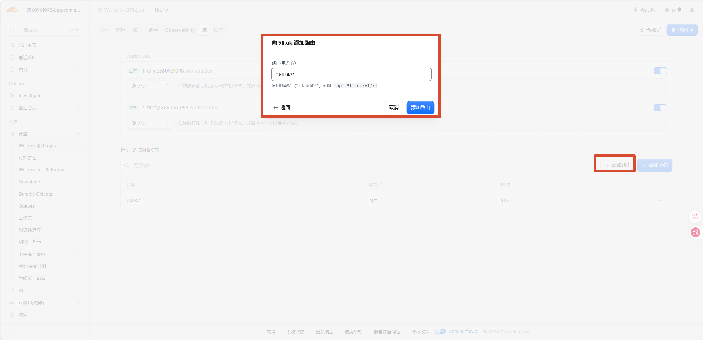

## 前言

优选IP的主要好处有：

- **访问速度更快**：减少网络绕路，网页打开更迅速。
- **延迟更低**：请求响应时间更短，尤其对国内用户体验提升明显。
- **连接更稳定**：选择质量更好的节点，减少丢包、超时等问题。
- **提升下载速度**：对于图床、博客、静态资源等，图片和文件加载通常更快。
- **改善跨境访问体验**：在部分地区，可以避开网络质量较差的 Cloudflare 节点。

不过需要注意的是，**优选 IP 并不会提升 Worker 的计算性能，也不会增加 Cloudflare 的带宽**。它优化的是**客户端到 Cloudflare 边缘节点**这一段网络路径，因此效果会因地区、运营商和时间而有所不同。

## 1.添加路由

进入自己的Wokers项目，点击域，添加路由，输入自己网站的域名(**注意:此域名必须由Cloudflare托管**)

比如我的博客主域名是9ll.uk，那么就写9ll.uk/*

如果你是想要二级域名访问，那么就写 xx.9ll.uk/*

## 2.选择自己喜欢的优选IP

[CloudFlare优选Cname域名 - 微测网](https://www.wetest.vip/page/cloudflare/cname.html)

该网站提供了很多优先域名列表，可以自己去测测速然后选择一个\

## 3.域名解析CNAME

回到自己域名的DNS解析，**一定要关掉代理**

## 结语

其实这种方式是别人已经优选好了IP，你只是在抄别人的作业

你可以进去[CloudFlare优选IPV4地址 - 微测网](https://www.wetest.vip/page/cloudflare/address_v4.html)，甚至是自己直接复制ping出来好的Cloudflare IP,直接将域名A解析到IP即可，弄多几条甚至几百条A解析即可(几百条还叫优选吗?/doge)

cname别人的话，其实也是一个别人已经做好A解析IP的列表而已
