## 前言

只需要一个域名，就可以创建无限个的邮箱地址，类似各大邮箱平台的体验。本项目可部署到 Cloudflare Workers，个人 **0 服务器成本**，搭建属于自己的邮箱服务。

当然，你也能用它来**管理不同平台的账号邮箱**，把注册邮箱和私人邮箱分开，更加安全，可以**完全隐藏自己的真实邮箱**

> **前提条件：** 你的域名必须已托管至 Cloudflare（即 NS 服务器指向 Cloudflare）。

（昨天还想着自己用 WPF 做一个调用 Resend API 的项目呢...今天就发现了更好的开源方案）

---

## 第一部分：部署 CloudMail 收件服务

整体流程：**Fork 仓库 → 创建 Worker → 配置环境变量 → 创建存储资源并绑定 → 设置域名邮件路由 → 初始化数据库 → 注册管理员**

### 1. Fork 仓库并创建 Worker

首先 Fork 仓库：[cloud-mail](https://github.com/hy4962/cloud-mail)

然后在 Cloudflare Dashboard 中创建 Worker，选择**从 GitHub 导入**。

> 点开 **高级设置**，将路径设置为 `/mail-worker`，这一步不要漏掉。

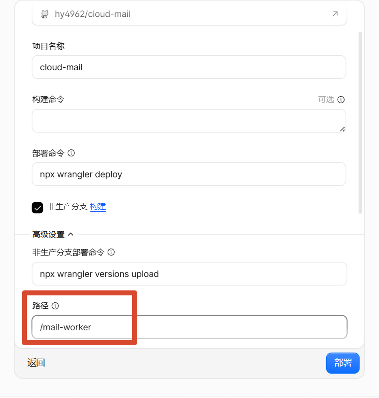

### 2. 配置环境变量

在 Worker 的**设置 → 变量和机密**中，添加以下环境变量：

| 变量名     | 必需 | 用途                                                         |
| :--------- | :--: | :----------------------------------------------------------- |
| `domain`     |  ✅   | 邮箱域名。多域名用 JSON 数组格式，例如 `["example.com","example2.com"]` |
| `admin`      |  ✅   | 管理员邮箱地址，例如 `admin@example.com`                     |
| `jwt_secret` |  ✅   | JWT 密钥，随便输入一串字符串即可，**不要包含特殊字符**       |

> ⚠️ **建议：** 如果你还没有绑定自定义域名到 Worker，推荐先绑定再配置环境变量。绑定域名的方式见优选 IP 文章。

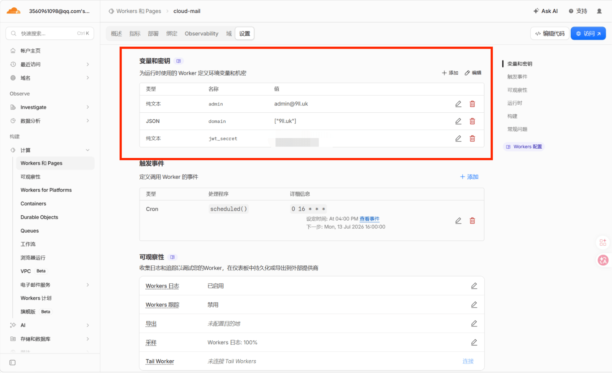

### 3. 创建存储资源（D1 + KV + R2）

CloudMail 需要三种存储资源，分别用于数据库、缓存和附件存储：

| 资源类型 | 推荐命名           | 用途       |
| :------- | :----------------- | :--------- |
| D1 数据库  | `Cloud-mail-DB`    | 存储邮件数据 |
| KV 存储    | `Cloud-mail-KV`    | 缓存与配置   |
| R2 存储桶  | `Cloud-mail-R2`    | 邮件附件     |

按推荐名称创建即可，当然你也可以用自己的命名。

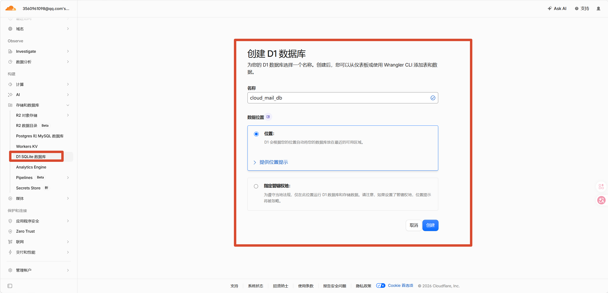

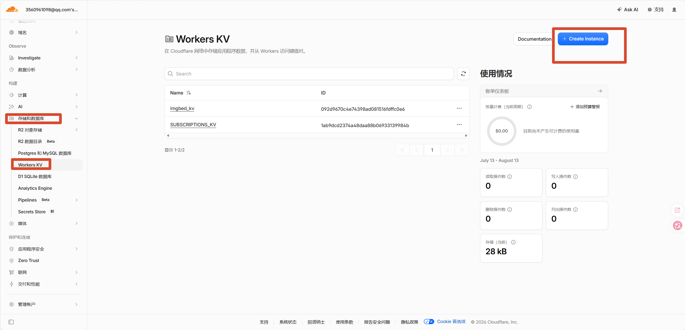

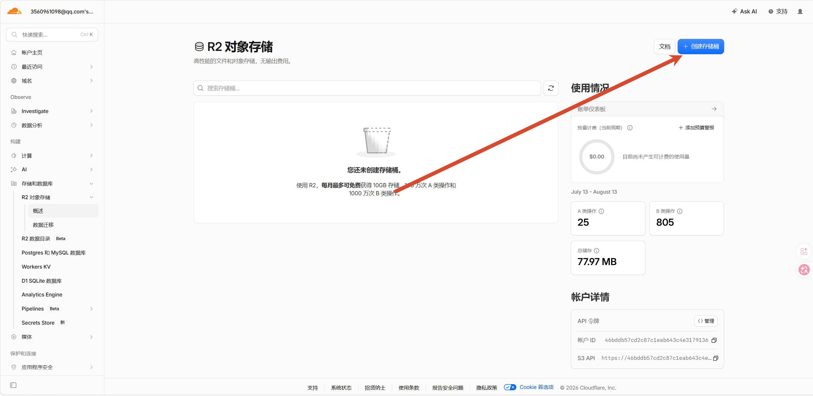

创建完成后，回到 Worker 的**设置 → 绑定**页面，将三个资源全部绑定上去：

> ⚠️ **绑定的时候变量名必须严格为** `db`、`kv`、`r2`，否则 Worker 无法正确读取。

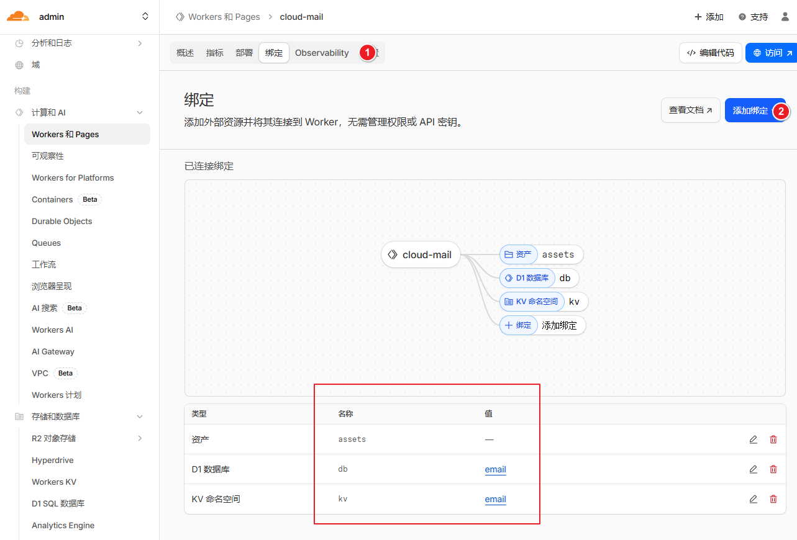

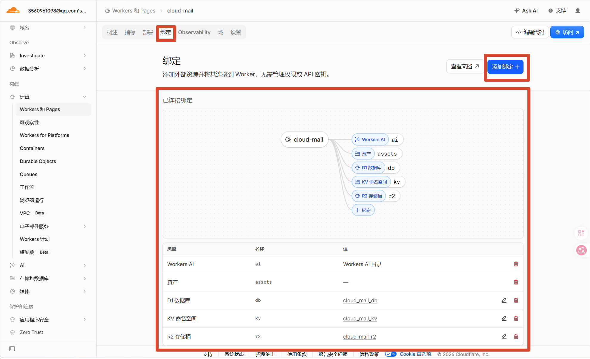

### 4. 配置域名邮件路由

进入 Cloudflare 的 **电子邮件 → 电子邮件路由** 页面，将收到的邮件转发到刚才创建的 Worker 项目。

> 如果你的域名刚托管过来，可能需要先点击启用电子邮件路由，Cloudflare 会自动添加所需的 MX 记录。

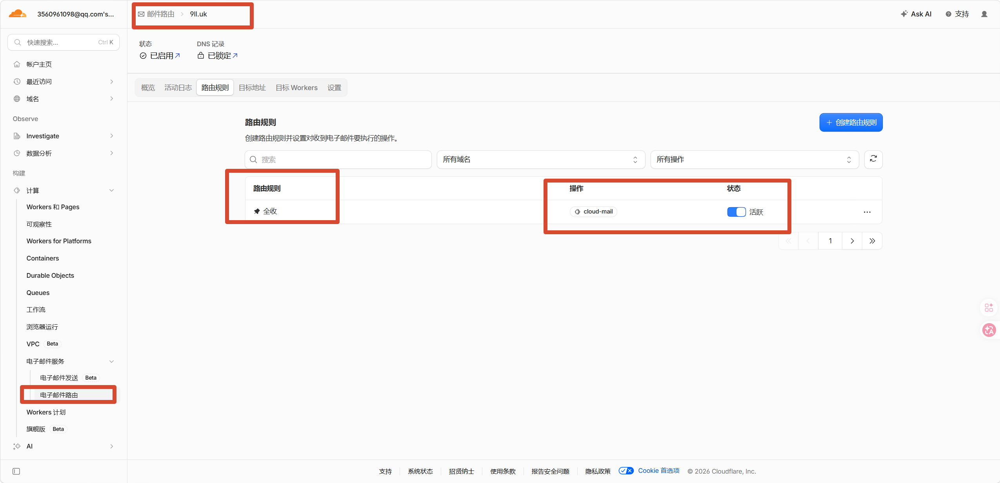

### 5. 初始化数据库并注册管理员

在浏览器中访问以下地址来初始化数据库：

```
https://你的worker域名/api/init/你的jwt_secret
```

看到浏览器返回 **success** 即表示初始化成功。

然后直接访问：

```
https://你的worker域名/
```

在页面上 **注册管理员账号**。管理员账号就是你在步骤 2 中设置的 `admin` 环境变量值。

到这一步，CloudMail 的收件功能就部署完成了 🎉

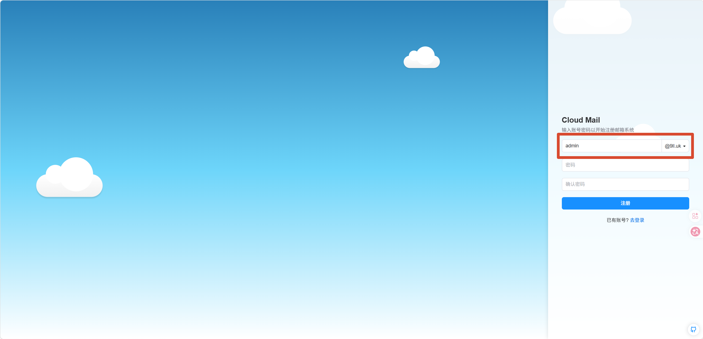

---

## 第二部分：配置 Resend 发件服务

Cloudflare Workers 本身不支持发邮件（25 端口被封禁），所以我们需要借助第三方发件服务。**Resend** 提供了免费额度（每月 3000 封），对个人使用来说足够了。

整体流程：**注册 Resend → 添加域名并验证 DNS → 创建 API Key → 配置 Webhook 回调 → 填入 Token**

### 1. 注册 Resend 并添加域名

前往 [Resend 官网](https://resend.com/login) 注册账号，然后在控制台中添加你的域名。

添加后，Resend 会提供几条 DNS 记录（SPF、DKIM 等），你需要到 Cloudflare 中添加这些记录来完成域名验证。

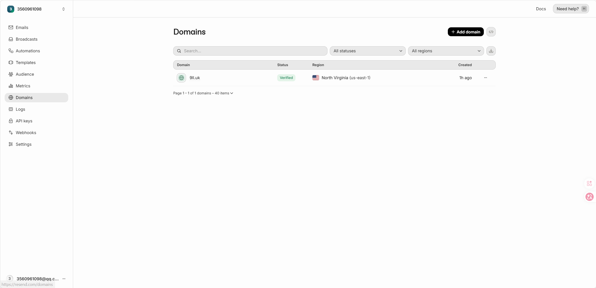

### 2. 创建 API Key

在 Resend 控制台的 **API Keys** 页面创建一个新的 Key，复制保存好，后面要用。

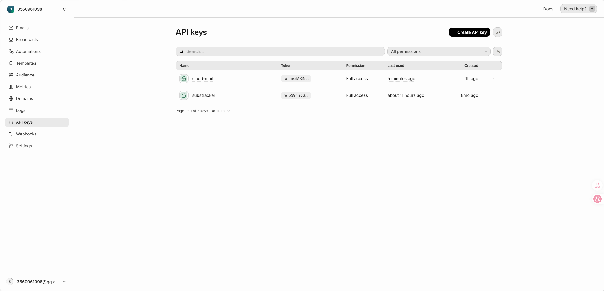

### 3. 配置 Webhook 回调

在 Resend 的 **Webhooks** 页面，添加一个新的 Webhook，用于接收邮件发送状态的回调通知：

- **Endpoint URL** 填写：`https://你的worker域名/api/webhooks`
- **Events** 权限选择如下图所示：

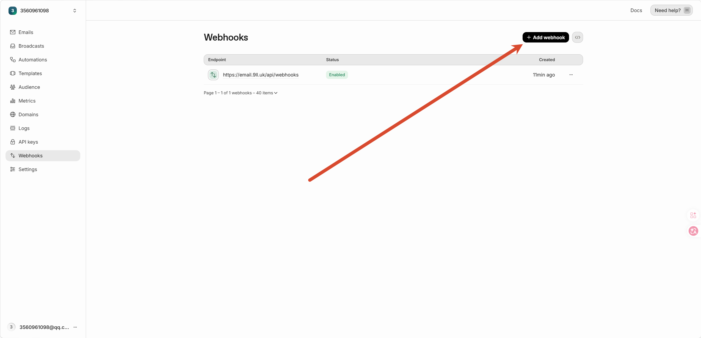

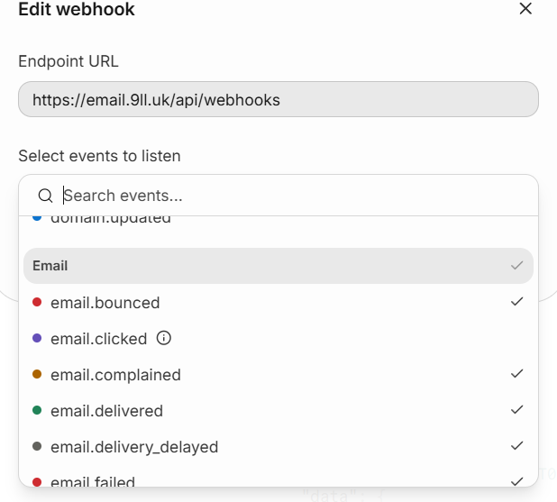

### 4. 填入 Resend Token 到 CloudMail

回到 CloudMail 的管理员后台，在设置页面中填入刚才复制的 Resend API Key：

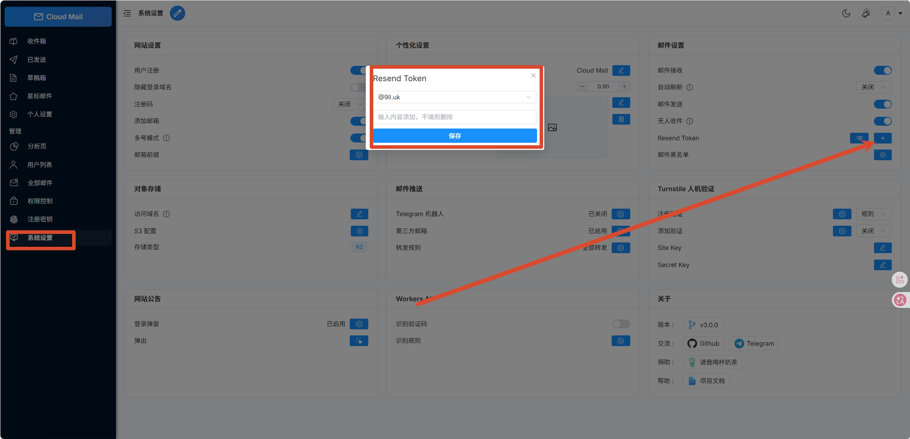

---

## 结语

至此，CloudMail 已经完成全部部署。

- 收邮件由 Cloudflare Email Routing + Workers 负责。
- 发邮件由 Resend 提供 API 支持。

整个方案几乎不需要服务器，只需要一个托管到 Cloudflare 的域名，就能拥有自己的邮箱系统。

另外，CloudMail 后台还支持将收到的邮件自动转发到自己的真实邮箱，即使不经常登录后台，也不会错过任何新邮件。


过程中遇到问题可以**直接在评论区留言**，看到都会回复的

文章是**摆烂技术站**原创，需要转载等用途请联系**WeChatOfficialAccount@9ll.uk**
