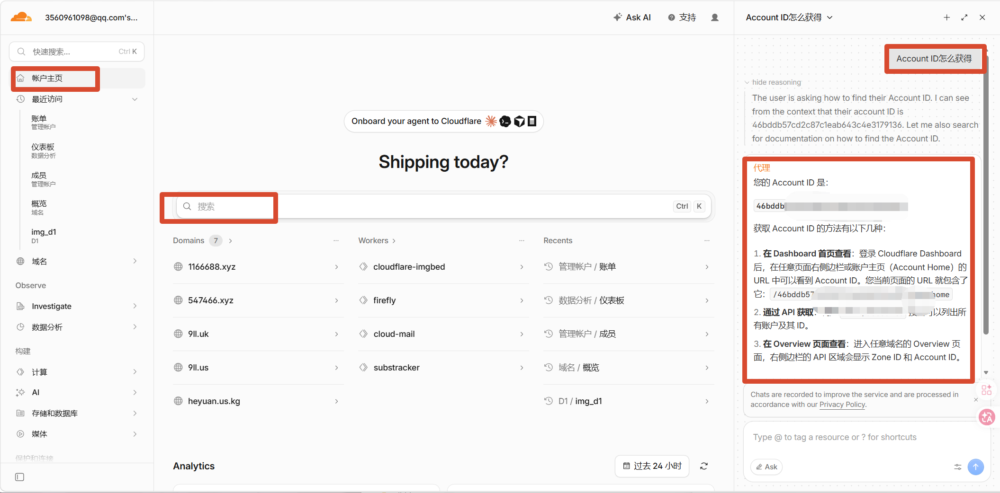
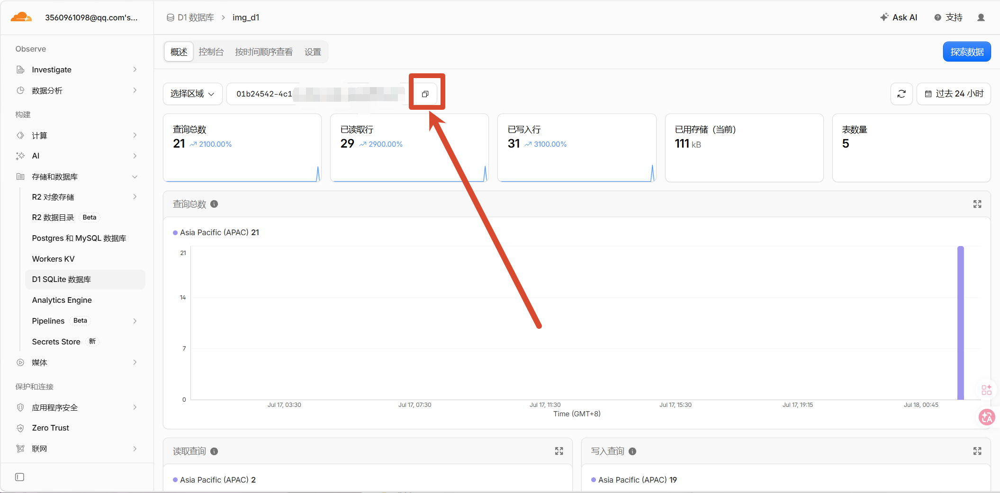
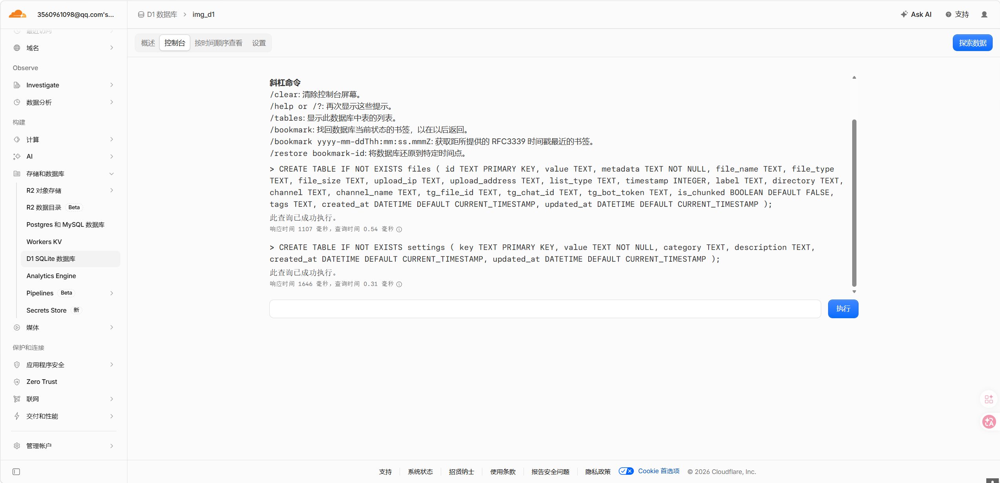
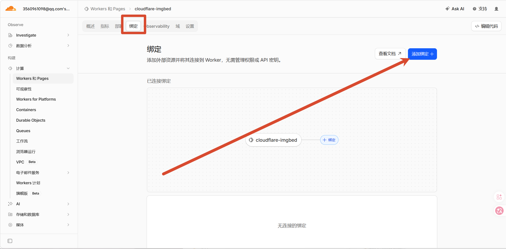
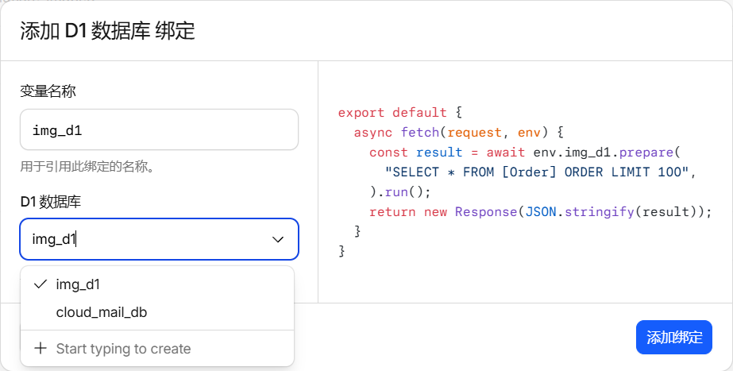
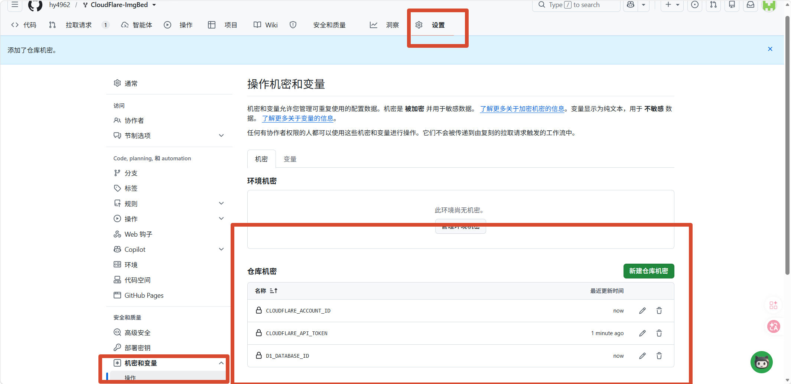
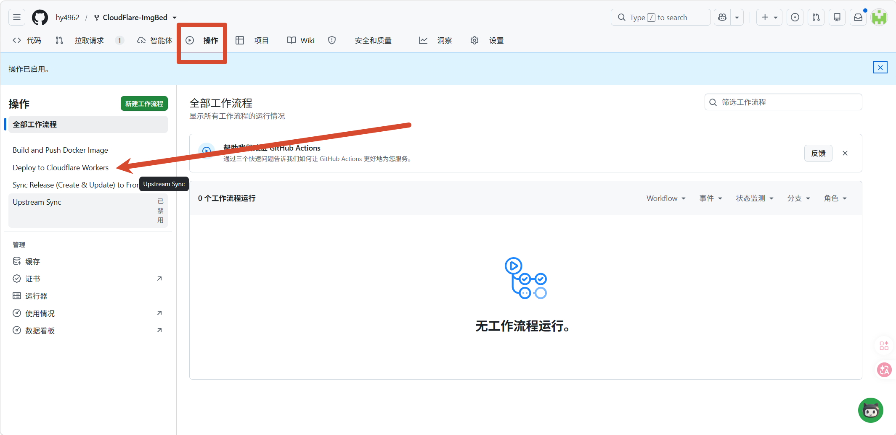
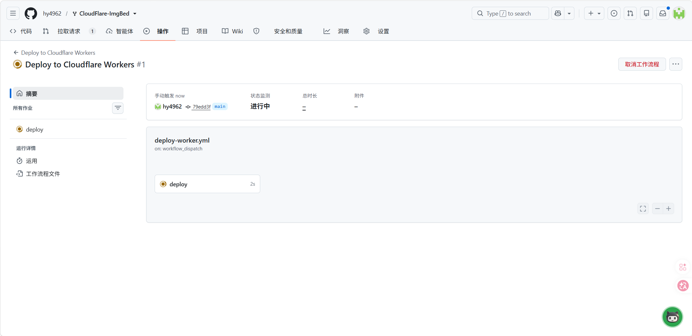
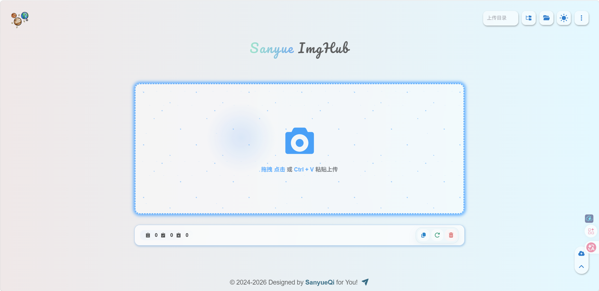

# 折腾 CloudFlare ImgBed：用 Workers 部署一个免费图床

## 为什么想搞这个

之前我一直用别人搭的图床，偶尔抽风挂了就得换一个，挺烦的。后来想着干脆自己搞一个算了，反正也不需要多大的量，个人博客够用就行。

研究了一圈发现 CloudFlare ImgBed 这个项目挺合适的。它跑在 Cloudflare Workers 上，数据库用 D1，存储可以选 R2 或者 Txxxram Bot，免费额度对个人图床来说完全够用。最关键的是不用自己搞服务器，Cloudflare 的边缘网络速度也不差。

部署方式有两种：Pages 和 Workers。Pages 更简单，Dashboard 里点几下就行。Workers 需要用 GitHub Actions，适合熟悉 CI/CD 流程的用户，支持 push 到 main 分支时自动部署，也可以手动触发。两种方式功能完全一样，我选了 Workers，主要想试试 GitHub Actions 自动部署的感觉。

## 第一步：Fork 项目

先去 GitHub 上找到 [CloudFlare ImgBed](https://github.com/MarSeventh/CloudFlare-ImgBed)，点右上角 Fork 到自己的账户下。这一步没什么好说的，应该都会。

## 第二步：准备 Cloudflare 资源

### 2.1 获取 API Token

登录 [Cloudflare Dashboard](https://dash.cloudflare.com/)，点头像进「我的个人资料」，左边栏有个「API 令牌」，点进去，然后点右上角的「创建令牌」。

模板选「编辑 Cloudflare Workers」就行。选完会跳到权限配置页面，这里直接默认就好，不用改什么。权限、账户资源、区域资源都是帮你配好的，往下翻到底提交就行。

创建完之后把 Token 记下来，后面要填到 GitHub Secrets 里。

### 2.2 获取 Account ID

Account ID 在 Dashboard 首页右侧栏的 Account Details 区域。我一开始没找到，后来发现直接在首页问 Ask AI 就行，它会告诉你在哪。



复制下来备用。

### 2.3 创建 D1 数据库

数据库用来存图床的文件元数据，比如文件名、大小、上传时间之类的。KV 和 D1 二选一，我选了 D1，免费额度比 KV 多不少。

进 Dashboard 左侧「存储和数据库」→「D1 SQL 数据库」，点「创建数据库」。名字必须填的 `img_d1`，区域选了亚太地区，然后点创建。

创建完之后回到 D1 数据库的概述页面，这里能看到数据库 ID。**点旁边的复制按钮把 ID 复制下来**，后面配置 GitHub Secrets 要用。



接下来去 D1 的「控制台」选项卡，把初始化 SQL 执行一下。这段 SQL 会建好几个表：`files`（存文件信息）、`settings`（存配置）、`index_operations`（索引操作记录）之类的，还有索引和触发器。



直接复制粘贴执行就行。**要分段输入**，别一次全贴进去，容易出问题。控制台会显示每条语句的执行结果，看到「此查询已成功执行」就说明没问题。

这里贴一下主要的建表语句，方便你对照检查：

```sql
CREATE TABLE IF NOT EXISTS files (
    id TEXT PRIMARY KEY,
    value TEXT,
    metadata TEXT NOT NULL,
    file_name TEXT,
    file_type TEXT,
    file_size TEXT,
    upload_ip TEXT,
    upload_address TEXT,
    list_type TEXT,
    timestamp INTEGER,
    label TEXT,
    directory TEXT,
    channel TEXT,
    channel_name TEXT,
    tg_file_id TEXT,
    tg_chat_id TEXT,
    tg_bot_token TEXT,
    is_chunked BOOLEAN DEFAULT FALSE,
    tags TEXT,
    created_at DATETIME DEFAULT CURRENT_TIMESTAMP,
    updated_at DATETIME DEFAULT CURRENT_TIMESTAMP
);
```

还有 `settings`、`index_operations`、`index_metadata`、`other_data` 几个表，以及一堆索引和触发器。完整的 SQL 在项目的 [database/init.sql](https://github.com/MarSeventh/CloudFlare-ImgBed/blob/main/database/init.sql) 里。

> 踩坑提醒：如果你之前已经建过表想重新来，先把 SQL 开头那几行 `DROP TABLE` 的注释去掉，执行一遍清掉旧表，再跑建表语句。生产环境慎用这个操作。

### 2.4 创建 R2 存储桶（可选）

如果需要使用 R2 存储渠道，进 Dashboard 左侧「存储和数据库」→「R2 对象存储」，点「创建存储桶」，记下存储桶名称。我暂时没用 R2，先用默认的渠道跑起来再说。

## 第三步：绑定 D1 数据库

在配置 GitHub Secrets 之前，先把 D1 数据库绑定到 Worker 上。进 Dashboard → Workers 和 Pages → 找到你刚创建的 Worker（默认叫 `cloudflare-imgbed`），点进去，选「绑定」标签页。



点「添加绑定」，选 D1 数据库。变量名称填 `img_d1`（跟代码里用的名字一致），D1 数据库选你之前创建的那个。



点「添加绑定」就搞定了。

## 第四步：配置 GitHub Secrets

回到 fork 的仓库，进 **Settings → 机密和变量 → 操作**。

一开始仓库里什么都没有，是空的。

点「New repository secret」把需要的值一个个加上。Secrets 是加密存储的，Actions 日志里不会泄露。别用 Variables，public 仓库的话所有人都能看到你的配置。

如果需要配置部署保护规则（比如环境机密），也可以在 Settings → 环境里设置。

最终需要加的 Secrets 如下：



| Secret 名称 | 说明 | 是否必填 |
|:--|:--|:--|
| `CLOUDFLARE_API_TOKEN` | Cloudflare API Token | 必填 |
| `CLOUDFLARE_ACCOUNT_ID` | Cloudflare Account ID | 必填 |
| `D1_DATABASE_ID` | D1 数据库 ID | 和 KV 二选一 |
| `KV_NAMESPACE_ID` | KV 命名空间 ID | 和 D1 二选一 |
| `R2_BUCKET_NAME` | R2 存储桶名称 | 可选 |
| `WORKER_NAME` | Worker 名称 | 可选，默认 `cloudflare-imgbed` |
| `WORKER_VARS` | 业务环境变量（JSON） | 可选 |

说实话大部分配置不用在这写。像存储渠道、审查策略什么的，部署完在管理面板里都能改。我一开始把什么都填了，后来发现根本没必要。`WORKER_VARS` 只有当你需要配 Telegram Bot 这类特殊渠道的时候才用得上，而且格式要是 JSON：

```json
{
  "TG_BOT_TOKEN": "your-bot-token",
  "TG_CHAT_ID": "your-chat-id"
}
```

不过真要用 Telegram 渠道，我建议还是部署完在管理面板里配，比在这填 JSON 方便多了。

## 第五步：运行部署

进仓库的 **操作** 页面，左边选「Deploy to Cloudflare Workers」。



点「Run workflow」，选 main 分支，开始跑。



部署完成后，可以通过 `https://<worker-name>.<account-subdomain>.workers.dev` 访问。第一次跑可能会慢一点，耐心等一下。**可能国内访问不了，可以直接看我的Woker优先IP的文章**。

## 最后看看效果

部署完绑定好之后，访问你的 Worker 地址，应该能看到图床界面了。



界面还挺好看的，支持拖拽上传、点击上传、Ctrl+V 粘贴上传，底部还有文件管理和统计。默认就能用，挺省心的。

部署完成后，记得去管理面板配置存储渠道，不然图片传不上去。

## 踩坑记录

整个过程其实挺顺利的，就几个小地方需要注意：

1. **D1 初始化 SQL 要分段执行**：一次全贴进去可能会报错，我分了几次才跑成功。控制台会显示每条语句的执行结果，看到「此查询已成功执行」就说明没问题
2. **WORKER_VARS 不用急着配**：大部分业务设置在管理面板都能改，不用一开始就写死在 Secrets 里
3. **部署前记得绑定 D1**：光配置 Secrets 不够，还得在 Cloudflare 这边把数据库绑到 Worker 上，不然部署完图床打开是白的

## 接下来打算

部署完能跑了，下次出个配置文章

---

*写于 2026 年 7 月，折腾 CloudFlare ImgBed 部署的记录*
