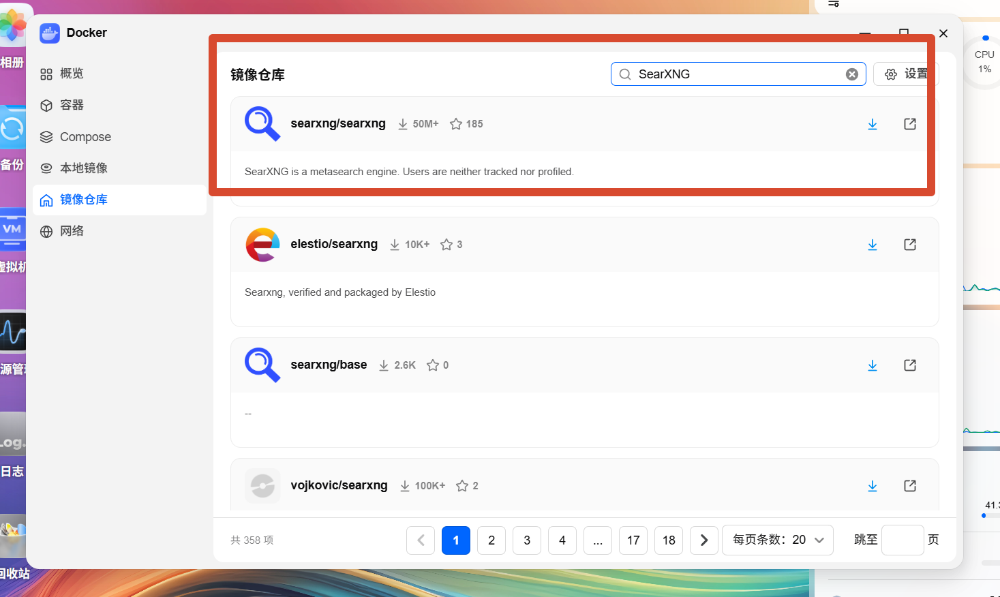
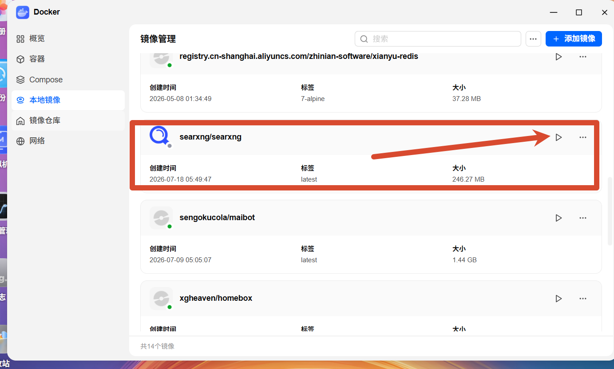
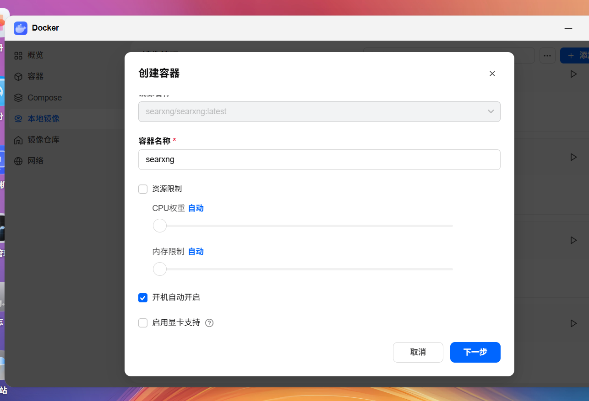
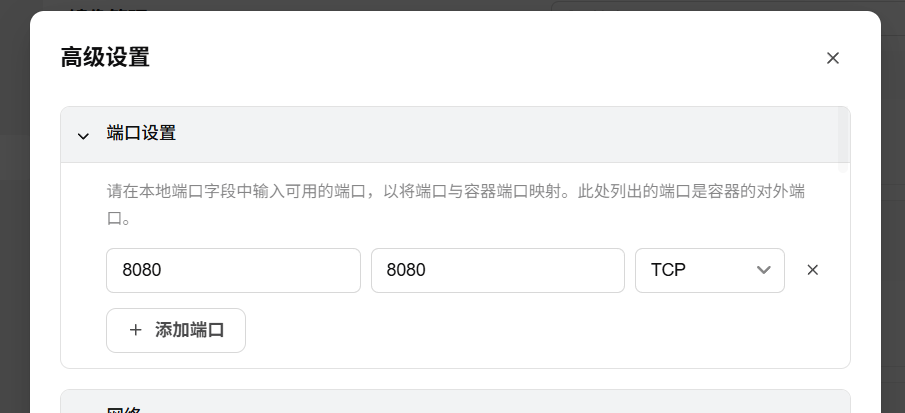
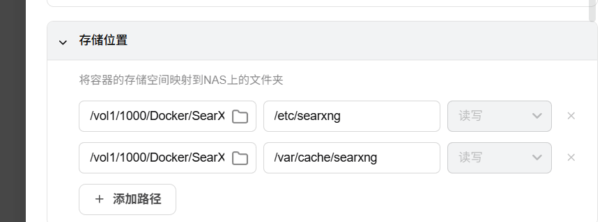

# 🐳 Docker 部署 SearXNG 完整教程

> **SearXNG** 是一款开源的元搜索引擎，聚合多个搜索引擎的结果，同时**不追踪用户、不建立用户画像**，是注重隐私的搜索利器。本文将手把手演示如何通过 Docker Desktop 在 NAS 上快速部署 SearXNG。

---

## 一、搜索并拉取 SearXNG 镜像

打开 Docker Desktop，进入左侧 **「镜像仓库」** 选项卡，在搜索框中输入 `SearXNG`：



在搜索结果中选择官方镜像 **`searxng/searxng`**（下载量 50M+，⭐ 185），点击右侧的下载按钮拉取镜像。

---

## 二、从本地镜像创建容器

镜像下载完成后，切换到左侧 **「本地镜像」** 选项卡，找到 `searxng/searxng` 镜像，点击右侧的 **▶ 运行** 按钮启动创建流程：



在弹出的 **「创建容器」** 对话框中，确认以下设置：

| 配置项 | 值 |
|--------|-----|
| 镜像名称 | `searxng/searxng:latest` |
| 容器名称 | `searxng`（可自定义） |
| 开机自动开启 | ✅ 勾选 |



> 💡 **提示**：「资源限制」可保持默认（CPU 权重和内存限制均为自动），除非你的 NAS 性能紧张需要手动限制。

配置完成后，点击 **「下一步」** 进入高级设置。

---

## 三、配置端口映射

在 **「高级设置 → 端口设置」** 中，添加端口映射规则，将容器的 `8080` 端口映射到宿主机的 `8080` 端口：

| 本地端口 | 容器端口 | 协议 |
|----------|----------|------|
| 8080 | 8080 | TCP |



> ⚠️ **注意**：如果 `8080` 端口已被其他服务占用，请将「本地端口」修改为其他可用端口（如 `8081`、`8888` 等），后续访问时使用对应端口即可。

---

## 四、配置存储路径映射

继续在同一页面的 **「存储位置」** 部分，添加以下两条路径映射规则，将容器内的配置和缓存目录持久化到 NAS 本地：

| NAS 宿主机路径 | 容器内路径 | 权限 |
|---------------|-----------|------|
| `/vol1/1000/Docker/SearXNG/config` | `/etc/searxng` | 读写 |
| `/vol1/1000/Docker/SearXNG/cache` | `/var/cache/searxng` | 读写 |



> 🔑 **关键提醒**：**务必映射 `/etc/searxng` 目录**——这一步非常重要，因为我们后续需要覆盖默认的配置文件来自定义 SearXNG 的行为。如果不映射此路径，配置文件将仅存在于容器内部，容器重建后会丢失。

---

## 五、启动容器

完成以上所有配置后，确认并启动容器。稍等片刻，容器即可正常运行。

当容器状态显示为 **🟢 运行中**，说明部署成功！此时可以通过 `http://<你的NAS-IP>:8080` 访问 SearXNG 搜索页面。

---

## 六、覆盖自定义配置文件

为了获得更好的搜索体验，需要将默认配置文件替换为优化后的版本。

### 6.1 下载优化配置

下载我提供的优化配置文件：

🔗 [settings.yml 下载链接](https://imgbed.9ll.uk/file/1784479323375_settings.yml)

### 6.2 替换配置文件

1. 进入你映射到 `/etc/searxng` 的 **NAS 宿主机目录**（例如 `/vol1/1000/Docker/SearXNG/config`）
2. 找到目录中的 `settings.yml` 文件
3. 用下载的文件**覆盖**原文件

### 6.3 重启容器

配置文件替换完成后，回到 Docker Desktop **重启 SearXNG 容器**，使新配置生效。

---

## 七、访问与使用

打开浏览器，访问：

```
http://<你的NAS-IP>:8080
```

你将看到 SearXNG 的搜索界面，可以直接开始使用了 🎉

---

## 📋 常见问题

### Q1：端口冲突怎么办？
修改本地端口映射即可，例如将本地端口改为 `8081`，然后通过 `http://<NAS-IP>:8081` 访问。

### Q2：容器启动后访问不了？
检查以下几点：
- 容器状态是否为「运行中」
- 端口映射是否正确
- NAS 防火墙是否放行了对应端口

### Q3：配置文件没有生效？
确认配置文件已正确覆盖到映射的宿主机路径，并且**重启了容器**。

---

<iframe src="https://gist.github.com/hy4962/97571177bd34268a194e982ca0e290b6.js"></iframe>
