# 网站每天多少人访问你知道吗？用 Vercel 零成本搭了一个 Umami 网站统计系统

搭了网站之后，我一直想看看每天到底有多少人来访问。

说实话，之前一直没搞统计，不是不想看数据，就是觉得 Google Analytics 太重了，配一堆东西看着就头大。后来我一想，有没有那种简单点的，能直接看到访客数、来源、热门页面就够了。

搜了一圈发现了 Umami，开源的网站统计工具，界面挺干净的。最关键的是——能直接部署到 Vercel 上，不用买服务器，零成本。

我一想，反正也不花钱，试试呗。

搭好之后用了几天，效果确实不错。先放几张图给你们看看：

这是 Umami 的概览页面，访客来自哪些国家一目了然，世界地图上直接能看到分布：

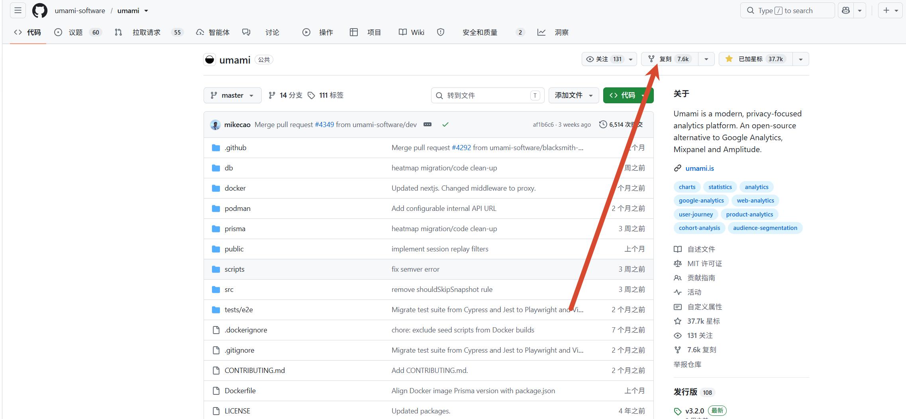

访客数、访问次数、浏览量、跳出率、平均访问时长，数据摆在那里：

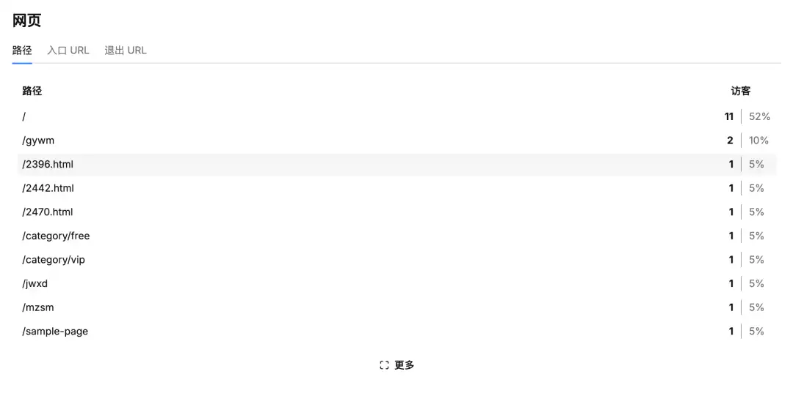

热门页面排行也很清楚，哪篇文章有人看、哪篇没人看，心里有数：

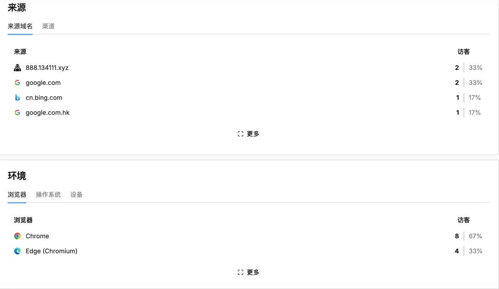

还有来源分析，从哪个搜索引擎来的、哪个域名引过来的，都有：

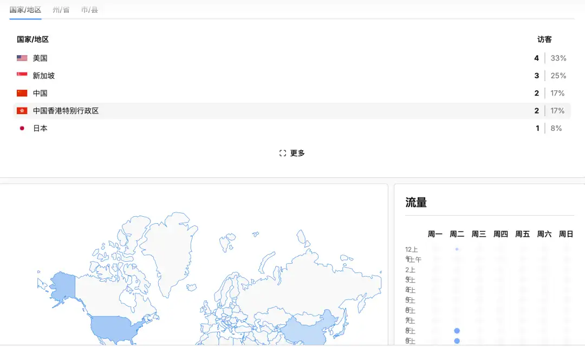

看到这些数据之后，我才真正知道自己网站的流量情况。以前全靠猜，现在数据就摆在后台里。

下面说说我是怎么搭的。

## 为什么选 Umami

其实一开始我不想用 Neon 的，因为它的免费计划远不如 TiDB。TiDB 的免费额度很大，听起来很诱人。

但问题是——TiDB 是 MySQL 的，Umami 用的是 PostgreSQL，不太兼容。整了半天还是放弃了，一直构建失败给我整红了。

后来我一想，算了，换个思路吧。Umami 官方说支持 Vercel 一键部署，Neon 提供免费的 PostgreSQL，那就试试 Neon。

事实证明这个选择是对的。部署过程比我想象的简单很多，而且 Neon 的免费套餐对个人站点来说完全够用——0.5 GB 存储、100 个项目上限，足够了。

## 部署过程

### 一、Fork 项目

打开 Umami 的 GitHub 项目，点右上角的"复刻"，把代码拷到自己账号下。

项目地址：`https://github.com/umami-software/umami`

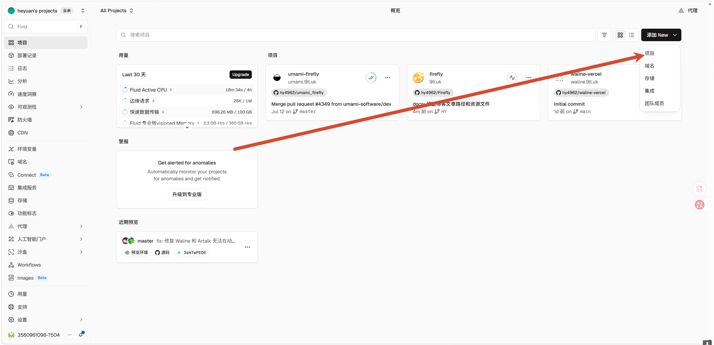

### 二、在 Vercel 导入项目

登录 Vercel 控制台，左侧菜单点"项目"，然后右上角点"添加 New"→"项目"。

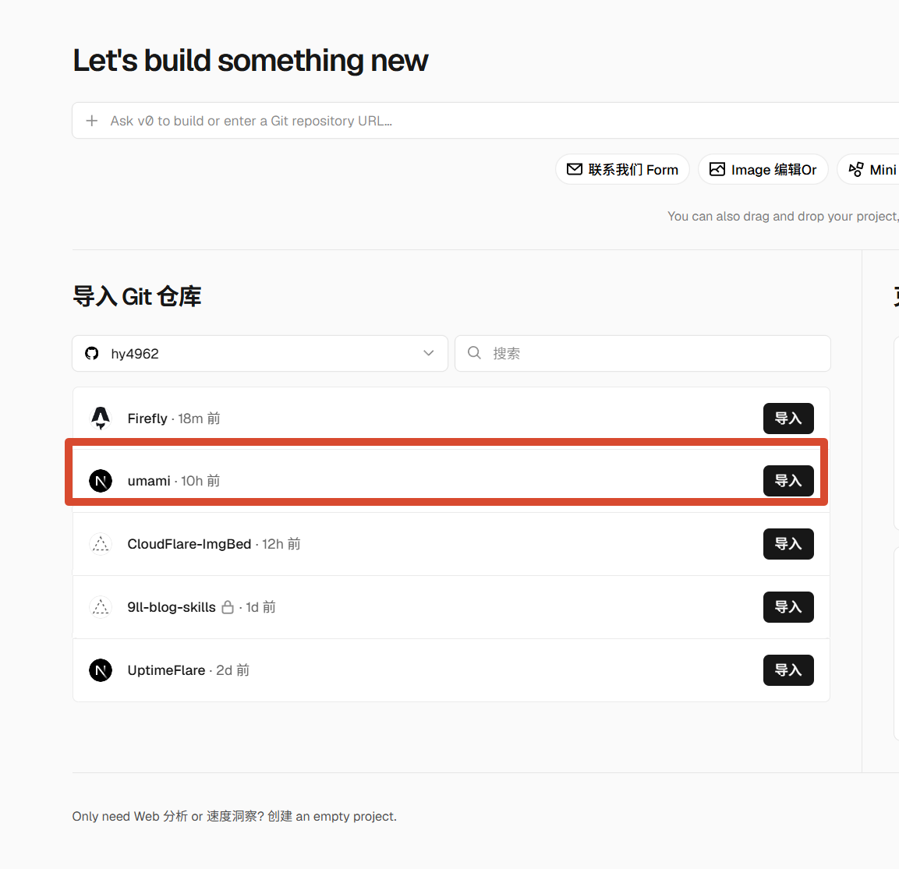

在"导入 Git 仓库"下面找到刚复刻的 umami 项目，点"导入"。

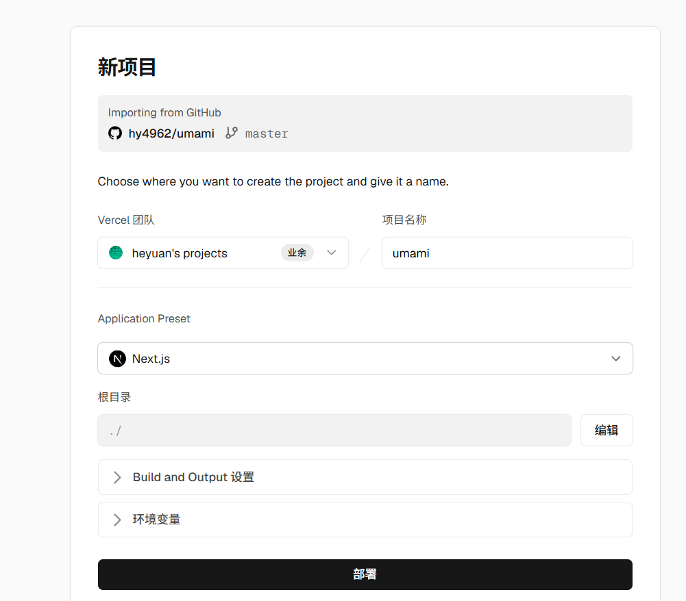

项目名称可以随便填，我直接用的 "umami"。其他保持默认就行，直接点"部署"。

这一步会部署失败，因为还没配数据库，不用管它。

### 三、创建 Neon 数据库

回到 Vercel 控制台，左侧菜单找到"存储"，点进去。然后点右上角的"创建 Database"。

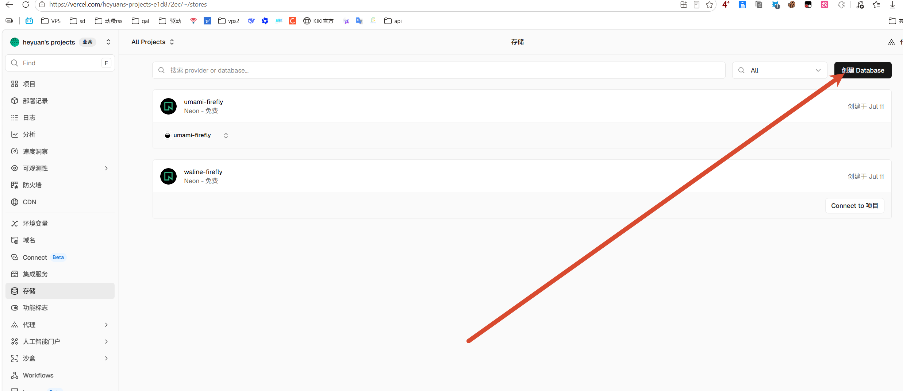

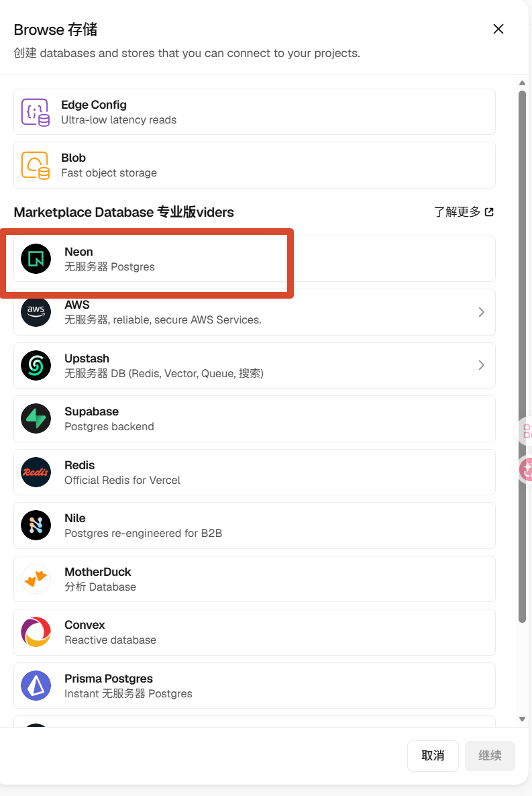

在弹出的窗口里选 Neon（无服务器 Postgres），然后点"继续"。

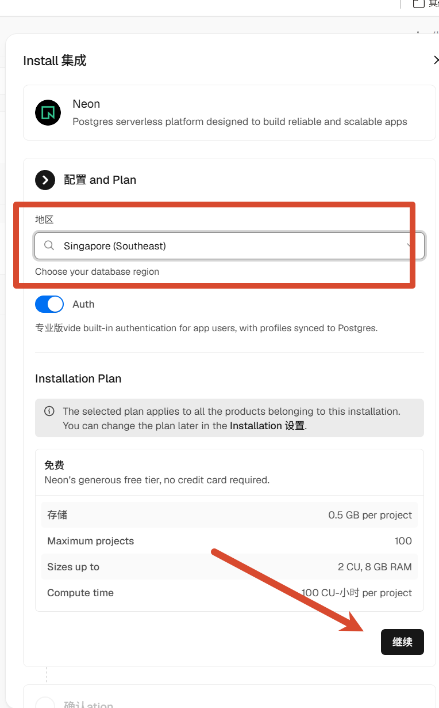

区域选近一点的，我选了 Singapore（Southeast）。其他保持默认，往下拉点"继续"。

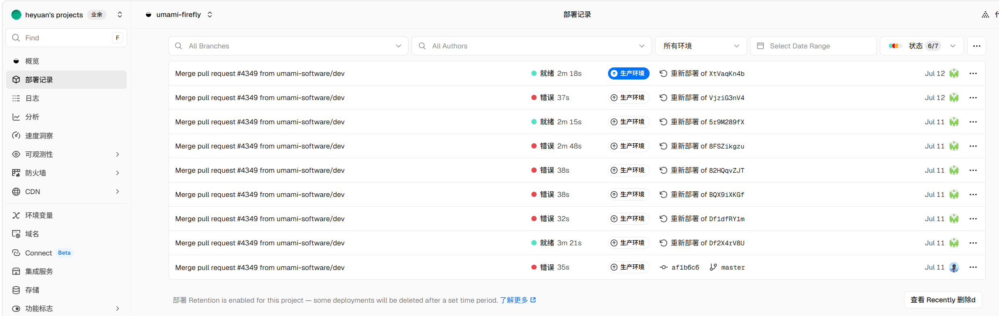

数据库名字可以随便填，确认一下信息没问题就点安装。

### 四、关联项目

数据库创建好之后，点"Connect to Project"，选择你刚才创建的 umami 项目，然后点"Connect Project"。

### 五、重新部署

回到 Vercel 的"部署记录"页面，找到刚才失败的那条记录，点右侧三个点，选"重新部署"。

等几分钟，看到绿色的"就绪"就说明部署成功了。

不过我折腾的过程中遇到了不少问题。你看这个部署记录，一堆红色的"错误"，给我整红了。反复试了好多次才成功，中间有几次差点放弃。

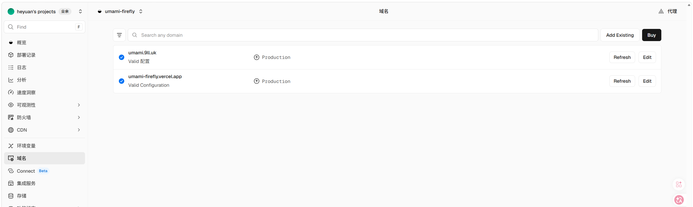

后来发现是数据库连接的问题，重新关联了一次项目之后就好了。如果你也遇到部署失败，先检查一下数据库有没有关联成功。

## 登录后台

部署成功后，打开你的 Umami 地址（Vercel 给的那个 .vercel.app 域名），就能看到登录页面。

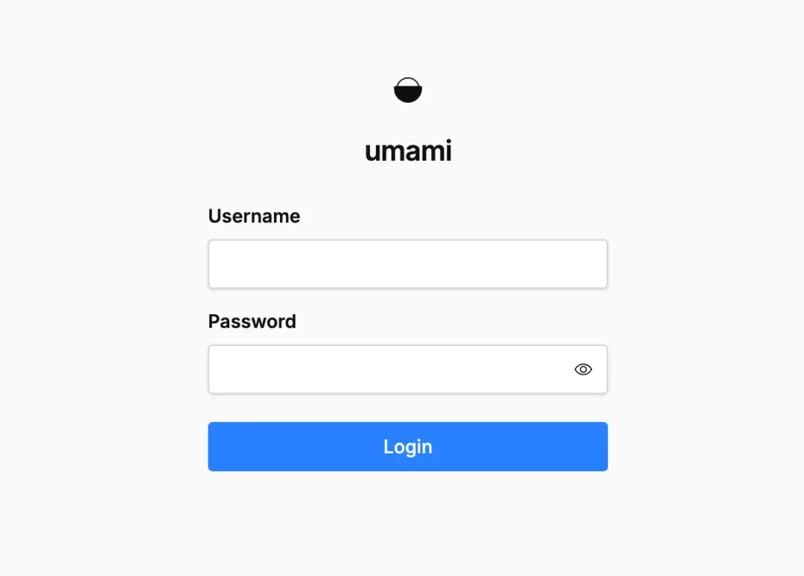

初始账号密码是：
- 用户名：`admin`
- 密码：`umami`

登录后记得改密码。

## 绑定自定义域名

如果你有自己的域名，可以在 Vercel 的"域名"页面绑定。我绑的是 `umami.9ll.uk`，配置好之后状态显示"Valid 配置"就行了。（上面那张部署记录截图底部也能看到域名配置的部分。）

绑完域名之后，你的 Umami 就可以通过自己的域名访问了，看起来也更专业一点。

## 最后

折腾这些东西最大的乐趣，其实不是最后那个结果，而是过程中折腾的那些体验。

这次搭 Umami 总体来说还行，虽然中间踩了不少坑——TiDB 不兼容、部署反复失败、数据库关联出问题——但折腾完之后用起来确实挺舒服的。数据一目了然，每天打开后台看看访客数、来源、热门页面，心里有数多了。

如果你也搭了网站但一直没关注数据，可以试试 Umami。零成本、部署简单、数据清晰，对个人站长来说够用了。

---

*写于 2026 年 7 月，折腾 Umami 网站统计的记录*
