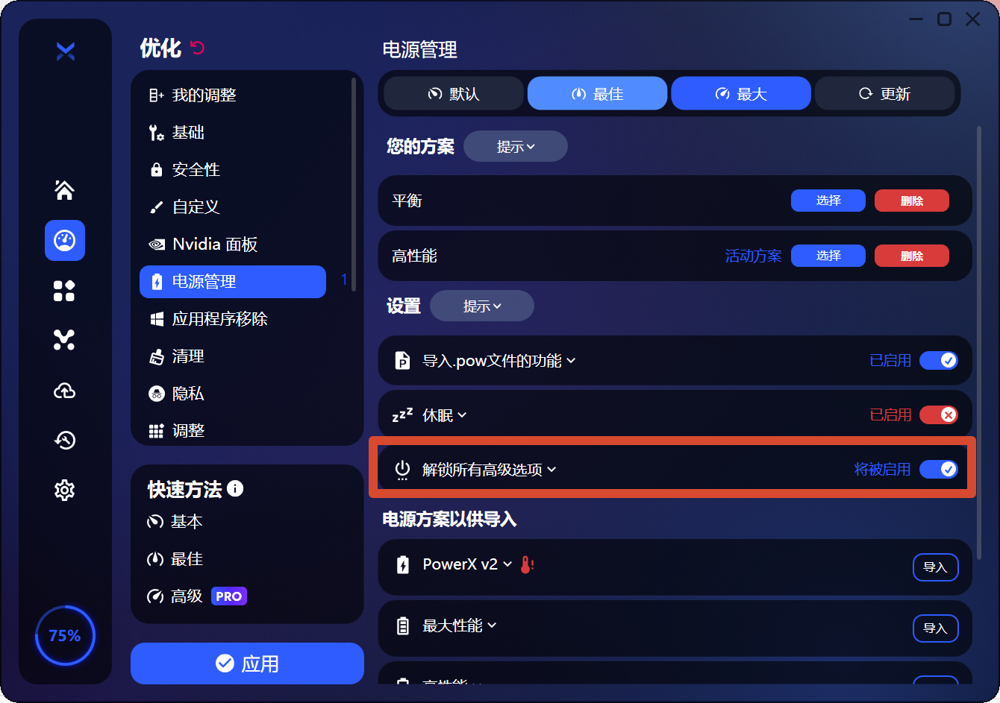
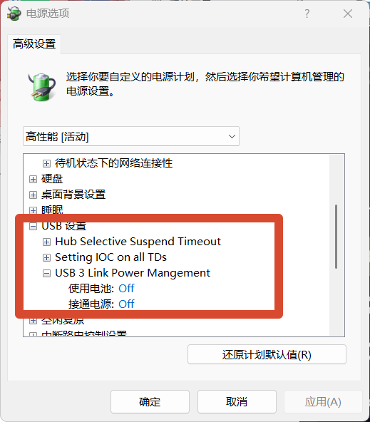
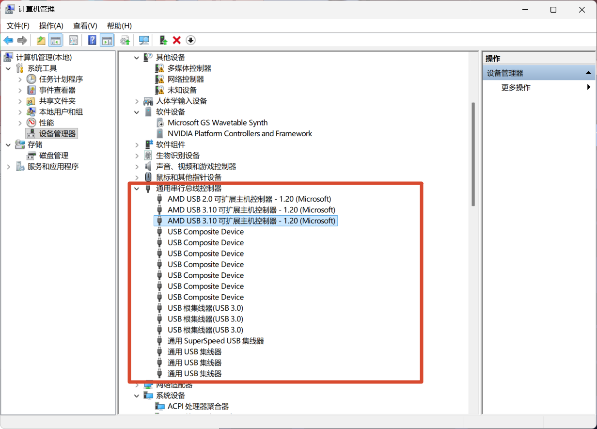
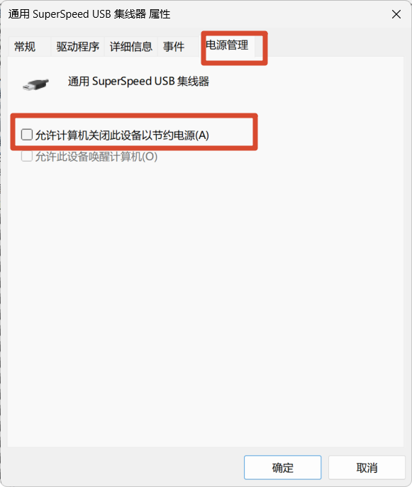

# 优化鼠标跟手性，顺便解决了完美死斗跳 ms 的问题

## 起因

最近在用的 ATKU2 老是感觉不跟手，延迟很高，开高 HZ 也没用。忍不住买了新鼠标还没到，想着趁这段时间控制变量，排查一下是不是电脑环境的问题。

无意中想起来 [BoosterX](https://boosterx.org/zh/)，就是 simple 同款的那个优化软件。其实我心里不太喜欢这类软件，感觉细节没那么可控，但为了统一环境还是试了一下。

## 发现电源计划的问题

用完 BoosterX 一键优化后，发现它自带了一个电源计划。试了一下，鼠标确实特别跟手了，但电脑帧数明显变低了。

于是我开始研究，发现是"完全体"电源计划的问题。

## 操作步骤

### 1. BoosterX 解锁高级选项

先在 BoosterX 里把电源管理的高级选项解锁：

### 2. 修改高性能电源计划的 USB 设置

找到高性能电源计划，把 USB 设置里的三项全部改成 Off：

> 我用的高性能是 Windows 自带的，执行 `powercfg -duplicatescheme e9a42b02-d5df-448d-aa00-03f14749eb61` 就行。因为 BoosterX 自带的电源计划帧数远不如我的。

### 3. 设备管理器关闭 USB 节电

进入设备管理器 → 通用串行总线控制器，把所有能关的"允许计算机关闭此设备以节约电源"都关掉：

### 4. （可选）关闭 CS 全屏优化

CS 记得关闭全屏优化。这个我没有认真测试，不敢保证一定要关，但关了没坏处。

## 全流程总结

其实操作很简单：

1. 打开 BoosterX，快速方法里选"最佳"，点应用
2. 按上面的步骤改电源计划和设备管理器

## 效果

真的非常见效。起码在我 9955HX + 5070Ti Laptop 装了 XOS11 25H2 的机器上，绝对不可能是什么心理作用，实在是太明显了。

另外这软件还顺带解决了一个问题——我只有完美死斗会跳 ms，突然一下 20ms 多卡手一下，但其他场景都没有，包括完美天梯实战也没有。一开始还以为是完美自己的问题，今天才发现不是。优化完也搞定了。
