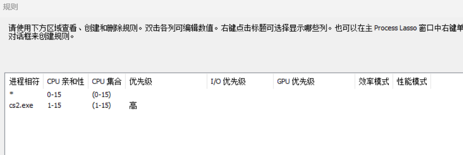
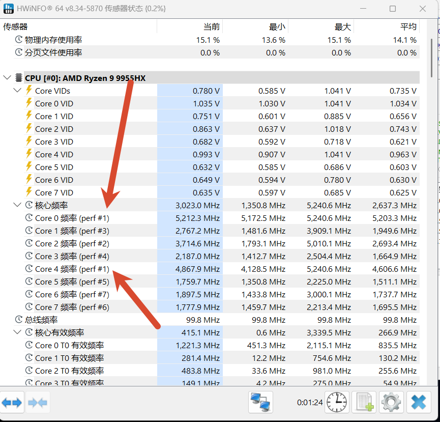
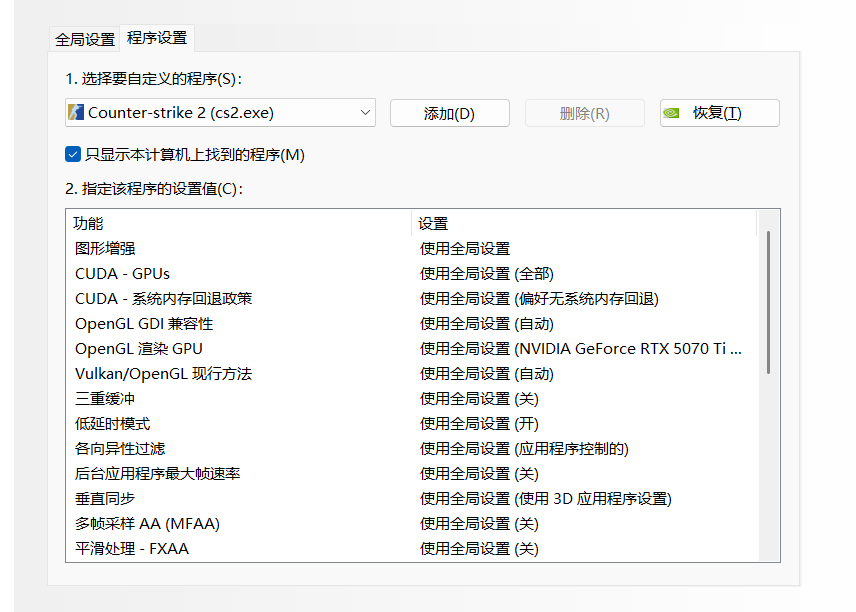
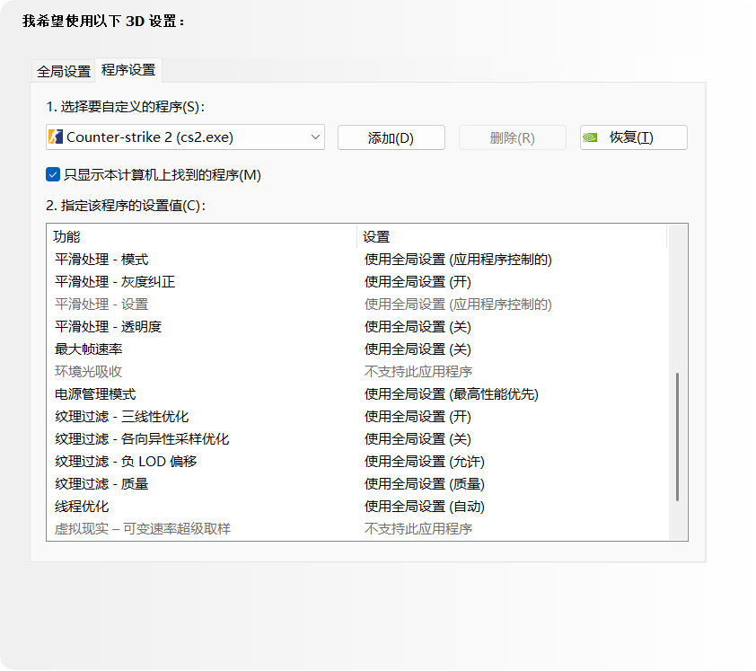
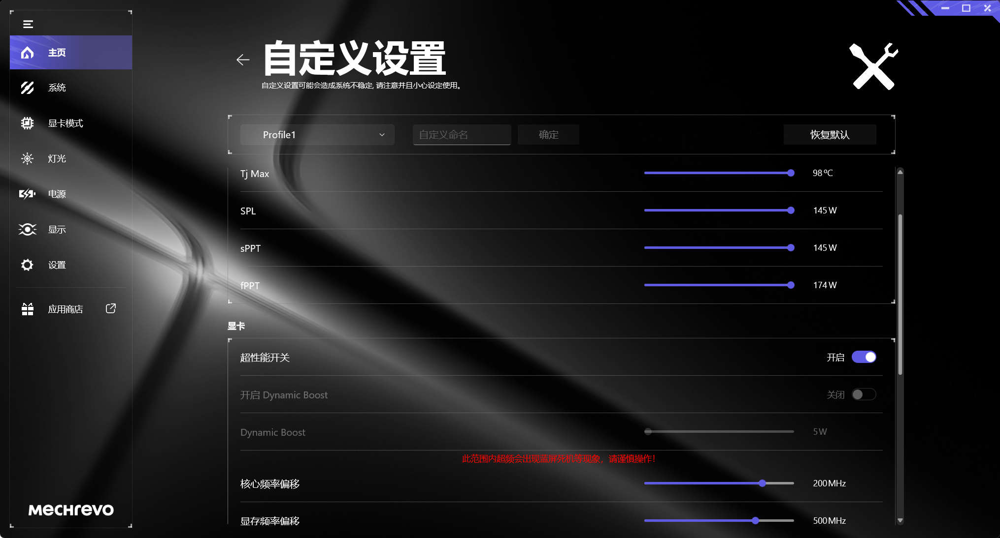

折腾了一套游戏性能优化方案，从系统设置到硬件超频都搞了一遍。以下是我目前在用的配置：

- CPU：9955HX
- GPU：5070Ti 12G Laptop
- 内存：16X2=32G( 镁光M8D1 )
- 系统：XOS11 25H2 V15


---

## 系统层面优化

### Process Lasso Pro 配置

规则添加游戏进程就完事了：禁用 CPU0 + 提升进程优先级。




#### 金银核与禁用 CPU0 的原理

`perf#1` 代表系统会优先将任务分配到该核心上。我的金银核是 Core 0 和 Core 4。

简单来说：如果你的金银核中有一个正好在 CPU0 上（比如我的情况），游戏禁用 CPU0 的收益最高。因为在鼠标、键盘高轮询率的情况下，系统会优先用金银核处理输入事件。禁用 CPU0 后，游戏反而会更流畅——因为输入处理不再抢占游戏核心的资源。



### 系统快速配置

使用 Booster 快速设置最佳配置，然后手动恢复 WiFi 和蓝牙为正常打开状态。

> 提示：这个系统需要在设备管理器里单独手动安装 WiFi 驱动。

---

## 鼠标延迟消除（共 5 项）

### 1. 关闭鼠标加速

**默认状态**：开启

**操作步骤**：`Win + R` → 输入 `main.cpl` → 确定 → 指针选项 → 取消勾选「提高指针精确度」→ 应用

**效果**：修复鼠标拖不动

### 2. 修改 Win32PrioritySeparation 为 42（十进制）

**默认值**：十进制 2

**操作步骤**：`Win + R` → 输入 `regedit` → 确定 → 找到路径：

```
HKEY_LOCAL_MACHINE\SYSTEM\ControlSet001\Control\PriorityControl
```
双击 `Win32PrioritySeparation`，修改为十进制 `42`（需重启生效）

**效果**：修复鼠标拖不动

### 3. 关闭 USB 选择性暂停

**默认状态**：已启用

**操作步骤**：`Win + R` → 输入 `powercfg.cpl` → 确定 → 更改计划设置 → 更改高级电源设置 → USB 设置 → USB 选择性暂停设置 → 改成「已禁用」

**效果**：修复鼠标拖不动

> 提示：如果没有 USB 设置选项
>
> 则访问注册表`HKEY_LOCAL_MACHINE\SYSTEM\CurrentControlSet\Control\Power\PowerSettings\54533251-82be-4824-96c1-47b60b740d00`
>
> 在右侧找到 `Attributes`，双击，将数值从 `1` 改为 `2`
>
> 或者请参考下图操作：


### 4. 关闭修复应用缩放（仅 Win10）

**默认状态**：开启

**操作步骤**：桌面右键 → 显示设置 → 高级缩放设置 → 修复应用缩放 → 关

**效果**：修复鼠标掉帧

> 此项仅限 Win10，Win11 不用理会。

### 5. 关闭「在打字时隐藏指针」

**默认状态**：开启

**操作步骤**：`Win + R` → 输入 `main.cpl` → 确定 → 指针选项 → 取消选中「在打字时隐藏指针」

**效果**：修复鼠标掉帧（需重启生效，虽然抽象但确实影响鼠标表现）

---

## GPU 设置及超频（NVIDIA）

安装厂商官方驱动包，但没安装核显、N 卡驱动和 AMD 安全启动。厂商控制台 CPU 全拉满，然后对 N 卡进行超频：




- **核心频率**：+200 MHz
- **显存频率**：+500 MHz




> N 卡驱动我自己用 596.36-notebook-win10-win11-64bit-international-dch-whql


## BIOS（CPU 和内存）
### CPU

- **UMAF 分核负压设置**：如下图所示,[Github:hy4962/UMAF_BETA.zip ](https://github.com/hy4962/Share/blob/main/Windows/ZIP/UMAF_BETA.zip)
- **关闭 VBS + 内存虚拟化**：使用[Github:hy4962/关闭DG和VBS自动包](https://github.com/hy4962/Share/blob/main/Windows/ZIP/关闭DG和VBS自动包.zip)执行重启后疯狂按F3开机即可
- **频率**： 4.8 G


> 尝试禁用CCD1的方案然后跑5.2 G和5.0G，但是温度反而100°C，93°C了，双CCD4.8G倒是最多85°C，都是用同一套负压。奇怪...

### 内存条

本人是**镁光 M8D1**，原生 5600c50，超到 6000c38。我的作业貌似非常保守，这个也是超别人的


# 省流版

总结一下核心配置：

- **CPU**：4.8G + 全核分核负压
- **GPU**：核心频率 +200Mhz，显存频率 +500Mhz
- **内存**：5600C50 → 6000C38
- **系统**：XOS11 25H2 + Booster 快速最佳设置 + 鼠标设置
- **电源**：高性能电源计划，取消 USB 节能
- **设备管理器**：取消所有 USB 设备"允许计算机关闭此设备以节约电源"
