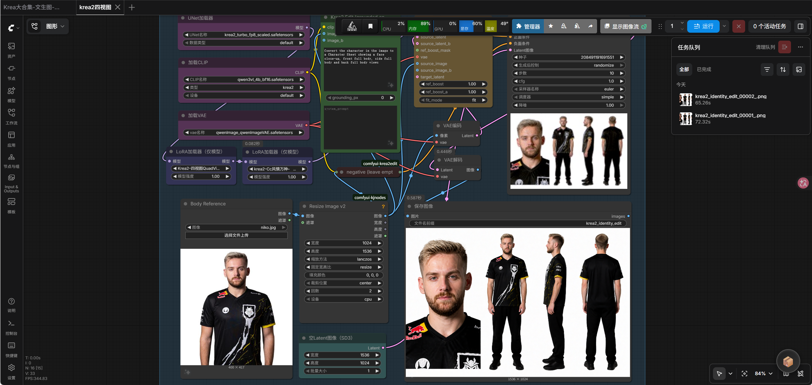

最近在用 Krea2 生成四视图，整理了一下必备模型和可选 LoRA，方便后续使用。

[Share/Comfyui/Workflow/Krea2四视图.json at main · hy4962/Share](https://github.com/hy4962/Share/blob/main/Comfyui/Workflow/Krea2四视图.json)

## 必备模型

以下三个模型是 Krea2 四视图生成的基础，缺一不可。

1. **Krea2 模型**：[krea2_turbo_fp8_scaled.safetensors](https://huggingface.co/Comfy-Org/Krea-2/blob/main/diffusion_models/krea2_turbo_fp8_scaled.safetensors) - 核心扩散模型
2. **文本编码器**：[qwen3vl_4b_bf16.safetensors](https://huggingface.co/Comfy-Org/Qwen3-VL/blob/main/text_encoders/qwen3vl_4b_bf16.safetensors) - Qwen3-VL 文本编码器
3. **VAE**：[qwenImage_qwenImageVAE.safetensors](https://huggingface.co/hy4962/Share/blob/main/Comfyui/vae/qwenImage_qwenImageVAE.safetensors) - QwenImage VAE

这三个模型都需要下载到 ComfyUI 的对应目录中。

## 可选 LoRA

可选的 LoRA 模型来自魔搭社区的作者 [yan303145427](https://www.modelscope.cn/profile/yan303145427)，他分享了多个 Krea2 风格的 LoRA。

我个人目前只用 [krea2-Cc风情万种-风格](https://www.modelscope.cn/models/yan303145427/krea2-Cc-FQWZ-ArtStyle/file/view/20260716204803/krea2-Cc风情万种-风格.safetensors?status=2) 这个 LoRA。这个作者的 krea2 lora 都很不错，可以根据自己的风格选择。

## 使用说明

下载好模型后，可以参考这个 [Bilibili 视频](https://www.bilibili.com/video/BV14Zu16YERZ/?share_source=copy_web&vd_source=ed7d1d02f65398903f7bdbaab5c74522) 配置工作流。视频里详细介绍了四视图生成的提示词技巧和加速流配置，这里就不重复了。

如果遇到问题，可以参考视频评论区或作者的其他分享。