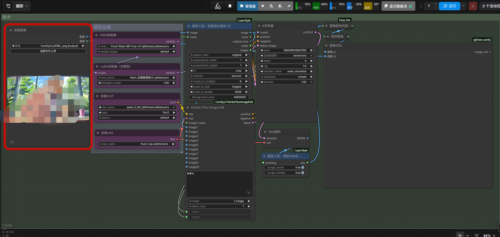
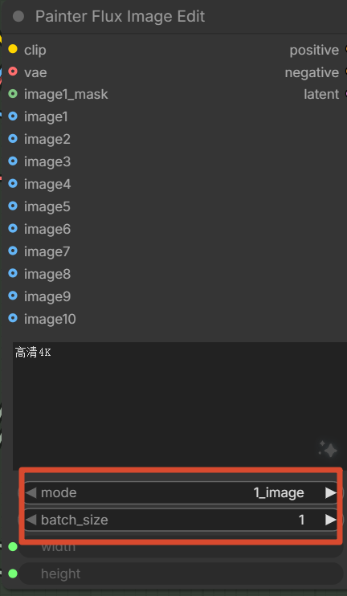

最近在用 ComfyUI 做图像放大，发现把放大功能从文生图工作流里抽出来单独用，确实方便很多。

之前文生图工作流里也带放大功能，但每次想单独放大一张图，还得加载整个文生图流程，加载模型多、显存占用大，而且参数混在一起不好调。干脆直接抽出来，做成一个独立的放大工作流。

[Share/Comfyui/Workflow/放大.json at main · hy4962/Share](https://github.com/hy4962/Share/blob/main/Comfyui/Workflow/放大.json)

## 为什么单独抽出来

主要原因就一个：**方便抽卡和管理**。

文生图工作流里，放大参数和生成参数混在一起，想调放大效果还得在一堆节点里找。单独抽出来之后，所有放大相关的配置一目了然，改参数也方便。

另外就是显存管理。文生图工作流加载的模型多，放大只是其中一个环节。单独做放大工作流，可以只加载需要的模型，显存占用小一些。

## 工作流结构

整个工作流结构很清晰：

主要分几个部分：

1. **模型加载区**：加载 UNET、CLIP、VAE 和 LoRA 模型
2. **图像输入**：加载要放大的原图
3. **图像预处理**：按比例缩放到目标尺寸
4. **采样器**：进行放大处理
5. **后处理**：色彩匹配和保存

## 模型配置

这个工作流需要几个特定的模型文件：

**主模型**：Flux2-Klein-9B-True-v2-fp8mixed.safetensors
- 这是 Klein 系列的主模型，专门针对图像放大优化

**LoRA 模型**：Klein_动漫高清放大.safetensors
- 这个 LoRA 是专门做动漫风格高清放大的，效果比通用放大好很多

**CLIP 模型**：qwen_3_8b_fp8mixed.safetensors
- 文本编码器，用 Qwen 3 8B 的 fp8 混合精度版本

**VAE 模型**：flux2-vae.safetensors
- Flux2 的 VAE，负责图像的编解码

模型下载地址都在 HuggingFace 上，直接搜文件名就能找到：

- 主模型：[Flux2-Klein-9B-True-v2-fp8mixed.safetensors](https://huggingface.co/buckets/hy4962/Flux2-Klein-9B-True-V2-bucket/tree/Flux2-Klein-9B-True-v2-fp8mixed.safetensors)
- LoRA模型：[Klein_动漫高清放大.safetensors](https://huggingface.co/buckets/hy4962/Klein_AnimeHDupscaling-bucket/tree/Klein_动漫高清放大.safetensors)
- CLIP模型：[qwen_3_8b_fp8mixed.safetensors](https://huggingface.co/buckets/hy4962/qwen_3_8b_fp8mixed-bucket/tree/qwen_3_8b_fp8mixed.safetensors)
- VAE模型：[flux2-vae.safetensors](https://huggingface.co/buckets/hy4962/flux2-dev-bucket/tree/split_files/vae/flux2-vae.safetensors)

## 关键节点设置

这个工作流里有个很重要的设置，必须注意：

在 PainterFluxImageEdit 节点里，有两个参数必须设置为特定值：

- **mode**：必须设置为 `1_image`
- **batch_size**：必须设置为 `1`

## 使用体验

单独用这个工作流放大图像，确实比在文生图工作流里方便很多：

1. **加载速度快**：只加载需要的模型，不用加载整个文生图流程
2. **参数清晰**：所有放大相关参数都在一起，改起来方便
3. **显存占用小**：模型少了，显存压力也小了

不过也有个问题：这个工作流是针对动漫风格优化的，放大真人图像效果可能不如专门的放大模型。

## 总结

把这个放大工作流从文生图里抽出来，是我用 ComfyUI 以来做过最正确的决定之一。管理方便、调参方便、显存占用也小。

如果你也在用 ComfyUI 做图像放大，建议也试试单独做一个放大工作流。特别是如果你经常需要放大动漫风格的图像，这个 Klein 系列的模型效果真的不错。
