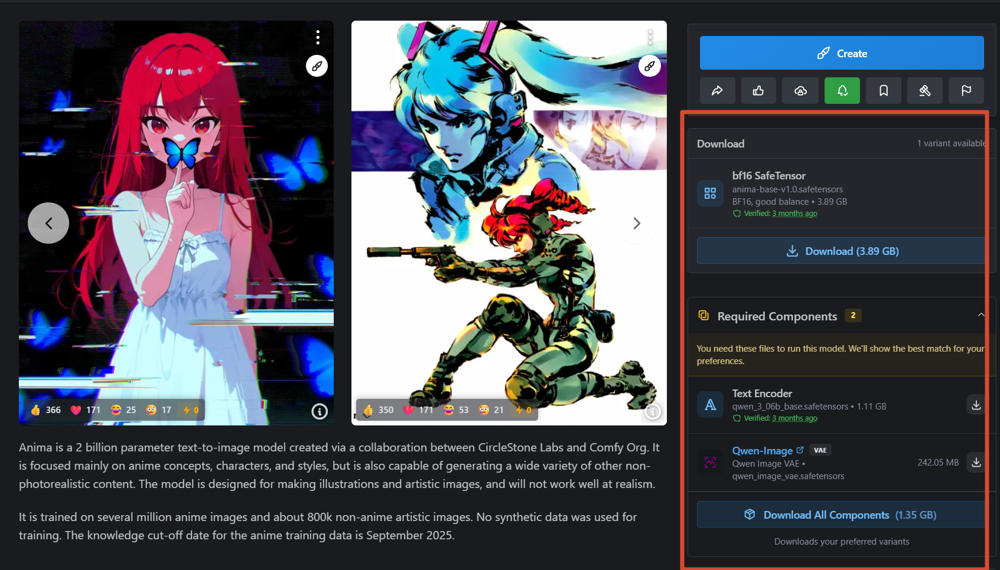
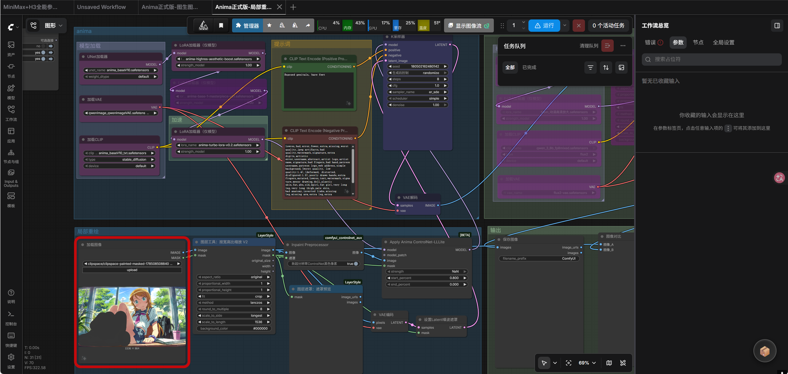
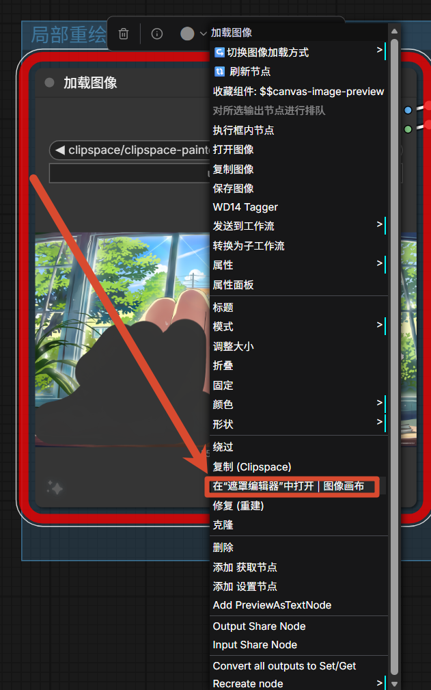
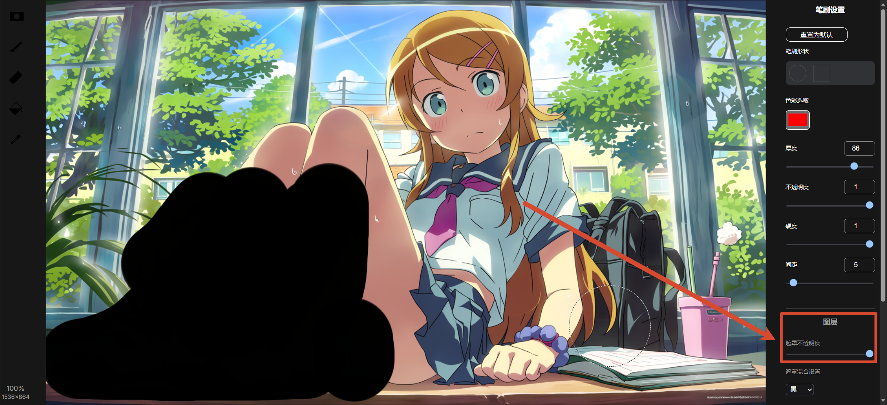

最近在折腾 ComfyUI 的局部重绘，找到了一个挺好用的工作流，分享一下。

## 工作流下载

[Share/Comfyui/Workflow/Anima正式版-局部重绘+高清放大.json at main · hy4962/Share](https://github.com/hy4962/Share/blob/main/Comfyui/Workflow/Anima正式版-局部重绘%2B高清放大.json)

## 模型准备

用的是 Anima 这个模型：[Anima - base-v1.0 | Anima Checkpoint | Civitai](https://civitai.red/models/2458426/anima?modelVersionId=2945208)

右边三个模型都要下载，别漏了。

## 工作流结构

整体预览：

## 使用方法

导入图片后，打开遮罩：

把不透明拉满，需要改哪里就涂黑哪里：

## 使用体验

这个工作流我主要用来做局部修复，**换装效果非常好**。比如想给图里的人换件衣服，圈出衣服区域涂黑，生成出来很自然，和原图融合得很好。

手指、脚趾这些细节修起来也很方便，圈个遮罩就能搞定。Anima 模型本身就不容易出这些部位的错误，但万一有问题，用这个工作流修复也很顺手。

使用上也没什么坑，主要就是注意把模型放对位置就行了。

## 总结

ComfyUI 局部重绘工作流，用 Anima 模型，人像修复效果很好，推荐试试。
