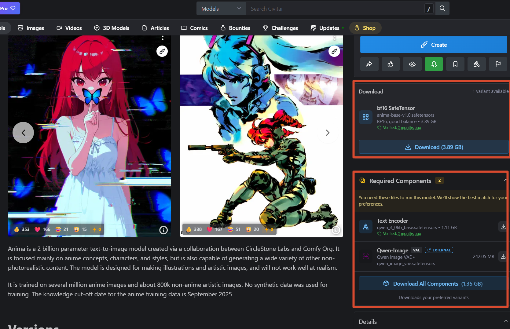
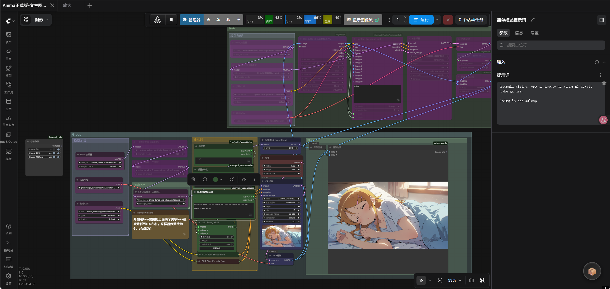

前阵子在 B 站刷到了 [每日提钢小助手5号](https://space.bilibili.com/3690999272442168) 分享的 Anima 工作流，折腾了一下，感觉挺好用的，就想着整理出来分享一下。

这篇只包含文生图的部分。放大我单独抽出来做了另一套工作流，不喜欢混在一起，下次再发。

---

## 工作流文件

工作流放在 GitHub 上：

[Anima 正式版-文生图工作流](https://github.com/hy4962/Share/blob/main/Comfyui/Workflow/Anima正式版-文生图工作流%20(1).json)

下载下来直接拖进 ComfyUI 就能用。

---

## 必备模型

这是重点。要跑起来需要下载三个文件，缺一不可。

[Anima - base-v1.0 | Civitai](https://civitai.red/models/2458426/anima?modelVersionId=2945208)

页面里有三个文件，**三个都要下**，放的位置不一样：

- 第一个主模型 → `ComfyUI\diffusion_models` 或 `ComfyUI\Unet`
- 第二个 text 模型 → `ComfyUI\text_encoders` 或 `ComfyUI\clip`
- 第三个 VAE → `ComfyUI\vae`

---

## 可选：官方加速 Lora

这个我挺推荐的。官方出的 turbo lora，能把步数压到 6～8 步快速出图，质量损失极低。

[Anima - turbo-v1.0 | Civitai](https://civitai.red/models/2458426/anima?modelVersionId=3108589)

用法上有点区别：

- **不用 turbo lora**：采样器步数设 30，CFG 5～8
- **用 turbo lora**：步数改成 8，CFG 改成 1

速度差挺多的，日常出图我基本就用 turbo 了。

---

## 提示词怎么写

负面提示词基本不用动，直接写正面提示词就行。

如果要生成特定动漫角色，可以去这个网站查触发词：

[ANIMADEX — Anime character & artist catalogue for ANIMA](https://animadex.net/)

里面有角色和画师的触发词，找到对应的复制进提示词就行。

---

折腾完感觉这套工作流比我之前用的顺多了，尤其是 turbo lora 那块，8 步出图速度很快，质量我觉得够用。放大的部分下次单独发。
