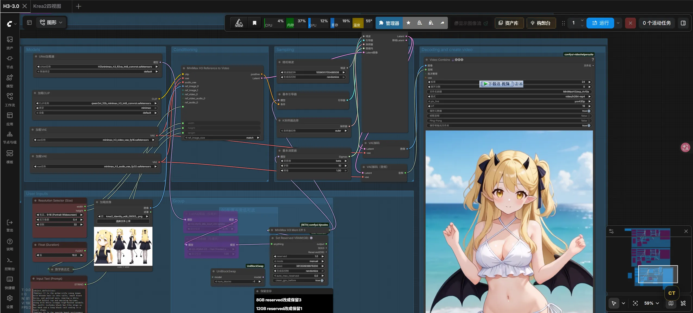
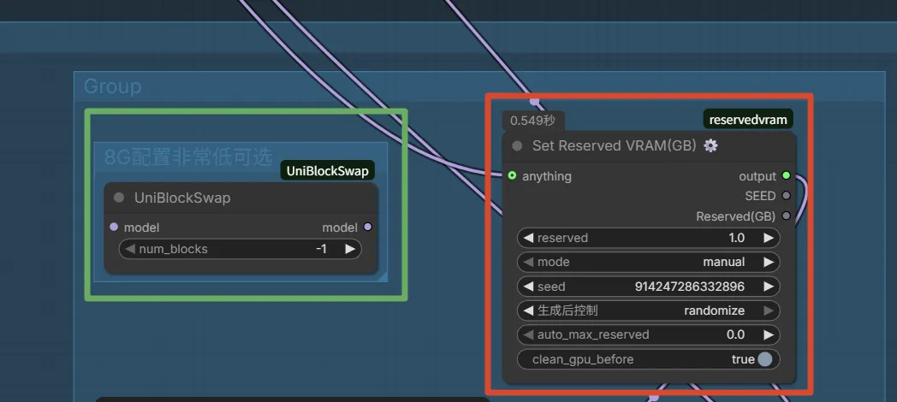
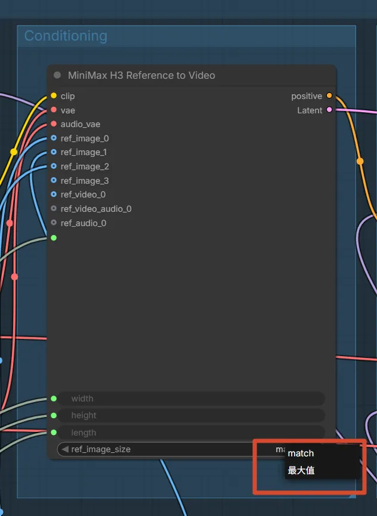
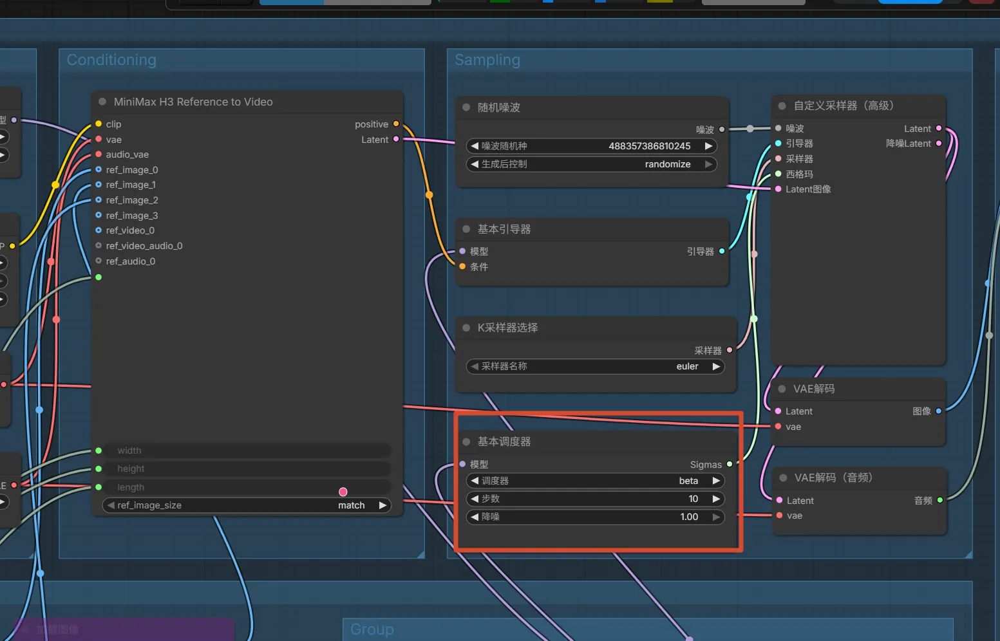
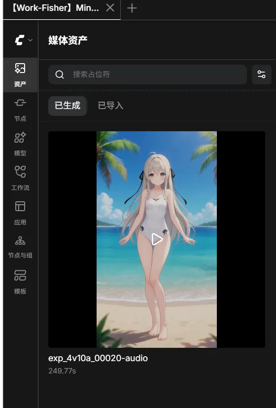
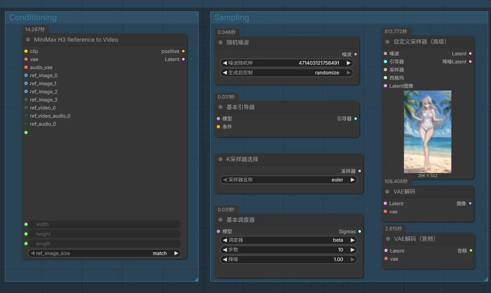

---
title: "MiniMax H3 工作流分享：不用4步LoRA，速度还快5倍"
published: 2026-08-11
description: "分享一个 MiniMax H3 的 ComfyUI 工作流，不用官方4步LoRA，生成速度和质量反而更好"
image: ./images/cover.webp
tags: [MiniMax, ComfyUI, AI视频, 工作流, 视频生成]
category: AI
draft: false
---

## 写在前面

MiniMax H3 官方说 3060 能跑，但实际上很多人跑起来还是很吃力。我折腾了好几天，找到了一个工作流，不仅能跑，而且直接提速 500%。

更离谱的是，这个工作流甚至没用官方 4 步 LoRA，但生成速度和质量都比用了 LoRA 的更优秀。

下面把模型下载、插件、配置、实测数据都整理一遍。

[Share/Comfyui/Workflow/H3-3.0.json at main · hy4962/Share](https://github.com/hy4962/Share/blob/main/Comfyui/Workflow/H3-3.0.json)

## 模型下载

| 来源 | 地址 |
|---|---|
| HuggingFace | [Comfy-Org/MiniMax-H3](https://huggingface.co/Comfy-Org/MiniMax-H3/tree/main) |
| 国内源 | [ModelScope](https://www.modelscope.cn/models/Comfy-Org/MiniMax-H3/files) |

## 我的硬件配置

- GPU：RTX 5070 Ti Laptop（12G 显存）
- 内存：32G
- 虚拟内存：32G-64G

## 能跑的模型搭配

下面这套组合实测可以正常运行：

| 文件类型 | 文件名 |
|---|---|
| diffusion_models | [minimax_h3_fl2va_int8_convrot.safetensors](https://huggingface.co/Comfy-Org/MiniMax-H3/blob/main/diffusion_models/minimax_h3_fl2va_int8_convrot.safetensors) |
| text_encoders | [qwen3vl_32b_minimax_h3_int8_convrot.safetensors](https://huggingface.co/Comfy-Org/MiniMax-H3/blob/main/text_encoders/qwen3vl_32b_minimax_h3_int8_convrot.safetensors) |
| vae | [MiniMax-H3 VAE](https://huggingface.co/Comfy-Org/MiniMax-H3/tree/main/vae) |

## 可能需要的插件

- [comfyUI-llama-TE](https://github.com/tl2012tl/comfyUI-llama-TE)：qwen3/qwen3.5/qwen3.7/gemma4 图片反推、提示词扩写高速版
- [TE_MAN](https://github.com/tl2012tl/TE_MAN)：首个为 ComfyUI 打造的漫剧/增强生图/生视频插件

> [!NOTE] 补充插件
> 有些插件在 ComfyUI Manager 里可能搜不到，可以直接从 GitHub 安装：
> - [Goohaitools](https://github.com/goohai/Goohaitools-comfyui)：50 多个实用工具，包括批量加载文件夹图片、自动保存指定 DPI、遮罩分析、人脸矫正等
> - [H3-Motion-Context](https://github.com/NikoDemon80/ComfyUI-H3-Motion-Context)：MiniMax H3 的 clip chaining，运动和音频能真正跨片段衔接

## 提示词生成

工作流里自带了提示词模板，用法很简单：

1. 把模板复制给 AI
2. 把你的想法尽可能详细地描述一下
3. AI 就能生成标准格式的提示词
4. 直接用于生成即可

> [!WARNING] 关于提示词模型
> 强烈建议本地部署 Qwen 3.5 无审查版本来生成提示词。哪怕是 Grok，也容易遭到拒绝回答。

## 细节设置

### 8G 显存用户

如果你是 8G 显存，把红色的节点换成绿色的即可。

### 一致性模式选择

使用 Max 模式可以保持非常优秀的人物一致性，但速度会慢一倍。一般 Match 模式也够用了。

### 采样步数

由于没有使用 4 步 LoRA，所以步数可以自己设置。默认 10 步，速度很快，质量也不错。追求更高质量可以设成 15 步，这个工作流很快，多几步没什么影响。

## 实测数据

跑了好几天，生成了三四十个 10 秒视频，以下是两个典型场景的耗时：

### 场景一：0.4 像素，8 秒视频

总时长 249 秒，直出 0.4 像素 8 秒视频。

### 场景二：0.9 像素，10 秒视频

也可以直出 0.9 像素 10 秒视频，总时长约 1000 秒。

## 踩坑记录

### 衣服或场景对不上文字描述

有时候衣服或者部分场景对不上文字描述，这是因为在 Full-Reference Mode（全参考模式）下，AI 的优先级逻辑是：

1. **最高优先级**：`<Picture N>`（参考图）中的视觉特征
2. **次级优先级**：`<Subject N>` 定义的文字描述
3. **最低优先级**：`detailed_description` 中的动态场景描写

不过实测更强烈的文字描述可以跨越优先级，所以描述写详细一点是有用的。

### 提示词 Skill 推荐

目前只推荐官方原版的提示词 Skill。试了很多其他 UP 主的，发现效果都不如官方 Skill。有些 UP 的提示词适用范围太小，有些太短，不太通用。

[MiniMax-H3/skills at main · MiniMax-AI/MiniMax-H3](https://github.com/MiniMax-AI/MiniMax-H3/tree/main/skills)

## 写在最后

这个工作流的核心优势就是：不用官方 4 步 LoRA，速度反而更快，质量也不错。对于显存有限的用户来说，是个比较好的选择。

如果有什么问题或者更好的配置方案，欢迎交流。
