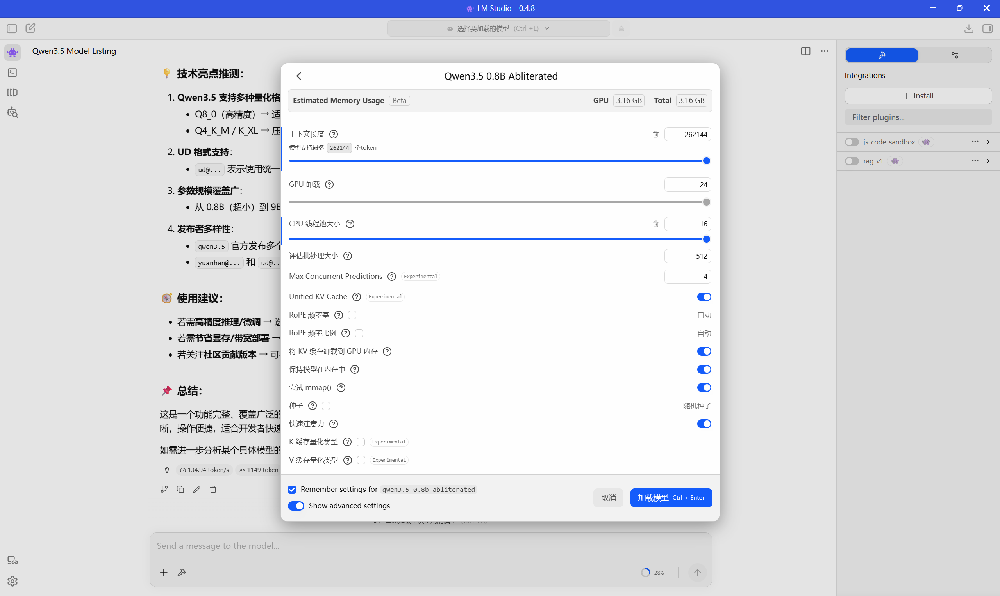

为什么要折腾本地大模型？原因其实就几个字：**隐私、免费、离线能用**。

把数据发给第三方 API，总归要担心泄露。本地跑的话，所有对话都留在你自己的硬盘上，谁也看不到。而且不花钱——没有 API 调用费，没有 token 计价，想怎么问就怎么问。断网也能用，出差坐高铁的时候特别香。

Qwen3.5 是通义千问团队出的开源模型，从 0.6B 到 72B 一堆尺寸可选。小的跑在集显笔记本上，大的需要专业显卡。这篇主要讲怎么在自己电脑上把 Qwen3.5 跑起来，从下载工具、选模型、到调设置，每一步都写明白。

---

## 一、你的电脑带得动吗？先看看硬件

跑本地模型最吃两样东西：**显存（VRAM）和内存（RAM）**。

模型能塞进显存就全塞进去，速度最快。塞不完的会溢出到内存，速度砍一大截但还能跑。内存也不够？那直接卡死或者根本加载不了。

给你一个大概的参考：

| 显存大小 | 能跑的模型 | 能跑的量化精度 | 体验 |
|---|---|---|---|
| 6GB（比如 GTX 1660、RTX 3060 6G） | Qwen3.5-4B | Q4_K_M 或更低 | 能用，回复速度还行，复杂推理差点意思 |
| 8GB（RTX 3060 8G、RTX 4060） | Qwen3.5-4B 全精度 或 8B 量化版 | 4B 跑 Q8，8B 跑 Q4 | 4B 很流畅，8B 也跑得动 |
| 12GB（RTX 3060 12G、RTX 4070） | Qwen3.5-8B 甚至 14B 的量化版 | 8B 跑 Q8，14B 跑 Q4 | 甜点配置，8B 毫无压力 |
| 16GB+（RTX 4080、4090、A4000） | Qwen3.5-14B 或更大 | 高精度随便选 | 爽就完事了 |
| 24GB（RTX 4090、A5000） | Qwen3.5-30B 量化版 | Q4 到 Q8 | 大模型也能本地跑 |

**没有独显怎么办？** 也能跑。纯 CPU 推理会慢很多，但 Qwen3.5-4B 用 Q4 量化在 16GB 内存的笔记本上是可以动的。就是等回复的时候得有点耐心，一秒蹦两三个字的节奏。

**内存方面**，建议至少 16GB。模型文件本身就要占内存，加上推理时的临时开销，8GB 基本没戏。

---

## 二、下载 LM Studio

LM Studio 是一个本地大模型的图形化运行工具，支持 Windows、Mac、Linux。不用折腾命令行，不用配 Python 环境，下载就能用。对新手来说是最省心的选择。

到官网 [lm-studio.me](https://www.lm-studio.me/) 下载对应系统的安装包，装好就行。

装完第一次打开，界面是英文的，不过用起来很简单。后面的操作基本就是一个流程：**下载模型 → 加载模型 → 开聊**。

---

## 三、下载模型

### 去哪下？

两个地方：

- [魔搭社区](https://www.modelscope.cn/)（国内直连，速度快）
- [Hugging Face](https://huggingface.co/)（要魔法，但模型最全）

两个站的模型是一样的，哪个方便用哪个。

### 选什么格式？

LM Studio 只认 **GGUF** 格式的模型。去下载站搜 Qwen3.5 的时候，认准文件名里带 `.gguf` 后缀的。

推荐看看 [Unsloth AI](https://www.modelscope.cn/organization/unsloth) 团队发的版本。他们搞了一种叫 **UD（Unsloth Dynamic）** 的高级量化，比普通量化聪明——不是所有层都压成同一个精度，而是关键层保留高精度，不那么重要的层压狠一点。同样的文件大小，UD 版本比普通版本聪明一丢丢。

### 量化精度怎么选？

这是新手最迷糊的地方。简单说：**精度越高越聪明，但文件越大、越吃显存。精度越低越省资源，但模型会变"笨"。**

常见的量化格式从高到低排：

| 量化格式 | 位数 | 大概多大（4B 模型） | 质量 | 适合谁 |
|---|---|---|---|---|
| FP16 | 16-bit | ~8GB | 原版质量 | 显存充足的土豪 |
| Q8_0 | 8-bit | ~4.5GB | 接近原版 | 日常用已经很好了 |
| Q6_K | 6-bit | ~3.5GB | 略有下降 | 显存紧一点的折中方案 |
| Q4_K_M | 4-bit（中档） | ~2.8GB | 能用 | 显存紧张的首选 |
| Q4_K_S | 4-bit（低档） | ~2.5GB | 勉强能用 | 实在没显存才考虑 |
| Q3 以下 | 3-bit | 更小 | 明显变傻 | 别折腾了 |

**我个人的建议**：日常使用选 **Q4_K_M**，性价比最高。显存富裕的话上 Q8。低于 Q4 就别折腾了，模型明显变傻，回答质量下降得厉害。

### Unsloth 的 UD 版本和普通版有什么区别？

用表格说清楚：

| 特性 | Qwen3.5-4B-Q8_0.gguf | Qwen3.5-4B-UD-Q8_K_XL.gguf |
|---|---|---|
| 量化类型 | 标准量化 | 高级混合量化（UD + K-quants） |
| 精度策略 | 所有权重统一压成 8-bit | 关键层高精度（16-bit），普通层 8-bit |
| 文件后缀含义 | Q8_0：传统 8-bit 量化 | UD：Unsloth Dynamic 动态混合精度；XL：Extra Large 高精度；K：K-quant 分组量化策略 |
| 推理速度 | 较快（计算逻辑统一，硬件友好） | 稍慢（高精度层计算量大一点） |
| 智能程度 | 高（接近原版 FP16） | 极高（理论上比 Q8_0 更接近原版） |
| 适用场景 | 日常对话、代码编写、追求速度 | 复杂推理、高精度任务、不差那点显存 |

简单说，UD 版本就是"花了更多的显存换更高的智能"。如果你显存够用，优先选 UD 版。

### 视觉模型的 mmproj 文件

Qwen3.5 有些版本支持看图（视觉能力）。但光下模型文件还不够，**还得下一个叫 mmproj 的文件**，和模型放在同一个文件夹里才行。

mmproj 也有精度区分，推荐下 **F32** 的。F16 和 F32 的视觉效果差距肉眼可见，F32 识别准确率明显高一些。

---

## 四、在 LM Studio 里配置模型路径

打开 LM Studio，第一件事是告诉它你把模型存在哪了。

点左边栏的文件夹图标（或者 Settings 里的 Models Directory），改成你存放 gguf 文件的路径。比如：

`D:\AI\models\qwen3.5\Qwen3.5-9B-UD-Q4_K_XL`

有个坑要注意：**LM Studio 读取模型的时候，路径得有两级以上的文件夹嵌套**。你直接把 gguf 文件丢在 `D:\AI\models\` 根目录下，它可能识别不到。建个子文件夹把模型放进去就好了。

配好路径后，左边栏应该能看到你的模型列出来了。

---

## 五、加载模型和 GPU 设置

找到模型后，点右边的加载按钮。加载之前可以调参数，最重要的一项是 **GPU Offload（GPU 卸载）**。

### GPU Offload 是什么？

大模型的运行靠"层"（layers）。GPU Offload 就是控制**有多少层跑在显卡上，多少层跑在 CPU 和内存上**。

- 全部卸载到 GPU = 全层跑显卡，速度最快，但得有足够显存
- 卸载一部分 = 显存装不下的层退回 CPU，速度变慢但能跑
- 不卸载 = 纯 CPU 推理，最慢

### 设多少合适？

**原则：显存能装下多少层，就卸载多少层。** 不确定的话，先把 GPU Offload 拉满，如果加载时报错或者显存爆了，再往回调。

LM Studio 界面右上角会显示预计占用多少显存/内存，看着那个数字来调就行。目标是**模型全部装进显存**，如果装不下，就尽量多塞几层到 GPU。

举几个例子帮你理解：

| 你的情况 | GPU Offload 建议 | 说明 |
|---|---|---|
| 12GB 显存跑 4B Q8（需要约 5GB） | 全部拉满 | 绰绰有余，全塞 GPU |
| 8GB 显存跑 8B Q4（需要约 5.5GB） | 全部或接近全部 | 能塞下，注意别开太多后台程序 |
| 6GB 显存跑 4B Q8（需要约 5GB） | 大部分卸载到 GPU | 留一点空间给系统，卸载个 25-28 层左右 |
| 纯集显 / 无独显 | 0 或 1 | 只能走 CPU 推理，慢但能用 |

加载成功后，就可以在聊天界面直接跟模型对话了。

---

## 六、推荐的模型尺寸

Qwen3.5 有很多尺寸：0.6B、1.7B、4B、8B、14B、30B、72B。不是越大越好，适合你硬件的才是最好的。

### 怎么选？

- **6GB 以下显存**：老实选 4B。别贪心上 8B，跑不动硬跑体验极差。
- **8-12GB 显存**：4B 全精度或者 8B 量化版，看你对质量的要求。
- **12-16GB 显存**：8B 全精度首选，14B 量化版也行。
- **24GB 以上**：14B 全精度甚至 30B 量化版都可以试。
- **笔记本没独显**：4B Q4 量化，纯 CPU 慢慢跑。

说实话，4B 模型日常聊天、写代码辅助已经够用了。没必要一味追求大模型——跑不动的大模型还不如跑得飞快的小模型好用。

---

## 七、加载之后先试试

模型加载成功后，别急着干正事。先丢几个问题试试水：

1. **闲聊试试**：随便问个问题，看看回复速度能不能接受，输出是否正常。
2. **中文能力**：让模型用中文写一段东西，看看中文输出质量。
3. **代码能力**：让它写个简单的函数，看看逻辑对不对。
4. **推理能力**：给个需要多步推理的问题，比如"一个房间里有3个杀手，你杀了一个，还剩几个？"。

如果回复速度慢到一秒蹦一两个字，那说明你的显存没装下模型，大量计算跑在 CPU 上了。回去调 GPU Offload，或者换个更小的量化版本。

如果回复乱码或者答非所问，大概率是模型文件损坏了，重新下载试试。

---

## 八、常见问题

**Q：加载模型的时候报错，提示内存不够？**
要么你的模型太大了，换个小点的量化版本。要么你电脑后台开着太多东西，关掉一些再试。

**Q：模型回复特别慢，一秒才蹦几个字？**
检查 GPU Offload 是不是没设对，模型大概率跑在 CPU 上了。把更多层卸载到 GPU。

**Q：模型下载下来了但 LM Studio 里看不到？**
检查路径对不对，确保有两级以上的文件夹嵌套。gguf 文件名别乱改。

**Q：Q4 和 Q8 到底差多少？**
日常聊天差别不大。写代码、做数学题、复杂逻辑推理的时候，Q8 明显更靠谱。显存够就上 Q8，不够就 Q4_K_M。

**Q：能同时跑两个模型吗？**
理论上可以，但需要双倍显存/内存。一般没这个必要，除非你在做对比测试。

**Q：CPU 推理是不是完全不能用？**
也不是。Qwen3.5-4B Q4 在 16GB 内存的电脑上，纯 CPU 大概一秒能出 2-5 个 token，聊天勉强能用，写长文就别指望了。

---

## 九、跑起来再说

本地部署大模型这事，说难不难，说简单也得折腾一下。LM Studio 已经把门槛拉到很低了——不用写代码，不用配环境，图形界面点几下就能跑。

真正折腾的地方在于**选模型和调设置**。模型太大跑不动，太小不够聪明；量化太高压缩太多，太低又吃不消显存。多试几次，找到自己硬件的甜点就好了。

Qwen3.5 整体质量不错，4B 在同级别里算是能打的。日常用用完全没问题，写代码辅助、翻译、问答都挺好。真要搞复杂任务，上 8B 或者 14B。

别纠结了，先跑起来。有问题再调，比对着参数表发呆强。
