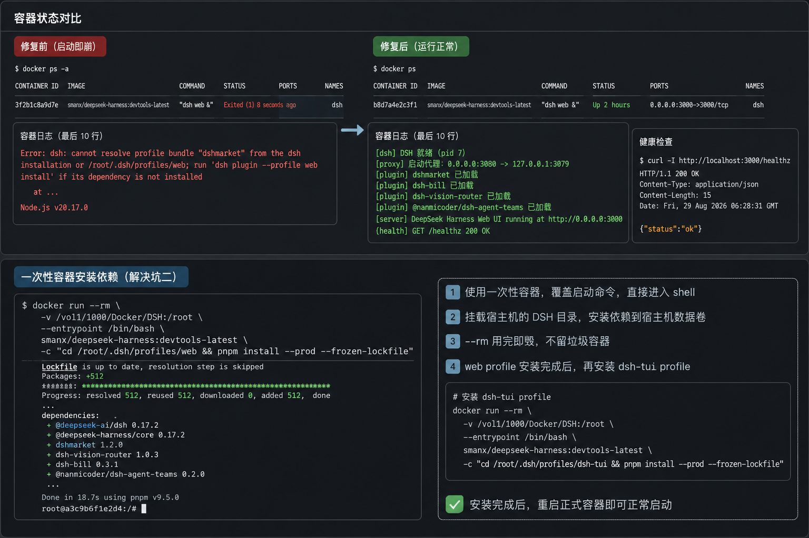

我在 Windows 上用 DSH（DeepSeek Harness）跑了一阵子，陆陆续续装了十好几个插件：dshmarket、dsh-chat-import、dsh-vision-router、dsh-agent-teams、dsh-bill，乱七八糟一堆。用着是挺爽，但有个问题一直膈应：这玩意就住在我这台 Windows 上，想让它一直挂机，电脑就得一直开着，费电。

正好 NAS 上跑着 Docker，我就想，干脆把整个 DSH 连插件带配置一起搬过去，塞进容器里，以后在外面随时能访问。计划很朴素，结果从拷文件那一刻开始，连炸了四个坑，每次都启动即崩。最后是 AI 通过 SSH 远程一条龙修好的，我在旁边基本就负责看戏和拍大腿。

这篇就记一下这个过程，重点说 AI 是怎么全自动修的。

## 起因：想给 DSH 搬家

Windows 上的 DSH 存在 `C:\Users\XOS\.dsh` 里，结构大概是：

- `profiles/web/`：web 版 profile，插件清单（`package.json`）、启用配置（`cordis.yml`）、依赖都在这
- `settings.yaml`：全局配置，模型、皮肤、面板开关之类
- `.credentials.yaml`：API key 等凭据
- 各个插件自己的数据目录，`dsh-bill/`、`dsh-chat-import/`、`skin-center/`……

我最初的想法很直接：整个 `.dsh` 拷到 NAS 挂载进容器，完事。结果第一步就栽了。

## 坑一：Junction 变成了实体目录

先在 Windows 上 robocopy 把 `.dsh` 备份出来，然后整个丢进容器的挂载目录，启动容器：

```text
Error: dsh: /root/.dsh/profiles/node_modules/@deepseek-ai/dsh exists
and is not a symlink; remove it so dsh can manage the installation fallback
```

当时人直接傻了：`@deepseek-ai/dsh` 怎么会「存在但不是符号链接」？

原因很阴：Windows 上 DSH 核心包的 node_modules 全是 Junction（目录符号链接），真正的实体在 `D:\.pnpm-store`。我 robocopy 的时候没加 `/XJ`，这些链接就被解析成实体目录拷了过去。到 Linux 上一看，DSH 期望这里是个干净的 symlink 好自己管理，结果是个实打实的目录，直接罢工。

> [!WARNING] 教训
> 拷贝 `.dsh` 必须排除 node_modules 和 junction：
> `robocopy "C:\Users\XOS\.dsh" "D:\dsh-migrate\.dsh" /E /XJ /XD node_modules`
> node_modules 交给目标机器重新 `pnpm install`，别搬。

## 坑二：依赖没装，DSH 拒绝启动

删掉坏东西重来，把干净的备份（34MB，无 node_modules）传到 NAS 挂载目录。启动，又崩：

```text
Error: dsh: cannot resolve profile bundle "dshmarket" from the dsh
installation or /root/.dsh/profiles/web; run 'dsh plugin --profile web
install' if its dependency is not installed
```

这个好懂：node_modules 没带过来，DSH 也不会自己装，得进容器跑 `pnpm install`。麻烦的是容器一启动就崩，根本进不去，`docker exec` 无从谈起。

AI 给的办法很骚：用一次性容器，同一个镜像、同一个挂载，覆盖启动命令直接进 shell 装依赖：

```bash
docker run --rm \
  -v /vol1/1000/Docker/DSH:/root \
  --entrypoint /bin/bash \
  smanx/deepseek-harness:devtools-latest \
  -c "cd /root/.dsh/profiles/web && pnpm install --prod --frozen-lockfile"
```

web profile 装完再补 dsh-tui 那个 profile，同一个套路：`cd /root/.dsh/profiles/dsh-tui && pnpm install --prod --frozen-lockfile`。

关键点就三个：`--rm` 用完即毁，`--entrypoint /bin/bash` 跳过正常启动命令直接给 shell，`-v` 挂载同一个数据卷。等于在容器外面修容器里面的世界，那个崩掉的容器根本不用管。装完确认插件都回来了：dshmarket、dsh-bill、dsh-vision-router、@nanmicoder/dsh-agent-teams，一个不少。



## 坑三：凭据文件权限 666，安全校验拦路

依赖齐了，启动，还炸：

```text
credentials-local: /root/.dsh/.credentials.yaml is readable beyond its
owner (mode 666); run "chmod 600 /root/.dsh/.credentials.yaml" before
starting again
```

这是 Windows 拷文件的经典后遗症：robocopy 备份时把文件权限全放开了，`.credentials.yaml` 成了 666，谁都能读。DSH 有安全校验，凭据文件必须属主独占。

```bash
chmod 600 /root/.dsh/.credentials.yaml
```

顺手把 `settings.yaml`、`dsh-ssh.json` 也一起收紧。

## 坑四：TUI 插件要 TTY，后台容器没有

第四次启动，日志里终于不是「启动即退」了，但还是起不来：

```text
Error: dsh-tui requires an interactive terminal (stdout must be a TTY).
```

原因是我的 profile 里启用了 `@deepseek-harness-tui/dsh-tui`（TUI 界面插件）。它启动时会检测 stdout 是不是 TTY，容器里 `dsh web &` 是后台跑，没有 TTY，直接抛异常。

解法也简单：web 部署反正用浏览器访问，TUI 用不上，直接在 profile 的补丁配置里禁掉。在 `cordis.patch.yml` 追两行：

```yaml
# Docker 后台部署无 TTY，禁用 TUI（web 浏览器访问不受影响）
- id: dsh-tui
  disabled: true
```

## 修好了：容器平稳运行

四次折腾完，容器终于 `Up` 起来了：

```text
[dsh] DSH 就绪（pid 7）
[proxy] 启动代理：0.0.0.0:3080 -> 127.0.0.1:3079
```

端口探活直接 HTTP 200，浏览器打开就是熟悉的 `DeepSeek Harness` 界面。插件、配置、聊天记录全都在，等于搬了个家，行李一件没丢。

## AI 全自动修复是怎么做到的

说回重点。整个过程里，AI（就我正在用的这个 agent）做的不是「丢几条命令让你自己跑」，而是全程接管：

1. 远程连宿主机：直接 SSH 到 NAS，`docker ps -a` 看容器状态，`docker inspect` 确认挂载关系
2. 判断挂载点：一眼看出 `-v /vol1/1000/Docker/DSH:/root` 意味着整个根目录都在宿主机上，所以「不进容器也能修」
3. 改文件用 sudo 提权：宿主机上 `.dsh` 属主是 root，AI 自己拿 root 密码提权读写
4. 自动打包传输：本地 `tar -czf` 打包备份，`ssh_upload` 传过去，远端解压，再校验文件都在
5. 自我纠错：每修一步就启动一次容器、读日志、分析下一个报错，然后接着修，四个坑全是这么被逐个填平的
6. 顺手清理：tar 包、一次性容器，用完都收拾干净

全程我给它的指令大概就两三条：「拷过去报错了」「容器进不去怎么办」「现在好了吗」。剩下全是它自己来。最爽的是它自己就注意到备份里没有 node_modules、注意到权限是 666、注意到 TUI 要 TTY，每个都是看一眼报错日志就定位到根因，然后给出对应修法。

以前遇到这种「启动即崩、日志一大坨」的容器问题，我的流程是：搜报错，复制一堆命令，越改越乱，最后重装。这次基本是它修、我看，体验完全不一样。

## 经验总结

这套流程以后再遇到同类场景可以直接抄：

1. 备份 `.dsh` 时排除 node_modules 和 junction（`/XJ /XD node_modules`）
2. 清单文件（`package.json`、`pnpm-lock.yaml`、`cordis.yml`）必须带，这是重建依赖的依据
3. 到新机器后手动跑一次 `pnpm install --prod --frozen-lockfile`，别指望 DSH 自动装
4. 迁完用 `chmod 600` 收紧 `.credentials.yaml` 等敏感文件
5. Docker 或后台部署记得禁用 TUI 类插件（`cordis.patch.yml` 里 `disabled: true`）
6. 容器崩了进不去？用一次性容器 + 同挂载覆盖 entrypoint，在容器外面修

最值钱的一条还是那句：跨平台迁移，别硬搬 node_modules。让依赖在目标环境重新装，比带着一堆 Windows 链接结构过去折腾省事得多。

## 写在最后

这次折腾给我最大的感受倒不是 DSH 迁成功了，而是「AI 全自动运维」这状态离日常生活真不远了。一个能 SSH、能判断挂载关系、能自己打补丁重启再验证的 agent，处理这种环境迁移问题已经挺能打。当然它也不是万能的，中间好几次我都怀疑它要卡住了，结果它就是硬生生把四个坑一个个填平。
