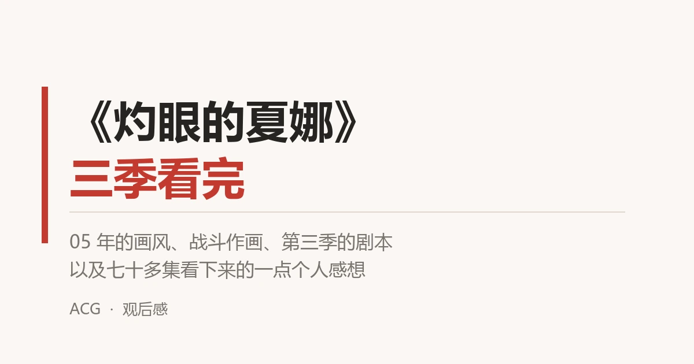

# 《灼眼的夏娜》三季观后感

先说结论：前两季很经典，第三季挺意外，整体确实写得好。

看的时候倒是一直很期待夏娜跟悠二能早点把关系挑明。

结局的处理方式跟我想的不太一样，不过冷静下来想想，这个收尾是合理的，也确实写得不错。

## 前两季：经典，但基本能猜到下一步

第一季和第二季都非常经典。

经典到什么程度——看到一半大概就能猜到下一步要写什么、大概会发生什么事。

我个人不太把这个当成缺点。老番的节奏就是这样，一集一个事件，铺垫、冲突、收尾一气呵成。你大概知道接下来会有个红世使徒冒出来，也知道夏娜会打赢，但看的时候不觉得无聊。

第一季主要在建立世界观。悠二从普通高中生变成"火炬"，零时迷子，火雾战士，红世使徒，这些设定一层层铺开。给夏娜取名、带她去上学这些日常段落，是整部作品最舒服的部分。

第二季把校园日常写到了极致，然后再让所有人站到路口。转学生、化装舞会的影子、悠二开始不满足于被保护——表面还是日常，底下的暗流已经很急了。

两季看下来，人物都立住了。夏娜从一台战斗机器慢慢学会情绪和日常，这条线写得比很多同类型作品扎实。

## 第三季：剧本挺意外，和《巨人》有点不约而同

第三季是真的让我没想到。

前两季基本在预期内，第三季直接把棋盘掀了。悠二不再是等着被救的那个少年，而是站到了对面，成了化装舞会的盟主，主导一个"创造新世界"的计划。

这个转向挺狠的，也把整部作品从"打怪"变成了"阵营战争 + 世界观收束"。

还有就是，这剧本很多地方的母题和《进击的巨人》后期有种不约而同的感觉。

具体哪些地方像，各人有各人的看法，我不多展开。但"为了族群的存续去找一条活路，代价是把整个世界重写一遍"这种结构，看的时候确实很熟悉。

顺带一提，第三季收尾的方式，也不是简单的谁打赢谁。

## 画风和战斗：05 年的番，比近几年不少战斗番还能打

画风是我很满意的一点。

这种 05 年的画风能做到这么好看，真的是没得说。起码我个人非常喜欢。

更难得的是战斗。

PPT 敷衍这个毛病，其实现在的新番反而更严重。一到关键场面就几张静止帧推拉，配上光效和喊叫，就算打完了。

《灼眼的夏娜》完全没有这个问题。打起来是真的在动，招式、火焰、封绝的空间感都做得挺认真。

说实话，这么早的番，战斗表现能比近几年的大多数战斗番还要优秀得多。

这可能也是我到现在还愿意看老番的原因。

## 结局：没烂尾，只是跟我想的不太一样

回到开头那句话。

期待夏娜跟悠二挑明关系，期待了很久。真到了结局，走向跟我预期的不太一样。

但要说结局差，也不对。

它不是烂尾，也不是敷衍。该收的线都收了，人物的动机也站得住，该给的交代都给了。

可能只是我期待的方向，和作品想给的方向不太一样。

## 老番的好处

这种老番还是比较有意思的。

都是带你进入一个个精彩的世界。

现在的番很多是把你留在现实里，老番是把你拉走。设定、世界、规则、代价，一整套都给你搭好，你进去待上一整季，出来的时候会有点舍不得。

反过来看现在的新番，路子基本就两条：要么画几个好看的角色，剩下的全靠你自己磕；要么干脆就是厕纸。愿意认真搭一个世界的，反而是少数。

《灼眼的夏娜》就是这类作品里比较典型的一个。

## 集数够，配角才立得住

三季加起来七十多集，篇幅是它占的最大便宜之一。

集数够最直观的好处是：不只主角能讲清楚，各种配角的支线和故事也都有地方去铺。

吉田一美、佐藤、田中、玛琼琳、威尔艾米娜，这些人不只是站在主角旁边喊加油的工具人，各自都有自己的想法、自己的选择，也不全围着主角转。

人物一多、戏份一足，形象和性格自然就鲜明起来了。

想起之前看《AIR》的时候，一共才 12 集，中间还要塞进去一段主角前代的故事，看完就是一个感觉：太紧了。

不是说它做得不好，是那个篇幅真的撑不起那么多东西。对比之下，《灼眼的夏娜》集数给够了，看得就舒服得多。

---

## 以下开始剧透

下面按季整理了三季的剧情脉络和关键设定，是我看的时候顺手记的笔记。

每季单独折叠，**想看哪季点哪季**，而且每一季都做了隔离——**不会透露下一季的任何走向**，按顺序点开也不会被剧透到后面。没看完的别乱点。

第一季（2005，24 集）｜相遇、入局与世界观建立

<strong>一句话概括</strong>：普通高中生坂井悠二遇见火雾战士夏娜，得知自己早已死亡、只是"火炬"，并在红世使徒的袭击中逐步卷入两个世界的战争。

<strong>这一季在做什么</strong>：把世界观和人物关系立起来——红世是什么、存在之力怎么被消耗、悠二为什么还算"活着"、夏娜为什么在战斗。看完这一季，后面所有人的动机都才对得上。

<strong>主线脉络</strong>

<ul>
<li><strong>相遇与真相</strong>：悠二被卷入红世使徒吃人现场，被夏娜所救。夏娜展开"封绝"，告知悠二他早已被吞噬，现在的他只是替代品"火炬"。</li>
<li><strong>零时迷子</strong>：悠二体内寄宿着宝具"零时迷子"，因此不会像普通火炬一样熄灭，成为红世各方争夺的目标。</li>
<li><strong>法利亚格尼篇</strong>：红世之王"猎人"法利亚格尼为复活恋人玛丽安，利用宝具"幸福之钟"收集存在之力。夏娜与悠二首次直面强大使徒。</li>
<li><strong>同伴与日常</strong>：悠二给夏娜取名"夏娜"，带她体验学校生活。吉田一美、佐藤、田中等同学进入故事。玛琼琳·朵（悼文吟诵人）登场，与夏娜并肩作战。</li>
<li><strong>爱染他篇与最终战</strong>：红世之王"爱染他"蒂丽亚制造"摇篮花园"，企图吞噬城市。夏娜与悠二在决战中确认彼此的重要性。</li>
<li><strong>结局</strong>：夏娜在战斗前对悠二说出"我喜欢你"，但悠二没有听见。化装舞会开始关注悠二体内的零时迷子。</li>
</ul>

<strong>这一季要记住的设定</strong>

<ul>
<li><strong>红世</strong>：异世界，其居民"徒"需消耗存在之力。</li>
<li><strong>存在之力</strong>：维持世界与存在的能量。</li>
<li><strong>火炬 / 密斯提斯</strong>：被吞噬后留下的残渣；密斯提斯是体内藏有宝具的火炬。</li>
<li><strong>火雾战士</strong>：人类与红世之王契约后诞生的讨伐者。</li>
<li><strong>零时迷子</strong>：悠二体内的宝具，每天零点恢复存在之力。</li>
</ul>

<strong>留下的伏笔</strong>

<ul>
<li>夏娜从"战斗机器"逐渐学会情感与日常。</li>
<li>悠二决心不再只被保护。</li>
<li>零时迷子，以及化装舞会投过来的视线，在这一季末留了下来。</li>
</ul>

第二季（2007，24 集）｜日常下的暗流与抉择

<strong>一句话概括</strong>：在看似平静的校园日常下，零时迷子的秘密、"化装舞会"的阴影和"彩飘"菲蕾丝的出现，把悠二与夏娜推向必须做出选择的十字路口。

<strong>这一季在做什么</strong>：把校园日常推到极致，再让每个人站到路口。这一季的张力几乎全来自"表面还是日常、底下全是暗流"——转学生到底是谁、菲蕾丝要拿零时迷子做什么、悠二想变成什么样。

<strong>主线脉络</strong>

<ul>
<li><strong>校园日常与近卫史菜</strong>：转学生近卫史菜出现，她与化装舞会巫女黑卡蒂极为相似。她融入学校生活，与夏娜、吉田等人产生交集，成为全季最大谜团。</li>
<li><strong>菲蕾丝与零时迷子</strong>：红世之王"彩飘"菲蕾丝为夺回零时迷子而来。零时迷子原与"约定的两人"——约翰和菲蕾丝有关。约翰作为火炬逐渐消散，菲蕾丝想用零时迷子救他。</li>
<li><strong>吉田、佐藤、田中的选择</strong>：吉田一美对悠二感情加深，并从菲蕾丝处获得力量或宝具，主动选择参战。佐藤和田中接触玛琼琳，开始思考普通人类能否介入火雾战士的战斗。</li>
<li><strong>悠二的变化</strong>：悠二不再满足于被保护，开始锻炼自在法，希望变强并带夏娜离开城市。他一度释放出银色火焰，暗示体内藏着远超零时迷子的异常力量。</li>
<li><strong>史菜真相与结尾</strong>：近卫史菜最终被揭示为与黑卡蒂、化装舞会密切相关的存在，消失或回归。圣诞夜，悠二被化装舞会带走，夏娜无力阻止。</li>
</ul>

<strong>这一季要记住的设定</strong>

<ul>
<li><strong>零时迷子</strong>：与"约定的两人"有关，菲蕾丝想用它救约翰。</li>
<li><strong>约定的两人</strong>：约翰与菲蕾丝，零时迷子原主。</li>
<li><strong>化装舞会</strong>：红世使徒组织，巫女黑卡蒂，本季最大威胁的来源。</li>
<li><strong>银色火焰</strong>：悠二体内异常力量的暗示。</li>
</ul>

<strong>留下的伏笔</strong>

<ul>
<li>第二季把校园日常写到极致，再让所有角色站到选择路口。</li>
<li>悠二"想改变"的执念贯穿全季，他不想再只做一个被保护的人。</li>
<li>圣诞夜悠二被带走，故事停在这里。</li>
</ul>

第三季 FINAL（2011，24 集）｜阵营战争与世界观收束

<strong>一句话概括</strong>：悠二主动与创造神祭礼之蛇融合，成为化装舞会盟主，试图创造使徒不必吃人的新世界"无何有境"；夏娜与火雾战士为阻止并改写这个计划而战。

<strong>这一季在做什么</strong>：从"打怪"彻底变成阵营战争，同时完成世界观的收束——前面两季攒下的伏笔，都在这里给出交代。

<strong>主线脉络</strong>

<ul>
<li><strong>悠二回归与化装舞会</strong>：圣诞夜失踪后，悠二与红世创造神"祭礼之蛇"融合，成为其代行体，并成为化装舞会新盟主。他不再是等待救援的少年，而是敌方领袖。</li>
<li><strong>无何有境计划</strong>：祭礼之蛇的权能是"造化与确定"。悠二计划创造新世界"无何有境"，让红世之徒迁入，获得充足存在之力，从而不再需要啃食人类。他本意是间接终结战争，而非直接禁止吃人。</li>
<li><strong>火雾战士的抵抗</strong>：夏娜、亚拉斯特尔、玛琼琳、威尔艾米娜等火雾战士联合进攻化装舞会，试图阻止世界创造。但最终无法阻止"无何有境"诞生。</li>
<li><strong>夏娜打入法理</strong>：在世界之卵完成前，夏娜用"真红"击中世界之卵，强行写入一条法理——<strong>新世界中的徒无法啃食人类</strong>。祭礼之蛇本可消除这条规则，但听到使徒们接受"不吃人也没关系"，最终选择保留。</li>
<li><strong>结局与双赢</strong>：无何有境完成，使徒迁入，部分火雾战士进入新世界监督。夏娜与悠二决战并和解，悠二一意孤行的"赎罪式保护"被夏娜否定——她要求一起承担。拉米的帮助或礼物让悠二摆脱火炬命运，能够与夏娜一起走向新世界。菲蕾丝与约翰的孩子"两界嗣子"被威尔艾米娜带入新世界；引导神沙哈尔的眷属将这一新事物广播给所有徒。</li>
</ul>

<strong>这一季要记住的设定</strong>

<ul>
<li><strong>祭礼之蛇</strong>：红世创造神，权能"造化与确定"。</li>
<li><strong>无何有境</strong>：为使徒创造的新世界。</li>
<li><strong>世界之卵</strong>：创造新世界的核心术式。</li>
<li><strong>两界嗣子</strong>：菲蕾丝与约翰融合诞生的新个体，证明徒与人类可有非捕食关系。</li>
<li><strong>引导神沙哈尔</strong>：权能"唤起与传达"，通过神谕向所有徒广播新事物。</li>
</ul>

<strong>主题与争议点</strong>

<ul>
<li>悠二并非想直接创造"不吃人世界"，而是想用充足存在之力让使徒"不需要吃人"。</li>
<li>"徒无法啃食人类"是夏娜一方强行注入的法理，不是悠二原计划。</li>
<li>结局并非单纯胜负，而是火雾战士、使徒、新世界三方妥协后的双赢。</li>
<li>夏娜与悠二的核心矛盾：悠二想独自赎罪，夏娜拒绝被排除在外。</li>
</ul>

---

## 写在最后

《灼眼的夏娜》算是我这轮补老番里比较有代表性的一部。

它不完美，第三季的收尾也不是那种让人拍桌叫好的类型，但它把该讲的故事讲完了。世界观、战斗作画、人物成长这几项都完成了，二十年后回头看依然不觉得过时。

之前写的[《零之使魔》观后感](/posts/anime/zero-no-tsukaima/zero-no-tsukaima/)和[《俺妹》观后感](/posts/anime/oreimo/oreimo/)也是同一批补的，都是那个年代的作品，感兴趣可以一起看。
