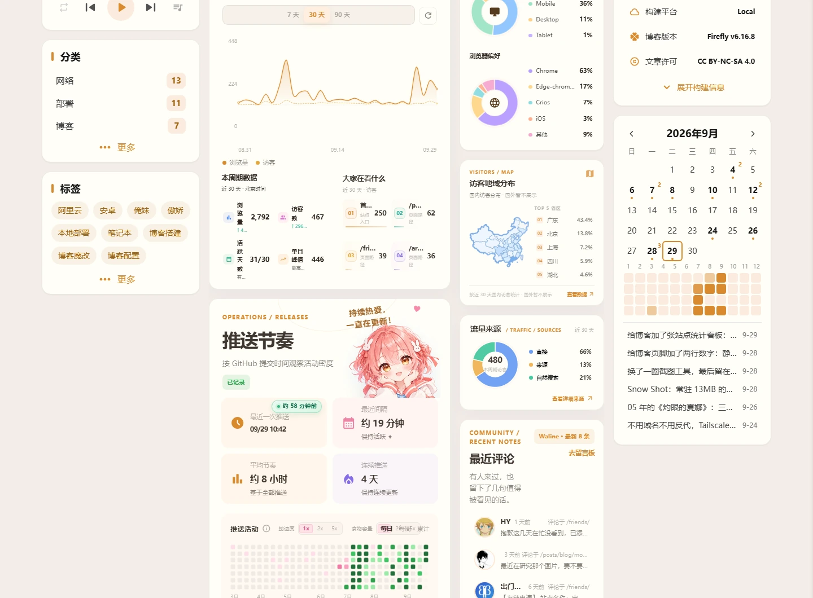
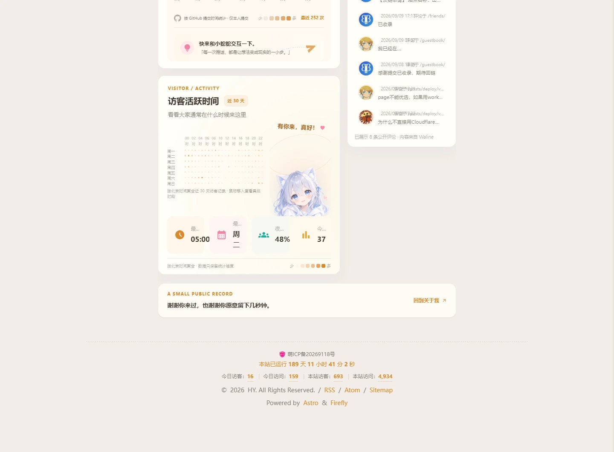

上一篇刚给[页脚加了两行数字](/posts/blog/footerstats/)，转头又看上了 [rainzt.cn](https://rainzt.cn) 的 `/analytics/`。

那和页脚那两行完全不是一个量级——整整一页数据看板：


四张彩色总览卡、能切 7 / 30 / 90 天的访问脉冲、按 GitHub 推送时间排的热力图、24 小时活跃分布、设备与浏览器的环形图，还有一张中国地图和最近评论。

## 第一版：照着自己设计

我当时的做法是——截图，看一眼，然后自己写。

结果做出来是这样：能跑，数据也全对，但一看就不是那个味道。它的卡片有自己的四色体系（蓝、薄荷、金、紫），总览卡上压着纹理，访问脉冲下面还挂了一组「本周数据 / 大家在听什么」的小卡，动效的节奏也不一样。我这份是「功能齐全的朴素版」，人家那份是设计过的。

被一句话点醒之后我才反应过来：**这东西的源头就在仓库里，我为什么要在那儿瞎设计。**

它的来源是 [Jarvis0227/Aemeath](https://github.com/Jarvis0227/Aemeath)，和我一样是 Firefly 的 fork——同一种子。

## 人家是四个部分，不是一个文件

去翻仓库，结构比我想的散：

| 文件 | 行数 | 干什么的 |
|---|---|---|
| `src/pages/analytics.astro` | 3959 | 页面本身，模板 / 脚本 / 样式三大段 |
| `src/components/widget/AnalyticsSnapshot.astro` | 665 | 侧栏那块分布图 |
| `src/components/analytics/UmamiMetrics.astro` | 582 | **渲染四个总览数字的** |
| `public/assets/images/analytics/*` 等 | 8 个文件 | 角色插画、hero 背景、中国地图 |

注意第三行。

## 最大的坑：四个数字永远「加载中」

我先把页面搬过来，构建，打开——访问脉冲有数据，环形图有数据，地图有数据，评论区也正常。

**唯独最上面那四张总览卡，一直停在「加载中」。**

查了半天才明白：页面模板里只输出了 `data-umami-stat` 占位符，**真正去请求数据、把数字写进去的逻辑，写在 `UmamiMetrics.astro` 里**。那个组件原本是在主题布局层全局引入的（页脚统计也用它），页面上根本不显眼。

漏了它，页面其余模块全部正常工作，因为那些数据是页面自己的脚本拉的；只有那四个数字永远填不上。

补上组件之后立刻出数：累计访客 670、累计浏览 4,716、今日访客 1、今日浏览 9。

## 适配只动了三处

搬过来之后要做点本地化，但尽量少改，方便以后跟着上游一起更新。

**一是署名。** hero 卡片右下角有一行 `RZ / 2026`，改成自己的。顺带把 localStorage 的 key 前缀和全局变量名里的 `rainzt` 也换掉了，一共 19 处——都是内部标识，看不见，改完不会互相干扰。

**二是两个缺的 CSS 变量。** 页面用了 `--text-color` 和 `--font-active-sans`，这两个我这份主题里没有——作者是直接改了 `src/styles/variables.styl` 加的。为了两个变量去动主题源文件不划算，我改成在页面自己的 `.analytics-page` 作用域里就地定义，暗色模式也单独给了一组值。

**三是配置字段。** 页面从 `analyticsConfig.umamiAnalytics` 里读 `shareId`、`shareApiBase` 和 `historicalStats`（迁移前历史累计，我没有迁移过就填 0）。

## 顺手把入口挪了

第一版我把导航入口挂在了「关于」的子菜单里，结果被吐槽「不然我怎么进去」。

有道理。藏在下拉里的入口等于没有，现在提到了顶级导航，和「我的」「关于」并列。

## 成品

搬到一半的样子，左边是主题自带的侧栏，中间是看板主体：



再往下是活跃时段热力图和评论：



数据全部来自 Umami 的公开分享接口，浏览器直连，**不需要任何后端**——和上一篇页脚统计是同一套路子，只是这次铺得更开。GitHub 提交记录在构建时拉取，Waline 评论走它的公开接口。

## 顺带发现的一个老问题

看板页顶部 banner 上那四个巨大的「暂无封面」，我一度以为是自己搞出来的。

对比了一下 about 页面——**也有**。查代码才明白是主题音乐播放器的封面占位：

```js
ui.cover.src = '';
ui.cover.classList.add('opacity-0');
ui.cover.alt = cfg.i18n.noCover;   // 图片没 src 时 alt 就被浏览器画出来了
```

它给图片挂了 `opacity-0`，但 `alt` 文本照样渲染。这是主题自带的小瑕疵，要修得动 `src/components/features/`，本次没碰。

## 最后说个教训

这一轮最大的浪费不在技术，在流程：**看到别人有个好效果，第一反应应该是先翻他的仓库，而不是照着截图自己设计。**

功能能对，味道对不上。而且人家那份是反复调过的，我再自己摸一遍，只是在重复他的试错过程。

不过反过来说，这次翻车也不是全白费——至少搞清楚了 `x-umami-share-token` 和 `x-umami-share-context` 这两个头缺一不可，那是自研时试出来的。
