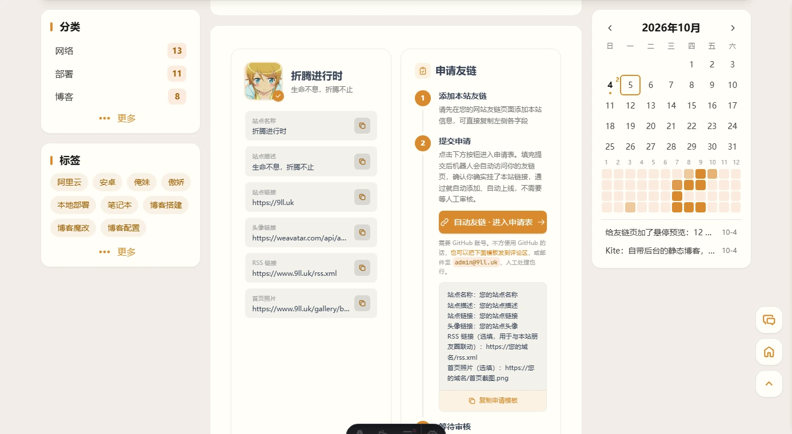

今天翻 [blog.amamo.top](https://blog.amamo.top/friends/) 的友链页，看到页面上有一行小字：「自动友链 点击上方进入申请表，按提示填写站点信息并提交。」

点进去是个 GitHub Issue 表单。


我这边友链页的申请方式还是老一套：复制模板，发评论区或者发我邮箱，等人手动加。

差别挺明显的。他那边提交完就等结果，我这边至少得等我打开邮箱。

## 他那边是怎么做的

顺手把他的仓库扒了一遍。他的站也是 fork 的 Firefly，仓库公开，[qwc-ch/Firefly](https://github.com/qwc-ch/Firefly)。

实现全在 `.github/` 下面，一共三个文件：

| 文件 | 干什么的 |
|---|---|
| `.github/ISSUE_TEMPLATE/friend-request.yml` | 申请表本体 |
| `.github/scripts/process-friend-request.cjs` | 校验 + 改配置 + 提交 |
| `.github/workflows/friend-link-checker.yml` | 触发（文件名起得有点误导，内容其实是「自动更新友链」） |

流程是这样的：申请人在 Issue 表单里填站点名、主站链接、**友链页地址**；workflow 监听到 `issues: [opened]` 就启动，跑脚本去访问那个友链页，确认页面上确实有他的站，然后改 `friendsConfig.ts` 并提交。

还有个细节我觉得挺聪明：触发条件里还带了 `issue_comment: [created]`，而且**只有 Issue 作者本人的回复**才会重新跑一遍。申请人第一次没挂链接被拒了，改完自己回一句，机器人重新验一次，不用关掉重开。

入口也不是什么站内表单，就是一条链接：

```text
https://github.com/qwc-ch/Firefly/issues/new?template=friend-request.yml
```

## 一个反直觉的点：这事不需要服务端

搜「自动友链」的时候翻到一篇写得很细的文章，讲的是把友链数据抽成 `links.json`、把站切成 SSR、再加一个 API 接口负责校验和写文件。看完我一度以为得动构建模式。

扒完他的仓库才发现，**他压根没上 SSR**。站还是纯静态的，部署在 GitHub Pages（`deploy.yml` 里就是 `on: push: branches: [master]`）。

关键在于：校验和写入**不发生在访客访问的时候**，而是发生在 GitHub Actions 的容器里。

- 机器人跑在 GitHub 的机器上，改文件、提交、推送，都是它干的
- 推送触发平台重新构建，新友链就出现在页面上了

所以静态站完全够用。那篇文章里的 SSR 是作者自己站的部署方式，不是这件事的必要条件。

## 但他的脚本不能直接抄

有三处我这边过不去。

### 一、他会把整个数组重写一遍

他脚本里的写入逻辑是：先把现有的 `friendsConfig` 全部解析成对象，再全部重新渲染回去。

```js
const friendBlocks = [...listMatch[1].matchAll(/\{([\s\S]*?)\n\t\},?/g)].map((item) => item[1]);
return friendBlocks.map((block) => ({
	title: extractString(block, 'title'),
	imgurl: extractString(block, 'imgurl'),
	desc: extractString(block, 'desc'),
	siteurl: extractString(block, 'siteurl'),
	tags: extractTags(block),
	weight: extractNumber(block, 'weight', 10),
	enabled: extractBoolean(block, 'enabled', true),
	issue_id: extractNumber(block, 'issue_id', 0),
}));
```

问题出在字段白名单上。他的 `FriendLink` 类型里没有 `rss` 和 `homepage`，而他这个站也确实没用这两个字段，所以他跑着没事。

我这边的 `friendsConfig.ts` 正在用：`rss` 有 2 条、`homepage` 有 1 条，另外还有一堆分组的注释。按他这个流程走一遍，那些字段和注释全会被吃掉——因为整个数组会被"重新渲染"成他认识的那 8 个字段。

所以我把写入改成**只往数组头部插一条**，其他位置一个字节都不碰：

```js
const anchor = 'export const friendsConfig: FriendLink[] = [';
const at = raw.indexOf(anchor);
const updated =
	raw.slice(0, at + anchor.length) + eol + entry + raw.slice(at + anchor.length);
```

顺带加了按域名去重，否则同一个人重复申请会插进去两条。

### 二、他的方案有点重

他的 workflow 里有这两步：

```yaml
- run: pnpm install --frozen-lockfile
- run: pnpm exec playwright install --with-deps chromium
```

因为他的校验是用 Playwright 真的开一个浏览器去渲染友链页，再读渲染后的 DOM。

对靠 JS 出内容的站来说这确实更准，代价是每跑一次都要装一遍依赖外加一个 Chromium，几分钟起步。

我这边的校验只需要判断「页面 HTML 里有没有那个域名」，Node 内置的 `fetch` 就够了，**零第三方依赖**，跑完二十来秒：

```yaml
- name: Setup Node.js
  uses: actions/setup-node@v4
  with:
    node-version: "22"

- name: Process friend request
  uses: actions/github-script@v7
  with:
    github-token: ${{ secrets.GITHUB_TOKEN }}
    script: |
      const path = require('node:path');
      const handler = require(path.join(process.env.GITHUB_WORKSPACE, '.github/scripts/auto-friend-link.cjs'));
      await handler({ github, context, core });
```

代价也说清楚：**纯前端渲染的友链页我抓不到**，页面内容靠 JS 出来的站会被误判成「没挂链接」，这类只能走人工。

### 三、校验比博客里写的松

他博客里写的是「主站域名与友链页域名一致（避免广告跳转）」，但脚本里其实只做了两件事：打开友链页、看页面里有没有出现他的域名或者站名。

站名那条尤其松——拿「年华」两个字去页面里做 `includes`，随便哪里出现这两个字就过了。

我这边把三项都写实了，全过才写入。

## 我的三件套

同样是三个新增文件，职责划得很清楚：

| 文件 | 说明 |
|---|---|
| `.github/ISSUE_TEMPLATE/friend-request.yml` | 申请表，7 个字段（多了 RSS 和首页照片两个选填） |
| `.github/scripts/auto-friend-link.cjs` | 校验 + 写入，零依赖 |
| `.github/workflows/auto-friend-link.yml` | 触发 + 建 label |

友链页那边的入口做成这样：



原来的「发评论区 / 发邮件」那条路我没删，压缩成一行小字留在按钮下面。用 GitHub 的门槛确实有，得给人留个后路。

## 校验的三项

| 检查 | 怎么做的 | 不过会怎样 |
|---|---|---|
| 主站能打开 | fetch 主站，跟随重定向后要求 200 | 拒绝，提示「主站无法访问」 |
| 友链页能打开 | fetch 友链页，用重定向后的最终地址 | 拒绝，附上状态码和错误 |
| 两站同域 | 比 registrable domain，`blog.example.com` 和 `example.com` 算同域 | 拒绝，提示域名不一致 |
| 页面挂了本站链接 | 在 HTML 里找 `9ll.uk` | 拒绝，把需要挂的站点信息列出来 |

另外做了两个防呆。

字段里的换行和引号会压平转义。有人手打 Issue 的时候如果在「网站名称」里塞一段 `"];` 加换行，不处理就会把 `friendsConfig.ts` 撕成语法错误。

还有 label 不存在时不能让整个 job 挂掉。GitHub API 对不存在的 label 直接返回 422，流程会当场炸掉，所以 `addLabels` 外面包了 try/catch，workflow 里也顺手 `gh label create ... || true` 先建一遍。

## 踩坑记录

### `### 网站名称` 读不出来

Issue 表单提交之后，正文长这样：

```text
### 网站名称

测试小站

### 网站链接

https://example.com
```

我一开始按 `\n### ` 切分，每块的第一行当字段名。写完跑单元测试，发现**第一个字段永远解析不出来**。

原因挺蠢的：正文**开头**就是 `### 网站名称`，它前面没有换行，所以没被切走，留在了第一块里，字段名变成带 `### ` 前缀的字符串，怎么都匹配不上。

修法是在清洗字段名时补一句：

```js
String(label).replace(/^#+\s*/, '')   // split 后第一块的 label 会带 "### " 前缀
```

还有个更值得记的教训：测试得走生产路径。

我第一版测试是自己在测试里手动拼了个对象塞进去测的，跑得干干净净——因为它压根没碰真正解析 Issue 正文的那段代码。后来把字段整理抽成 `buildForm()`，测试和主流程共用同一个函数，上面那个 bug 才浮出来。

### 按钮上的字看不见

申请入口那个按钮我写完看着挺好，dev 一热更新，按钮变成一个纯橙色块，字全没了，底下隐约一条虚线。

不是 HTML 写错，是主题里有一条全局样式：

```css
/* src/styles/markdown.css */
a:not(.no-styling) {
	@apply relative bg-none font-medium text-(--primary) underline
	       decoration-(--link-underline) decoration-1 decoration-dashed underline-offset-4;
}
```

它会把 MDX 正文里所有的 `<a>` 染成主题色、加一条虚线底。我给按钮写的是 `text-white` 加 `no-underline`——这两个都是单类选择器，特异性 `(0,1,0)`，压不过 `a:not(.no-styling)` 的 `(0,1,1)`。于是**橙字压在橙底上**，那条虚线就是 `decoration-dashed` 的下划线。

解法是主题自己留的口子，`no-styling` 类：

```jsx
<a href="..." class="... no-styling">自动友链 · 进入申请表</a>
```

主题自带的 wiki 链接、GitHub 卡片组件用的都是这个类。加上它那条规则整条不命中，不用 `!important` 硬怼，也不用碰主题源文件。

## 上线之后卡了个 404

代码推上去、Vercel 也构建完了，点申请链接——404。

先怀疑文件名写错，去 GitHub 上看了一眼，`.github/ISSUE_TEMPLATE/friend-request.yml` 好好在那躺着。

查了一下仓库 API：

```json
{
	"full_name": "hy4962/Firefly",
	"fork": true,
	"has_issues": false
}
```

**fork 出来的仓库，GitHub 默认把 Issues 关掉了。** Issues 不开，`/issues/new` 一律 404，模板文件在不在都一样。

去 `Settings → General → Features` 把 Issues 勾上就好了。

中途我还用 curl 探过 `/issues/new`，返回 404；探 `/issues`，返回 200，看着像功能开着。这两个状态码其实都说明不了问题——未登录访问新建页本来就 404，而列表页是公开可读的。**它们区分不出「开着但没登录」和「压根关着」**，最后是靠 API 里的 `has_issues` 定的案。

## 这套东西的边界

三个说实话的地方：

1. **申请者得有 GitHub 账号**。这是最硬的限制，参考站也躲不掉。国内访客里没有 GitHub 的比例不低，所以「发评论区 / 发邮件」那条路我留着没删。
2. **纯前端渲染的友链页抓不到**。我只 fetch HTML，页面内容靠 JS 出来的站会被误判。
3. **垃圾 Issue 会留在仓库里**。校验不过的会被自动打标、自动关闭，但 Issue 本身还在列表里，得手动清。

想解决第一条得再套一层自己的表单页加一个云函数去调 GitHub API，那就多一个要维护的组件和一把 Token。现阶段我觉得不值。

## 极简流程

要复刻的话，需要动的就四处：

1. `.github/ISSUE_TEMPLATE/friend-request.yml` —— 申请表，字段按自己的站点信息改
2. `.github/scripts/auto-friend-link.cjs` —— 校验和写入，改开头 `SITE_INFO` 里的域名
3. `.github/workflows/auto-friend-link.yml` —— 触发
4. 友链页加一个入口按钮（记得带 `no-styling`）

然后两个仓库设置：

```text
Settings → General → Features → 勾上 Issues
Settings → Actions → General → Workflow permissions → Read and write
```

第二条是给机器人 push 配置用的，默认就是 Read and write，但如果之前手动收紧过，这里不放开提交会失败。

前置条件就这些。零依赖、零服务器，整套东西三个文件。
