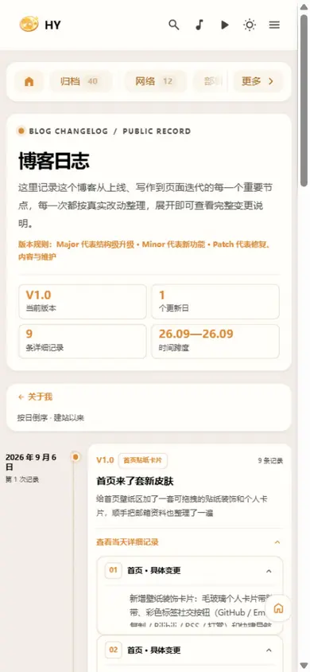

前一篇写了[首页贴纸卡片的魔改过程](/posts/blog/homestickercard/)，这次折腾的是另一件事：**博客日志页**。

起因还是刷 rainzt.cn。他们首页有贴纸，里面还有个 `/blog-changelog/` 的更新日志，每次改动都记一条，版本号、变更明细、时间线摆得整整齐齐。我当时就想，这习惯挺好——博客又不是写完就扔，以后改了什么自己也该有个账本。

说干就干，最后做出来的成品长这样：


## 第一版翻车：光看概述就动手

一开始我没去扒源码，让 AI 帮我"描述一下这个页面长什么样"，照着那个概述做了个版本：一个卡片加几条列表。

结果被自己打脸了。和源站的出入大到没法看——人家是 hero 统计卡加时间线加大卡片，我做出来的是个毛坯。最讽刺的是我还写了个"详细记录"，把写博客文章这种事也塞进了变更明细。

痛定思痛，还是老老实实扒源码。

## 扒站：把 HTML 和 CSS 都拆出来

第一步是 `curl` 把页面和它自己的样式文件都拉下来：

```bash
curl -sL https://rainzt.cn/blog-changelog/ -o changelog.html
# 从 HTML 里找到它引用的样式文件
grep -o 'blog-changelog[^"]*\.css' changelog.html
# 再把这个 CSS 也拉下来
curl -s https://rainzt.cn/_astro/blog-changelog.A9uhDpGh.css -o changelog.css
```

然后对着 HTML 的结构一层层拆，它的页面骨架长这样：

```
blog-changelog-page
├── hero（眉线 + 标题 + 描述 + 版本规则 + 2×2 统计卡）
├── nav（返回链接 + 按日倒序说明）
└── ol.list（时间线）
    └── li.entry × N
        ├── date（日期 + 第几次记录）
        ├── rail（圆点 + 轴线）
        └── article.card（版本徽章 + kind 短语 + h2 + 描述
            + details 折叠明细 + tags）
```

关键细节在 CSS 里：时间线轴线是一条渐变的 1px 竖线，圆点是主题色带光环（`box-shadow: 0 0 0 .22rem`），折叠明细用的是原生 `<details>` 配 `max-height` 过渡，箭头旋转 180 度。这些光看概述是绝对看不出来的。

## 重做：全部塞进三个新文件

照着结构重做了一版。和首页贴纸一样，我给自己定的规矩是**不碰主题源码**，方便以后合并 CuteLeaf/Firefly 上游的更新。所以拆成三块：

| 文件 | 作用 |
|---|---|
| `src/pages/blog-changelog.astro` | 页面入口，Astro 按文件名自动生成 `/blog-changelog/` 路由 |
| `src/components/features/ChangelogTimeline.astro` | 时间线组件，HTML + 全部 CSS 自包含 |
| `src/config/blogChangelogConfig.ts` | 日志数据，以后每次更新只改这一个文件 |

这个方案最舒服的地方是**记日志完全不用碰代码**，往配置里加一个对象就行：

```ts
{
    version: "V1.0",
    title: "首页贴纸卡片",
    date: "2026-09-06",
    summary: "首页来了套新皮肤",
    description: "给首页壁纸区加了一套可拖拽的贴纸装饰和个人卡片……",
    items: [
        { category: "首页", text: "新增壁纸装饰卡片……" },
        { category: "视觉", text: "贴纸布局按列对齐……" },
    ],
    tags: ["首页", "贴纸", "视觉", "移动端", "性能"],
}
```

样式全部复用 Firefly 的主题变量（`--line-divider`、`--content-meta`、`--card-bg`、`--primary`），深浅色模式自动适配，一行硬编码颜色都不用写。

## 细节：从配置自动算统计

源站的统计卡是写死的，我这里全部从配置实时算出来：

```ts
const totalItems = entries.reduce((sum, e) => sum + e.items.length, 0);
// 时间跨度：最早一条到最新一条，格式 26.09—26.09
const dateSpan = `${最早.date.slice(2,7).replace("-", ".")}—${最新.date.slice(2,7).replace("-", ".")}`;
```

当前版本取数组第一条、更新日数取数组长度、"第 N 次记录"倒着数。以后加日志，统计数字自己会涨，不用维护。

## 踩坑：两次跑错方向

1. **概述不可信**。第一版全靠文字描述，做出来四不像。第二次把 HTML 和 CSS 全部拉下来 1:1 复刻才像样。教训：做界面参考，永远以源码为准，别信二手转述。
2. **菜单入口差点忘了**。页面做完才反应过来——导航栏里根本没入口，访客怎么进？后来在「关于」子菜单里加了一项「博客日志」，放在「关于我」上面，顺手在关于页面里也补了个链接。



## 写在最后

这页做完，博客就算有了自己的"账本"。V1.0 已经把贴纸卡片那次的改动全记进去了，以后每折腾一次就记一条，看着版本号往上走，还挺有成就感的。

和贴纸一样，这次依然是三个新文件加两处内容文件的小改动，合并上游时零冲突。需要的人可以照这个思路给任何静态博客加日志页：路由靠文件约定，数据放配置，样式自包含。

页面地址：[/blog-changelog/](/blog-changelog/)，导航栏「关于 → 博客日志」也能进。
