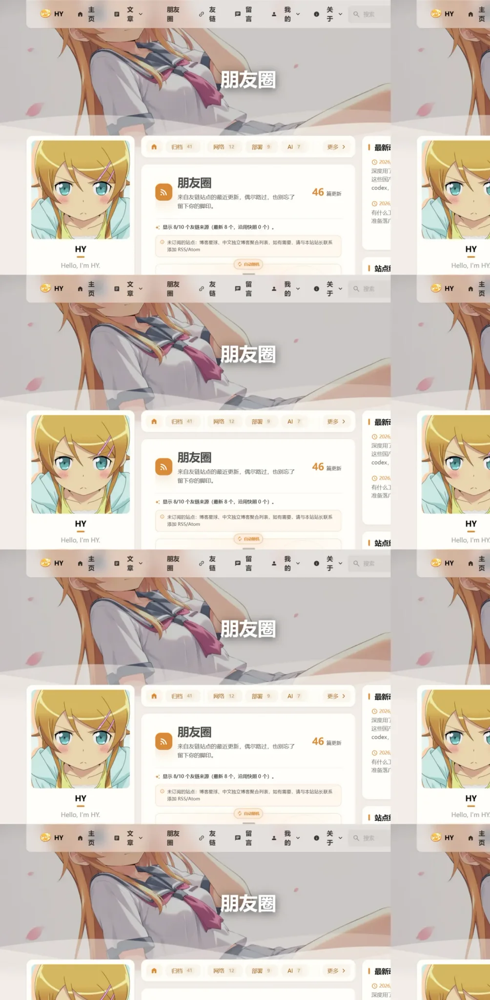

上一轮魔改[首页贴纸卡片](/posts/blog/homestickercard/)和[更新日志页](/posts/blog/blogchangelog/)的时候，我一直在 rainzt.cn 上转悠。她导航栏里有个"朋友圈"，点进去是把所有友链博客最近的文章聚成的一条时间线，谁更新了都看得到。我当时就惦记上了——这功能对独立博客来说太合适了，相当于一个小号的博客聚合社区，还不用装任何服务。

成品先放这里，就是这个 `/moments/`：


## 一个前提：RSS 抓取发生在构建时

先想清楚这事怎么做。老派的"朋友圈"是浏览器实时去抓别人的 RSS，要过一层 CORS 代理（rss2json 那套），又脆又慢，还依赖第三方服务活着。我的博客是纯静态，最顺的做法是反过来：**抓取发生在 `astro build` 的时候**，数据直接烤进 HTML，线上还是那个纯静态站点，服务器零参与。

代价也明确：内容的"新"取决于多久重新构建一次。所以我配了个 GitHub Actions 定时任务，每天自动抓一遍并提交快照，提交又触发 Pages 部署。每天更新一次朋友圈，对我来说完全够了。

## 核心代码：一个文件干完所有事

抓取逻辑全在 `src/utils/friends-feed.ts`，页面入口 `src/pages/moments.astro` 里就一行关键代码：

```ts
const feed = await loadFriendsFeed(friends);
```

Astro 的 frontmatter 里顶层 `await` 是在构建时执行的，这一行就是"把全部友链的 RSS 抓回来"。

具体流程：

1. 遍历 `friendsConfig.ts` 里 `enabled: true` 的友链；
2. 每个站点按顺序猜 RSS 地址：先试你填的 `rss` 字段，没填就猜 `rss.xml`、`feed.xml`、`feed/`、`atom.xml`、`index.xml` 这些常见路径，还不行就抓首页解析 `<link rel="alternate">` 标签；
3. 用正则把每个 feed 的 `<item>`/`<entry>` 拆出标题、链接、摘要、时间，每个站最多取 12 篇；
4. 所有来源去重后，按来源配额（本站 3 成 / Blog 4 成 / 博客社区 3 成）挑片、交错排列成一条时间线。

防呆也做了：并发 5 个、单个 8 秒超时、失败重试 3 次。全部失败就用上一次的快照兜底，构建永远不会因为友链挂了而炸。

## 和友链共用一个配置

朋友圈不是新数据源，它读的就是友链那一份配置。我给 `FriendLink` 类型加了一个可选字段：

```ts
// RSS/Atom 地址，可留空并由朋友圈页面自动探测
rss?: string | string[];
```

填了就优先用，不填靠探测。探测失败的站点会列在页面底部的提示里——"未订阅的站点：xxx"，方便你直接去跟对方要 RSS 地址。

顺带我还把自己也加进了友链：`siteurl` 指向本站、`rss: "/rss.xml"`，这样自己的文章也进时间线，页面上会打"本站主理人"的蓝色徽章（跟"推荐友链"的金色徽章区分开）。唯一的副作用是友链页也会出现自己这条，排在最前面当个自荐位，我觉得挺好。

## 每天自动刷新：一个 workflow 完事

保持新鲜的方案是 `src/data/friends-feed-snapshot.json` 这个快照文件 + 一个定时 workflow：

```yaml
# .github/workflows/refresh-friends-feed.yml（节选）
on:
  schedule:
    - cron: "30 1 * * *"  # UTC 01:30 = 北京时间 09:30
  workflow_dispatch:

permissions:
  contents: write
```

每天到点跑一遍 `tsx scripts/refresh-friends-feed.ts`，把抓到的结果写进快照文件并提交；提交触发 Pages 部署，朋友圈就连着快照一起更新了。抓取失败也没事，脚本不会报错，构建回退到旧快照，最多就是有一天没更新。

## 踩坑：两个加载不出来的头像

这轮最折腾的反而不是抓取，是头像。

**BlogsClub 的头像**是对方站点的 favicon，浏览器里直接打开好好的，从我博客里加载就 404。排查了半天，用 curl 带不同 Referer 一个个试，发现它 nginx 按 Referer 做防盗链：从它自己站内点过去 200，从外部站点引过来 404。解决办法两层：友链页和朋友圈页的头像 `` 全加 `referrerpolicy="no-referrer"`，同时把它的 favicon 下载下来本地托管（`public/assets/images/friends/blogsclub-favicon.png`），彻底不依赖对方服务器的心情。

**我自己的头像**也翻车了。`profileConfig` 里的头像是走 Astro 图片管线优化的，产物文件名带哈希（`_astro/avatar.CjtmSIpt.avif`），我手填的 `/assets/images/avatar.avif` 这个固定路径线上根本不存在。解决是复制一份到 `public/` 目录——public 的文件原样进产物，路径不带哈希。

这两个坑都是构建/引用模型的特性，跟朋友圈本身没关系，但都是"看起来很简单，实际要绕一下"的典型。

## 改动清单：全部新增文件，不碰主题源码

和之前的魔改一个规矩，方便以后合并 CuteLeaf/Firefly 上游：

| 文件 | 作用 | 改动类型 |
|---|---|---|
| `src/pages/moments.astro` | 朋友圈页面，路由 `/moments/` | 新增 |
| `src/utils/friends-feed.ts` | RSS 抓取、解析、快照读写 | 新增 |
| `scripts/refresh-friends-feed.ts` | 定时任务的执行入口 | 新增 |
| `.github/workflows/refresh-friends-feed.yml` | 每天定时抓快照并提交 | 新增 |
| `src/data/friends-feed-snapshot.json` | 抓取结果快照，构建兜底用 | 新增 |
| `src/types/friendsConfig.ts` | 友链类型加 `rss` 字段 | 小改 |
| `src/config/friendsConfig.ts` | 加自己这条友链 + 注释示例 | 小改 |
| `src/config/navBarConfig.ts` | 朋友圈、友链、留言提为一级导航 | 小改 |

改动之后我顺手做的调整：原来"社交"这个父菜单里塞着友链和留言，现在直接拆了，朋友圈、友链、留言都变成一级导航，首页导航栏一眼能看到朋友圈。

## 效果和一些数据

当前 10 条启用的友链，8 个探测成功进了时间线（含我自己），40 篇文章进时间线，`/moments/` 这页 HTML 约 530KB。这个体积只发生在朋友圈这一页，其他页面完全不受影响——首页、文章页该多快还多快，因为抓取是构建时的事，线上没有任何动态请求。



页面本身还带点小东西：顶部一张"随机一篇文章"的卡片，5 秒自动换一篇（可以关），配色和边框跟着主题走，深浅色都适配。友链文章多的时候有分页，每页 20 篇。

## 后来：给来源加配额，不让聚合站霸榜

这篇发出去没几天，我自己刷朋友圈发现了新问题：前排几乎全是博友圈、八零圈、BlogsClub 这几个聚合站，真正的个人博客被挤到后面几页去了。

原因不在数据，在排序——聚合站更新频率是个人博客的几十倍，按时间倒序它天然霸榜，第一页 20 篇里有 14 篇是社区。查的时候还顺手把随机池数了一遍，它本身就是 6:4，锅根本不在那。

于是我给时间线加了一层来源配额：**本站 3 成、Blog 4 成、社区 3 成**，再按配比交错排列，翻到哪一页比例都一样。每个来源的取文上限也顺势从 6 篇提到 12 篇，不然本站只有一个源，凑不出 3 成。

完整过程和排出来的顺序写在[《给朋友圈加了层来源配额》](/posts/blog/momentsmix/)里。

## 写在最后

朋友圈这功能最打动我的地方是它把"友链"从一堆死链接变成了活的：谁更新了、什么时候更新的，一眼看过去就是整个圈子的近况。成本就一次构建多花个几十秒（每天定时任务跑，不占我手）——对静态博客来说，这买卖划算。

后面如果想再进一步，可以给每条时间线加"只看某个友链"的过滤，或者把快照改成增量只抓有变化的站。不急，先跑一阵子看看。

