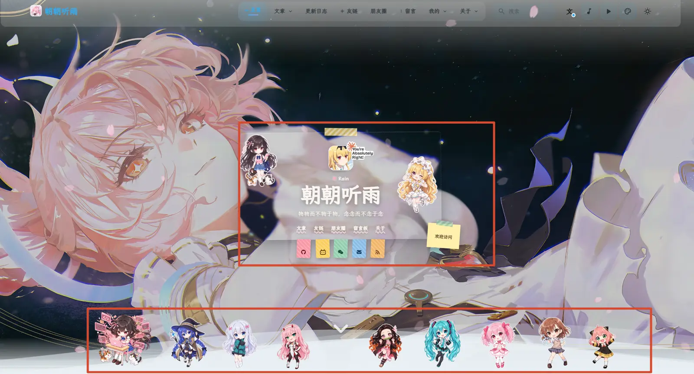
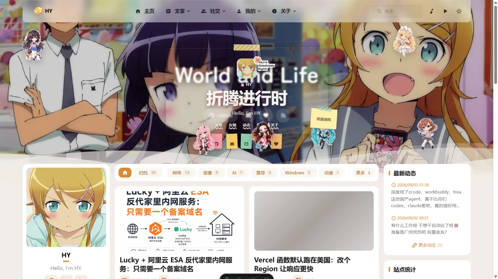
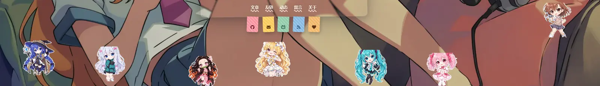
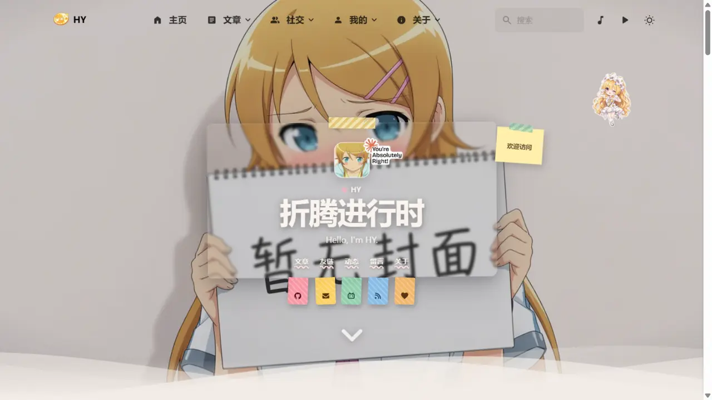
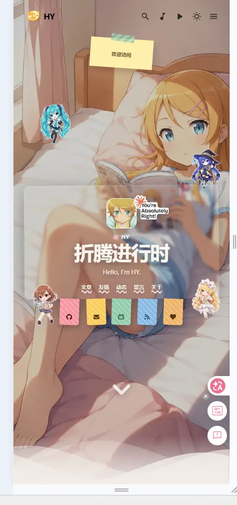
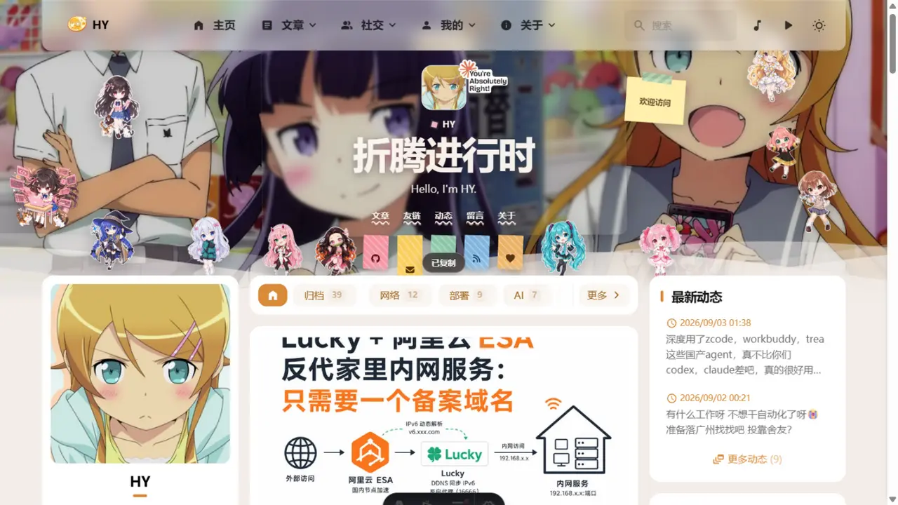

前几天刷到 [rainzt.cn](https://rainzt.cn)，首页是一张虚线框毛玻璃卡片，头顶贴着胶带、头像旁边挂了个 "You're Absolutely Right!" 的小贴纸，底下还有一排 Q 版小人，按住还能拖走。我一瞬间就觉得自己的首页太素了。



更舒服的是，我去翻了翻它的源码仓库 —— ::github{repo="Jarvis0227/Aemeath"}，发现它也是基于 Firefly 二改的。同一种子，那我抄作业的心就更安了。

## 先扒站：仓库里根本没有这套代码

第一反应是去仓库里找实现，结果 `sticker`、`drag` 全搜了一遍，啥都没有。它的 GitHub 仓库落后于线上站，这套装饰层根本没开源进去。

行吧，那就直接扒线上站。`curl` 把首页 HTML 拉下来，grep 一把 `home-wallpaper-sticker`，结构立刻清晰了：

```bash
curl -sL https://rainzt.cn/ -o rainzt.html
grep -o 'class="[^"]*sticker[^"]*"' rainzt.html | sort -u
```

从线上站一共拆出三块料：

1. **卡片 HTML**：一个 `article.home-wallpaper-card`，头像、身份行、标题、副标题、导航、彩色标签，全是语义化标签
2. **CSS**：`home-wallpaper-decor.css`，22KB，从卡片毛玻璃到贴纸投影全带
3. **JS**：一段拖拽脚本，Pointer Events 实现，附带移动端四角随机投放和点击复制 toast

贴纸图片就直接从它站点上下载到自己的 `public/images/home-stickers/`，一共十几张 webp。

## 集成方案：全放新文件，只留一个挂载点

这里我给自己加了个约束：**以后要合并 CuteLeaf/Firefly 上游的更新**。所以这套东西不能像传统魔改那样把主题文件改得到处都是，不然下次合并就是一场战争。

最终的结构是：

```
src/config/homeCardConfig.ts              # 新文件：全部配置
src/components/features/HomeWallpaperDecor.astro   # 新文件：HTML + CSS + JS 全自包含
public/images/home-stickers/              # 新目录：贴纸素材
```

主题文件只动了 `WallpaperSection.astro` 一个，改动是纯增量的一小段：

```diff
+ import HomeWallpaperDecor from "@/components/features/HomeWallpaperDecor.astro";
+ import { homeCardConfig } from "@/config/homeCardConfig";

  const { state, backgroundImages, title, bannerPostMeta } = Astro.props;
+ const homeCardEnabled = homeCardConfig.enable === true;

+ {homeCardEnabled && <HomeWallpaperDecor />}
```

卡片上显示什么也全部收进配置文件，换标题、换社交链接、挪贴纸都不用碰组件：

```ts
export const homeCardConfig = {
  enable: true,
  identity: "HY",
  title: "折腾进行时",
  subtitle: "Hello, I'm HY.",
  navLinks: [
    { name: "文章", url: "/archive/" },
    { name: "友链", url: "/friends/" },
    // ...
  ],
  socials: [
    { name: "GitHub", icon: "fa7-brands:github", url: "https://github.com/hy4962" },
    { name: "Email，点击复制", icon: "fa7-solid:envelope", copy: "admin@9ll.uk" },
    // ...
  ],
  stickers: [
    // top/left 是百分比定位，rotate 是角度，mobile 决定移动端是否显示
    { src: "/images/home-stickers/blonde-idol.webp", name: "金发偶像", top: 18, left: 84, width: 112, rotate: 4, mobile: true },
    // ...
  ],
};
```

以后合并上游，就算 `WallpaperSection.astro` 被改了，冲突也就几行，手工处理一下就完事。

## 显隐方案：不跟 Swup 纠缠，交给 CSS

Firefly 的壁纸区在 Swup 容器外面，切页不重渲染。这意味着装饰层不能依赖"重新渲染时判断是不是首页"，得自己处理显隐。

我最后用的方案是纯 CSS 门控，和主题里滚动指示器的思路一致：

```css
.home-wallpaper-decor {
  opacity: 0;
  visibility: hidden;
  /* ... */
}
html[data-wallpaper-mode="banner"] body.is-home .home-wallpaper-decor,
html[data-wallpaper-mode="fullscreen"] body.is-home .home-wallpaper-decor {
  opacity: 1;
  visibility: visible;
}
```

`body.is-home` 是服务端渲染 + Swup 切页时都会维护的类，`data-wallpaper-mode` 跟着壁纸模式走。这样切去文章页装饰层自动淡出，回到首页自动出现，一行 JS 都不用写。

入场动画则是等所有贴纸图片加载完后给容器加 `is-ready` 类触发，动画播完再用 `animationend` 事件打上 `is-motion-settled` 标记固化终态。另外加了个 `MutationObserver` 盯着 `body` 的 class，每次从别的页面回首页时重播一遍入场动画。

## 贴纸布局：给卡片的可交互区让路

贴纸位置全用百分比，但默认值不能随便摆——卡片居中占了大约 34%~66% 的横向空间，导航链接和社交标签都在卡片下半部，贴纸直接压上去会挡住点击。

所以布局原则很简单：**上半区放两侧，中部贴边，底部一排"站在"波浪线上**。贴纸宽度用了 `min()` 做响应式收缩：

```css
width: min(105px, 5.4688vw, 11.5068vh);
```

移动端更直接：只有配置里 `mobile: true` 的贴纸会显示，由脚本随机投放到卡片两侧的四块区域，每次刷新位置都不一样，便签则自动居中到顶部。

## 踩坑记录

这次踩的坑比写代码的时间还长，值得单独一节。

### 坑 1：默认横幅文字阴魂不散

装饰卡片上线后，"World and Life" 那套默认横幅文字还叠在卡片上。我明明在服务端把 `showHomeText` 关了，HTML 里也确实带着 `hidden` 类——但页面跑起来之后它又出现了。

翻主题源码才发现有个 `syncBannerHomeTextVisibility()`，会在运行时按"是否首页 + 壁纸模式"重新计算并把 `hidden` 类摘掉。它不认识我的卡片，只知道"首页就该显示横幅文字"。



不想去改主题的工具函数，最后用同一条件的 CSS 规则直接压死：

```css
html[data-wallpaper-mode="banner"] body.is-home .banner-home-text-overlay {
  display: none !important;
}
```

这段 CSS 在我的组件里，组件不渲染时它也不存在，卡片关掉就一切恢复原状。

### 坑 2：看不见的卡片盒模型挡住了点击

调试时发现分类栏的"归档"按钮点不动，Playwright 报错说元素被 `article.home-wallpaper-card` 盖住了。卡片是透明的，但盒模型是实打实的，社交标签下方还伸出去一截。

解法是把整个卡片设成 `pointer-events: none`，再只给真正需要交互的子元素恢复：

```css
.home-wallpaper-card { pointer-events: none; }
.home-wallpaper-card__nav a,
.home-wallpaper-card__social-link,
.home-wallpaper-card__avatar-sticker {
  pointer-events: auto;
}
```

### 坑 3：切到 fullscreen 模式，贴纸三连崩

把壁纸模式切成 `fullscreen` 之后怪事来了：贴纸变大了一圈、下半截被裁掉、滚动一下还糊成一团。



查出来是主题在 fullscreen 模式下有针对壁纸容器内**所有** `img` 的规则，一共三条变体，其中最高的一条长这样：

```css
html[data-wallpaper-mode="fullscreen"][data-fullscreen-layout="classic"] #wallpaper-wrapper img {
  width: 100% !important;
  height: 100% !important;
  object-fit: cover !important;
  filter: blur(var(--fullscreen-blur)) !important;
  transform: scale(1.05) !important;
}
```

它的本意是让壁纸图铺满全屏、滚动时渐变模糊，但贴纸图也是 img，全被扫进去了：`cover` 负责裁切，`scale(1.05)` 负责放大，`blur` 负责糊脸，三个症状一次凑齐。

修法是在我自己的组件里加更高特异性的豁免规则。主题那条是 `(1,2,2)`，我借自己容器的类提到 `(1,3,2)`：

```css
html[data-wallpaper-mode="fullscreen"] #wallpaper-wrapper .home-wallpaper-decor .home-wallpaper-sticker img {
  width: 100% !important;
  height: auto !important;
  object-fit: contain !important;
  filter: none !important;
  transform: none !important;
}
```



### 坑 4：!important 大战之下，拖拽失效了

修上面这个的时候又埋了个雷：`transform: none !important` 把头像小贴纸的拖拽也废了——JS 拖拽写的是内联 `style.transform`，在内联样式里 `!important` 之外，任何样式表的 `!important` 都能把它按在地上摩擦。

解法是拖拽位移不走 `style.transform`，改写 CSS 变量：

```css
.home-wallpaper-card__avatar-sticker {
  transform: translate(var(--avatar-sticker-tx, 0px), var(--avatar-sticker-ty, 0px));
}
```

```js
// fullscreen 下也照样能拖
sticker.style.setProperty("--avatar-sticker-tx", `${translateX}px`);
sticker.style.setProperty("--avatar-sticker-ty", `${translateY}px`);
```

变量赋值是内联的，规则里带 `!important` 的 `transform` 引用的还是这份值，两边不打架。

## 效果

移动端只保留四张贴纸，随机撒在卡片两侧，便签居中到顶部：



拖拽是按下即拖，Pointer Events 鼠标触屏通用，位置限制在壁纸范围内，点击邮箱标签会弹"已复制"的 toast：



刷新后贴纸会回到初始位置，这点是故意的——位置记忆听着美好，但访客拖乱之后就再也回不去了，参考站也是这么做的。

## 极简流程

1. `curl` 抓参考站 HTML，拿到卡片结构、CSS、拖拽 JS 三块料，贴纸图下载到 `public/images/home-stickers/`
2. 新建 `src/config/homeCardConfig.ts`，卡片内容和贴纸位置全配置化
3. 新建 `src/components/features/HomeWallpaperDecor.astro`，HTML/CSS/JS 自包含
4. `WallpaperSection.astro` 里加一个挂载点，同时把 `showHomeText` 短路掉
5. 显隐交给 `body.is-home` + `data-wallpaper-mode` 的 CSS 门控
6. 踩坑修复：压默认文字、放开卡片点击、fullscreen 豁免、CSS 变量拖拽

## 写在最后

这次最值得记的其实不是贴纸本身，而是"合并友好"这个约束：所有逻辑收进两个新文件，主题只留一个挂载点，连踩坑修复都尽量用自己组件里的高优先级规则去覆盖，而不是直接改主题源码。以后上游更新合并过来，该是啥样还是啥样。

贴纸素材目前用的还是 rainzt 的演示图，都是常见的动漫 Q 版贴纸，想换成自己的图直接丢进 `public/images/home-stickers/` 改下配置就行。下一步打算把贴纸换成一套自己喜欢的角色，再看看要不要给 fullscreen 模式单独配一套贴纸位置。
