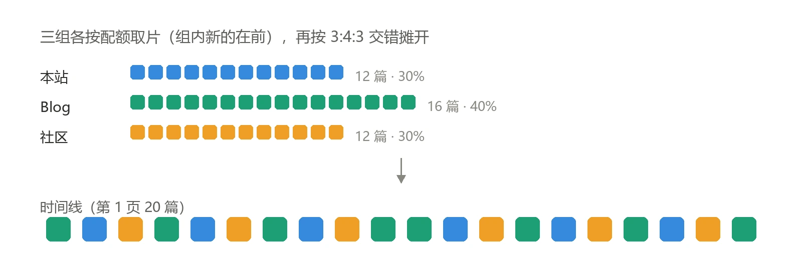

[朋友圈](/posts/blog/friendsmoments/)上线才几天，我自己刷着刷着就发现不对劲：那条时间线翻下去，前排几乎全是博友圈、八零圈、BlogsClub 这几个聚合站，我自己和几个真正在写博客的朋友被挤到后面几页去了。

上一篇写朋友圈的时候我压根没管展示顺序，就是所有来源合流、按发布时间倒序一把排下来。当时觉得挺合理——朋友圈嘛，谁更新得近谁在前。

真跑起来才发现这套逻辑有个硬伤：**聚合站的更新频率是个人博客的几十倍。** 博友圈那种站点天天在爬别人的新文章，时间永远是新鲜的；而霞の葉間 上一次发文还是五月底。按时间排，聚合站天然霸榜。

## 先怀疑随机池，结果不是它的锅

我第一反应是「随机推荐的比例没配好」。毕竟页面顶部那张「随机一篇文章」的卡片就是随机抽的，所以我先去把随机池数了一遍：

| 标签 | 友链 | 篇数 | 占比 |
|---|---|---|---|
| Blog | 折腾进行时（本站）、夏夜流萤、霞の葉間、UpXuu、朝朝听雨 | 30 | 62.5% |
| 博客社区 | 博友圈、八零圈、BlogsClub | 18 | 37.5% |

池子一共 48 篇，**本身就是 6:4**，跟我想配的比例几乎一样。随机卡片那边根本没问题。

问题在排序。我把时间线按展示顺序拉出来一看，第一页 20 篇里 14 篇是社区，**70%**。这就对上了——我看到的「社区占比过大」，是排序排出来的观感，不是数据分布。

> [!NOTE] 这轮最有价值的一条
> 看到「占比不对」，别急着调权重。先分清是**池子的分布**不对，还是**展示的顺序**不对。这两件事的修法完全不同。

## 定配比：本站 3 成、Blog 4 成、社区 3 成

想清楚之后配比就好定了。我把自己也加进了友链（`siteurl` 指向本站 + `rss: "/rss.xml"`），所以时间线里其实有三类东西：我自己的、带 `Blog` 标签的友链、带 `博客社区` 标签的聚合站。

那就把本站单独拎出来算一组，剩下按标签分：

```ts
mix: [
  { key: "own", weight: 30 },
  { key: "Blog", weight: 40 },
  { key: "博客社区", weight: 30 },
],
```

`own` 是保留字，按 `siteConfig.site_url` 匹配；其余的值直接按友链的 `tags` 匹配，数组顺序同时决定优先级。

## 第一步：先把取文上限提上去

第一个坑来得很快。

抓取逻辑里我写死了「每个友链最多取 6 篇」。这在原来的设计里没毛病，反正所有来源一视同仁。但配上比例就出事了：**本站只有一个源，最多只能贡献 6 篇。** 40 篇里要占 3 成是 12 篇，6 篇怎么凑都凑不出来。

我顺手数了一遍各家的供给量——本站 RSS 里有 44 篇可用，根本不是没货，是我自己把口子卡住了。

所以把上限提到 12，并且让它从配置里读，不再写死在代码里。

## 第二步：排序不能是纯时间倒序

这是这轮唯一一次方案翻车。

第一版我想得很简单：按比例分配名额、各组取自己最新的几篇、最后**整体按时间倒序**排一下。听起来没毛病，总数也能对上，可第一页还是被聚合站霸占。

原因很直白：**配额只约束了总量，约束不了顺序。** 社区组总共就 12 篇，但博友圈那几篇时间最新，倒序一排全跑到最前面去了。总量对了，观感照旧。

第二版换成**按配比交错**：每一步都挑「当前实际落后目标比例最多」的那一组，取它的下一篇。组内仍然是新的在前，组与组之间是均匀摊开的。



排出来基本是个三拍循环，中间偶尔连出两个 Blog 把 40% 凑够：

```text
Blog 本站 社区 │ Blog 本站 社区 │ Blog 本站 社区 │ Blog Blog 本站 社区 │ Blog 本站 社区 │ Blog 本站 社区 │ Blog
```

## 第三步：顺手删掉一段旧逻辑

改到一半发现页面顶上那张随机卡片里，我自己埋过一段「20% 概率优先抽本站」的代码。

当时的想法是给自己一点曝光。但现在配比已经在池子里分好组了，这段逻辑等于在配置之上又叠了一层倾斜——本站实际命中率被压到 20%，跟配置里的 3 成对不上。

同一个地方叠两层倾斜，最后谁大谁小根本算不清。删掉，让随机卡片老老实实在配好的池子里等概率抽。

## 最后看看效果

配比全部收在新加的一个配置文件里（只新增文件，没碰主题源码）：

```ts
export const momentsFeedConfig: MomentsFeedConfig = {
  // 时间线展示多少篇。页面每 20 篇一页，填 40 正好两页
  displayLimit: 40,

  // 每个友链最多抓几篇。本站只有一个源，这个值太小就凑不出 3 成
  maxItemsPerFriend: 12,

  mix: [
    { key: "own", weight: 30 },
    { key: "Blog", weight: 40 },
    { key: "博客社区", weight: 30 },
  ],

  layout: "balanced",
};
```

构建完扒了一眼产物：

| | 本站 | Blog | 博客社区 |
|---|---|---|---|
| 整体（40 篇） | 12（30%） | 16（40%） | 12（30%） |
| 第 1 页（20 篇） | 6（30%） | 8（40%） | 6（30%） |
| 第 2 页（20 篇） | 6（30%） | 8（40%） | 6（30%） |

每一页都是 3:4:3，翻页不会突然变成聚合站专场。

`layout` 我留了三个值，想改回纯时间倒序就把 `balanced` 换成 `chronological`——配比还在，代价是第一页又会变回聚合站霸榜，`shuffle` 则是完全打乱。

## 踩坑记录

**一、聚合站天然的「新鲜度优势」，是任何时间排序都绕不过去的。**
只要有站点在频繁聚合别人的文章，按时间排它一定占前排。要么接受，要么改成配额制，没有第三条路。

**二、配额是上限，不是保底。**
某一组文章不够，空出来的名额会补给其他还有余量的组，不会凭空造文章。所以哪天本站没更新，那天的实际比例就会偏，这是预期行为，不是 bug。

**三、删掉自己写的旧逻辑比想象中难。**
见上面第三步。功能越叠越多的时候，最该检查的就是「我是不是在同一个地方倾斜了两次」。

## 还没解决的

现在的组内策略是「取最新的 N 篇」，所以 Blog 组那 16 篇名额被更新勤快的站占满了。表现是：**夏夜流萤、霞の葉間 因为几个月没更新，一篇都没进时间线**，8 个来源实际只出现 6 个。

这算不算问题其实见仁见智——朋友圈本来就是看「最近谁写了什么」，几个月没动静的站被挤出去也说得过去。但如果你希望每个友链都能露脸，那就得把组内挑选从「按时间取最新」换成「按友链轮询」，每站轮流上。

先跑一阵子看看，不急。
