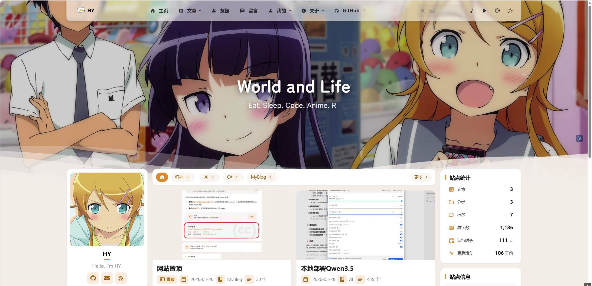
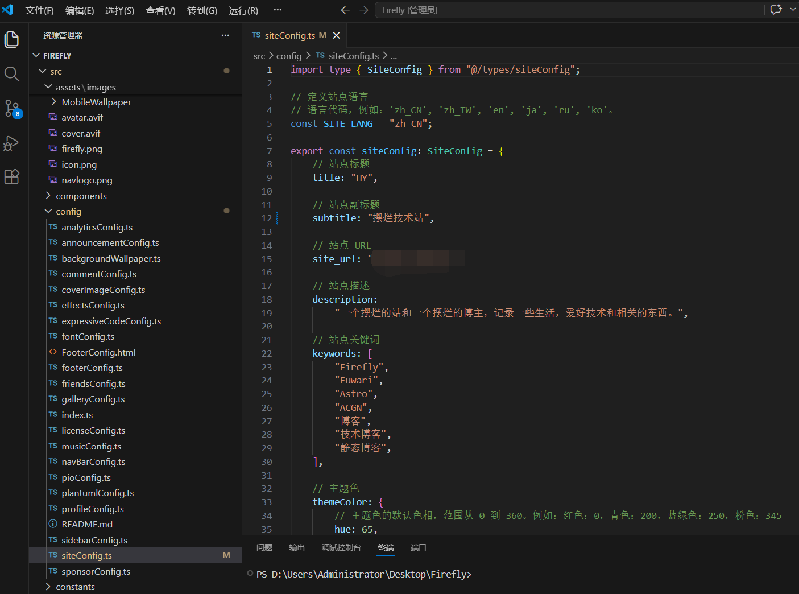

上一篇我讲了怎么从零搭建 Firefly 博客，从 Fork 仓库到 Vercel 部署，最后博客上线了。

但上线只是开始。

默认的博客标题是"Firefly"，副标题是"Demo site"，主题色是绿色，页面宽度、卡片样式全都是默认值。跟别人的博客长得一模一样，没啥意思。

所以今天这篇文章，我就来聊聊怎么改配置，让博客变成你自己的风格。

<!-- more -->



## 配置文件都在哪

Firefly 的所有配置文件都在 `src/config/` 目录下。打开你的项目，找到这个文件夹，里面一堆 `.ts` 文件，每个文件管一块功能。

主要的配置文件有这些：

- `siteConfig.ts` — 站点基础配置（标题、描述、主题色、页面宽度等）
- `profileConfig.ts` — 个人资料（头像、昵称、简介、社交链接）
- `navBarConfig.ts` — 顶部导航栏
- `sidebarConfig.ts` — 侧边栏布局
- `commentConfig.ts` — 评论系统
- `fontConfig.ts` — 字体配置
- `musicConfig.ts` — 音乐播放器

看起来挺多的，其实不用一次全改。先把 `siteConfig.ts` 搞定，其他的以后慢慢调。

## siteConfig.ts：最核心的配置文件

这个文件管着整个站点的基本信息。打开 `src/config/siteConfig.ts`，你会看到类似这样的结构：



```typescript
export const siteConfig: SiteConfig = {
  title: "折腾进行时",
  subtitle: "你的域名",
  site_url: "https://你的域名,
  description: "生命不息，折腾不止！一个技术博客？",
  // ...
};
```

### 站点标题和副标题

`title` 是浏览器标签页上显示的名字，也是搜索引擎抓取的标题。`subtitle` 一般显示在首页或者导航栏上。

这两个改成你自己的就行。比如：

```typescript
title: "我的小破站",
subtitle: "随便写写",
```

### 站点 URL

`site_url` 这个一定要改。它影响 sitemap 和 RSS 生成的地址。如果你的域名是 `blog.example.com`，就填 `https://blog.example.com`。

别忘了加 `https://`，也别加末尾的 `/`。

### 主题色

Firefly 支持自定义主题色。`themeColor.hue` 是色相值，范围 0-360。

几个常用的：

- 红色：0
- 绿色：120
- 青色：200
- 蓝绿色：250
- 粉色：345

我之前试过 165，是个不错的青绿色。现在改成 65，偏黄一点，看起来更温暖。

`defaultMode` 控制默认是亮色还是暗色模式：

- `"light"` — 亮色
- `"dark"` — 暗色
- `"system"` — 跟随系统

我选了 `"system"`，让浏览器自动决定。

### 页面宽度

`pageWidth` 控制整个页面的最大宽度，单位是 `rem`。默认 100，数值越大页面越宽。

如果你觉得内容区域太窄，可以调大一点，比如 120。但太宽了反而不好看，特别是单栏布局的时候。

### 卡片样式

```typescript
card: {
  border: true,
  followTheme: true,
},
```

`border` 控制卡片有没有边框和阴影。开了之后文章卡片会有点立体感。

`followTheme` 让卡片背景在浅色模式下跟随主题色。这个看你喜好，我开了之后觉得还挺协调的。

## 页面开关

Firefly 有很多页面功能，比如友链、打赏、相册这些。在 `siteConfig.ts` 的 `pages` 对象里可以控制开关：

```typescript
pages: {
  friends: true,    // 友链页面
  sponsor: true,    // 打赏页面
  guestbook: true,  // 留言板
  bangumi: true,    // 番组计划（追番）
  gallery: true,    // 相册
  dynamic: true,    // 动态页面
},
```

设成 `false` 就会隐藏对应的导航入口，访问那个页面会 404。

我一开始把 `guestbook` 关了，因为还没配评论系统。后来配好 Waline 之后又打开了。

## 文章列表布局

这个挺有意思的。`postListLayout` 控制文章列表怎么显示：

```typescript
postListLayout: {
  defaultMode: "list",      // 默认列表模式
  mobileDefaultMode: "grid", // 移动端用网格模式
  descriptionLines: 2,       // 摘要显示2行
  tagsPosition: "bottom",    // 标签显示在底部
},
```

`defaultMode` 有两个选择：`"list"` 是单列列表，`"grid"` 是多列网格。我用了 `"list"`，在桌面端看比较舒服。

`mobileDefaultMode` 是移动端的默认布局。我设了 `"grid"`，手机上看起来更紧凑。

`tagsPosition` 控制标签显示位置。设成 `"bottom"` 的话标签会显示在卡片底部，替代统计数据的位置。

### 文章卡片信息控制

下面还有 `meta` 和 `stats` 两个对象，控制文章卡片上显示哪些信息：

```typescript
meta: {
  showPublished: true,  // 发布日期
  showCategory: true,   // 分类
  showTags: true,       // 标签
  showWords: true,      // 字数
  showReadingTime: false, // 阅读时间
},
```

我关掉了 `showReadingTime`，因为觉得字数已经够了，再显示阅读时间有点冗余。

## 其他重要配置

### profileConfig.ts：个人资料

这个文件管你的头像、昵称、简介和社交链接。打开 `src/config/profileConfig.ts`：

```typescript
export const profileConfig: ProfileConfig = {
  avatar: "./avatar.webp",
  name: "你的名字",
  bio: "你的简介",
  socialLinks: [
    // 社交链接配置
  ],
};
```

`avatar` 放你的头像图片路径。图片可以放在 `public/` 目录下，也可以放在 `src/assets/` 下（后者会自动优化）。

### navBarConfig.ts：导航栏

导航栏的配置在这个文件里。可以设置导航链接、Logo、是否全宽等。

我比较喜欢全宽导航栏，所以设了 `widthFull: true`。

### fontConfig.ts：字体

Firefly 支持自定义字体。你可以用 Google Fonts、Fontsource，或者本地字体。

但说实话，默认字体已经挺好看了，我暂时没改。

### commentConfig.ts：评论系统

这个文件管评论系统的配置。Firefly 支持 Twikoo、Waline、Giscus、Artalk 等。

我之前写过一篇 [搭建 Waline 评论系统](/posts/deploy/deploywaline/) 的文章，里面有详细配置。

### musicConfig.ts：音乐播放器

如果你想在博客里加背景音乐，可以配置这个文件。支持 Meting API（在线音乐）和本地音乐。

我暂时没开，怕影响加载速度。

## 怎么测试配置效果

改完配置后，本地跑一下就能看到效果：

```bash
pnpm dev
```

浏览器打开 `http://localhost:4321`，刷新就能看到新的配置。

改主题色、页面宽度这些，刷新就能看到。改导航栏、侧边栏这些，可能需要重启一下开发服务器。

我一般改完配置会跑一下 `pnpm build`，确保没有语法错误。如果构建失败了，报错信息会告诉你哪个文件哪一行有问题。

## 踩坑记录

### site_url 没改导致的问题

我一开始忘了改 `site_url`，结果 sitemap 生成的地址是默认的 `https://firefly.cuteleaf.cn`。提交给 Google Search Console 的时候，验证一直不通过。

后来才发现是这个配置没改。改完重新构建就好了。

### 图片路径搞混

Firefly 支持两种图片路径：`public/` 目录下的和 `src/` 目录下的。

`public/` 下的图片不经过优化，直接复制到构建输出。`src/` 下的图片会自动压缩、转换格式。

我一开始把头像放在 `public/` 下，结果加载比较慢。后来移到 `src/assets/` 下，构建时自动压缩了，加载快了不少。

### 主题色改了但没生效

有次改了 `themeColor.hue`，刷新页面发现没变化。后来发现是浏览器缓存的问题。清一下缓存或者用无痕模式就能看到。

## 配置参考

配置文件挺多的，不可能一次全记住。官方文档写得比较全：[Firefly 站点配置](https://docs-firefly.cuteleaf.cn/zh/guide/site.html)

我建议先把 `siteConfig.ts` 搞定，其他的用到了再去文档里查。每个配置项都有注释，看着改就行。

## 写在后面

配置这个东西，其实不用一次全改完。

先把基本的改了，标题、副标题、主题色这些。其他的用到了再慢慢调。反正改配置又不花钱，多试几次就知道什么好看了。

说实话，折腾配置本身也是种乐趣。看着自己的博客一点点变成想要的样子，还挺有成就感的。

后面我可能会写一篇关于自定义 CSS 样式的文章，让博客变得更不一样。如果你也想折腾，可以关注一下。

有问题的话直接在评论区问，我看到了会回复。

---

*写于 2026 年 7 月，折腾 Firefly 博客配置的记录*
