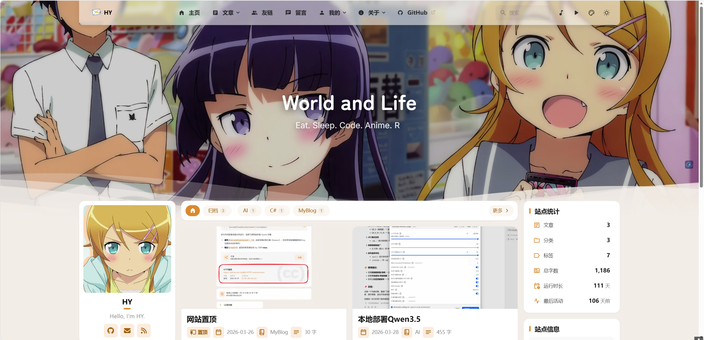
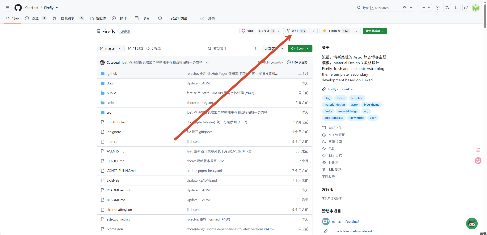
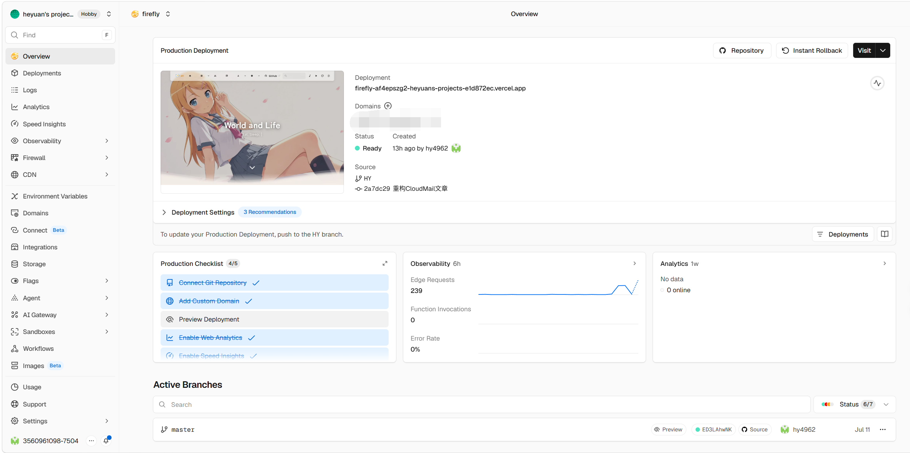
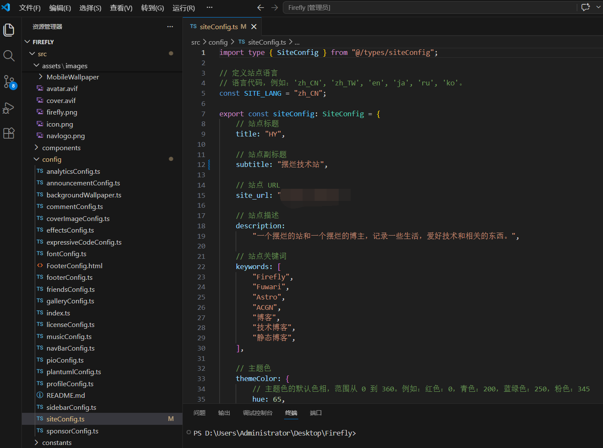

很多人想搭一个自己的博客，但真正开始的时候才发现：

买服务器麻烦。

配环境麻烦。

搭数据库麻烦。

甚至只是把文章显示出来，都要折腾半天。

其实现在很多博客已经不需要服务器了。Astro 这类静态博客框架，写完文章后直接生成网页文件，丢到 Vercel、Cloudflare Pages 这类平台上就能跑。不用管服务器，不用装数据库，免费额度对个人博客也够用。


我选择 Firefly 的原因很简单：它基于 Astro，速度快，而且默认设计已经比较完整。不需要自己从零写主题，稍微改改配置，就能变成一个属于自己的博客。


今天就记录一下我自己部署 Firefly 博客主题时整理的一套流程。Firefly 是一个基于 Astro 的博客主题，支持暗色模式、评论系统、全文搜索这些功能，样式也挺好看。下面以 Vercel 为例，从零开始讲怎么把它跑起来。

<!-- more -->



## 一、Fork 仓库

打开 Firefly 的 GitHub 仓库：[CuteLeaf/Firefly](https://github.com/CuteLeaf/Firefly)

页面右上角有个 **Fork** 按钮，点一下。



弹出的页面里 **Repository name** 可以改成你喜欢的名字，比如 `my-blog`，然后点 **Create fork**。等几秒钟仓库就到你账号下了。浏览器地址栏变成 `https://github.com/你的用户名/my-blog` 就说明成功了。

Fork 比下载压缩包好的地方在于：后面作者更新了代码，你的仓库页面上会出现 **Sync fork** 按钮，点一下就能同步最新版本。

## 二、注册 Vercel 并导入项目

打开 [vercel.com](https://vercel.com/)，点 **Sign Up**，选 **Continue with GitHub**，用 GitHub 账号登录。

登录后进入 Dashboard，右上角点 **Add New...** → **Project**。

Vercel 会列出你 GitHub 账号下所有的仓库。找到刚才 Fork 的那个，点 **Import**。

如果列表里没看到，点页面上的 **Adjust GitHub App Permissions**，授权 Vercel 访问那个仓库，回来刷新就有了。

导入之后进入配置页面，Vercel 会自动识别 Astro 框架。确认这几个参数：

- **Build Command**: `pnpm build`
- **Output Directory**: `dist`
- **Install Command**: `pnpm install`

一般 Vercel 会自动填好，检查一下没问题就点 **Deploy**。

## 三、等构建完成

点完 Deploy，Vercel 开始构建。页面上会显示四个阶段：

1. **Cloning** — 拉代码
2. **Installing** — 安装依赖包
3. **Building** — 编译。这一步最慢，要处理图片、生成搜索索引，大概一两分钟
4. **Finalizing** — 收尾

构建成功后页面会跳转，显示 **Congratulations**，上面有你的博客地址，格式大概是 `https://my-blog-xxxxx.vercel.app`。点开就能看到博客了。



如果构建失败了，点 **Building** 旁边的 **View logs** 看报错。最常见的是 Node.js 版本太低——Firefly 要求 22 以上。去项目的 **Settings → General → Node.js Version**，改成 `22.x`，保存后回到 **Deployments** 点 **Redeploy** 就行。

## 四、绑定自定义域名

默认的 `my-blog-xxxxx.vercel.app` 能用，但你多半想用自己的域名。

在项目的 **Settings → Domains**，输入你的域名（比如 `blog.example.com`），点 **Add**。Vercel 会根据你的域名类型提示对应 DNS 记录，按照页面提示添加即可。

域名在哪里买的就去哪里加。阿里云搜「云解析 DNS」，腾讯云搜「DNSPod」，Cloudflare 在域名的 DNS 设置页。

加完回到 Vercel 等一两分钟，点 **Refresh**。验证通过后 Vercel 会自动申请 HTTPS 证书。

## 五、改站点配置

博客上线了，但标题、副标题还是默认值。

这些在 `src/config/siteConfig.ts` 里改：

```ts
export const siteConfig: SiteConfig = {
  title: "你的博客名",
  subtitle: "你的副标题",
  site_url: "https://你的域名",
};
```



`site_url` 一定要改成你实际的域名，不然 sitemap 和 RSS 生成的地址会是错的。

其他配置文件都在 `src/config/` 目录下：

- `profileConfig.ts` — 头像、简介、社交链接
- `navBarConfig.ts` — 顶部导航栏
- `sidebarConfig.ts` — 侧边栏
- `commentConfig.ts` — 评论系统（支持 Twikoo、Waline、Giscus，这个之后我有详细的搭建，也是vercel或者cf workers）

具体怎么改看 [Firefly 官方文档](https://docs-firefly.cuteleaf.cn/zh/guide/getting-started.html)，写得比较全。

改完怎么生效？往下看。

## 六、写文章，push 就发布

这是你后面用得最多的操作。有两种方式，看你习惯哪种。

### 方式一：直接在 GitHub 网页上写（不需要装任何东西）

所有操作都在浏览器里完成：

1. 打开你的 GitHub 仓库，进入 `src/content/posts/` 目录
2. 点 **Add file → Create new file**
3. 文件名填 `我的第一篇文章/index.md`（斜杠前面是文件夹名，GitHub 会自动创建）
4. 写内容：

```md
---
title: 我的第一篇文章
published: 2026-07-15
description: 这是一篇测试文章
tags: [测试, 博客]
category: 日常
---

正文内容。支持 Markdown 语法。
```

5. 页面底部填个提交信息，点 **Commit changes**

提交之后回到 Vercel Dashboard，它已经开始自动构建了。等一两分钟，新文章就上线了。

上传配图的话，在同一个文件夹里点 **Add file → Upload files**，把图片拖进去。在文章里用 `` 引用。

### 方式二：本地编辑，push 到 GitHub（推荐）

经常写文章的话建议装本地环境，用自己顺手的编辑器写。

**装环境（一次性）：**

1. 装 [Node.js](https://nodejs.org/) 22.x 版本
2. 打开终端（Windows 搜 PowerShell，Mac 搜终端），运行 `npm install -g pnpm`
3. 装 [Git](https://git-scm.com/)
4. 终端里运行 `git clone https://github.com/你的用户名/my-blog.git`

**日常流程：**

1. 在 `src/content/posts/` 下新建文件夹，写 `index.md`
2. 想预览效果就跑 `pnpm dev`，浏览器打开 `http://localhost:4321`
3. 写好之后：

```bash
git add .
git commit -m "新增一篇文章"
git push
```

Push 上去，Vercel 自动构建，一两分钟后新文章上线。不需要登录 Vercel，不需要手动触发任何东西。

用 VS Code 的话更方便，左侧栏有 Git 按钮，点一下就能提交推送。

## 七、自动部署是怎么回事

你 push 代码到 GitHub，Vercel 怎么知道的？

导入仓库的时候，Vercel 会在你的 GitHub 仓库里装一个 Webhook。每次你 push 代码到主分支，GitHub 通知 Vercel，Vercel 自动拉代码、构建、部署。你什么都不用做。

还有个有用的功能：新建分支 push 上去的话，Vercel 会给这个分支生成一个预览地址（Preview Deployment），主分支不受影响。不确定改动效果的时候，先在分支上试试。

## 总结

日常写博客的流程就四步：

1. 在 `src/content/posts/` 下写文章
2. Push 到 GitHub（或者在 GitHub 网页上直接提交）
3. Vercel 自动构建，等一两分钟
4. 新文章上线

买服务器、配 Nginx、搞 HTTPS 这些全不用管。写完推上去就好了。


后面**我还会继续记录 Firefly 的一些配置，比如评论系统、Umami 网站统计、自定义主题修改等**。如果你也喜欢折腾自己的小网站，可以一起交流。

有不懂的问题**直接在评论区问**