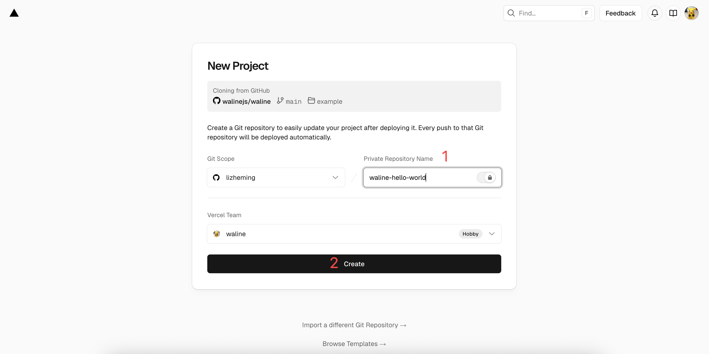
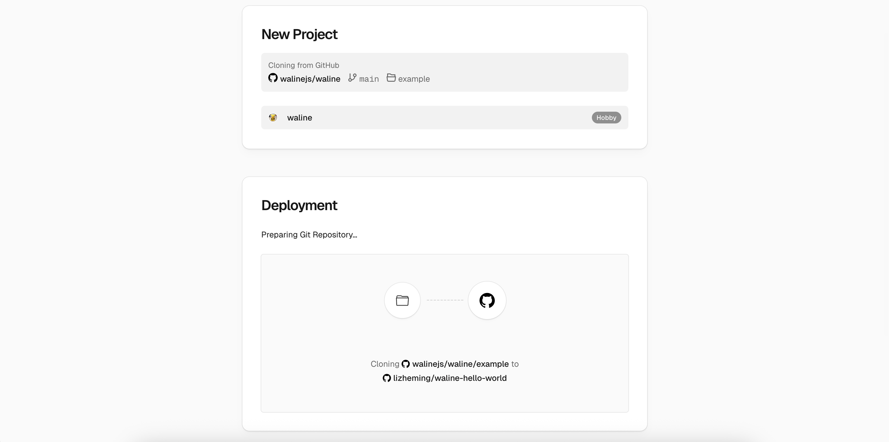
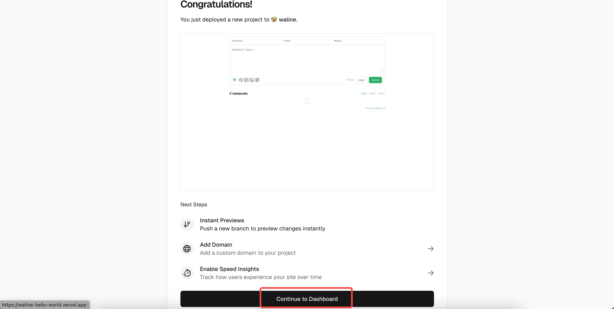
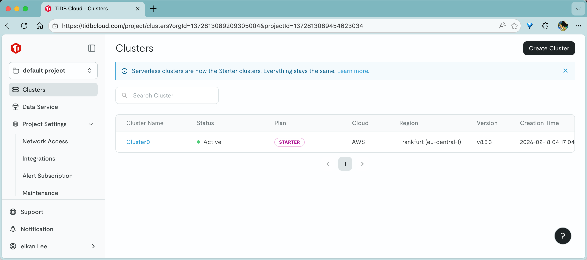
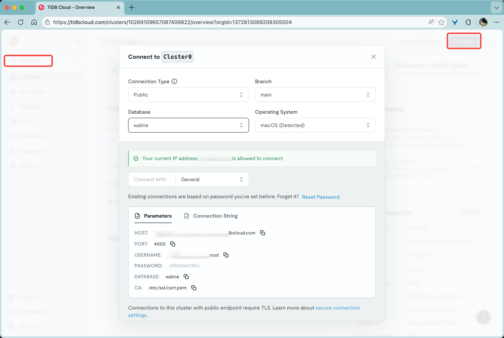

有次在别人的博客上看到 Waline，去 GitHub 一查，发现它支持多数据库、能自己部署、还能统计浏览量，功能挺全的。关键是它开源，数据自己掌控，我就想着搞一个试试。

## 为什么选 TiDB 而不是 Neon

Waline 官方的 Vercel 部署教程默认用 Neon（PostgreSQL），免费给 512MB。但我查了一下 TiDB Cloud，免费额度有 5GB，差了十倍。对于评论系统来说数据库不会太大，但 5GB 总比 512MB 舒服，以后万一要存点浏览量数据也不用担心。

TiDB 本身是兼容 MySQL 协议的 NewSQL 数据库，Waline 直接支持 TiDB 作为后端，不用额外折腾。所以我就决定用 Vercel + TiDB 这个组合。

## 第一步：部署 Vercel 服务端

Waline 官方提供了一键部署的按钮，点一下就行。

[](https://vercel.com/new/clone?repository-url=https%3A%2F%2Fgithub.com%2Fwalinejs%2Fwaline%2Ftree%2Fmain%2Fexample)

点击上面的按钮，会跳转到 Vercel。如果你还没登录，它会让你用 GitHub 账号注册或登录。

登录之后，给你的项目起个名字，比如 `my-waline`，然后点 `Create`。



Vercel 会基于 Waline 模板自动创建一个仓库，大概一两分钟就能部署好。



部署成功后会有一屏烟花，点 `Go to Dashboard` 进入控制台。



到这里服务端代码就部署好了，但还没连数据库，所以先别急着用。

## 第二步：创建 TiDB 数据库

这一步是整个过程中最核心的，也是跟官方教程不一样的地方。

### 注册 TiDB Cloud

去 [TiDB Cloud](https://tidbcloud.com) 注册一个账号。注册完之后会自动创建一个 TiDB 实例，不用手动配置。

### 创建表结构

登录后点进你的实例（默认叫 `cluster0`），左侧选 `SQL Editor`。



接下来要执行建表语句。Waline 官方提供了一个 SQL 文件，但那个是 PostgreSQL 格式的。TiDB 用的是 MySQL 兼容语法，需要用 [waline.tidb](https://github.com/walinejs/waline/blob/main/assets/waline.tidb) 这个文件。

SQL 文件的内容大概是这样的：

```sql
CREATE DATABASE `waline`;

USE waline;

CREATE TABLE `wl_Comment` (
  `id` int unsigned NOT NULL AUTO_INCREMENT,
  `user_id` int DEFAULT NULL,
  `comment` text,
  `insertedAt` timestamp NULL DEFAULT CURRENT_TIMESTAMP,
  `ip` varchar(100) DEFAULT '',
  `link` varchar(255) DEFAULT NULL,
  `mail` varchar(255) DEFAULT NULL,
  `nick` varchar(255) DEFAULT NULL,
  `pid` int DEFAULT NULL,
  `rid` int DEFAULT NULL,
  `sticky` boolean DEFAULT NULL,
  `status` varchar(50) NOT NULL DEFAULT '',
  `like` int DEFAULT NULL,
  `ua` text,
  `url` varchar(255) DEFAULT NULL,
  `createdAt` timestamp NULL DEFAULT CURRENT_TIMESTAMP,
  `updatedAt` timestamp NULL DEFAULT CURRENT_TIMESTAMP,
  PRIMARY KEY (`id`)
) CHARSET=utf8mb4;

CREATE TABLE `wl_Counter` (
  `id` int unsigned NOT NULL AUTO_INCREMENT,
  `time` int DEFAULT NULL,
  `reaction0` int DEFAULT NULL,
  `reaction1` int DEFAULT NULL,
  `reaction2` int DEFAULT NULL,
  `reaction3` int DEFAULT NULL,
  `reaction4` int DEFAULT NULL,
  `reaction5` int DEFAULT NULL,
  `reaction6` int DEFAULT NULL,
  `reaction7` int DEFAULT NULL,
  `reaction8` int DEFAULT NULL,
  `url` varchar(255) NOT NULL DEFAULT '',
  `createdAt` timestamp NULL DEFAULT CURRENT_TIMESTAMP,
  `updatedAt` timestamp NULL DEFAULT CURRENT_TIMESTAMP,
  PRIMARY KEY (`id`)
) CHARSET=utf8mb4;

CREATE TABLE `wl_Users` (
  `id` int unsigned NOT NULL AUTO_INCREMENT,
  `display_name` varchar(255) NOT NULL DEFAULT '',
  `email` varchar(255) NOT NULL DEFAULT '',
  `password` varchar(255) NOT NULL DEFAULT '',
  `type` varchar(50) NOT NULL DEFAULT '',
  `label` varchar(255) DEFAULT NULL,
  `url` varchar(255) DEFAULT NULL,
  `avatar` varchar(255) DEFAULT NULL,
  `github` varchar(255) DEFAULT NULL,
  `twitter` varchar(255) DEFAULT NULL,
  `facebook` varchar(255) DEFAULT NULL,
  `google` varchar(255) DEFAULT NULL,
  `weibo` varchar(255) DEFAULT NULL,
  `qq` varchar(255) DEFAULT NULL,
  `oidc` varchar(255) DEFAULT NULL,
  `2fa` varchar(32) DEFAULT NULL,
  `createdAt` timestamp NULL DEFAULT CURRENT_TIMESTAMP,
  `updatedAt` timestamp NULL DEFAULT CURRENT_TIMESTAMP,
  PRIMARY KEY (`id`)
) CHARSET=utf8mb4;
```

注意一点：TiDB Cloud 的 SQL Editor 每次只能执行一条语句。所以你得按 `;` 分隔，一句一句贴进去执行。每贴一句，点右上角的蓝色运行按钮，或者按 `Ctrl+Enter`（Mac 上是 `Cmd+Enter`）。


三张表都创建好之后，数据库就准备完了。

### 获取连接信息

点左侧的 `Overview` 回到首页，右上角有个 `Connect` 按钮，点进去获取连接配置。

Connect with 选 `General`，然后点 `Reset password` 生成一个新密码。



你需要记下这几个信息：

- **Host**：类似 `xxx.ap-southeast-1.tidbcloud.com`
- **Port**：默认 `4000`
- **User Name**：一般是 `xxx.root`
- **Password**：刚才生成的那个
- **Database**：`waline`

## 第三步：给 Vercel 配置数据库

回到 Vercel 的项目控制台，点顶部的 `Settings`，然后找到左侧的 `Environment Variables`。

点右上角的 `Add Environment Variable`，依次添加以下五个变量：

| 变量名 | 值 | 说明 |
|--------|-----|------|
| `TIDB_HOST` | `xxx.ap-southeast-1.tidbcloud.com` | TiDB 的 Host 地址 |
| `TIDB_PORT` | `4000` | TiDB 端口 |
| `TIDB_DB` | `waline` | 数据库名 |
| `TIDB_USER` | `xxx.root` | 用户名 |
| `TIDB_PASSWORD` | `你生成的密码` | 密码 |


填完之后，去 `Deployments` 页面，点最新一次部署右边的 `Redeploy` 按钮，让环境变量生效。


等部署状态变成 `Ready` 之后，点 `Visit` 就能看到你的 Waline 服务了。


这个地址就是你的服务端地址，后面客户端接入要用到。

## 第四步：绑定自定义域名（可选）

如果你不想用 Vercel 默认的域名，可以绑自己的域名。

点 `Settings` → `Domains`，输入你想绑定的域名，点 `Add`。


然后去你的域名服务商那里，添加一条 CNAME 记录：

| Type | Name | Value |
|------|------|-------|
| CNAME | example | cname.vercel-dns.com |

`example` 是你子域名的部分，比如你想用 `comment.yourdomain.com`，就填 `comment`。

等 DNS 生效后，你的评论系统地址就变成了 `comment.yourdomain.com`，管理后台在 `comment.yourdomain.com/ui`。


## 第五步：在网站里接入评论

服务端搞定了，最后一步是在你的网站里引入 Waline 客户端。

在 HTML 里加上这几行：

```html
<head>
  <link rel="stylesheet" href="https://unpkg.com/@waline/client@v3/dist/waline.css" />
</head>
<body>
  <div id="waline"></div>
  <script type="module">
    import { init } from 'https://unpkg.com/@waline/client@v3/dist/waline.js';
    init({
      el: '#waline',
      serverURL: 'https://你的服务端地址',
    });
  </script>
</body>
```

把 `serverURL` 替换成你 Vercel 部署后的地址就行。

如果你用的是 Astro、Hexo 这类静态博客框架，一般都有 Waline 插件，配置起来更简单。

## 管理评论

### 自带管理后台，这是 Waline 的一大优势

说实话，很多评论系统（比如 Valine、Twikoo）都没有独立的管理后台，你只能去数据库里一条条翻评论，或者在前端一个一个删除。Waline 不一样，它自带一个完整的 Web 管理界面。

访问 `<你的服务端地址>/ui/register` 注册账号，第一个注册的人自动成为管理员。

登录后你能看到一个干净的管理界面，功能还挺全的：

- **评论审核**：新评论默认需要审核，管理员通过后才会显示在前端。防止垃圾评论直接出现在你的博客上。
- **批量操作**：可以批量通过、拒绝或删除评论，不用一条条点。
- **修改评论**：管理员可以直接编辑用户提交的评论内容，比如修改敏感信息。
- **标记垃圾**：可疑的评论可以标记为 spam，系统会自动识别类似的评论。
- **搜索过滤**：可以按文章 URL、用户名、邮箱、时间范围筛选评论，找起来方便。
- **用户管理**：普通用户注册后会出现在管理后台的用户列表里，管理员可以调整用户角色。

跟那些只能在前端删除评论的方案比起来，这个管理后台体验好太多了。你可以在手机浏览器上直接访问 `/ui` 管理评论，不用开电脑。

普通用户也可以通过评论框注册账号，登录后能看到自己的评论记录，修改自己的资料。

## 写在最后

整个过程其实挺顺利的，从开始折腾到跑通大概花了半小时。主要时间花在了搞清楚 TiDB Cloud 的 SQL Editor 怎么一句一句执行建表语句上。

Vercel 免费版对个人博客来说完全够用，TiDB Cloud 的 5GB 免费空间对于评论数据也绰绰有余。如果你跟我一样，不想把评论数据交给第三方，又不想自己维护服务器，这个组合挺合适的。

唯一要注意的是 TiDB Cloud 的免费版有连接数限制，如果你的博客流量特别大，可能需要考虑升级。不过对于大多数个人博客来说，应该不会碰到这个瓶颈。

---

*写于 2026 年 7 月，折腾 Waline 评论系统的记录*
