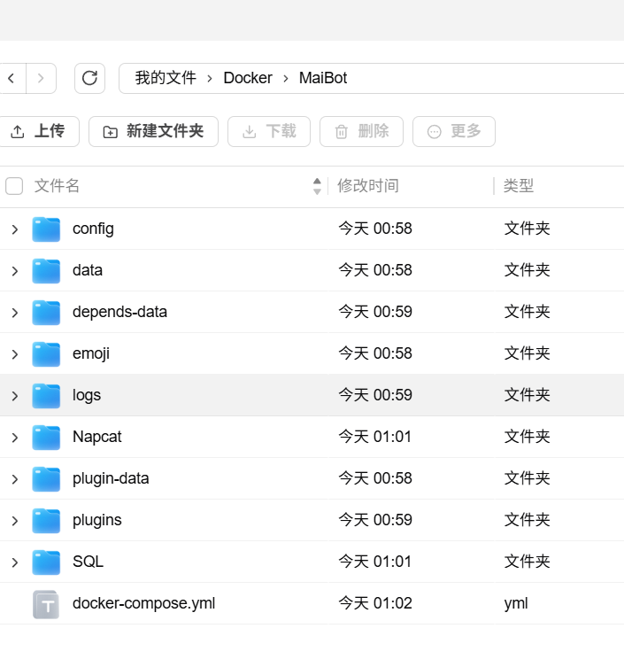
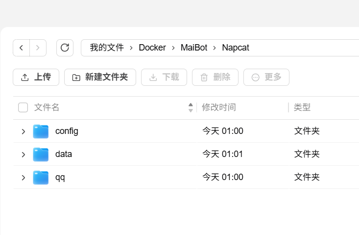
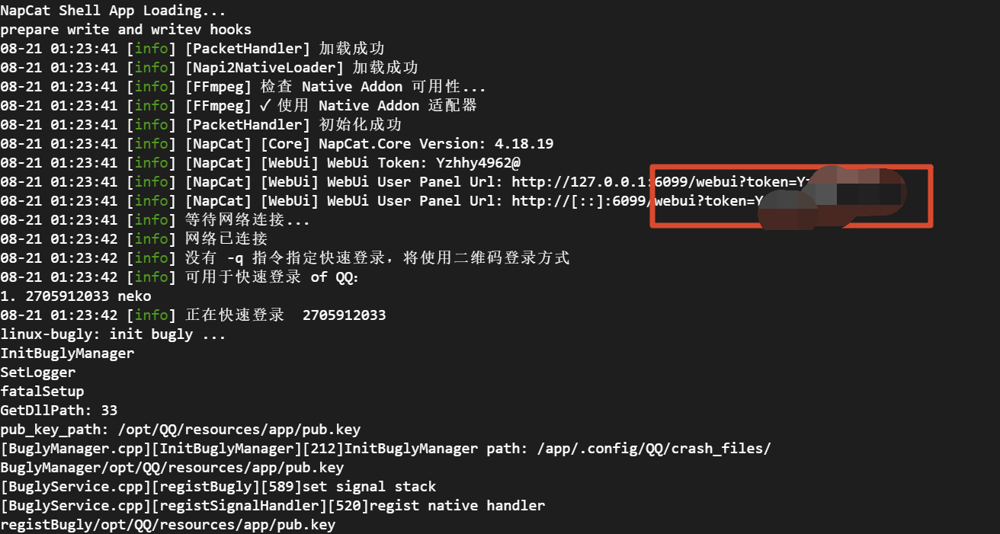
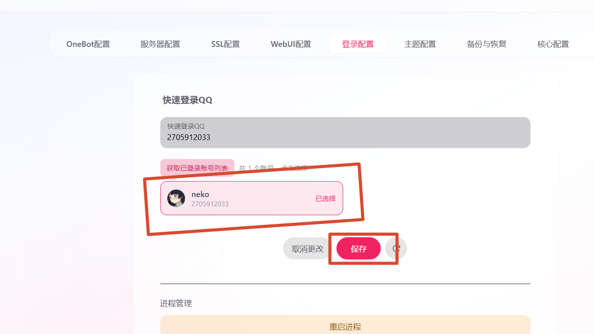
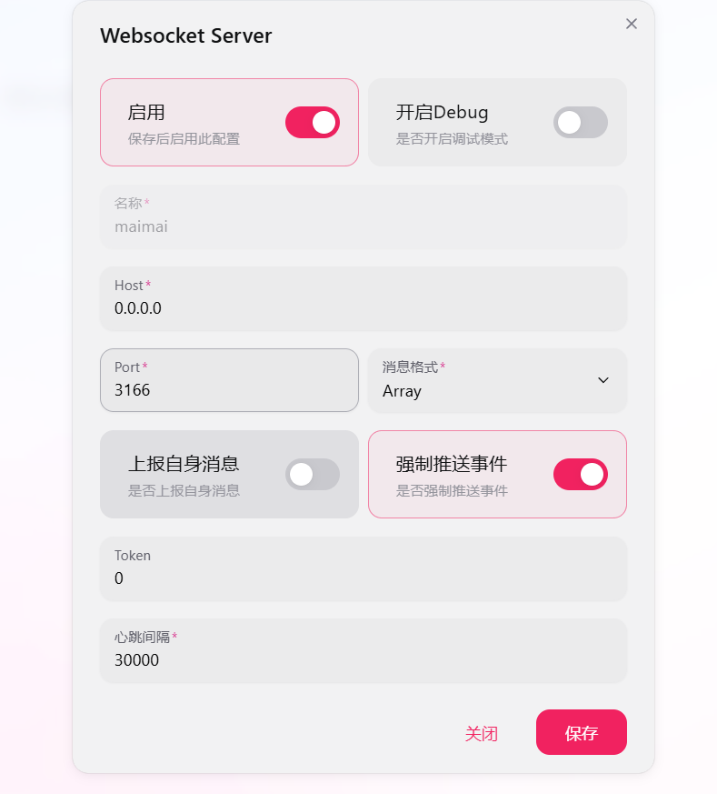
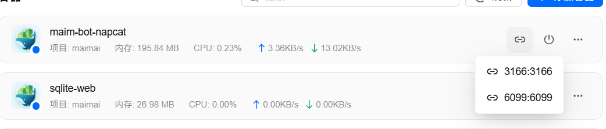
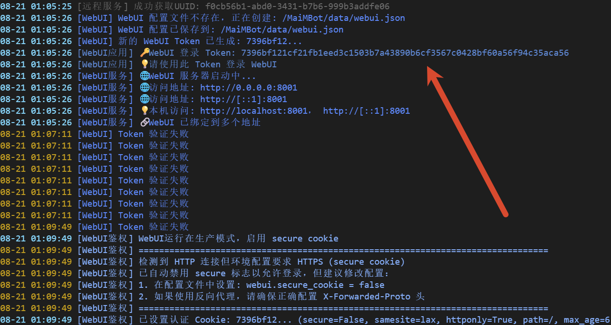
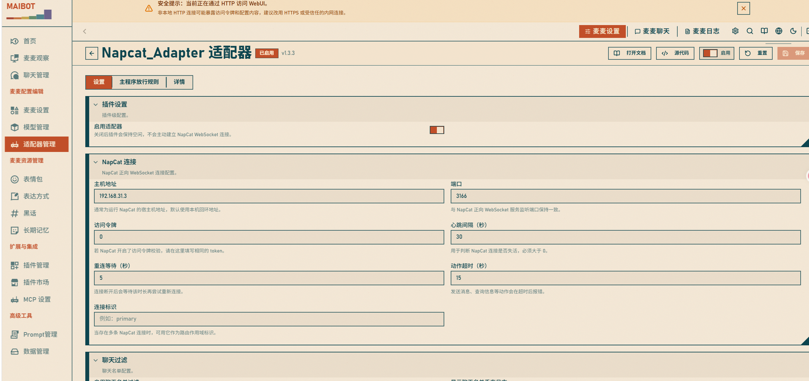
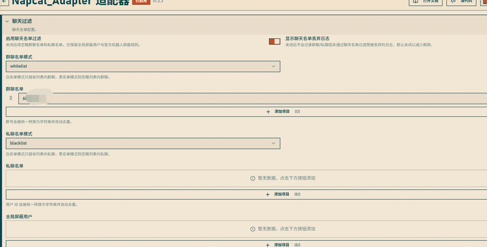
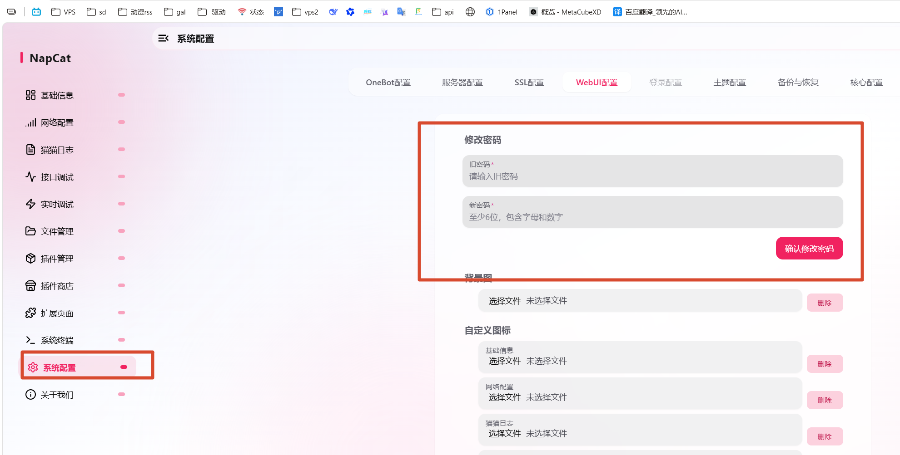

## 为什么要折腾

之前一直想给 QQ 群搞个 AI 机器人，试了不少方案不是要备案就是要装各种依赖，烦得很。后来刷到 MaiMBot 这个项目，看一眼就知道是怎么个玩法：不用自己写机器人代码，把模型接进去就能让 QQ 里的 bot 陪聊，等于一个账号接大模型的壳。

研究了一下发现部署倒不算复杂，就是中间有几个坑不踩不知道。这篇把完整流程记录下来，从拉镜像到登录 QQ、接通模型，一次说清楚。

## 三件套都是什么

整套东西就是三个容器：

| 容器 | 作用 |
|---|---|
| `maim-bot-core` | MaiMBot 主程序，接模型、管对话逻辑 |
| `maim-bot-napcat` | NapCat，负责连 QQ 账号 |
| `sqlite-web` | 网页版看数据库，方便后面对照排查 |

原理上 NapCat 把 QQ 账号包装成一个 OneBot 协议服务，MaiMBot 通过正向 WebSocket 连上去，就能收发群消息了。所以核心就两步：NapCat 登录 QQ 并监听，MaiMBot 连上这个监听端口。

## 编写 docker-compose.yml

我直接用项目提供的示例，稍微整理了一下。完整文件如下：

```yaml
services:
  core:
    container_name: maim-bot-core
    #### prod ####
    image: sengokucola/maibot:latest
    # image: infinitycat/maibot:latest
    #### dev ####
    # image: sengokucola/maibot:dev
    # image: infinitycat/maibot:dev
    environment:
      - TZ=Asia/Shanghai
      - EULA_AGREE=8e6e7d647f7f82d6ea98456b73908656
      - PRIVACY_AGREE=91e5db7659c560bc3545e63859b6ebc0
      - MAIBOT_LEGACY_0X_UPGRADE_CONFIRMED=1 # Docker 无法交互确认旧版升级迁移，默认跳过确认提示
      - MAIBOT_STATISTICS_REPORT_PATH=/MaiMBot/data/maibot_statistics.html # 统计数据输出到共享目录，首次运行可自动创建文件
      - WEBUI_HOST=0.0.0.0 # Docker 中需要监听全部容器网卡，宿主机才能通过端口映射访问 WebUI
    #      - EULA_AGREE=8e6e7d647f7f82d6ea98456b73908656 # 同意EULA
    #      - PRIVACY_AGREE=91e5db7659c560bc3545e63859b6ebc0 # 同意隐私条款
    ports:
      - "18001:8001" # webui端口

#      - "8000:8000"

    volumes:
      # 监听地址和端口会用于生成或迁移 ./docker-config/mmc/bot_config.toml 的 maim_message 与 webui 配置段
      - ./docker-config/mmc:/MaiMBot/config # 持久化bot配置文件
      - ./data/MaiMBot:/MaiMBot/data # 共享目录
      - ./data/MaiMBot-plugin-data:/MaiMBot/data/plugins # 插件持久数据目录，与插件源码目录隔离
      - ./data/MaiMBot/emoji:/data/emoji # 持久化表情包
      - ./data/MaiMBot/plugins:/MaiMBot/plugins # 插件目录
      - ./data/MaiMBot/logs:/MaiMBot/logs # 日志目录
      - ./depends-data:/MaiMBot/depends-data # 运行时资源文件
      # - site-packages:/usr/local/lib/python3.13/site-packages # 持久化Python包，需要时启用
    restart: always
    networks:
      - maim_bot

  # 启用 HTTPS 时，建议注释掉 core 服务中的 "18001:8001" 端口映射，
  # 然后取消注释此 Caddy 反向代理示例块，并按 dashboard/docs/Caddyfile.docker.example 修改域名。
  # caddy:
  #   image: caddy:2
  #   container_name: maibot-caddy
  #   restart: always
  #   ports:
  #     - "80:80"
  #     - "443:443"
  #   volumes:
  #     - ./dashboard/docs/Caddyfile.docker.example:/etc/caddy/Caddyfile:ro
  #     - caddy_data:/data
  #     - caddy_config:/config
  #   depends_on:
  #     - core
  #   networks:
  #     - maim_bot

  napcat:
    environment:
      - NAPCAT_UID=1000
      - NAPCAT_GID=1000
      - TZ=Asia/Shanghai
    ports:
      - "6099:6099"
    volumes:
      - ./docker-config/napcat:/app/napcat/config # 持久化napcat配置文件
      - ./data/qq:/app/.config/QQ # 持久化QQ本体
      - ./data/MaiMBot:/MaiMBot/data # 共享目录
    container_name: maim-bot-napcat
    restart: always
    image: mlikiowa/napcat-docker:latest
    networks:
      - maim_bot
  sqlite-web:
    # 注意：coleifer/sqlite-web 镜像不支持arm64
    image: coleifer/sqlite-web
    container_name: sqlite-web
    restart: always
    ports:
      - "8120:8080"
    volumes:
      - ./data/MaiMBot:/data/MaiMBot
    environment:
      - SQLITE_DATABASE=MaiMBot/MaiBot.db  # 你的数据库文件
    networks:
      - maim_bot

# volumes:         # 若需要持久化Python包时启用
#   site-packages:
#   caddy_data:
#   caddy_config:

networks:
  maim_bot:
    driver: bridge
```

几个值得注意的地方：

- **`EULA_AGREE` 和 `PRIVACY_AGREE`**：如果这两个环境变量没设置，第一次启动会卡在交互确认那里，Docker 环境下你没法在终端里回车，所以一定要带上。上面的值就是同意确认。
- **`MAIBOT_LEGACY_0X_UPGRADE_CONFIRMED=1`**：老版本迁移过来时跳过交互确认的，新装有没有都一样，不影响。
- **`WEBUI_HOST=0.0.0.0`**：必须设。不设的话 WebUI 只监听容器内部回环地址，宿主机通过端口映射也访问不到。
- **端口**：WebUI 映射到宿主机的 `18001`，NapCat WebUI 是 `6099`，sqlite-web 是 `8120`。想改就改冒号左边，但记得记好，后面要访问。

## 创建目录并启动

在你的部署目录下，先手动创建这些文件夹（compose 里的卷挂载到了一堆路径，目录不存在 Docker 会帮你建，但部分插件和日志目录最好先建好，避免权限问题）：

```bash
mkdir -p docker-config/mmc docker-config/napcat \
         data/MaiMBot-plugin-data data/MaiMBot/emoji \
         data/MaiMBot/plugins data/MaiMBot/logs \
         data/qq depends-data
```





对应关系如下（按上面 compose 里卷的挂载路径整理）：

| 宿主机目录 | 容器内路径 | 用途 |
|---|---|---|
| `docker-config/mmc` | `/MaiMBot/config` | bot 配置文件 |
| `docker-config/napcat` | `/app/napcat/config` | NapCat 配置 |
| `data/qq` | `/app/.config/QQ` | QQ 登录数据 |
| `data/MaiMBot` | `/MaiMBot/data` | 共享数据 |
| `depends-data` | `/MaiMBot/depends-data` | 运行时资源 |

然后启动：

```bash
docker compose up -d
```

第一次会从 Docker Hub 拉几个镜像，国内网络可能要等一会儿。

## 第一步：登录 QQ

先在浏览器打开 `http://你的服务器IP:6099`，这是 NapCat 的 WebUI。进去会要一个 token：



这个 token 在容器日志里：

```bash
docker logs maim-bot-napcat
```

日志里会打印一行类似 `Access Token: xxxxxxxx` 的东西，复制进去就能进 WebUI 了。

进去之后先扫码登录自己的 QQ。这里提醒一句：**MaiMBot 是拿你的 QQ 号当机器人用的**，扫码登录之后这个号就是 bot 本体，建议用个小号，别把自己大号交给机器人。

登录成功之后，勾选上**快速登录**，后面重启容器就不用再扫码了：



> [!WARNING] 警告
> 扫码登录有封号风险，这是 NapCat 这类框架的通用问题，介意的话别拿主号玩。

## 第二步：开启正向 WebSocket

在 NapCat WebUI 的**网络配置**里：

1. 新建或启用一个 **正向 WebSocket / WebSocket 服务器**。
2. 监听地址和端口默认即可，常用端口 `3166`。
3. 可以顺手设一个访问 Token。
4. **IP 监听建议填 `0.0.0.0`**，只监听回环地址的话后面的 MaiBot 容器连不进来。



这里有个关键点，**端口要映射出去**。因为 NapCat 和 MaiBot 是两个容器，MaiBot 要访问的是宿主机上映射出来的端口。compose 里 NapCat 只映射了 `6099`，如果你把 WebSocket 监听设在 `3166`，需要在 compose 的 napcat 服务里补上 `"3166:3166"` 再 `docker compose up -d`，启动后就能看到端口映射生效：



> [!NOTE] 提示
> 不要把 NapCat WebUI 的 token、MaiBot WebUI 的 Access Token 和 WebSocket 的访问 token 混用，三个是不同东西，各填各的。

## 第三步：配置 MaiBot 适配器

浏览器打开 `http://你的服务器IP:18001`，进 MaiBot 的 WebUI。首次进入需要 Access Token，同样去容器日志里找：

```bash
docker logs maim-bot-core
```



进去之后，在**适配器**里新建一个连接：

- 类型选 **NapCat（OneBot）** 相关适配器。
- 地址填 `ws://宿主机IP或域名:3166`（就是刚才 NapCat 监听的 WebSocket 地址）。
- 如果 NapCat 那边设了访问 token，这里填同一个。



## 第四步：加白名单

**这个项目默认是白名单模式**，不把人和群加进去的话，机器人谁的消息都不回。在 WebUI 里把**自己的 QQ 号**和**要用的群号**加进白名单，保存。



不填白名单是最常见的"明明都部署好了就是不回消息"的原因，先查这里。

## 第五步：配置模型

剩下的就是模型了，MaiMBot 支持各种 OpenAI 兼容接口。在 WebUI 的模型配置里填上你的 API 地址、Key 和模型名，保存之后到群里发条消息试试。

## 踩坑记录

1. **WebUI 打不开**：`WEBUI_HOST` 没设成 `0.0.0.0`，或者端口没映射对。
2. **MaiBot 连不上 NapCat**：WebSocket 监听地址不是 `0.0.0.0`，或者对应端口（如 `3166`）没映射。
3. **机器人不回复**：先查白名单，绝大多数情况是白名单没加。
4. **WebUI 登录密码忘了**：可以在系统配置页面修改密码，或者查看容器日志里的初始 Access Token。
5. **sqlite-web 报错**：注意 `coleifer/sqlite-web` 镜像不支持 arm64，ARM 机器上别用这个镜像。

## 常用的管理操作

- 修改 WebUI 登录密码：在系统配置页面的修改密码弹窗里操作，改完重启容器生效：



```bash
docker compose restart maim-bot-core
```

## 极简流程

1. 写 compose 文件，创建各种数据目录。
2. `docker compose up -d` 启动三个容器。
3. 浏览器开 `6099`，日志里拿 token，扫码登录 QQ。
4. NapCat 里新建正向 WebSocket，监听 `0.0.0.0:3166`，端口映射出去。
5. 浏览器开 `18001`，日志里拿 token。
6. MaiBot 适配器里填 `ws://宿主机IP:3166`，连上。
7. 把 QQ 号和群号加白名单。
8. 填模型 API，收工。