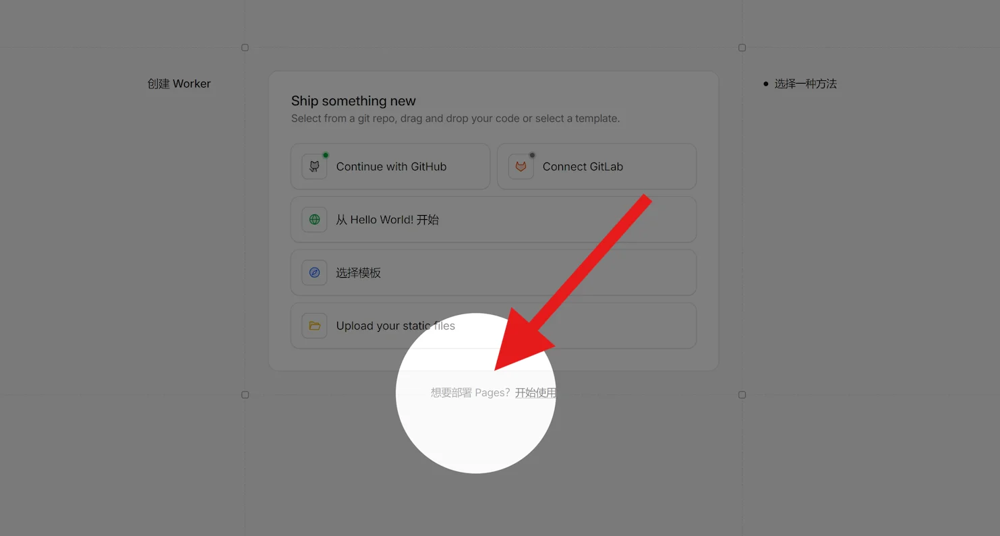
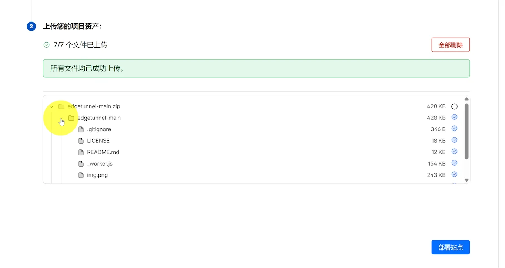
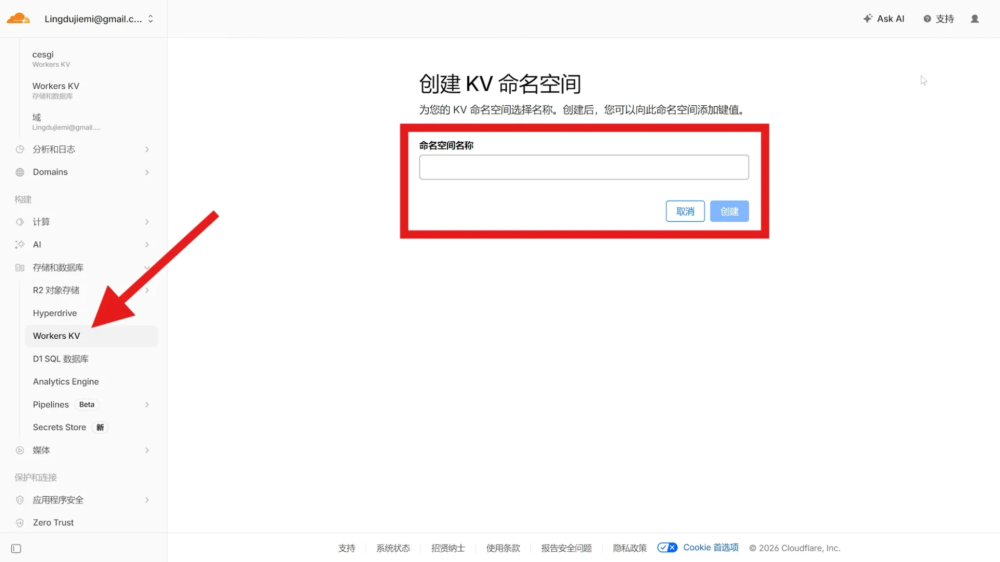
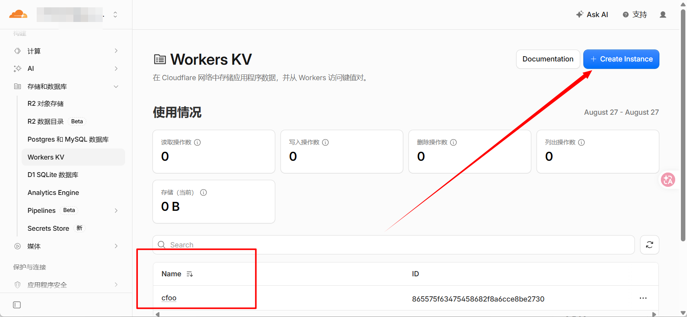
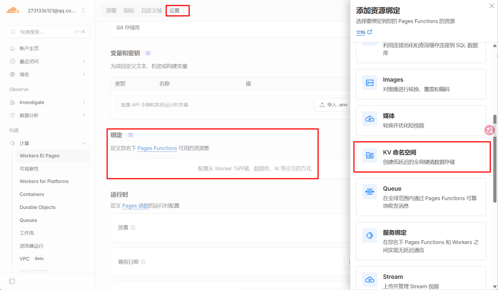
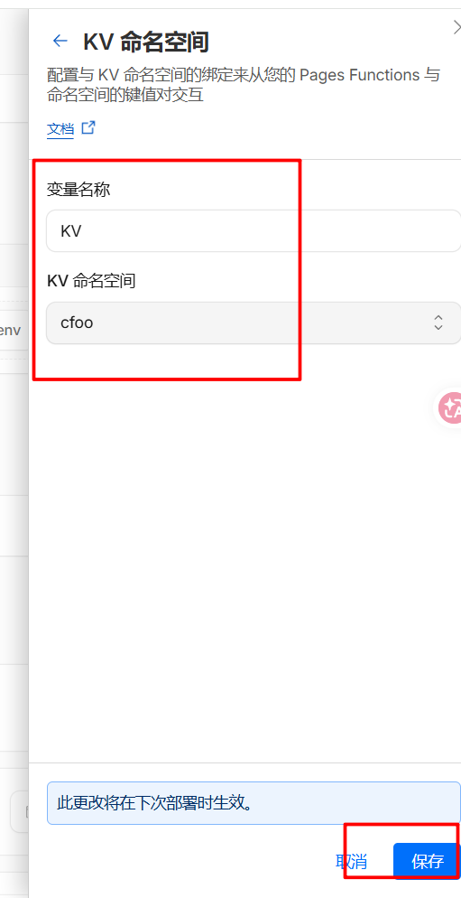
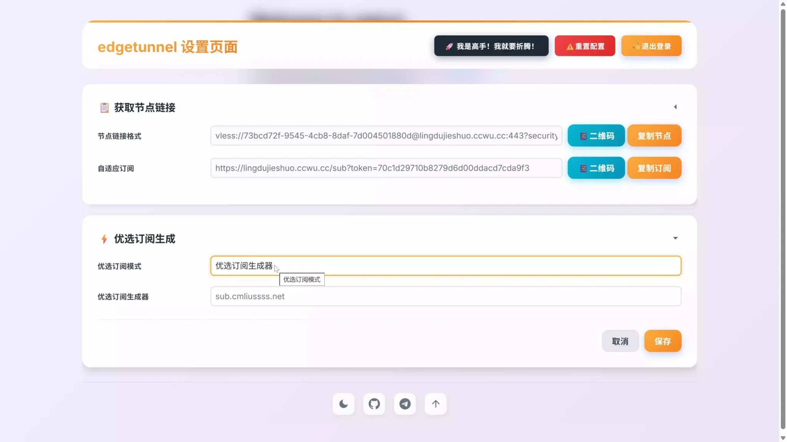

最近收藏的两篇教程都在推同一个东西——cmliu 开源的 [edgetunnel](https://github.com/cmliu/edgetunnel)，部署到 Cloudflare 上就能搭一个自己的节点，不用买服务器，Cloudflare 的免费额度直接白嫖。反正流程不复杂，我就自己动手过了一遍，把步骤和要注意的点记下来。

> [!WARNING] 说明
> 仅供学习记录，使用前请了解并遵守当地法律法规。

## 准备工作

就三样：

1. 一个 Cloudflare 账号（免费版就行）
2. 项目安装包：去 [edgetunnel 仓库](https://github.com/cmliu/edgetunnel)下载 [main.zip](https://github.com/cmliu/edgetunnel/archive/refs/heads/main.zip)，顺手给作者点个 Star
3. （可选）一个自己已有的域名，已经托管到 Cloudflare 的最省事

## 第一步：创建 Pages 项目并部署

进 Cloudflare 控制台，左侧找到 **Workers 和 Pages**，在创建页面的最底部有一行「想要部署 Pages？开始使用」，从这里进：

Pages 项目不用连 GitHub，选 **上传资产** 的方式就行。给项目取个名字，点击 **创建项目**，然后把刚才下载的 `main.zip` 拖进去上传，右下角点 **部署站点**：

等进度条跑完，首次部署就成了。

## 第二步：设置管理员密码，再重新部署

这一步是最容易漏的。部署完先别急着访问，要先告诉它管理员密码是多少：

1. 点 **继续处理站点** 进入项目
2. **设置** > **环境变量** > 为生产环境定义变量 > **添加变量**
3. 变量名称填 `ADMIN`，值填你自己定的管理密码，点 **保存**

保存之后环境变量不会立即生效，回到 **部署** 选项卡，右下角点 **创建新部署**，把 `main.zip` 再传一遍，点 **保存并部署**。后面每改一次配置都要这么重新部署一次，记住这个套路。

## 第三步：创建 KV 命名空间并绑定

edgetunnel 需要一个 KV 来存配置数据，不然后台很多东西没法持久化。

先建空间：在左侧菜单找到 **存储和数据库** > **Workers KV**，点右上角 **Create Instance**，弹窗里给命名空间起个名字，随意：

建好之后就能在列表里看到它了：

然后绑定到 Pages 项目：打开项目 **设置** 选项卡，往下找到 **绑定**，点 **+ 添加**，在弹窗里选 **KV 命名空间**：

关键的地方来了：**变量名称必须填 `KV`**（大小写一致），KV 命名空间选刚才建的那个，点 **保存**：

弹窗里会提示"此更改将在下次部署时生效"，所以老规矩，回部署页面再重新部署一次。

## 第四步：绑定自定义域名（可选）

不绑域名也能用自带的 `xxx.pages.dev` 访问，但部分地区 DNS 污染严重，pages.dev 域名根本打不开，所以有自己的域名建议还是绑一下：

1. 在 Pages 控制台切到 **自定义域** 选项卡，点 **设置自定义域**
2. 填入你的次级域名。注意别拿根域名来用，比如你的根域名是 `example.com`，这里就填 `cf.example.com` 这种
3. 按提示回域名的 DNS 服务商那里，添加一条 CNAME 记录：主机记录 `cf`，指向 `edgetunnel.pages.dev`，然后点 **激活域**

配置没问题的话证书会自动签发，几分钟就能生效。视频版可以看这个[视频教程](https://www.youtube.com/watch?v=LeT4jQUh8ok&t=851s)。

## 第五步：进入后台

浏览器访问 `https://你的域名/admin`（没绑域名就用 `https://项目名.pages.dev/admin`），输入第二步设置的 ADMIN 密码就能登录。后台长这样：

上面就是节点链接和订阅地址，复制到 v2rayNG、Clash Verge 这类客户端导入就能用了。右上角还有个"我是高手！我就是要折腾！"的入口，想玩优选 IP、ProxyIP、订阅转换的可以从那里深入，我目前还没折腾到那一步。

## 踩坑与提醒

1. **改了配置不生效**：ADMIN 环境变量、KV 绑定都是下次部署才生效，改完必须重新上传 zip 部署一次
2. **KV 变量名称**：必须一字不差地填 `KV`，不是随便起的名字
3. **自定义域名别用根域名**：根域名留给解析，节点用次级域名就行
4. 免费额度对个人轻度使用完全够，但别拿来做重活，毕竟吃的是 CF 的公益饭

## 极简流程

1. 下载 main.zip
2. Pages 上传资产部署，设 `ADMIN` 环境变量，重新部署
3. 建 KV 命名空间，绑定到 Pages，变量名 `KV`，再重新部署
4. （可选）绑个自己的次级域名
5. 访问 `/admin` 登录，复制订阅到客户端

## 参考资料

- [Edgetunnel 2.0 全新版本 - CMLiussss Blog](https://eo.blog.cmliussss.com/p/edt2/)
- [2026 最强 Cloudflare 免费节点 - 零度博客](https://www.freedidi.com/23618.html)（文中部分配图取自此篇）

*写于 2026 年 8 月，折腾记录*
