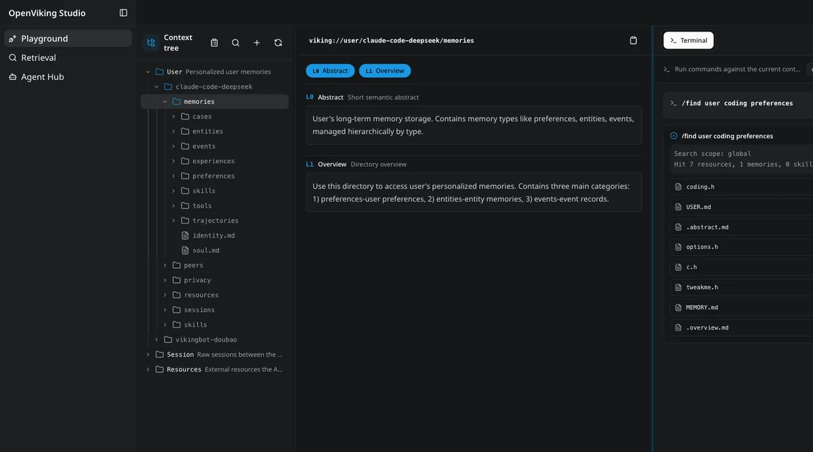

我 NAS 上跑着几个 AI Agent（Hermes、DeepSeek Harness 之类，后者搬进 Docker 的翻车过程我[单独记过一篇](/posts/ai/dsh-migrate-docker-ai-repair/)），一直给他们各自搞记忆有点散。后来看到 OpenViking——火山引擎开源的一个上下文记忆数据库，专给 AI Agent 当"长期记忆"用的，把记忆、资源、技能都当作 `viking://` 协议下的文件系统来管。反正 NAS 闲着也是闲着，就折腾着部署了一版。

这篇文章是完整的部署记录，最大的坑在最后：换 embedding 模型维度变了，服务直接拒绝启动，必须重建索引。如果你也打算在 fnOS 上跑 OpenViking，照着走能省不少时间。

## 为什么选 OpenViking

OpenViking 干的事：给 Agent 一个统一的、可检索的长期记忆库。

- 记忆、资源、技能统一用 `viking://` URI 管理，像操作文件系统一样 `ls`、`find`，不是黑盒向量库
- 内容写进去时自动分级处理：L0 摘要（约 100 token）、L1 概览（约 2k token）、L2 全文，按需加载，省 token
- 检索是可观测的，能看它是沿哪条路径找到结果的
- 会话结束后自动从对话里提取偏好和经验写进长期记忆

选择在 NAS 自托管而不是用云服务，就一个理由：**数据在自己手里**。记忆这种东西我不想放别人服务器上。OpenViking 官方自己也要求 Docker 部署时数据全在挂载目录里，天然适合 NAS。


## 准备工作

- fnOS 一台（x86_64），Docker 和 Docker Compose 可用（我这边 Docker 29.7.2 / Compose v5.5.0）
- 用 SSH 登录 NAS（fnOS 的 `hy4962` 用户在 docker 组，可以直接跑 docker 命令）
- 两个模型服务：
  - **Embedding（向量化）**：我用 SiliconFlow 的 `Qwen/Qwen3-Embedding-4B`（原因见下）
  - **VLM（内容理解/摘要）**：走我自己搭的 [new-api 网关](/posts/deploy/deploynewapi/)（OpenAI 兼容），模型 `deepseek-v4-flash`

> [!NOTE] 端口
> OpenViking 默认监听 `1933`，同时提供 HTTP API 和 Web Studio 界面（`/studio`）。确认端口没被占。

## 第一步：数据目录

部署之前先把目录结构定好，这是后面迁移最省心的一步。OpenViking 容器内所有持久状态都在 `/app/.openviking` 这一个目录下（配置 + workspace 数据全在里面），所以直接把 NAS 上的目录整个挂进去：

```text
/vol1/1000/Docker/OpenViking/
├── ov.conf            # 配置（模型、存储、root key）
├── docker-compose.yml
├── data/              # workspace：文件库 + 向量库 + bot
└── cache/             # 模型缓存
```

以后换机器迁移，把这个目录整个拷走就行，数据配置模型一个不落。镜像本体在 Docker 存储里，不占这个目录。

## 第二步：ov.conf 和 docker-compose

先写 `ov.conf`。关键三件事：`server.root_api_key`（容器内绑定 0.0.0.0 时必须有，否则拒绝启动）、embedding、VLM：

```json
{
  "server": {
    "host": "0.0.0.0",
    "port": 1933,
    "root_api_key": "换成你自己的随机串",
    "cors_origins": ["*"]
  },
  "embedding": {
    "dense": {
      "provider": "openai",
      "model": "Qwen/Qwen3-Embedding-4B",
      "api_base": "https://api.siliconflow.cn/v1",
      "api_key": "你的 SiliconFlow key",
      "dimension": 2560
    }
  },
  "vlm": {
    "provider": "openai",
    "model": "deepseek-v4-flash",
    "api_base": "http://192.168.31.3:3000/v1",
    "api_key": "你的 new-api key"
  },
  "storage": {
    "workspace": "/app/.openviking/data",
    "agfs": { "backend": "local" },
    "vectordb": { "backend": "local" }
  }
}
```

`docker-compose.yml` 就一行挂载的事：

```yaml
services:
  openviking:
    image: ghcr.io/volcengine/openviking:latest
    container_name: openviking
    restart: unless-stopped
    ports:
      - "1933:1933"
    volumes:
      - /vol1/1000/Docker/OpenViking:/app/.openviking
    environment:
      - TZ=Asia/Shanghai
```

## 踩坑记录：换 embedding 模型，服务直接拒绝启动

这是最大的一个坑。

Embedding 模型决定向量库的坐标系，所有记忆的向量都按它生成。**换模型 = 换坐标系**，所以向量库必须"一个模型一个池子"。OpenViking 启动时会校验向量库记录的 embedding 元数据和当前配置是否一致，不一致直接拒绝启动，这是保护机制：

```text
EmbeddingRebuildRequiredError: Existing collection embedding metadata does
not match current configuration. Rebuild is required...
```

我一开始用的 `Qwen3-Embedding-0.6B`（1024 维），后来想换 4B，改了配置重启，就撞上这个。而且更关键的是：

| 模型 | 维度 |
|---|---|
| Qwen3-Embedding-0.6B | 1024 |
| Qwen3-Embedding-4B / 8B | 2560 |

**维度都变了**，不是同一个坐标系的问题，是盒子尺寸都不一样了，旧向量完全没法复用。处理方式：

1. 停容器，删掉旧向量库（`data/vectordb/context`，备份一份再删）
2. 改 `ov.conf` 里 `dimension: 2560`
3. 启动，向量库按新模型重建
4. 已有内容重新向量化（我直接重新导入一次，173 个文件，210 秒跑完，零错误）

如果你换的是同维度的模型（比如 4B ↔ 8B，都是 2560），理论上可以设 `embedding.allow_metadata_override: true` 保留旧向量，但**不建议**，不同模型的语义空间不同，新旧向量混在一个库里检索会失真。老老实实重建最干净。

> [!WARNING] 换个 VLM 没事
> 只有 Embedding 要重建。VLM 模型（负责摘要、记忆提取）输出的是文本，跟向量库无关，随便换，改配置重启就行。

## 账号和权限：一个 Agent 一个用户

OpenViking 是多租户的：`account`（工作区）+ `user`（用户）。**记忆、会话按用户隔离**，`viking://resources` 是同一工作区共享的。

实践建议：**每个 Agent 一个 user 账号**，各自用各自的 user key 连接，记忆互不干扰。创建用户走 Admin API（root key 调用）：

```bash
curl -X POST http://127.0.0.1:1933/api/v1/admin/accounts/default/users \
  -H "Content-Type: application/json" \
  -H "X-API-Key: <root-key>" \
  -d '{"user_id": "hermes", "role": "user"}'
# 返回 user_key，就是给这个 agent 用的
```

注意三种角色的分工：

| 角色 | 范围 | 能干什么 |
|---|---|---|
| ROOT | 全局 | 建工作区、管所有用户（root key） |
| ADMIN | 单个工作区 | 管本工作区用户、重发 key |
| USER | 自己 | 只能访问自己的记忆 + 共享资源 |

**root key 不能直接访问数据 API**（返回 PERMISSION_DENIED），Agent 连接必须用 user key。

## 部署完成长什么样

启动后等健康检查通过：

```bash
curl http://127.0.0.1:1933/health
# {"status":"ok","healthy":true,...}
```

浏览器打开 `http://你的NAS-IP:1933/studio` 就是 Web Studio：



给 agent 配连接时就是填这个地址 + user key。我的 Hermes 打开 OpenViking 记忆提供方配置页，`ENDPOINT` 填 `http://192.168.31.3:1933`，`API KEY` 填 hermes 用户的 user key，保存即可。

## 延伸：把 Hindsight 的记忆迁过来

我之前用 Hindsight 给 Hermes 当记忆库，里面 570 条记忆单元 + 16 个会话全文。迁移路径是 Hindsight API 只读导出 → 转成 markdown → OpenViking 官方 API 导入，不是复制数据库文件（两家存储格式完全不兼容，Hindsight 是 PostgreSQL 图结构，OpenViking 是文件系统 + 向量库）。

导出（Hindsight 8888 端口 API）：

```bash
curl "http://127.0.0.1:8888/v1/default/banks/hermes/memories/list?limit=100&offset=0"
```

组装成 markdown（一条记忆一个标题块，保留时间/实体/来源），打包上传导入：

```bash
curl -X POST http://127.0.0.1:1933/api/v1/resources/temp_upload \
  -H "X-API-Key: <user-key>" -F "file=@hermes-hindsight.zip"
curl -X POST http://127.0.0.1:1933/api/v1/resources \
  -H "Content-Type: application/json" -H "X-API-Key: <user-key>" \
  -d '{"temp_file_id": "...", "to": "viking://user/hermes/resources/hindsight-import"}'
```

导入后 OpenViking 自动向量化 + 生成摘要，中文语义检索实测命中率不错（"欧盟人工智能法案"这类查询能稳定召回）。要说损失也有：Hindsight 的知识图谱关系边没法迁移，记忆从"图结构"变成了"可语义检索的资源库"，这是迁移的本质，不是意外丢失。

## 极简流程

1. 建目录 `/vol1/1000/Docker/OpenViking`，写 `ov.conf`（root key + embedding + VLM）
2. `docker compose up -d`，等 `/health` 返回 ok
3. 客户端连接：`http://NAS-IP:1933` + 一个 user key（Admin API 创建）
4. 换 embedding 模型 = 重建索引，换 VLM = 随便换

## 写在最后

OpenViking 是我目前用下来最顺手的 agent 记忆方案：开源、本地数据、多租户隔离，Web Studio 能直接看记忆结构。折腾下来最大的坑就是向量模型那个，其余都挺顺的。数据全部落在 `/vol1/1000/Docker/OpenViking`，哪天要换机器，整个目录拷走 + `docker save` 镜像就完事。