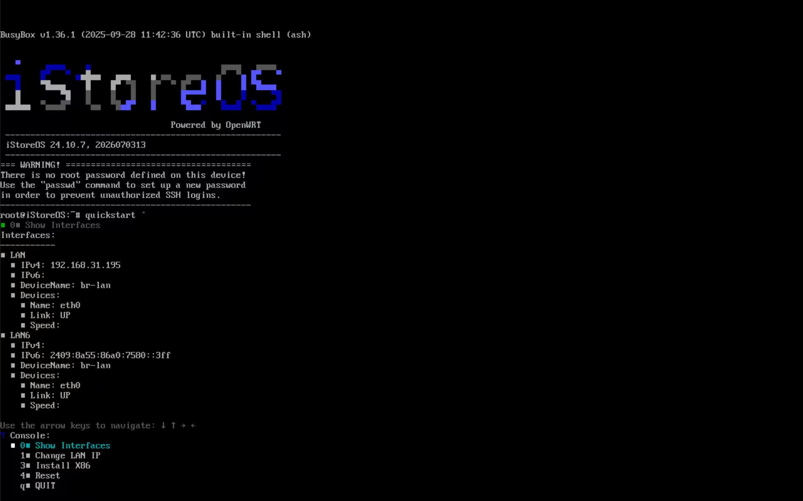
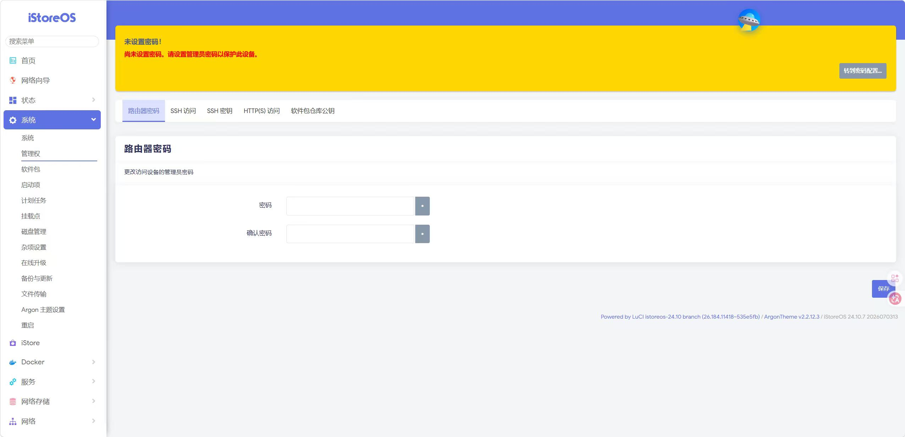
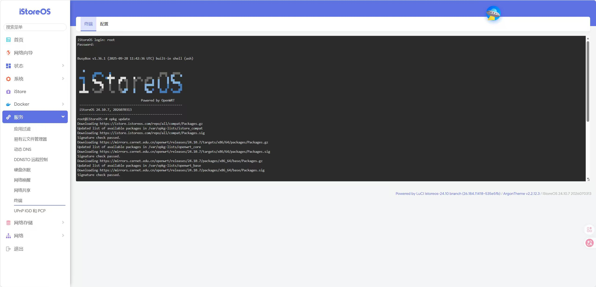
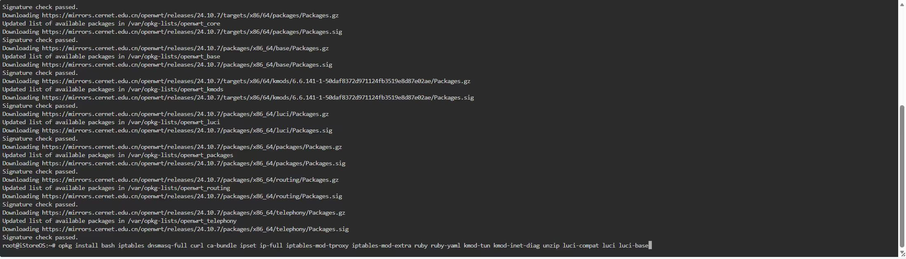
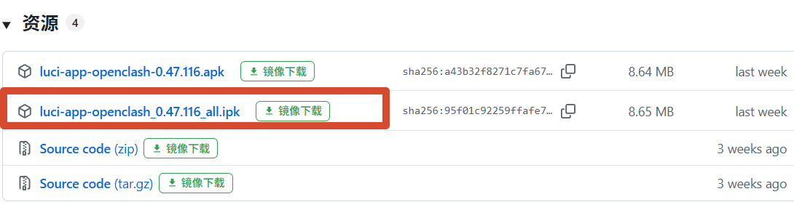
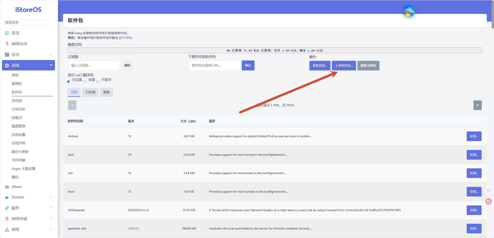
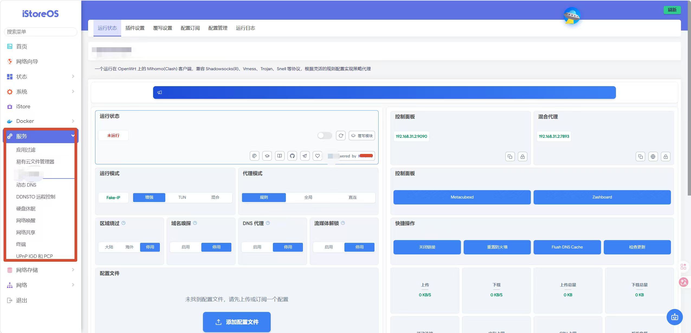

上一篇写了怎么在 FNOS 上装 iStoreOS 虚拟机，装完之后总得干点啥吧。iStoreOS 本身就是 OpenWrt 的改版，拿来跑 OpenClash 再合适不过了。

其实我之前一直用的是软路由方案，后来换了 NAS 就想着能不能把软路由也虚拟化了，省一台设备。装完 iStoreOS 虚拟机之后第一件事，就是把 OpenClash 搞上。

## 一、找到后台地址

iStoreOS 开机之后，输入 `quickstart`，然后选第一个回车。



然后就能看到后台管理地址了。我这边显示的是 `192.168.31.195`，你的可能不一样，看实际显示的就行。

浏览器打开这个地址，就能进 Web 管理页面。

## 二、改密码

进去之后第一件事，建议先改密码。

进 **系统 → 管理权**，找到「路由器密码」那栏，改成你自己的。



不改的话默认密码好像挺简单的，后面进终端要用 root 登录，还是改一下比较安心。

## 三、装依赖

这一步是最容易出问题的，

进 **服务 → 终端**（TTYD），用户名 `root`，密码填刚才设的。

先更新一下软件源：

```bash
opkg update
```



这一步可能会冒出一堆报错，类似 `Signature check failed` 或者 `returned 8`。我第一次看到这个报错的时候还挺慌的，以为哪里搞错了。后来查了一下，好像是签名验证的问题，不影响后面安装。不用管它，继续往下走就行。

然后装依赖包：

```bash
opkg install bash iptables dnsmasq-full curl ca-bundle ipset ip-full iptables-mod-tproxy iptables-mod-extra ruby ruby-yaml kmod-tun kmod-inet-diag unzip luci-compat luci luci-base
```



装的时候会看到一堆输出，不用逐行看，只要最后没报致命错误就行。有些包可能会提示已经装过了，那说明 iStoreOS 自带了一部分，跳过就好。

整个依赖安装大概要等个一两分钟，看你的网络情况。

## 四、下载并安装 OpenClash

依赖装好之后，就可以装 OpenClash 本体了。

去 GitHub 的 [OpenClash Releases](https://github.com/vernesong/OpenClash/releases) 页面，找到最新版本，下载 `ipk` 文件。



下载的时候注意看一下文件名，别下错了。一般下载量最大的那个就是。

然后进 **系统 → 软件包**，点「上传软件包」，把刚才下载的 ipk 传上去。



上传完会弹个确认框，点安装就行。安装过程很快，几秒钟就完事。

## 五、首次使用

装完之后刷新网页，**服务** 菜单下面就能看到 OpenClash 了。如果没看到，多刷新几次，或者等一会儿再试。

第一次进去可能会提示你下载内核，还会给你一个已经测速好的 CDN 列表。选个延迟低的点下载就行。



内核下好之后，导入你的订阅就可以用了。

## 极简流程

1. `quickstart` → 选第一个 → 拿到后台地址
2. 系统 → 管理权 → 改密码
3. 服务 → 终端 → `opkg update` → `opkg install` 装依赖
4. GitHub 下载 OpenClash 的 ipk → 系统 → 软件包 → 上传安装
5. 刷新 → 服务 → OpenClash → 下载内核 → 导入订阅

---

*写于 2026 年 7 月，折腾 iStoreOS 安装 OpenClash 的记录*
