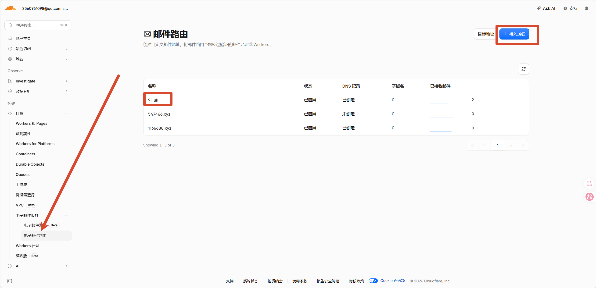
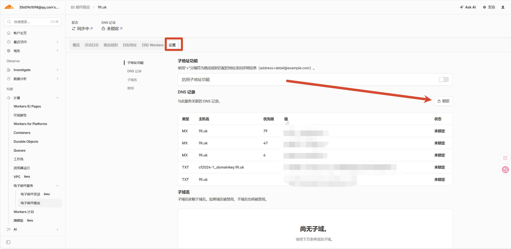
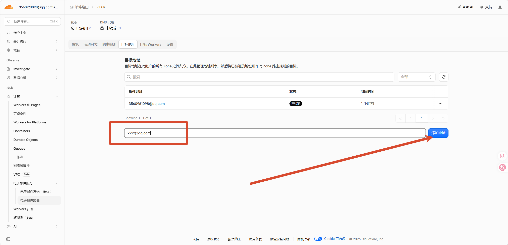
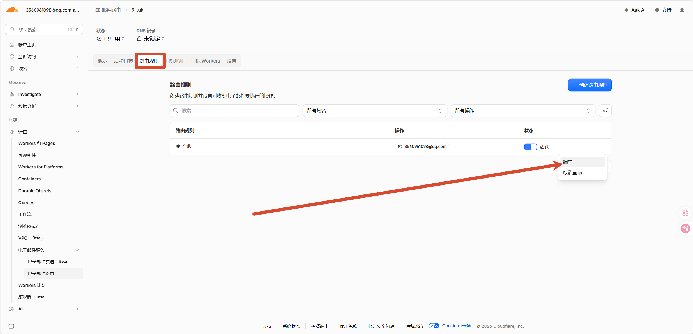
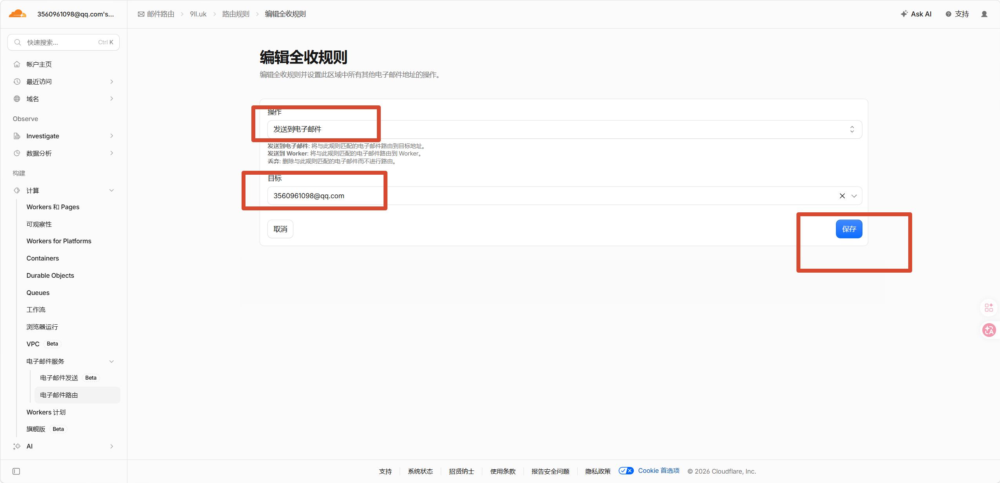
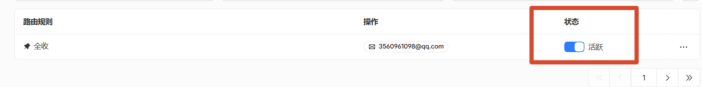
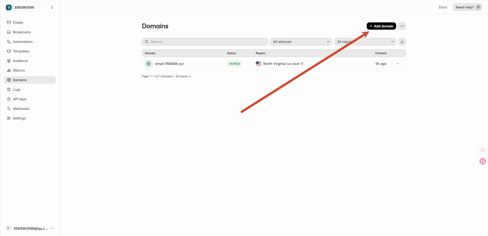

## 前言

偶尔生活需要隐藏自己的真实邮箱或者无限邮箱薅羊毛？

本篇文章为此诞生

## 在Cloudflare开启电子路由（收邮件）

1.先进去自己的控制台，点击电子邮件路由，接入自己的域名

2.点击设置，然后点击锁定，貌似点了锁定就好像会自己解析下面的DNS记录？反正没自动解析就自己动手一下吧

3.然后去目标地址，增加一下自己真正的邮箱，然后点击添加，我记得会发一封验证邮件，自己去验证一下就好啦

4.之后就是去路由规则，点击编辑，操作**选择发送到电子邮件**，目标**填写自己的邮箱**，点击**保存**，记得把状态开启，变成**活跃**

## 配置Resend（发送邮件）

1.注册好[Resend](https://resend.com/)后，来到[Domains · Resend](https://resend.com/domains)

2.然后按信息配置好DNS记录即可(没图)，因为这玩意免费计划只能添加一个域名，懒得删了再弄了，反正也没有难度

3.之后是用Resend发邮件即可(.....)

## 结语

Resend只能添加一个域名挺伤的，其实还有一个专门做了一套可以运行在workers的开源项目，这两天我部署一个玩玩

Resend特么的貌似还不能直接在控制台发送邮件，只有一个不好用的广播，但是官方提供了非常详细的Api文档，这几天有时间我写一个客户端开源一下？