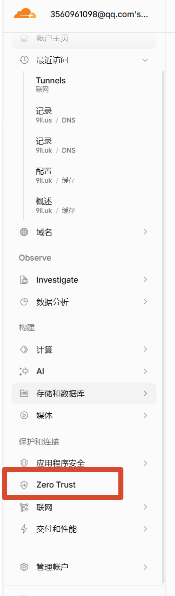
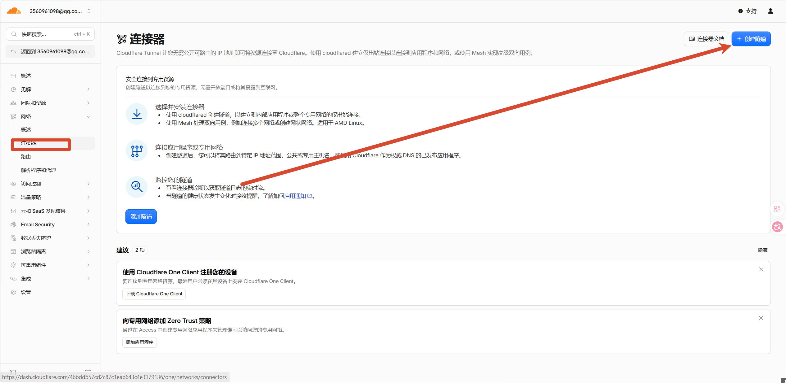
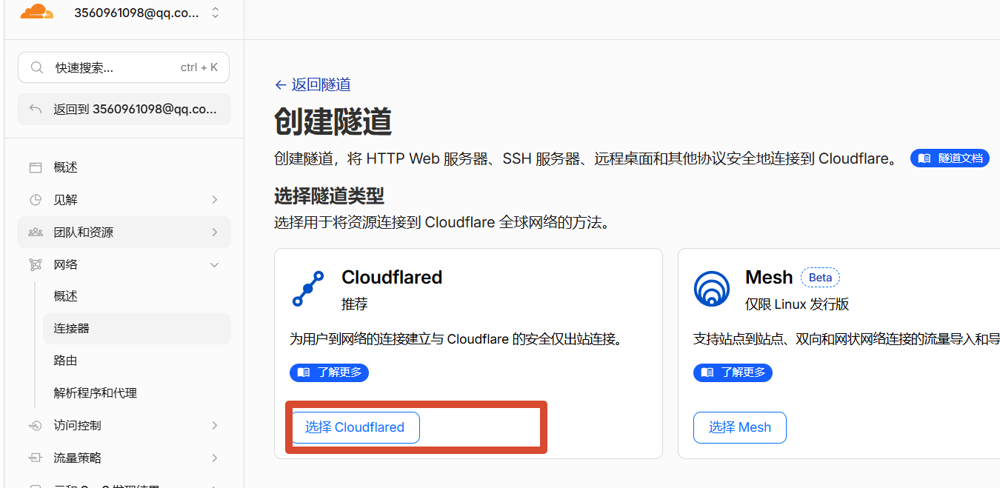
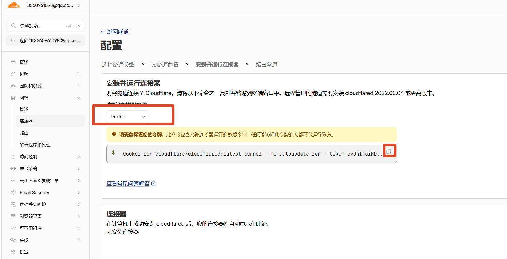
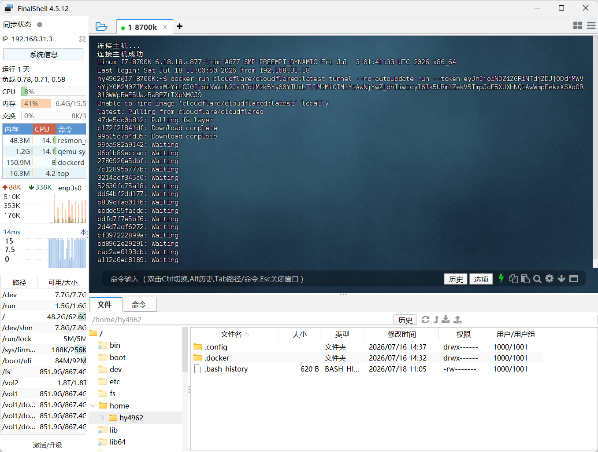
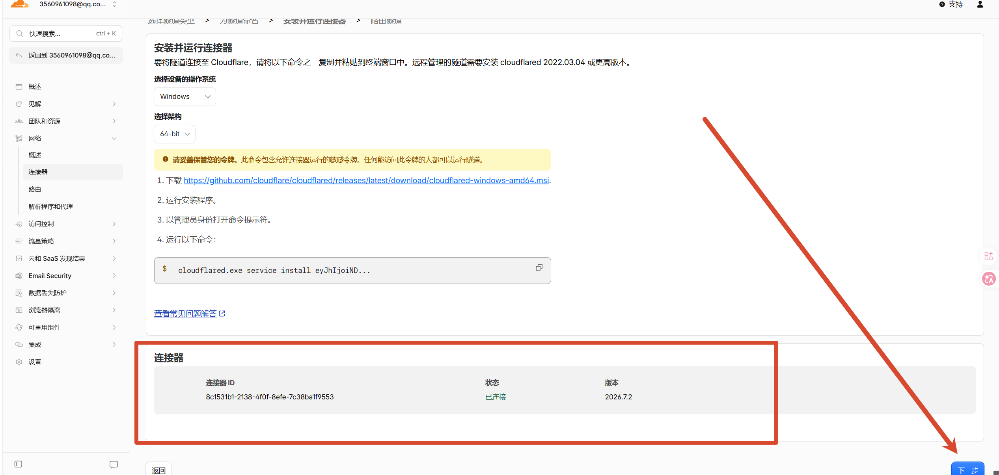
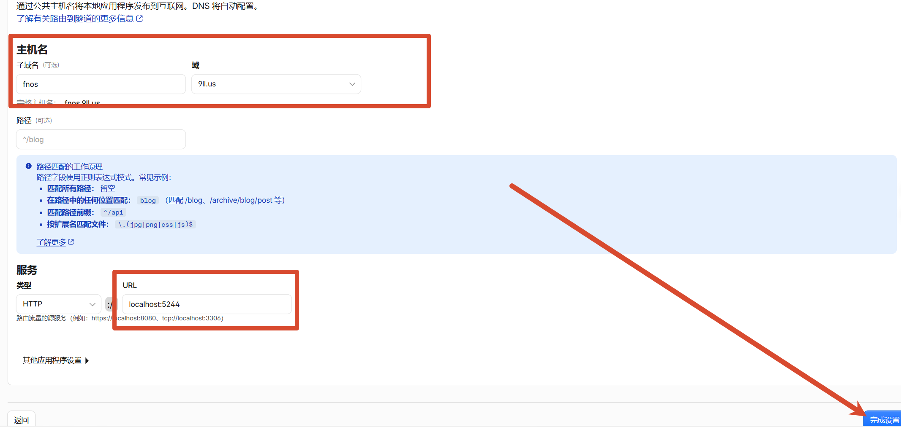
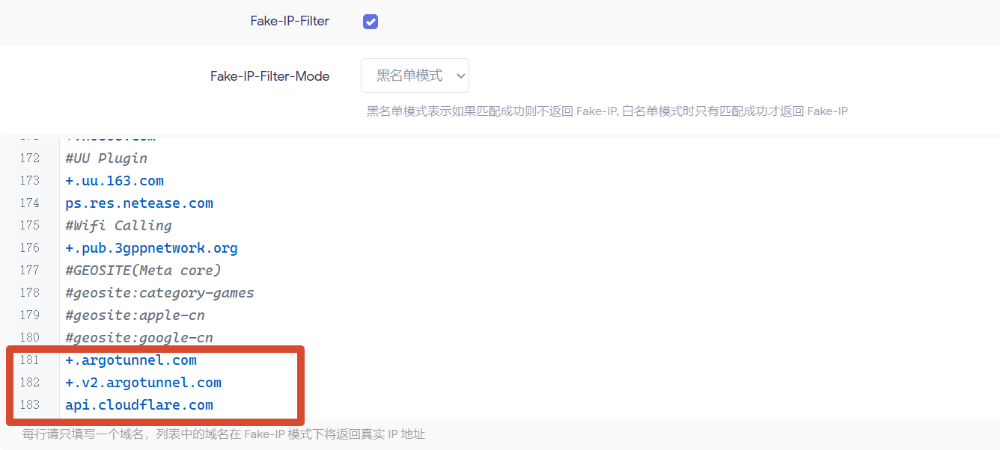
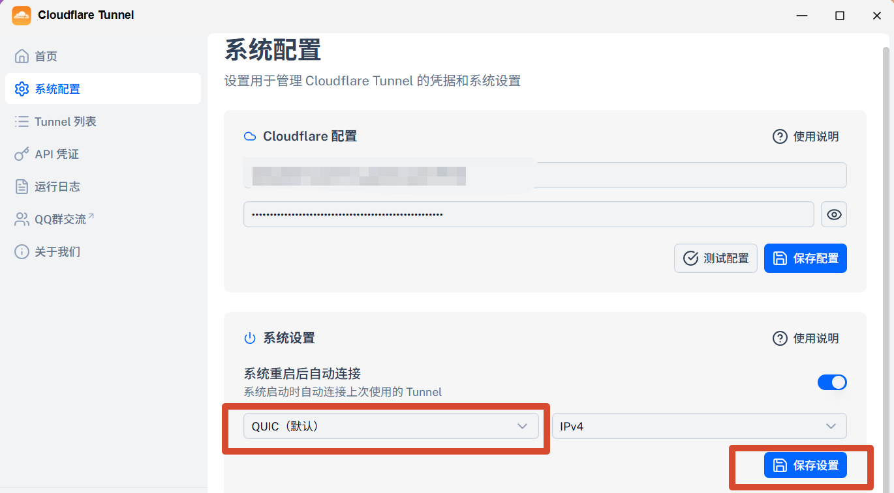

## 为什么想搞这个

我家里有台 NAS，上面跑了不少服务。平时在家用局域网访问挺方便的，但出门在外就抓瞎了。

之前试过端口转发，但总觉得不太安全，而且公网 IP 还是动态的，每次都要重新连。后来了解到 Cloudflare Tunnel，发现这东西挺合适的——不用开端口，不用公网 IP，也不用折腾 DDNS，流量还走 Cloudflare 的网络加密。

整个过程其实不复杂，跟着 Cloudflare 的界面一步步来就行。

## 第一步：进入 Zero Trust 控制台

登录 Cloudflare Dashboard，左侧菜单往下翻，找到"保护和连接"里的 **Zero Trust**，点进去。



## 第二步：创建隧道

进去之后点左侧的"连接器"，然后点右上角的"创建隧道"。



隧道类型选 **Cloudflared**，点"选择 Cloudflared"。



接下来给隧道起个名字，起完之后会到配置页面。这里选 **Docker**，会给你一段 docker run 命令，直接复制就行。



## 第三步：在服务器上部署

SSH 到你的服务器，把刚才复制的命令粘贴进去。第一次跑会拉取镜像，等一会儿就好。



镜像拉完、容器跑起来之后，回到 Cloudflare Dashboard，能看到连接器状态变成"已连接"。确认没问题后点"下一步"。



## 第四步：配置公网访问

接下来设置把哪个域名指向哪个本地服务。

子域名填你想用的，比如我填了 `fnos`，域名选你托管在 Cloudflare 的那个，完整主机名就是 `fnos.9ll.us`。

服务类型选 **HTTP**，URL 填你本地服务的地址和端口。我填的是 `localhost:5244`，这是 fnOS 的 Web 端口。

填完点"保存设置"就好了。



到这里正常来说就结束了，通过 `fnos.9ll.us` 就能访问你 NAS 上的服务了。

## 代理环境下的坑

但是，如果你的 Docker 宿主机开了代理，而且 tunnel 流量也被代理了，那可能会连不上。

这种情况下需要做两件事：

1. 把本地地址改成局域网 IP（比如 `192.168.x.x`），不要用 `localhost`
2. 代理的 Fake-IP-Filter 里加上这几个域名：

```
+.argotunnel.com
+.v2.argotunnel.com
api.cloudflare.com
```

`+.cloudflare.com` 看情况加不加都行。



这几个域名不加的话，Cloudflare Tunnel 的连接可能会被代理软件劫持或者解析到错误的地址，导致隧道连不上。加上之后让它走直连就正常了。

## fnOS 用户的另一个选择

如果你是飞牛 fnOS 用户，应用商店里有个 Cloudflare Tunnel 的 GUI 应用，操作比 Docker 简单不少，界面化配置挺方便的。

不过我试下来感觉没有 Docker 容器那么稳，可控性也差一些。而且这个应用如果连不上报错的话，去设置里把协议改一下——Docker 默认用的是 QUIC，应用默认是 HTTP/2，两个都试试看哪个能通。



我个人还是推荐 Docker 方式，毕竟出了问题排查起来更方便，日志也能直接看。

---

*写于 2026 年 7 月，折腾 Cloudflare Tunnel 的记录*
