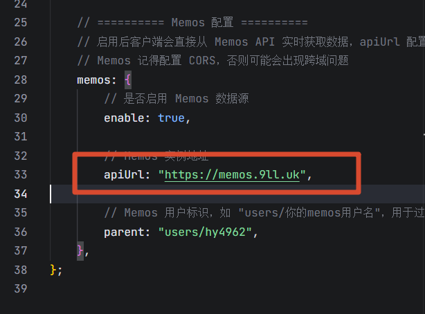
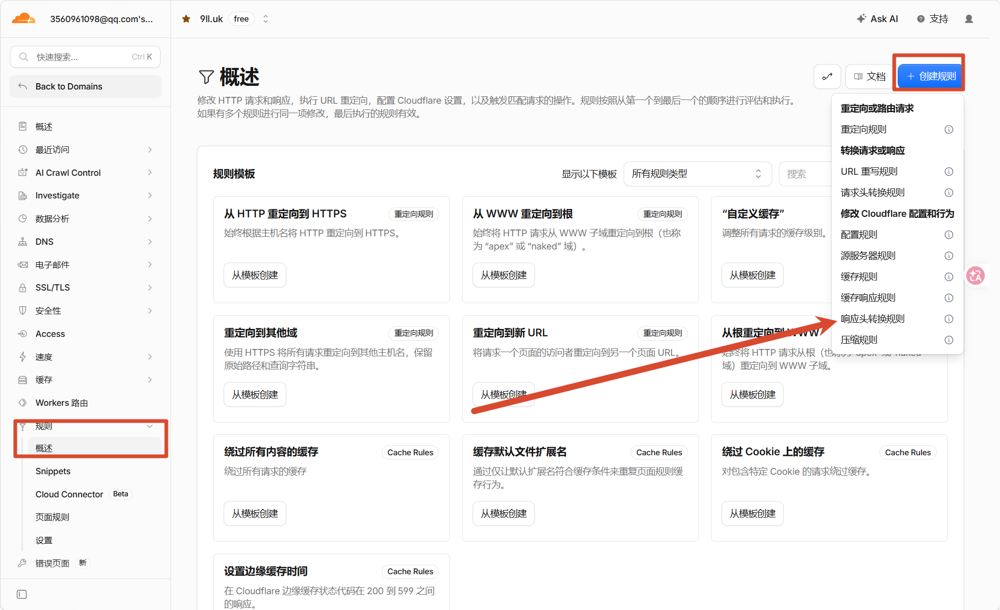
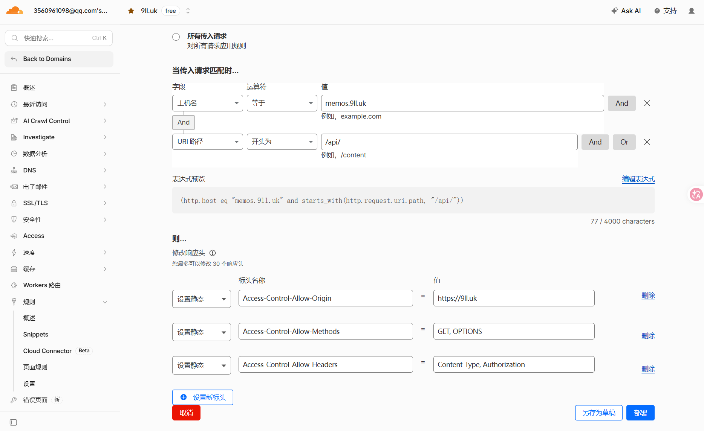

# 给 Cloudflare Tunnel 后面的 API 开启 CORS

我的 Memos API 通过 Cloudflare Tunnel 暴露在 `memos.9ll.uk`，前端则运行在 `9ll.uk`。两个地址的来源不同，浏览器发起 API 请求时就会受到同源策略限制，需要在响应中补上 CORS 相关响应头。

这里没有修改 Memos 本身，而是直接使用 Cloudflare 的响应头转换规则，在响应返回浏览器之前添加所需的 CORS 头。

## 先检查 API 地址

首先检查前端填写的 API 地址。域名末尾不要带 `/`，写成：

```text
https://memos.9ll.uk
```

而不是：

```text
https://memos.9ll.uk/
```

这里后续的 API 路径会由请求端继续拼接。如果基础地址末尾已经带了 `/`，就可能和后面以 `/` 开头的路径拼出重复斜杠。



## 创建响应头转换规则

进入 Cloudflare 控制台，选择对应域名，然后打开 **规则** 页面。点击 **创建规则**，选择 **响应头转换规则**。



这类规则会在 Cloudflare 边缘修改返回给浏览器的响应头。源站不需要跟着改，比较适合给 Tunnel 后面的服务补充 CORS 配置。

## 设置匹配条件

为了不让规则影响整个域名，我这里只匹配 Memos 的 API 请求：

| 字段 | 运算符 | 值 |
| --- | --- | --- |
| 主机名 | 等于 | `memos.9ll.uk` |
| URI 路径 | 开头为 | `/api/` |

对应的规则表达式是：

```text
(http.host eq "memos.9ll.uk" and starts_with(http.request.uri.path, "/api/"))
```

这样，只有访问 `memos.9ll.uk/api/` 下的请求才会被添加 CORS 响应头，其他页面和路径不会受到影响。

## 添加 CORS 响应头

操作选择 **修改响应头**，然后使用 **设置静态** 添加下面三项：

| 响应头 | 值 |
| --- | --- |
| `Access-Control-Allow-Origin` | `https://9ll.uk` |
| `Access-Control-Allow-Methods` | `GET, OPTIONS` |
| `Access-Control-Allow-Headers` | `Content-Type, Authorization` |



这三项分别控制：

- `Access-Control-Allow-Origin`：允许 `https://9ll.uk` 这个来源读取响应。这里写的是具体来源，不是对所有网站开放的 `*`。
- `Access-Control-Allow-Methods`：允许 `GET` 请求和浏览器的 `OPTIONS` 预检请求。
- `Access-Control-Allow-Headers`：允许请求携带 `Content-Type` 和 `Authorization`。

保存并部署规则即可。

## 注意请求范围

截图中的配置只开放了 `GET` 和 `OPTIONS`。如果你的前端还需要通过 API 创建、修改或删除内容，就要根据实际请求补充 `POST`、`PUT`、`PATCH` 或 `DELETE`，不能直接照抄这一项。

`Access-Control-Allow-Origin` 也要替换成你自己的前端来源，协议、域名和端口都要一致。如果跨域请求需要携带凭据，就不能把这里写成 `*`。

配置时先把规则限制在对应的 API 域名和路径，再按真实请求填写允许的来源、方法和请求头。Cloudflare Tunnel 负责暴露服务；响应头转换规则在浏览器收到响应前补上 CORS 配置。

## 参考资料

- [Cloudflare：Response Header Transform Rules](https://developers.cloudflare.com/rules/transform/response-header-modification/)
- [Cloudflare：在控制台创建响应头转换规则](https://developers.cloudflare.com/rules/transform/response-header-modification/create-dashboard/)
- [MDN：跨源资源共享（CORS）](https://developer.mozilla.org/zh-CN/docs/Web/HTTP/Guides/CORS)
