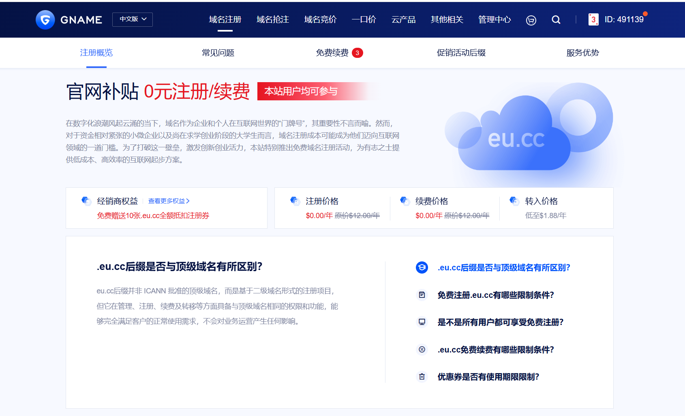

之前对免费域名的印象一直停留在 eu.org：域名长、注册要等审核，一直懒得折腾。前几天刷到一个 .eu.cc 的免费注册活动：GNAME 发全额抵扣券，注册 0 元，续费也 0 元，教程作者实测还能正常托管到 Cloudflare。我把活动页和教程翻了一遍，把规则和坑整理成这篇。

## .eu.cc 免费域名活动是什么

活动在 [GNAME 官方活动页](https://www.gname.com/tld-eu-cc.html)，核心就一句话：**注册就送 .eu.cc 全额抵扣券，用券注册 0 元**。

几个关键信息：

- 注册/登录 GNAME 账号后，每个账号能领 **3 张全额抵扣券**，一张券注册一个域名
- .eu.cc 正常价格 \$12/年，用券 \$0
- 想多领也有路子：官方给了代理名额，Basic Reseller 激活后 10 张，Advanced Reseller 共 20 张。激活条件我没深究，普通用户 3 个一般够用
- 转入也有活动价，页面标注低至 \$1.88/年
- 活动页没写截止日期，想薅趁早

> [!NOTE] .eu.cc 到底是个啥
> 它不是 ICANN 认证的顶级域，本质是挂在 .cc 下面的二级域项目。官方的说法是：管理、注册、续费、转移这些权利功能和正常顶级域一样。拿来做个人站点没问题，但"正经长期项目"的定位自己要有数。

## 注册流程：领券、查询、0 元结算

流程就四步：

1. 注册/登录 GNAME，打开[活动页](https://www.gname.com/tld-eu-cc.html)领取抵扣券
2. 搜索想要的域名
3. 结算时选全额抵扣券支付，\$0 拿下
4. 要接 Cloudflare 的，注册完把 NS 改过去（下面单独说）

看着简单，但有两个坑，单独拎出来说。

## 踩坑记录

### 溢价域名不能用券

两字母（`aa.eu.cc`）、三字母（`abc.eu.cc`）、品牌词和热门行业词这些属于溢价域名，抵扣券不管用，也不符合免费续费资格，实际价格以搜索结果为准。看到好记的短域名先别激动，搜出来看一眼价格再决定。

### 免费续费只有一个入口

这是整个活动最大的坑，值得展开写：

- 免费续费**只能**从活动页的 Renew for free 列表提交，登录后你的域名会列在页面里。在"我的域名"里手动续费、或者开自动续费，都不享受免费，按正常价格 \$12/年收
- 窗口问题：官方原话是 "within 90 days of expiration"（到期日 90 天的窗口内）；教程作者的实践是**要进入到期前 90 天，域名才会出现在活动页的可续费列表里**。具体以活动页列表的状态为准，没到窗口就先等着
- 所以注册完把到期时间记下来，到窗口了去活动页操作，别指望自动续费

> [!WARNING] 自动续费反而要钱
> 开了自动续费，到期扣的是正常价格 \$12/年，不是 0 元。免费续费只在活动页的 Renew for free 里有效。

另外代金券本身也有期限：领取后 30 天有效，过期作废，不可转让。别囤券，领了就注册。

## 托管到 Cloudflare

GNAME 自己的 DNS 也能用（还带个免费的智能解析），但既然是折腾人，直接上 Cloudflare 白嫖全家桶。教程作者实测 .eu.cc 可以当正常域名托管，流程和普通域名一样：

1. Cloudflare 控制台 → Add a domain，填你的 `xxx.eu.cc`，选 Free 计划
2. Cloudflare 给出两个 NS 地址
3. 回 GNAME 的域名管理，把 DNS 服务器改成这两个 NS
4. 回 Cloudflare 触发检查，等生效（几分钟到几小时不等）

接上之后，之前写过的这几套玩法就都能搬过来了：

- [Cloudflare+Resend域名邮箱](/posts/network/cloudflareemailrouting/)：免费收域名邮箱，配 Resend 还能发
- [CloudMail 无限收发邮箱](/posts/network/cloudmail/)：跑在 Workers 上的邮箱服务，收发一体
- [Workers 部署一个免费图床](/posts/deploy/deployimgbed/)：图床也吃 Cloudflare 这套，博客配图够用
- [Cloudflare Tunnel Docker部署教程](/posts/network/cloudflaretunnel/)：不用公网 IP 把内网服务挂到公网
- [不用服务器自建节点](/posts/deploy/cf-pages-edgetunnel/)：节点同样跑在 CF Pages 上，免费白嫖
- [IPv6 + Lucky 白嫖双栈 HTTPS](/posts/network/ipv6-cloudflare-lucky/)：那篇的前提就是"一个托管在 Cloudflare 的域名"，现在域名有了

## 适合谁，我的判断

- 适合：博客、导航站、个人主页、在线工具、项目展示页、短链接站、测试站。反正 0 成本，试错随便试，试错了就扔
- 和 eu.org 比：域名短得多，领券直接注册，不用等审核
- 不适合：正经长期项目。免费活动随时可能调整，二级域的"根"也不在自己手里，长期项目还是买个正规付费顶级域名踏实

我的判断：拿来折腾是真的香。但"0 元"的前提是记得去活动页续费——这个活动最大的成本不是钱，是记性。

## 极简流程

1. 注册/登录 GNAME → 活动页领 3 张全额券（30 天内用掉）
2. 搜域名，避开两字母、三字母、品牌词等溢价域名
3. 结算用券，\$0 注册
4. 到期前 90 天：活动页 Renew for free 列表里免费续费，别碰"我的域名"里的续费和自动续费
5. 要接 Cloudflare：Add a domain → 改 NS → 等生效
