我这边网络情况比较特殊，公网只有 IPv6 出口，没有公网 IPv4。内网跑着飞牛 NAS（fnos）和 new-api（[Docker 部署记录](/posts/deploy/deploynewapi/)）之类的服务，想在外面访问，走 IPv4 的路全堵死了。

后来折腾出这么一套组合：**Lucky 做 DDNS 把 IPv6 同步到 Cloudflare，再让 Cloudflare 当代理**。白嫖到三样东西：

- 外面走 IPv4 也能访问（双栈）
- 访问域名不用再带端口号
- 全链路 HTTPS

全程没花一分钱。记录一下怎么接的。

## 准备工作

- 一台部署了 Lucky 的设备。安装过程就不展开了，教程一大把，实在太简单。连安装都搞不定的，下面的配置估计也够呛，不如直接用付费的内网穿透工具，省心。
- 一个托管在 Cloudflare 的域名，Free 套餐就行（我的是 547466.xyz）。

## 第一步：Lucky 添加 IPv6 DDNS

打开 Lucky → 动态域名，添加一个 DDNS 任务：

- 服务商选 **Cloudflare**，填上你的域名和 API Token
- IPv6 地址来源选 **网卡（ipv6Addr）**
- 域名记录里把要用的域名配上，类型 **AAAA**（我是指向内网飞牛那台机器的）

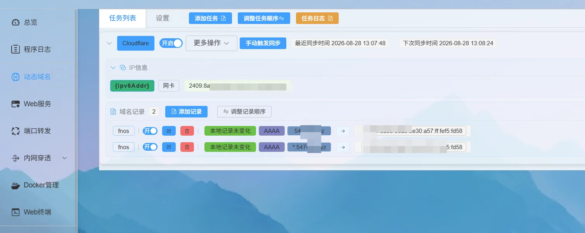

任务开起来之后，去 Cloudflare 看一眼解析记录，确认已经同步过去。

## 第二步：Cloudflare 开代理，SSL 先设灵活

关键一步：每条 DNS 记录旁边的「代理状态」必须开着（橙色云），不然下面说的规则全都不生效。我这边 AAAA 记录都是已代理状态。

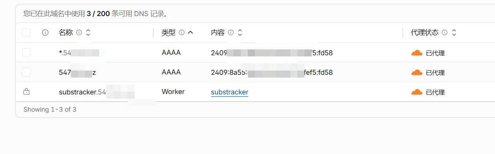

然后 SSL/TLS → 配置加密模式，先选「**灵活**」。这样访客到 Cloudflare 这段是 HTTPS，Cloudflare 到源站暂时走明文，先把链路跑通。想全链路 HTTPS 的话后面有专门一节。

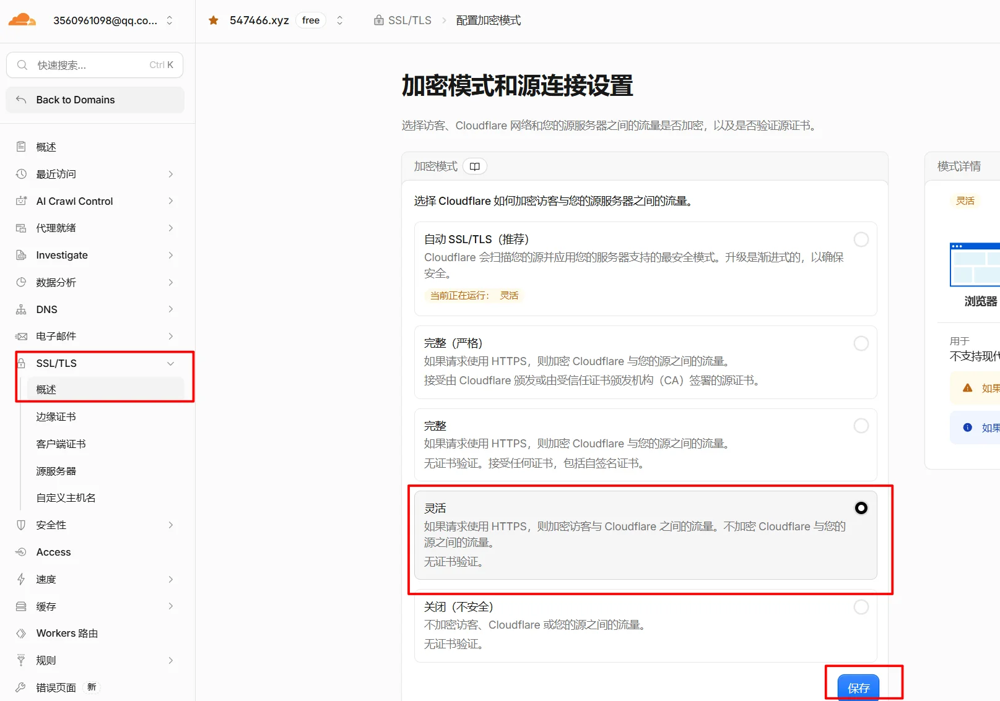

## 第三步：添加 Origin Rule，把端口去掉

这是整套方案的核心。Cloudflare 对外只开放 80/443，我用一条 **Origin Rules（源站规则）** 把所有入站请求的目标端口重写成 Lucky 的监听端口，这样外面访问 `https://你的域名` 就够了，不用再记端口。

操作路径：规则 → 概览 → Origin Rules，添加规则：

- 匹配条件：**所有传入请求**
- 操作：目标端口 → **重写到 16666**

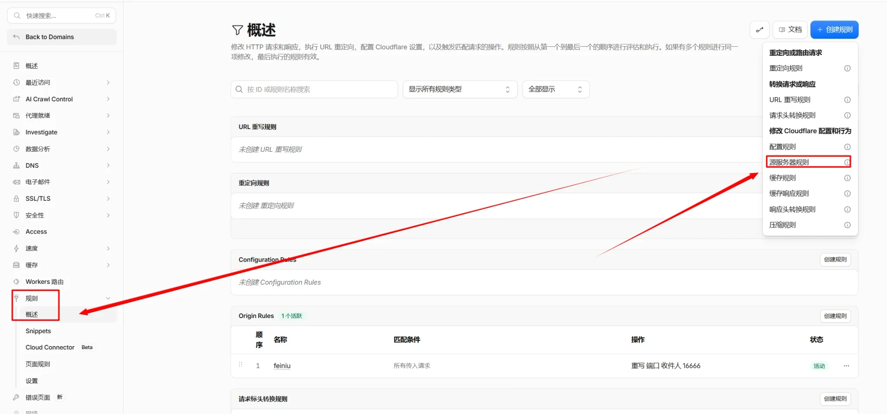

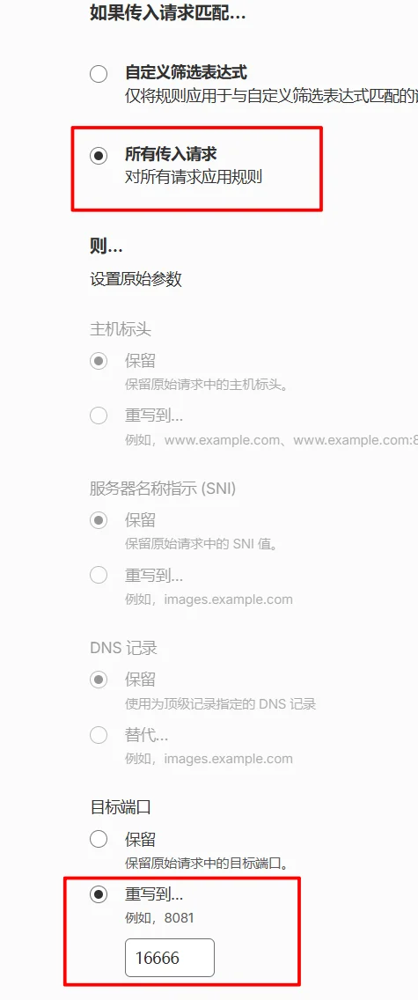

> [!NOTE] 另一种路子
> 如果你的 IPv6 源站 80 端口可以直接访问，这步可以跳过，Lucky 的 Web 服务直接用 80 端口就行。好处是不走 Cloudflare，网速快非常多；代价是没法双栈访问，外面的 IPv4 进不来。选哪个自己掂量。
>
> 连公网 IPv6 都没有的环境，这套方案就玩不转了，那就只剩 [Cloudflare Tunnel](/posts/network/cloudflaretunnel/) 这种穿透方案，部署教程我也写过。

## 第四步：Lucky 添加 Web 服务

回到 Lucky → Web 服务，添加规则：

- 监听类型勾上 **IPv6**
- **监听端口 16666**，必须跟上面 Origin Rule 重写的端口保持一致

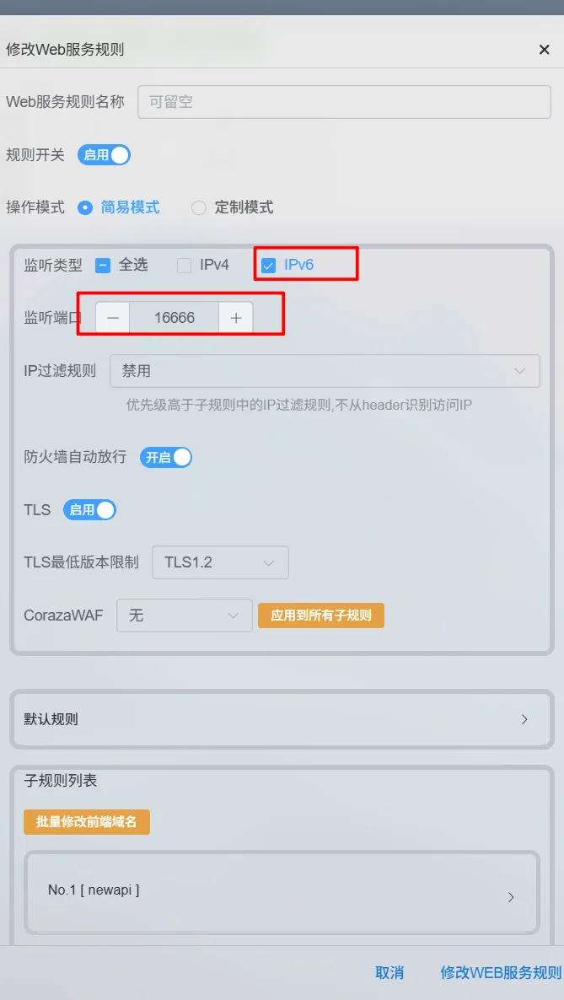

规则下面可以加子规则，**前端地址填想要的域名，后端地址填内网实际地址**。我这边挂了两个服务：

| 子规则 | 前端地址 | 后端地址 | 说明 |
|---|---|---|---|
| fnos | `547466.xyz` | `http://192.168.31.3:5666` | 飞牛 NAS（5666 是 fnOS 默认面板端口） |
| newapi | `ai.547466.xyz` | 内网 new-api 服务 | AI 中转站 |

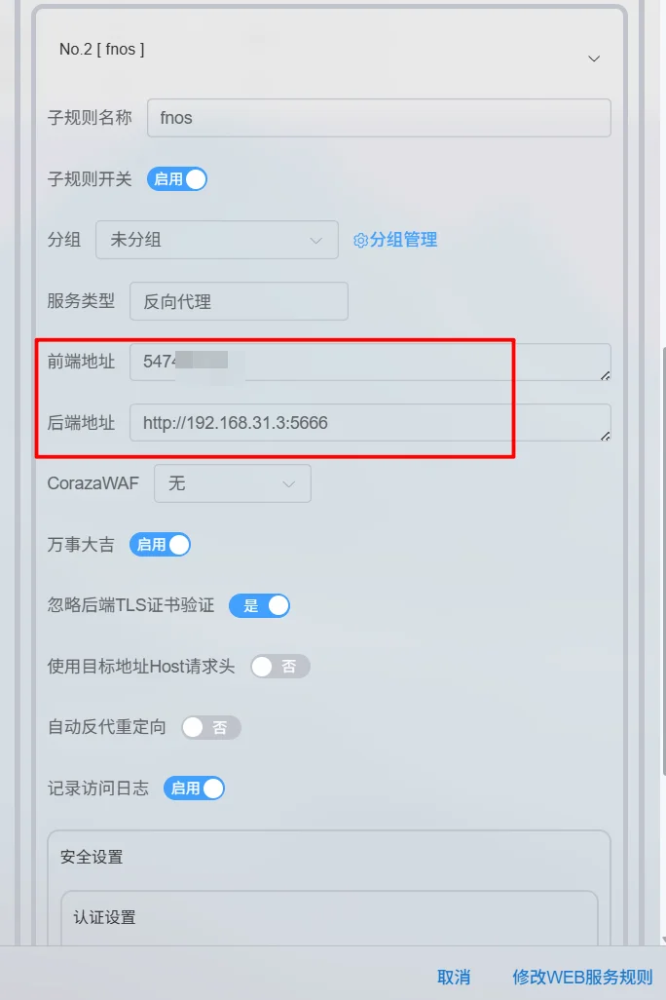

到这一步，不带端口号访问已经通了。剩下的是可选强化。

## （可选）全链路 HTTPS

默认「灵活」模式下，Cloudflare 到源站这一截是明文。想两头都加密，按下面来：

1. **加密模式改回「完整（严格）」**：SSL/TLS → 配置加密模式，选「完整（严格）」，它会验证源站证书。

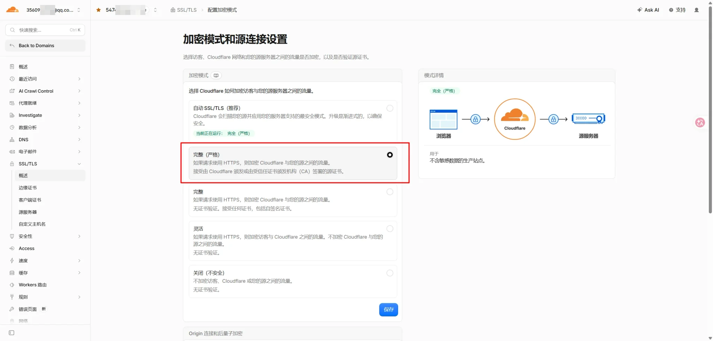

2. **创建源站证书**：SSL/TLS → 源服务器 → Origin 证书，创建一张 Cloudflare 签发的免费源站证书（选你要加密的域名就行）。

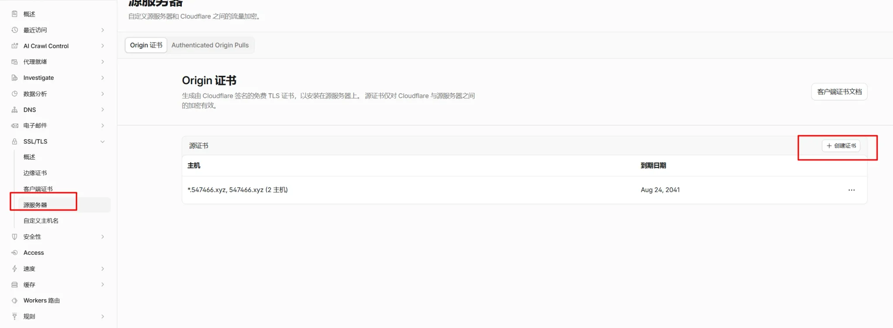

3.**把证书存成 txt**：生成后页面上有「源证书」和「私钥」两段 PEM 内容，分别复制保存成两个文件（我存的是 `yuan.txt` 和 `key.txt`）。

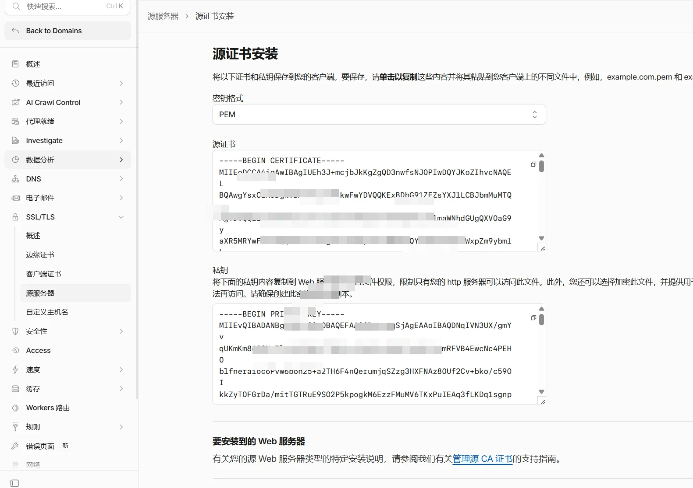

4. **Lucky 上传证书**：Lucky → SSL/TLS 证书 → 添加证书，方式选「文件」，证书选 `yuan.txt`，Key 选 `key.txt`。

   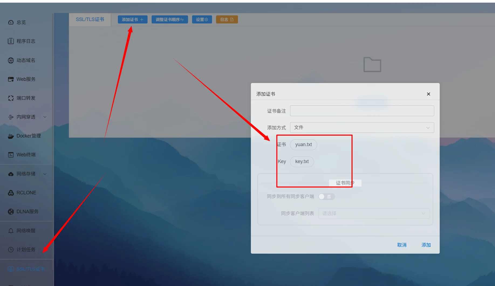

5. **Web 服务开启 TLS**：回到 Web 服务那条规则，把 TLS 打开（最低版本 TLS1.2）

   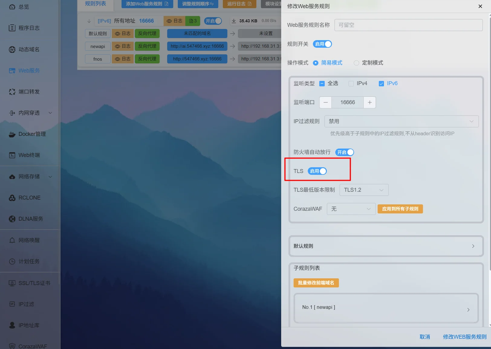

这样就是全链路 HTTPS：浏览器 → Cloudflare（CF 泛域名证书）→ 源站（Origin 证书）。

> lucky里面也可以直接申请Let's Encrypt的证书，那个也行。加了证书之后，⚠️访问一定记得要带https！

## 极简流程

1. Lucky 添加 DDNS：网卡取 IPv6 → 同步到 Cloudflare 的 AAAA 记录（开代理）
2. Cloudflare 加密模式先设「灵活」
3. Cloudflare 添加 Origin Rule：所有请求目标端口重写到 16666
4. Lucky Web 服务：监听 16666，子规则按域名反代到内网
5. （可选）CF 改「完整（严格）」+ Origin 证书 + Lucky 开 TLS → 全链路 HTTPS