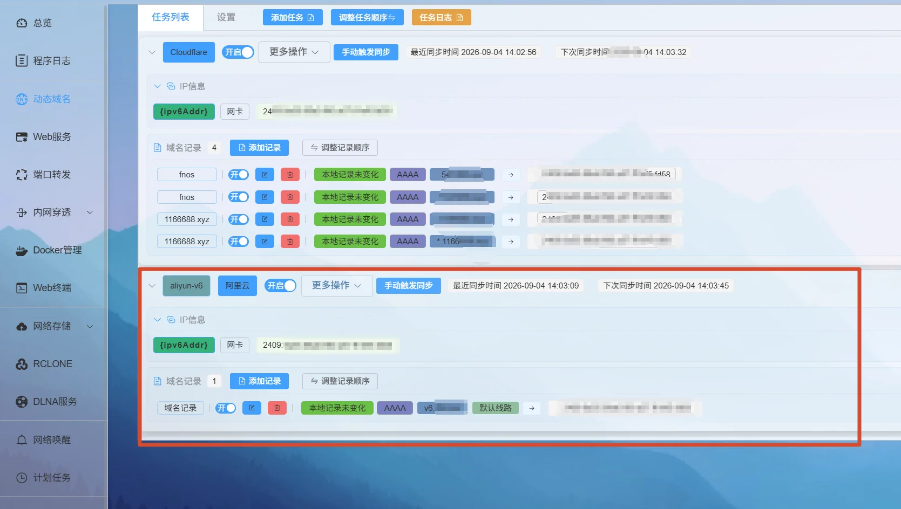
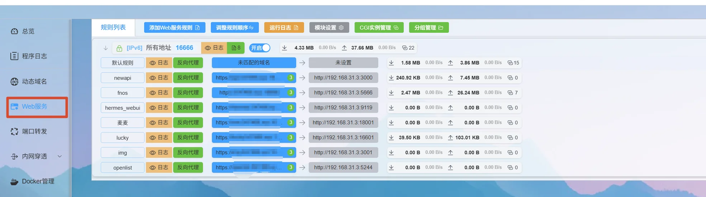
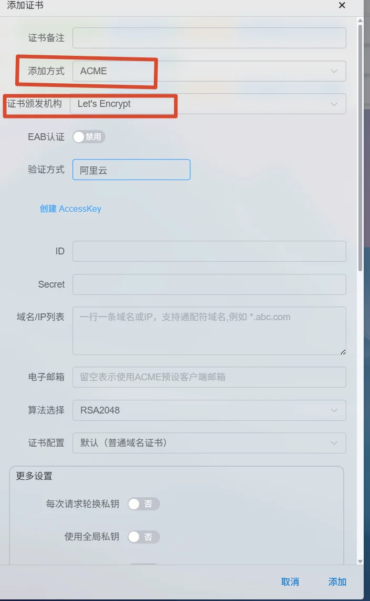
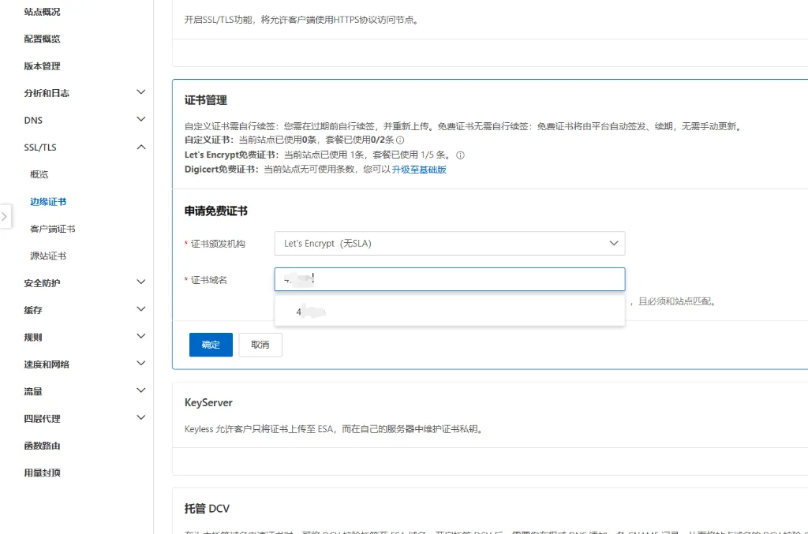
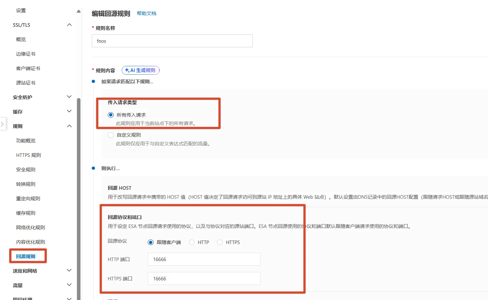
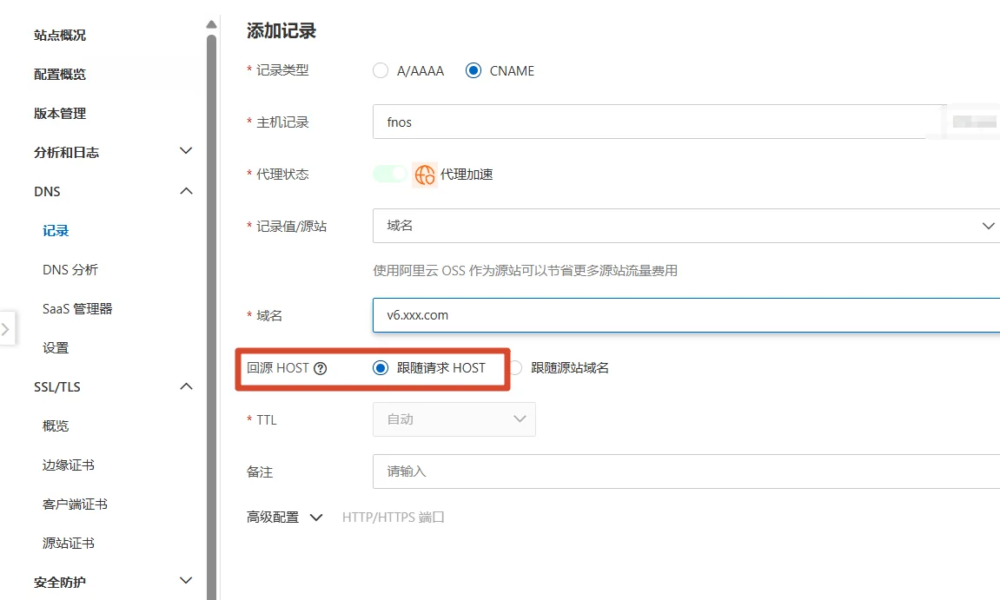
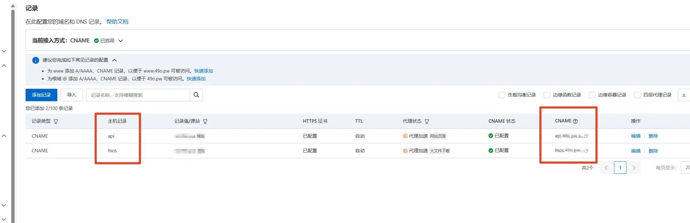
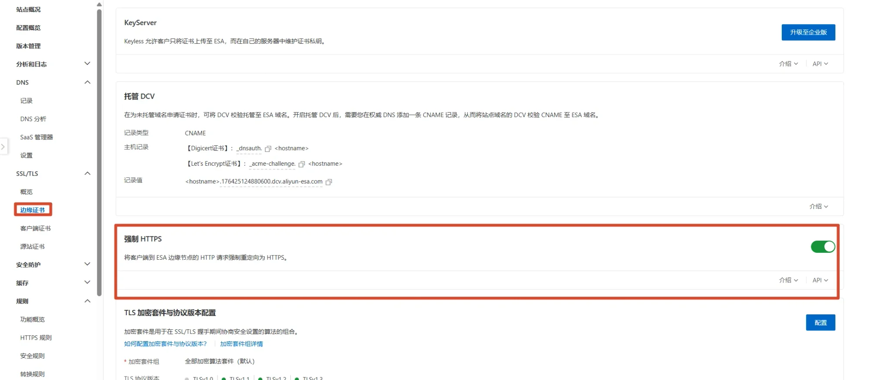

想在外面访问家里的内网服务？之前写过一篇 [Cloudflare + Lucky 的方案](/posts/network/ipv6-cloudflare-lucky/)，能用是能用，但 CF 的节点都在境外，国内访问速度基本看运气。这次换成阿里云 ESA（边缘安全加速平台），节点在国内，走的是正经加速线路。

前提条件就一个：**在国内云服务商那里有一个已经备案的域名**。ESA 要接备案域名，没备案的可以直接关掉这个页面了。

买域名、开通 ESA、接入 ESA 这些就不啰嗦了。接入方式我选的是 CNAME，比 NS 接入更通用一些，DNS 控制权还在自己手里。

## 第一步：Lucky 配一个阿里云 DDNS

家里宽带有 IPv6，所以先让 Lucky 把家里的 IPv6 地址同步到域名上。DDNS 服务商选**阿里云**，域名假设叫 `v6.xxx.com`，类型 AAAA，IP 来源网卡 IPv6。

这步和之前 Cloudflare 那篇基本一样，就是服务商从 Cloudflare 换成阿里云，去 RAM 里建个 AccessKey 填进去就行。

## 第二步：Web 服务反代

Lucky → Web 服务，添加反代规则：

- 监听端口：`16666`，后面 ESA 里回源也要**全部指向 16666**
- 前端：你的域名（比如 `fnos.xxx.com`）
- 后端：内网服务的地址（比如 `http://192.168.31.31:8080`）

## 第三步：顺手在 Lucky 申请证书

来都来了，就在 Lucky 申请一下证书吧。添加方式 ACME，颁发机构 Let's Encrypt，验证方式选阿里云（填 AccessKey 就能自动过 DNS 验证）。

> 你问我为什么不在 ESA 上用免费证书，还能自动续签。你说得对，但是 ESA 上的免费证书不知道为什么**不能下载**，不下载 Lucky 那边就没证书可用了……

申请完，把证书下载下来，去 ESA 上传。位置：SSL/TLS → 边缘证书 → 上传自定义证书。

> 提醒一句：在 Lucky 申请的证书，ESA 当然不会帮你自动续签，以后记得自己来续签一下。

## 第四步：添加回源规则

ESA → 规则 → 回源规则，新建一条：

- 匹配：**所有传入请求**
- 回源协议：**跟随客户端**
- HTTP 端口和 HTTPS 端口：都填 `16666`

## 第五步：ESA 域名解析 + DNS 的 CNAME 解析

先在 ESA 里给站点添加记录，类型 CNAME，记录值指向第一步的 `v6.xxx.com`。

这里有个天大的坑：

**回源 HOST 一定要选「跟随请求 HOST」！！！**

**回源 HOST 一定要选「跟随请求 HOST」！！！**

**回源 HOST 一定要选「跟随请求 HOST」！！！**

否则 ESA 回源时带的 HOST 就不是你在 Lucky 里设置的那个前端域名，Lucky 收到请求压根不知道你要访问哪个服务，直接就 404 了。

然后去你 DNS 服务商那里，给要用的子域名加一条 CNAME，指向 ESA 分配的接入域名，完事。

## 可选：强制 HTTPS

还在 SSL/TLS → 边缘证书页面，把「强制 HTTPS」开关打开，访客走 HTTP 也会被 301 到 HTTPS，建议开着。

## 总结

极简流程过一遍：

1. Lucky DDNS（阿里云）把 IPv6 同步到 `v6.xxx.com`
2. Lucky Web 服务反代，监听 `16666`
3. Lucky 申请证书 → 下载 → 上传到 ESA
4. ESA 回源规则：所有请求，端口全部 `16666`
5. ESA 添加 CNAME 记录，**回源 HOST 选跟随请求 HOST**
6. DNS 服务商加 CNAME 指向 ESA 接入域名

两个坑记一下：

- **回源 HOST**：不选「跟随请求 HOST」，Lucky 就认不出你要访问哪个服务，这条排查起来最费时间。
- **证书续签**：ESA 不会自动续签你上传的自定义证书，到期前记得手动操作。

到这里整套就通了，外面用域名直接访问家里服务，ESA 国内节点加速，全程带 HTTPS。

> 其实有一个更加简单粗暴的办法，但是不符合我个人：组合优于继承 的理念..
>
> 直接把域名选择NS接入ESA，在lucky里面选择阿里云ESA的DDNS解析泛域名，然后在ESA将泛域名解析的代理状态打开
>
> 去配置回源16666
>
> 回lucky反代各种服务即可
