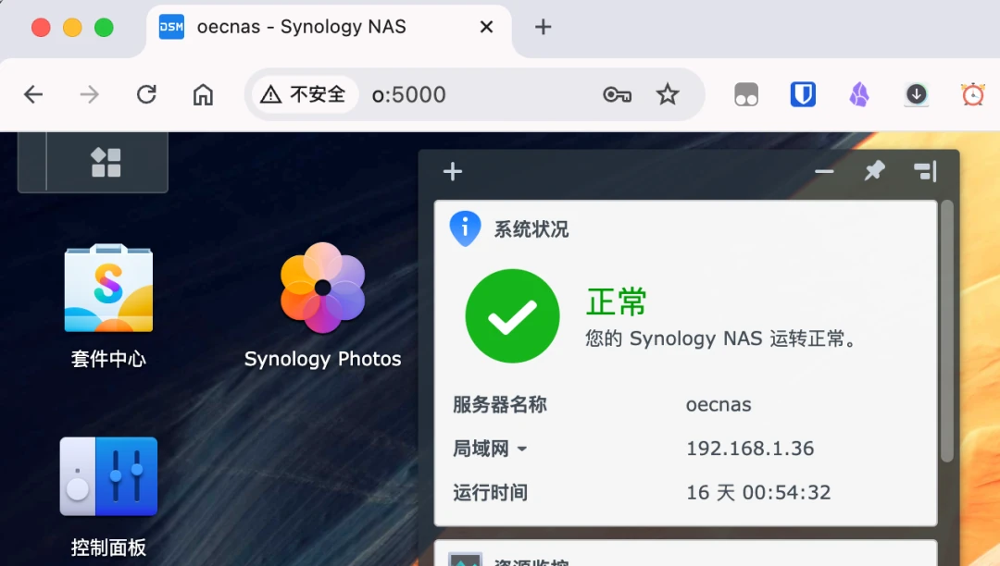
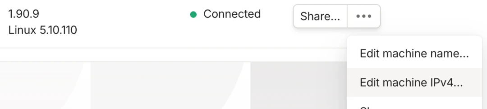
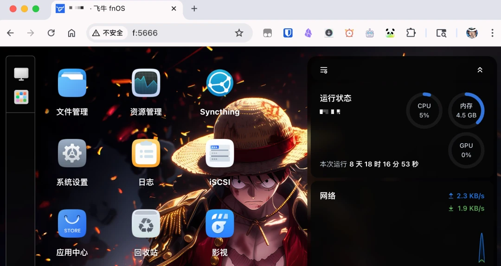

如果你家里有两三台小主机，每台上面跑着五六个 Docker 服务，你大概率遇到过这个场景：想打开某个服务的时候，得先回忆——这个服务跑在哪台机器上？那台机器的 IP 是什么来着？端口又是多少？

我之前用 [lucky 做反代](/posts/network/ipv6-cloudflare-lucky/)，规则设得挺规整，但真到用的时候根本记不住，每次都得翻规则列表。直到我把 Tailscale 的一个默认功能用起来，才发现访问 NAS 地址可以简单到 `o:5000` 这种程度——就两个字符加端口号，浏览器直接打开群晖 DSM。

今天把这个「魔法」说清楚。

## MagicDNS：默认就开着的开关

不卖关子，这个魔法叫 **MagicDNS**，Tailscale 默认开启，不需要你做任何额外设置。

只要你的设备都装了 Tailscale 并加入了同一个网络（官方叫 tailnet），浏览器里直接用「设备名:端口」就能访问对应服务。我的几台机器是这么命名的：

- 群晖叫 `o`，访问 DSM 就是 `o:5000`
- 飞牛主机叫 `f`，进 fnOS 桌面是 `f:5666`
- 拾光坞 N3 叫 `n3`，上面的 PanSou 搜索是 `n3:8822`

没有域名、没有证书、没有端口转发，甚至不用记 IP。设备名就是主机名，规律一句话就能记住：**什么设备、什么端口，就访问什么**。

Tailscale 免费额度给 100 台设备，对个人用户来说等于不设上限——官方明显没打算从普通消费者身上赚钱。

它的原理是什么？Tailscale 会给你的网络分配一个私有域名（形如 `xxx.ts.net`），每台设备是这个域名下的子域名。浏览器里输「设备名:端口」时，Tailscale 客户端在本地把设备名解析成那台机器在虚拟内网里的 `100.x.x.x` 地址，请求直接走过去。整个过程不需要你碰 DNS 记录，也不用装任何插件。

## 名字太长？自己改

默认设备名比较长（比如我的群晖叫 `oecnas`），想压缩成一个字母也很简单：

1. 打开 [Tailscale 管理后台](https://login.tailscale.com/)的设备列表，找到那台机器
2. 点右边三个点，选第一项 **Edit machine name**
3. 取消勾选「自动生成名称」，填入你想要的短名字，保存，立刻生效

我的命名规则是：飞牛 = `f`、OEC 群晖 = `o`、拾光坞 N3 = `n3`。改完之后，`f:5666` 打开飞牛桌面，`f:5244` 打开上面的 OpenList，一台机器上多个服务全靠端口区分，浏览器历史记录里一看就懂。

## 和 ZeroTier 比，各有什么讲究

我是先折腾的 ZeroTier，没走通才换的 Tailscale。最近 ZeroTier 改版了，界面干净大气，组网一次成功，免费额度限 10 台设备。

两家在易用性上其实不分伯仲，但思路不一样：

| | ZeroTier | Tailscale |
|---|---|---|
| 识别方式 | 一串网络 ID，设备申请加入，管理员审核放行 | 每台设备登录同一个 Google/微软账号（NAS 端可以用 auth key），身份即账户 |
| 免费额度 | 10 台设备 | 100 台设备 |
| MagicDNS | 没有直接对应的东西 | 默认开启，「设备名:端口」直接访问 |

如果你只有 NAS、电脑、手机这三四台设备，ZeroTier 的 10 台额度够用，界面也舒服；设备一多，Tailscale 的 100 台额度就没对手了。

不过先别急着冲——这类打洞组网方案最好用的前提，是你家宽带本身有 IPv6 公网。打洞成功时流量是点对点直连，速度拉满；打洞失败会走官方中继服务器，速度就全看中继质量了。有 IPv6 的环境下，速度、安全、便捷三项能同时占全。

## 什么场景下它比域名反代更香

总结一句话：**多台主机 × 多个 Docker 服务 × 自己日常管理**，这个组合下 MagicDNS 是无敌的。

域名反代方案当然能做更精细的控制（比如给外人分享链接），但那是「发布服务」的场景，我写过 [Cloudflare + Lucky](/posts/network/ipv6-cloudflare-lucky/) 和 [Lucky + 阿里云 ESA](/posts/network/lucky-esa-reverse-proxy/) 两篇，都是干这个用的。自己日常管理、在家在外面随时打开某个服务看一眼，「设备名:端口」的记忆成本几乎为零——你不用维护任何规则列表，加一台新设备、起一个新容器，地址自然就通了。

对我来说，lucky 那套反代规则还留着对外发布用，但日常访问早就全部切到这种方式了。

## 极简流程

1. 所有设备装 Tailscale，登录同一账号加入 tailnet
2. 浏览器直接输「设备名:端口」——MagicDNS 默认就开着，这步其实不用做任何事
3. 名字太长就去管理后台 Edit machine name 改短
4. 家里宽带最好有 IPv6 公网，保证打洞成功走直连

你要是也在用 Tailscale，现在就可以打开浏览器试试——这个开关默认就是开的，你可能一直都不知道。
