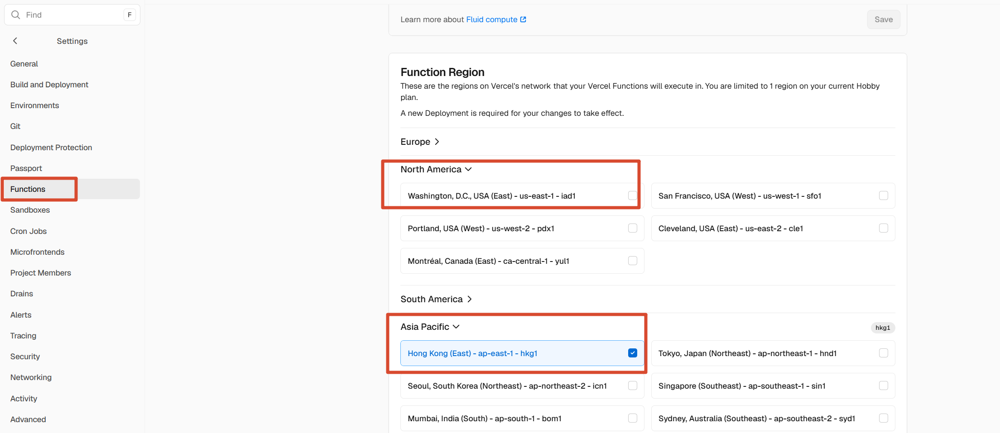

前几天刷到 UpXuu 的一篇文章，说 Vercel 项目还有地区之分。我第一反应是不对啊，Vercel 不是自带全球 CDN 吗，怎么还分地区？结果点进自己项目后台一看，好家伙，Functions 默认全跑在美国华盛顿（`iad1`），这入口藏得是真深。

## 这个设置管什么用

先说清楚，免得期望太高。Vercel 的静态资源（HTML、CSS、JS、图片）本来就走全球 CDN，访客从离自己近的节点拿，改不改都一样。受区域影响的只有 **Serverless Functions**——接口路由、SSR 页面、Middleware 这类需要真正跑代码的动态请求。

| 请求类型 | 受不受 Region 影响 |
| --- | --- |
| 静态资源（HTML / CSS / JS / 图片） | 不受，CDN 就近分发 |
| Serverless Functions（API / SSR / Middleware） | 受，在你选的区域执行 |

所以纯静态博客改了基本没感觉；但只要项目里有接口、SSR 或者评论后端这类动态请求，而访客又在亚太，那把区域改近一点就是有意义的。官方默认 `iad1` 的理由是大部分外部数据源（数据库之类）托管在美国东部，可对国内访客来说，这一来一回的延迟就不客气了。

## 怎么改

操作不难，两分钟的事：

1. 打开 [Vercel 控制台](https://vercel.com/dashboard)，进入要改的项目
2. 顶部切到 **Settings**，左侧选 **Functions**
3. 找到 **Function Region** 手风琴，展开后按大洲分组，勾一个离访客近的区域，比如亚太的香港 `hkg1`、东京 `hnd1`、新加坡 `sin1`、首尔 `icn1`
4. 右上角 **Save** 保存

注意面板里写着「A new Deployment is required for your changes to take effect」——改完区域**必须重新部署一次**才生效，光点保存没用。

## 踩坑记录

1. **Hobby 计划只能选 1 个区域。** 默认北美组的华盛顿 `iad1` 是勾着的，你要是直接跑去亚太组再勾一个，就变成同时选中两个区域，Hobby 直接不允许。正确姿势是先把 `iad1` 的勾取消掉，再勾自己想要的区域，保证最后只剩一个。要是带着两个区域的配置去部署，会报 `upgrade_required` 的错，而且界面上就一句莫名其妙的 unexpected error，原因藏在部署记录里，挺坑的。
2. **改完要重新部署。** Save 之后记得去 Deployments 里 Redeploy 一次，不然设置改了跟没改一样。

## 要不要改

我的判断：值得顺手改，但别期待逆天提升。

- 纯静态站点：改了没感觉，图个心理安慰
- 有 API / SSR / Middleware：值得改，动态请求少跑一趟美国
- 访客主要在国内：香港 `ap-east-1` 物理距离最近；要是数据库在别处（比如 Supabase 常用新加坡），就跟着数据源走

效果嘛，原作者的体感是有一点提升，但不是质变，属于「顺手改一下不亏」的级别。

## 极简流程

1. 项目 → Settings → Functions → Function Region
2. 取消勾选默认的 `iad1`
3. 勾选一个离访客近的区域（如 `hkg1`）
4. Save → Redeploy

## 参考资料

- [你的vercel项目，还能更快 - UpXuu's blog](https://upxuu.com/posts/vercel666)
- [Configuring regions for Vercel Functions - Vercel Docs](https://vercel.com/docs/functions/configuring-functions/region)
