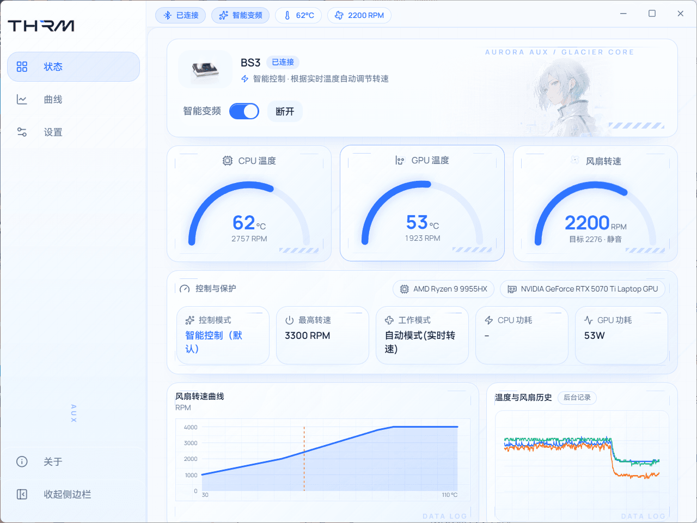
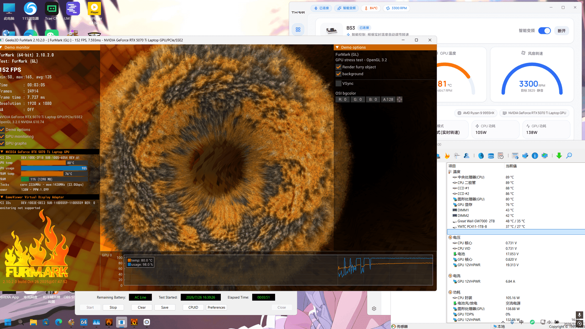
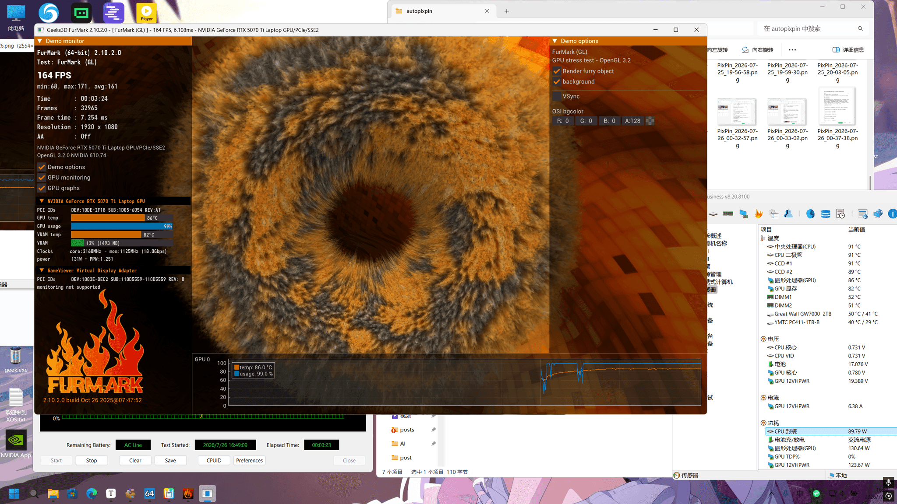

这玩意确实不是智商税，真的有用。不过我买它不是冲着 CPU/GPU 降温去的，主要就两个需求。但是不得不承认他也确实让我的烤鸡温度下降了5到8度(我没用30w的pd头和线跑满血)

**一是硬盘降温。**

我的 GW7000 2TB，打游戏直接 62 度，明明没啥读写。更气的是这不是笔记本的问题——我之前台式机也用这块盘，也是 60 度。台式机上还因为用的是盈通花嫁的 7800XT，matx 主板空间本来就挤，当时也没太好的办法，只能忍。

换了笔记本之后，这盘还是这样，索性就试试压风散热器能不能压一下。

**二是防尘。**

这东西公认防尘效果很优秀，据说一年笔记本里面都不带进灰的，算是意外的好处。

---

看来看去在 BS2 Pro 和 BS3 之间选，看到 BS3 也就 189，还是买新不买旧——虽然 BS2 Pro 比 BS3 散热效果更好，但价格差不多的情况下选新款没什么毛病。

---

然后是软件这块。开源社区有人做了第三方控制软件 THRM，智能风扇曲线、硬件监控、RGB、配置文件都有，Windows 和 Linux 都支持。

我压根没下过官方配套软件……买之前就看到这个项目了，直接用的这个。里面的智能学习功能确实好使，起码我没发现什么坏处。它会根据你的使用习惯自动调整风扇曲线，还有功耗预测前馈——就是 CPU/GPU 功耗突然上来的时候，转速会提前跟上，不会让温度先飙一波再说。

硬件监控也挺全的，CPU/GPU 温度、功耗、散热器转速都能看到，还能输出到 RTSS 游戏内叠加层，打游戏的时候直接看转速，挺方便的。

RGB 灯效也能调，亮度、动画速度、灯效模式都能自定义，不过我个人不太在意这个。

[TIANLI0/THRM](https://github.com/TIANLI0/THRM)

