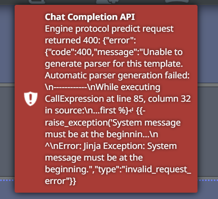
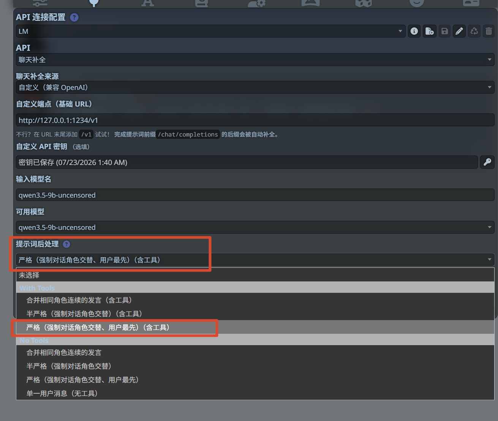
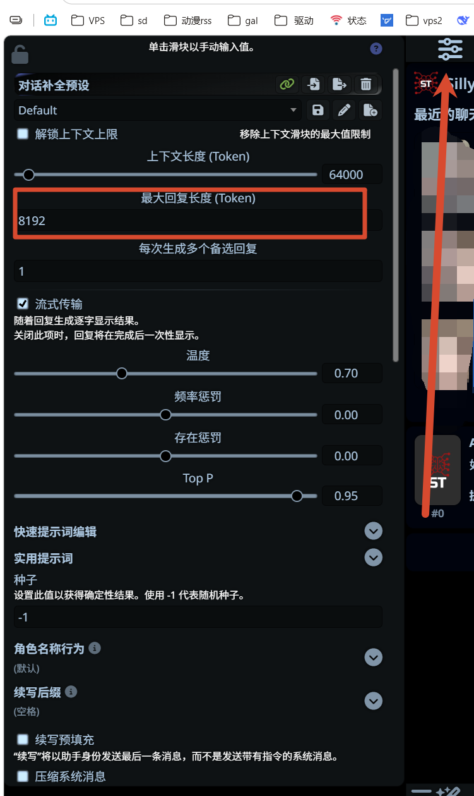

之前一直用各种在线平台跑 AI 角色对话，说实话大部分都差点意思——要么限制多，要么数据不在自己手里，折腾起来也不方便。后来在群里看到有人提"酒馆"，说是开源的，自己部署，想怎么玩就怎么玩。我一想，反正也不难搞，就试试呗。

折腾了一番，把部署过程和踩过的坑记下来，顺便也介绍一下这个东西。

## 酒馆是个啥

SillyTavern，社区里一般叫"酒馆"，是个开源的网页应用。简单来说，它就是一个前端界面，帮你对接各种 AI 模型（OpenAI、Claude、Gemini、本地模型等等），然后你通过浏览器跟 AI 聊天。

它本身不提供 AI 模型，你需要自己有 API Key 或者跑本地模型。但它的好处是：

- 数据全在本地，不经过第三方
- 可以自由调整各种参数和提示词
- 支持角色扮演、写作辅助等多种玩法
- 社区活跃，功能一直在更新

酒馆跑起来之后，浏览器打开 `127.0.0.1:8000` 就能用。

### 它能干什么

除了基本的聊天，酒馆还能玩不少花样：

- **角色卡片**：导入别人做好的角色卡，或者自己写一个，AI 就会扮演那个角色跟你对话
- **预设和破限**：通过预设文件控制 AI 的回复风格，比如更像小说、更口语化，或者突破一些限制
- **世界书**：给 AI 补充背景知识，比如角色的设定、世界观什么的
- **群聊**：多个角色一起聊天，有点像拉了个群
- **正则替换**：自定义消息的处理规则，比如隐藏 AI 的思考过程
- **扩展功能**：支持画图、语音合成、翻译等扩展，社区一直在加新东西

不过这些进阶功能先不管，部署好能聊天才是第一步。

## Windows 部署

我在 Windows 11 上部署的，过程其实不复杂。

### 前提准备

先装两个东西：

**Node.js**：去 nodejs.org 下最新的 LTS 版本装上就行。这是酒馆运行的底层依赖，必须有。注意 Windows 7 不支持，因为跑不了 Node.js 20。

**Git**：用来下载酒馆代码。可以装 Git for Windows，也可以用 GitHub Desktop。

装好之后可以验证一下，在命令行里输入：

```bash
node -v
git --version
```

能看到版本号就说明装好了。

### 安装路径注意

这个很重要：**不要装到 Program Files 或者 System32 这种系统文件夹里**。Windows 对这些路径有权限限制，跑起来会出问题。

就找个普通路径放着，比如 `D:\SillyTavern` 或者 `C:\Tools\SillyTavern`。

### 安装与启动

打开文件管理器，导航到你想放启动器的文件夹，在地址栏输入 `cmd` 回车，然后执行：

```bash
git clone https://github.com/SillyTavern/SillyTavern-Launcher.git && cd SillyTavern-Launcher && start installer.bat
```

**双击 `Launcher.bat`**，打开输入`1`它会自动下载需要的依赖包，然后启动服务。

第一次跑会慢一点，要下载一堆依赖。等命令行窗口里出现类似 `SillyTavern is listening on port 8000` 的提示，就说明启动成功了。

启动成功后，浏览器会自动打开酒馆界面。如果没有自动打开，手动访问 `http://127.0.0.1:8000` 就行。

## API 连接和配置

酒馆装好了，下一步就是连上 AI 模型。

酒馆支持好几种模型后端：

- **OpenAI**（GPT-4、GPT-3.5 等）
- **Claude**（Anthropic 的模型）
- **Gemini**（Google 的模型）
- **本地模型**（通过 Ollama，LMstudio 等方式运行）

在酒馆界面的设置里填上你的 API Key 就能连上，操作不复杂。

### 连接设置

打开酒馆后，点上面的"插头"图标（就是那个像电源插头的），进入 API 连接设置。

这里有几个地方要填：

1. **API 类型**：选你用的模型，比如 OpenAI、Claude、Gemini
2. **API URL**：填对应的 API 地址。如果是官方 API，一般有默认值；如果用反代或者第三方服务，填对应的地址
3. **API Key**：填你的密钥

填完之后点"连接"测试一下，能看到绿色的提示就说明连上了。

## 注意事项

这些是我折腾过程中遇到的问题，记下来防止以后忘。

### 对接 LM 测试成功但发消息发不出去

这个问题挺常见的。如果你测试连接没问题，但实际发消息的时候报错，很可能是"提示词后处理"没选对。



特别是用 Qwen 之类的模型时，它严格要求消息顺序必须是系统提示词在最前面，然后用户和角色交替发言。如果顺序不对，就会报这种错：



解决办法就是在"提示词后处理"那里选"严格（强制对话角色交替、用户最先）"。

### 参数设置

连上之后，建议把参数调一下。上下文长度、最大回复长度、温度这些，直接影响聊天体验。



- **上下文长度**：AI 能"记住"多少之前的内容。太短的话 AI 容易忘事，太长的话消耗的 token 多
- **最大回复长度**：AI 一次回复最多写多少字。设太小的话回复容易被截断，图里这个 8192 对大多数场景够用了
- **温度**：控制回复的随机性。0.70 左右比较平衡，想要更稳定可以调低，想要更有创意可以调高

这些参数不用一开始就调到完美，先用默认值跑起来，后面再根据实际体验慢慢改。

### 端口被占用

如果你之前跑过酒馆，或者有其他程序占用了 8000 端口，启动的时候会报错。解决办法：

1. 关掉之前那个酒馆窗口
2. 或者改端口号，在启动参数里指定一个别的端口

### API Key 的成本

这个得说一下。酒馆本身免费，但 API 调用是收费的。不同的模型价格不一样，用之前最好了解一下计费方式，免得月底看到账单吓一跳。

如果预算有限，可以考虑用一些提供免费额度的服务，或者跑本地模型（不过本地模型对显卡有要求）。

## 最后说两句

酒馆这个东西怎么说呢，上手难度不算高，但需要你有一定的动手能力。如果你之前没怎么用过命令行，可能会觉得有点麻烦，但跟着步骤走其实也还好。

部署好之后的体验还是不错的，可以自由调整各种参数，玩起来比在线平台灵活多了。缺点就是需要自己有 API Key，这块是有成本的。

如果你也想搞一个自己的 AI 聊天环境，可以试试。有问题的话欢迎交流。
