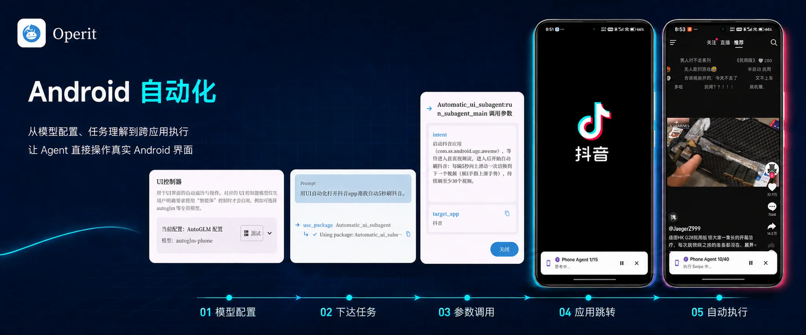
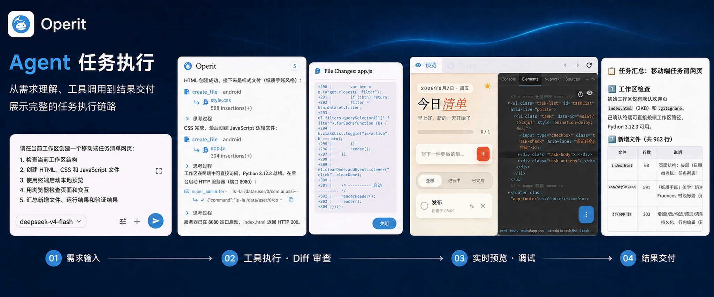

前几天在 GitHub 上翻到一个叫 Operit 的项目，7.7k star，说是安卓上的 AI Agent 平台。当时只是收藏了一下，没想到后来真拿它解决了一个折腾我很久的问题。

https://github.com/AAswordman/Operit

## 为什么觉得它有意思

我手机上跑着虚拟机挂机，具体挂的什么就不细说了，反正需要 7×24 开着。问题是这玩意每隔几小时就会卡死一次，卡死之后只能手动打开虚拟机软件、把里面的两个实例重新启动。人不在手机边上的时候就断了，很烦。

这类"定时巡检 + 自动恢复"的活，以前要么自己写无障碍脚本，要么用 Tasker 拼，都挺麻烦的。看到 Operit 支持无障碍、Shizuku、Root 三种通道直接操作手机界面，还能跑工作流和定时任务，就想着：能不能让 AI 直接帮我搞定这事？

## 排查过程

我直接把问题丢给它：虚拟机每隔几小时卡死，帮我看看怎么回事。

它先是翻日志、看进程状态，分析了一圈可能的原因——内存回收、后台限制这些都查了一遍。说实话具体原因到最后也没 100% 定位，虚拟机这种东西卡死的因素太多了。但它换了个思路：既然不好根治，那就盯着它，卡死了自动拉起来。

然后它给我写了一个看门狗程序：持续检测虚拟机的运行状态，一旦发现卡死，自动打开虚拟机软件，然后把里面的两个实例依次启动起来。整个过程不用我管。

跑了几天，挂机再没断过。偶尔看记录，看门狗半夜自己触发过几次重启，早上起来虚拟机好端端的跑着。

## 它能干什么

除了这次用到的自动化能力，看了下 README，功能面铺得挺广的：

- **AI 对话**：兼容 OpenAI、Anthropic、Gemini 各种端点，也能跑本地模型（内置 MNN，支持 GGUF）
- **设备自动化**：无障碍 / Shizuku / Root 三种通道，能模拟点击、读屏、操作界面
- **内置终端**：自带 Ubuntu 24.04 ARM64 用户空间，SSH、tmux、vim 都有
- **工作区**：能直接在手机上开 Web、Python、Go 项目，代码编辑加实时预览
- **工作流**：可视化编排，支持定时、Tasker、Intent、语音触发
- **其它**：长期记忆、角色卡、多标签浏览器、语音对话、悬浮窗，一堆

对我来说核心就一条：它是真的能动手的 Agent，不是只会聊天的那种。

## 权限这块要说一下

我自己的感受：**有 Root 才是完全体**。

UI 自动化这三档通道，能力差距挺明显的：

- **Root**：什么都能干，还能用虚拟显示，后台跑任务不挑场景
- **Shizuku**：ADB 级权限，大部分操作没问题，不用解锁 BL，应该是多数人的选择
- **无障碍**：能用，但受系统限制多，碰到敏感界面就抓瞎

我这次是看门狗检测到卡死后要去启动应用、点界面，有 Root 就完全没阻碍。没 Root 的话 Shizuku 应该也不错，至少比我之前试过的纯无障碍方案靠谱。

## 几个细节

- **系统要求**：Android 8.0+，只要 ARM64 设备，APK 直接从 Releases 下
- **协议**：LGPL-3.0，开源。作者还在做跨平台的 Operit 2（Rust + Flutter）
- **权限控制**：工具调用分"自动允许、每次询问、禁止"三档，默认询问，不会背着你乱来
- **语言**：界面支持八种语言，中文没问题

## 我的判断

这类"手机上的 AI Agent"项目最近不少，但大部分停留在"能调用几个 API"的水平。Operit 是真的把触手伸进系统里了——终端、文件、界面操作、定时任务都能串起来，这次看门狗的事就是个例子：从排查问题到写脚本到落地执行，全程在它里面完成。

适合什么人：手机上有 Root 或愿意装 Shizuku、喜欢折腾自动化、想让 AI 干实事而不只是聊天的人。

不适合什么人：只想找个开箱即用的 AI 聊天工具的。这东西功能多，设置项也多，得花点时间摸索。

反正我现在挂机是彻底放心了。以后手机上再有这种重复性的脏活，估计都会先丢给它试试。
