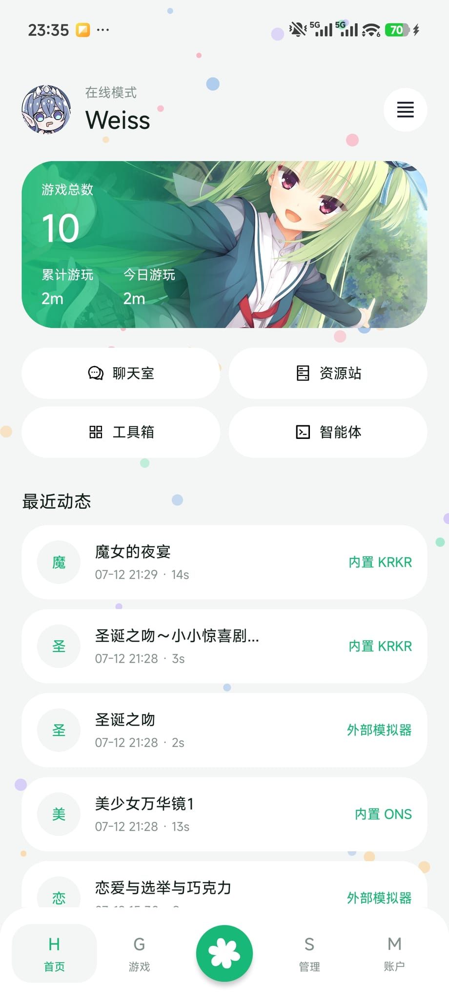
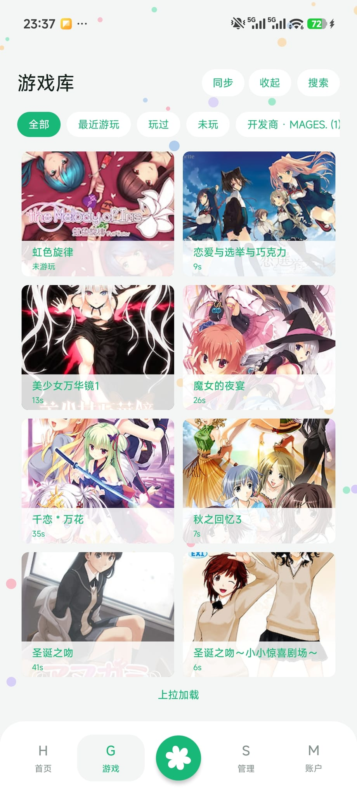
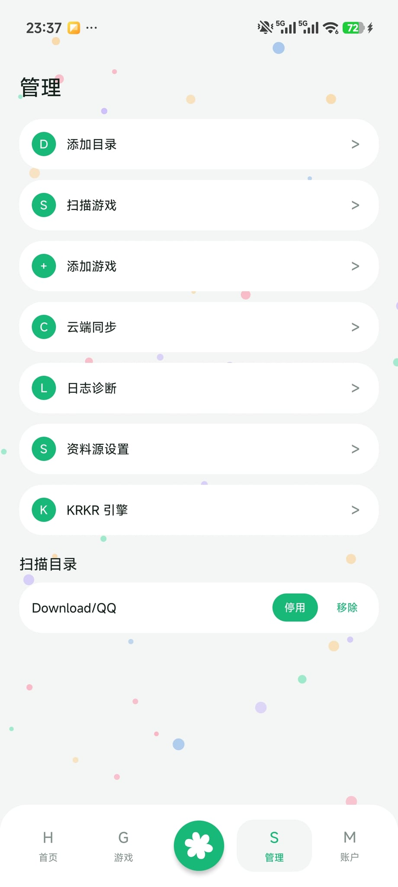
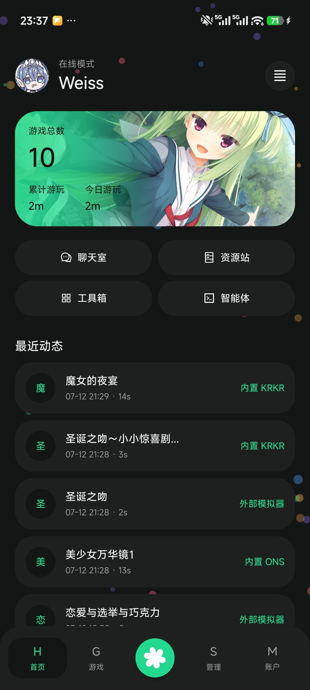
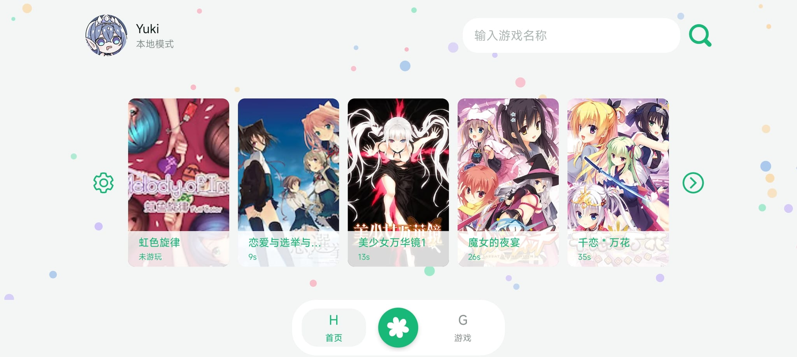

# 手机上终于有个像样的 Galgame 管理器了

前几天刷 GitHub 的时候，无意间看到一个叫 RinneMobile 的项目。

https://github.com/Weiss-UltimateSavior/RinneMobile

## 为什么觉得它有意思

我手机里存了不少 Galgame，但一直没找到好用的管理方式。

以前试过直接用文件管理器找游戏目录，每次想玩的时候都要翻半天。文件管理器这东西吧，找文档还行，找游戏是真的痛苦——游戏目录名乱七八糟，有的是日文，有的是拼音缩写，根本不知道哪个是哪个。

也试过几个启动器。有的只能启动安卓应用，KRKR 引擎的游戏完全不支持。有的倒是能启动，但是每次都要手动选目录，麻烦得要死。

还试过把所有游戏 shortcut 放到一个文件夹里，结果越攒越多，找起来更费劲了。

RinneMobile 说白了就是个"游戏库"——把你的本地游戏、安卓应用、模拟器入口、外部程序快捷方式全放到一个地方管理。

听起来简单，但市面上能做到这点的安卓工具还真不多。

## 它能干什么

我看了下 README，功能还挺全的。

### 统一管理

本地游戏、安卓应用、外部启动入口都能加进去。

这点太重要了。我手机里不光有 KRKR 引擎的游戏，还有一些安卓原生的 Galgame，还有几个通过 Winlator 跑的 PC 游戏。以前要分别用不同的方式启动，现在全放一个地方，方便多了。

### 自动扫描

选个目录，它会自动识别 KRKR、ONScripter、Tyrano、Artemis 这些引擎的游戏。

不用一个个手动添加，这点很省事。它会根据文件特征来判断引擎类型：

- KRKR：看有没有 `.xp3`、`startup.tjs` 这些文件
- ONScripter：看 `0.txt`、`nscript.dat` 这些
- Tyrano：看 `index.html` 和目录特征
- Artemis：看 `system.ini` 这些

识别出来之后，启动的时候会自动用对应的引擎打开。

### VNDB/Bangumi 数据源

可以给游戏补充封面和信息。

这个功能挺贴心的。添加游戏之后，可以关联 VNDB 或者 Bangumi 的数据，自动拉取封面图和游戏简介。这样游戏库看起来就整齐多了，不用自己一张张找封面。

### 数据同步

支持 WebDAV 云同步，换设备不怕丢数据。

我之前最怕的就是换手机。每次换手机，游戏存档、游玩记录全没了。RinneMobile 支持把数据同步到 WebDAV，换设备的时候导进去就行。

它同步的时候会根据 root 路径、本地 ID、游戏标题来匹配，空目录条目会优先按标题匹配。虽然不是 100% 能对上，但大部分情况够用了。

### 游戏时长记录

启动游戏后自动计时，切回来就停止。

这个功能对我来说还挺有用的。我之前一直想统计自己玩 Galgame 花了多少时间，但没有趁手的工具。RinneMobile 自动帮我记，虽然不是特别精确（中途切出去再切回来就不续计了），但大致有个数。

### AI 智能体

最让我意外的是它内置了一个 AI 智能体，可以连自己的 OpenAI 兼容 API。

比如查询游戏库、搜索文件之类的。这个功能我还没深入试，但听起来挺有意思的——以后说不定可以让 AI 帮我找某个台词在哪个游戏里出现过。

## 适合什么人

如果你是这类用户，可以看看：

- 手机里存了一堆 Galgame，想统一管理
- 用 KRKR、ONScripter 这些引擎的游戏比较多
- 想在多设备之间同步游戏数据
- 喜欢折腾，愿意自己配置

如果你只是偶尔玩一两个安卓版 Galgame，可能用不上这么重的工具。

## 几个细节

### 项目背景

这是基于 YukiHub 二次开发的分支版本，不是从零开始的，站在前人肩膀上。

作者叫 Weiss-UltimateSavior，GitHub 上 97 个 Star，不算多，但说明有人在用。有 QQ 交流群，遇到问题可以问。

### 协议和兼容性

GPL-3.0 协议，开源，可以自己改。

需要 Android 8.0 以上，老设备可能跑不了。我看了下编译信息，Min SDK 是 26，Target SDK 是 33，用的 Java 17。

### 已知问题

README 里提到了几个已知问题：

- KRKR 游戏里有文字输入弹窗的功能不能用，会导致闪退
- TF 卡里的 KRKR 游戏要通过镜像目录启动
- 华为设备可能有存储访问兼容性问题，可以试试开启"外部私有存档"

这些坑我还没踩到，但提前知道比较好。

### 界面

支持深色模式和横屏，这点挺加分的。

我挺喜欢它的界面设计，有好几个主题可以切换。竖屏横屏都能用，躺在床上玩的时候横屏模式挺舒服的。

## 和其他工具的对比

安卓上能启动 Galgame 的工具其实有不少，但大多数只管"启动"，不管"管理"。

比如 Tyranor，能启动 KRKR 和 Tyrano 引擎的游戏，但没有统一的游戏库，也没有数据同步。每次想玩都要翻文件夹。

再比如一些通用的游戏启动器，倒是能管理，但对 Galgame 引擎的支持不行，KRKR、ONScripter 这些都认不出来。

RinneMobile 的优势就在于"管理+启动+同步"三合一。虽然每个方面都不是最强的，但凑在一起，体验就完整多了。

## 我的判断

说实话，这个项目解决的问题确实存在——安卓上缺少好用的 Galgame 管理工具。

如果你有这个需求，值得试试。

它不是那种开箱即用的工具，需要自己配置一下。但折腾本来就是乐趣的一部分，对吧？

